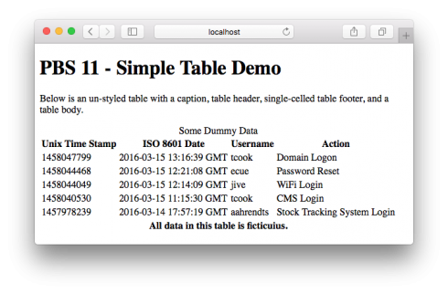
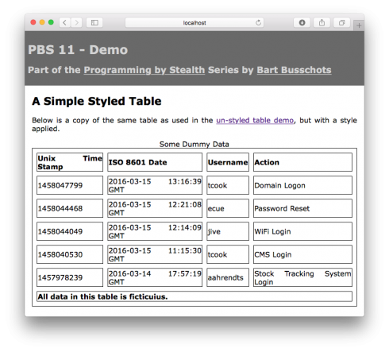
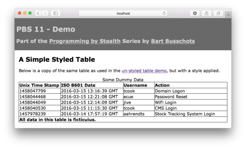
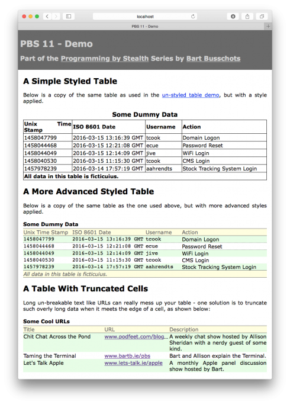

Finally, after many months of making Allison wait, it’s time to look at tables on web pages. We’ll start by describing the HTML markup for tables, and then look at how to style them with CSS.

Remember – tables are for one thing, and one thing only – **displaying tabular data**!

## Matching Podcast Episode 430

Listen Along: Chit Chat Across the Pond Episode 430

<audio controls src="http://media.blubrry.com/nosillacast/traffic.libsyn.com/nosillacast/CCATP_2016_03_17.mp3">Your browser does not support HTML 5 audio 🙁</audio>

You can also <a href="http://media.blubrry.com/nosillacast/traffic.libsyn.com/nosillacast/CCATP_2016_03_17.mp3?autoplay=0&loop=0&controls=1" >Download the MP3</a>

## Tables in HTML

Tables have been a part of the HTML spec for a long time, and they have changed a lot over time. As with everything else in this series, we’re only going to look at the correct way to do tables in HTML 5. We’re going to ignore all the obsolete ways tables were done in older versions of HTML.

The `<table>` tag is used to define a table. A table consists of a number of regions, defined by tags. Some of these are optional and some are not. The order in which these tags appear inside the table is not optional. The following are the four regions of a table, listed in the order they must appear within the `<table>` tag:

1.  `<caption>` (optional) – a title or caption for the table
2.  `<thead>` (optional) – one or more rows of column headers
3.  `<tfoot>` (optional) – one or more rows of column footers
4.  `<tbody>` – the data rows within the table

Note that all four of these tags must be direct children of the table tag.

By default, the table caption is rendered centred above the table. Next, the header rows are rendered, then the table body rows, and finally the table footer rows. In theory, browsers can use the table header and table footer to intelligently scroll and print tables. I’ve yet to see browser vendors implement these kinds of features though. However, this doesn’t make the regions useless – they are very useful when it comes to styling your tables. Every table should have a table body. Many tables you see have table heads. A few tables have captions. You tend not to see that many tables with a footer.

Inside the `<thead>`, `<tfoot>`, and `<tbody>` tags, your data and titles need to be contained within cells within rows. A row is defined by the `<tr>` (table row) tag. Cells are defined by either the `<th>` (table header) tag, or `<td>` (table data) tag. Header cells are for labelling rows or columns, and data cells are for containing data. Using the appropriate cell types will make your tables easier to style.

When tables were used for page layout, you would have found all sorts of complex techniques in regular use – merging of cells, the nesting of one table within another, and so on. When you only use tables to display tabular data, you tend not to need these advanced features, so I don’t want to dwell on them.

I will make one exception though – it often makes sense to merge all the cells in the footer row into one long cell containing some kind of information about the data source – perhaps the time the data was sourced at or copyright information. You can do this by including only one cell in the footer row, and setting the `colspan` HTML attribute on that one cell to the number of columns in the table. For example, if your table had four columns, you could use a footer something like:

```html
<tfoot>
  <tr>
    <th colspan="4">Info about the data here.</th>
  </tr>
</tfoot>
```

### Unstyled Table Example

Let’s tie all this together with a simple unstyled sample table. You can save the HTML below as `simpleTable.html` in a folder called `pbs11` in your local web server’s document root. View it at `http://localhost/pbs11/simpleTable.html` (a copy of this file is included in the zip file linked in the Worked Example section near the bottom of this post).

```html
<!DOCTYPE HTML>
<html>
<head>
  <meta http-equiv="Content-Type" content="text/html; charset=utf-8" />
  <link rel="stylesheet" type="text/css" href="style.css">
  <title>PBS 11 - Simple Table Demo</title>
</head>
<body>
<h1>PBS 11 - Simple Table Demo</h1>

<p>Below is an un-styled table with a caption, table header, single-celled
table footer, and a table body.</p>

<table>
  <caption>Some Dummy Data</caption>
  <thead>
    <tr>
      <th>Unix Time Stamp</th>
      <th>ISO 8601 Date</th>
      <th>Username</th>
      <th>Action</th>
    </tr>
  </thead>
  <tfoot>
    <tr>
      <th colspan="4">All data in this table is fictitious.</th>
    </tr>
  </tfoot>
  <tbody>
    <tr>
      <td>1458047799</td>
      <td>2016-03-15 13:16:39 GMT</td>
      <td>tcook</td>
      <td>Domain Logon</td>
    </tr>
    <tr>
      <td>1458044468</td>
      <td>2016-03-15 12:21:08 GMT</td>
      <td>ecue</td>
      <td>Password Reset</td>
    </tr>
    <tr>
      <td>1458044049</td>
      <td>2016-03-15 12:14:09 GMT</td>
      <td>jive</td>
      <td>WiFi Login</td>
    </tr>
    <tr>
      <td>1458040530</td>
      <td>2016-03-15 11:15:30 GMT</td>
      <td>tcook</td>
      <td>CMS Login</td>
    </tr>
    <tr>
      <td>1457978239</td>
      <td>2016-03-14 17:57:19 GMT</td>
      <td>aahrendts</td>
      <td>Stock Tracking System Login</td>
    </tr>
  </tbody>
</table>
</body>
</html>
```

The table will look something like:



You can see that the caption appears at the top, the header and footer are above and below the data, and the footer has a single cell stretched across the full width.

## Styling Tables

### Table Widths

By default table are only as wide as they need to be to contain their content. This variability can look very sloppy, so it often makes sense to set the width of a table using the `width` CSS property. In all our examples, I will be setting the `width` to `100%` to produce full-width tables.

### Borders

The simplest way to add borders to a table is to set a border on the table as a whole, and then on all table header and table data cells. To do this to all tables with the class `basic`, you could use the following CSS definition:

```css
table.basic, table.basic th, table.basic td{
  border: 1px solid black;
}
```

When you do this, you’ll notice that what you get is not the behaviour you tend to see in spreadsheet or word processing apps, where tables are presented as a simple grid. Instead, each cell has a separate border around it, and there is a gap between the borders of adjacent cells. The width of this gap can be controlled with the `border-spacing` CSS property (to be applied to tables, not cells). To illustrate the point, below is the code to add a 1 pixel solid black border with a very wide border spacing:

```css
table.basic{
  width: 100%; /* make the table full-width */
  border-spacing: 10px; /* exaggerate the space between cells */
}

table.basic, table.basic th, table.basic td{
  border: 1px solid black;
}
```

Our table now looks like this:



We can make tables behave like they do in Excel by collapsing the borders. Whether or not the borders are collapsed is controlled by the `border-collapse` CSS property, which can have the following two values; `separate` (not collapsed), and `collapse`.

When you collapse the borders, there is no longer any need to set a border on the table itself, so the following CSS will suffice:

```css
/* apply styles to the table */
table.basic{
  width: 100%; /* make the table full-width */
  border-collapse: collapse; /* collapse the borders (excel-like table) */
}

/* set a border on the cells */
table.basic th, table.basic td{
  border: 1px solid black;
}
```

This produces a table that looks like this:


### Controlling Column Widths

By default, tables are rendered using auto-layout mode (or more specifically with the `table-layout` property set to `auto`). In auto-layout mode, the browser will try to figure out what widths columns should be based on the content of the table. This means that, if you have multiple tables within the same document, no two will have the same column widths! Also, if you have a very large table, auto-layout mode becomes an absolute resource hog, as the browser has to digest a lot of information to determine the column widths to use.

Things get much simpler, and much more repeatable, if you disable this automatic layout mode by setting that table’s `table-layout` CSS property to `fixed`. Initially, this will result in all columns being the same width. But fear not, we have now asserted our control over the table’s layout, and we can start to control it ourselves with CSS.

You’ll find all sorts of approaches used to set column widths on tables. My preferred method is to set a `width` on the header cells in the table header only. It’s important to be very precise with your selectors here – you don’t want the widths you wanted to apply to one table to start affecting others! If you want to have multiple tables in the document that line up nicely and all look the same, use a class to address them all. If the table whose columns you want to control is a one-off, give it an ID and apply the styles to that ID.

As an example, the following CSS code sets the widths of each of the four columns in our example table (which has been assigned the ID `logs_table`) as percentages:

```css
/* set the column widths on the logs table */
#logs_table thead th:nth-child(1){
  width: 20%;
}
#logs_table thead th:nth-child(2){
  width: 30%;
}
#logs_table thead th:nth-child(3){
  width: 15%;
}
#logs_table thead th:nth-child(4){
  width: 35%;
}
```

Our table now looks like this:



The above example uses percentages, but you can also use exact pixel values. If your table is variable width (not set to an exact width), you can still use exact pixel values for your column widths, as long as you leave at least one `width` set to `auto`.

### Styling the Table Caption

For the most part, the table caption is just a box that sits above the table, is the full width of the table, and is, by default, centred. You can change the position of the caption using the `caption-side` CSS property. This has two allowed values: `top`, and `bottom`.

If you use the caption as an overall title for the table, then it makes sense to keep the caption at the top. If you use the caption to describe the table with a paragraph of text, then it probably makes more sense to move it to the bottom.

### Styling the Rows and Cells

With the exception of the special behaviour of the borders, table cells behave like any other box on a web page. You can set the padding, background, and text properties just like you can on any other element in the page.

Like with any other nested tags, the inner tags are rendered as being above the outer tags, so cells sit on top of rows, sit on top of regions, sit on top of the table as a whole. Like most other HTML tags, the above are all rendered with a transparent background by default. You can explicitly set a background on them like you can any other tag. Depending on what you’re trying to achieve, you can choose whether to set that background on the table, the region, the row, or the cell.

When it comes to aligning the text within cells, the horizontal alignment is controlled by the `text-align` CSS property which we learned about in [instalment 6](https://pbs.bartificer.net/pbs6) (just like text in other tags). The vertical alignment within cells is controlled by setting the value of the `vertical-align` CSS property to `top`, `middle`, or `bottom`.

### Truncating Cell Content

Long unbreakable content, like URLs, can cause problems in tables. They’ll either result in the cells containing them being unreasonably long or the URLs overflowing into adjacent cells. It may be desirable to stop this happening by automatically truncating overly long content in certain columns.

You can do this by combining the use of three CSS properties, one of which we have encountered before, and two of which are new to us.

Firstly, we want to hide any overflows, so we can do that with the `overflow-x` property we learned about in [instalment 8](https://pbs.bartificer.net/pbs8) (`overflow-x: hidden`).

Next, we may want to force the content of the cell to always stay on one line. URLs with `-` characters in them will break over multiple lines while other URLs will not. So for consistency, you may want to force all URLs to stay on one line. You can do this with the `white-space` CSS property.

The `white-space` property controls how the browser will treat white space within a tag. Below is a list of the most commonly used values for this property:


<dl>
<dt><code>normal</code></dt>

<dd>Multiple consecutive white space characters (space, tab, newline etc.) are collapsed into a single space, and lines break on spaces or dashes when needed.</dd>

<dt><code>nowrap</code></dt>

<dd>Multiple consecutive white space characters are collapsed, but lines only break on <code>< br /></code> tags.</dd>

<dt><code>pre</code></dt>

<dd>All white space is preserved (not collapsed), including newline characters. Lines only break on newline characters (i.e. behave like a <code>< pre></code> tag).</dd>

<dt><code>pre-wrap</code></dt>

<dd>White space is preserved (not collapsed), but lines will break on spaces and dashes as needed.</dd>

</dl>

The vast majority of tags have a default value of `normal` for the `white-space` CSS property.

In our case, what we want to do is force everything onto one line. So we want to set `white-space` to `nowrap`.

Finally, when the content of a cell is truncated, we want to indicate that fact to the user, and we want that indication to be automatic. We can do this with the `text-overflow` property which was introduced in CSS 3. This property specifies what the browser should do to indicate that text has been truncated by appearing in a hidden overflow. The default value for this property is `clip`, which means the text should just cut off without any explicit indication. The other allowed special value is `ellipsis`, which will add the three dots character at the end of the remaining visible text. The third option is to set the value of this property to a string of your choosing. Then this string will be used instead of an ellipsis character.

Putting it all together, the following definition would truncate the first column in a table with the ID `some_table`:

```css
#some_table tbody td:nth-child(1){
  white-space: nowrap;
  overflow-x: hidden;
  text-overflow: ellipsis;
}
```

## A Worked Example

You can download a zip file with the code [here](https://www.bartbusschots.ie/s/wp-content/uploads/2016/03/pbs11.zip) or [here on GitHub](https://cdn.jsdelivr.net/gh/bbusschots/pbs-resources/instalmentZips/pbs11.zip). Extract the files and save them in a folder called `pbs11` in your local web server’s document root, and then you’ll be able to browse to the demo at `http://localhost/pbs11/`. For completeness, the HTML and CSS from the example are included below:

```html
<!DOCTYPE HTML>
<html>
<head>
  <meta http-equiv="Content-Type" content="text/html; charset=utf-8" />
  <title>PBS 11 - Demo</title>
  <link rel="stylesheet" type="text/css" href="style.css" />
</head>
<body>

<!-- The page header -->
<header>
  <h1>PBS 11 - Demo</h1>
  <h2>Part of the <a href="http://www.bartb.ie/pbs">Programming by Stealth</a>
  Series by <a href="http://www.bartb.ie/">Bart Busschots</a></h2>
</header>

<!-- the main content of the page -->
<main>
  <h2>A Simple Styled Table</h2>

  <p>Below is a copy of the same table as used in the
  <a href="simpleTable.html">un-styled table demo</a>, but with a style
  applied.</p>

  <table class="basic logs">
    <caption>Some Dummy Data</caption>
    <thead>
      <tr>
        <th>Unix Time Stamp</th>
        <th>ISO 8601 Date</th>
        <th>Username</th>
        <th>Action</th>
      </tr>
    </thead>
    <tfoot>
      <tr>
        <th colspan="4">All data in this table is fictitious.</th>
      </tr>
    </tfoot>
    <tbody>
      <tr>
        <td>1458047799</td>
        <td>2016-03-15 13:16:39 GMT</td>
        <td>tcook</td>
        <td>Domain Logon</td>
      </tr>
      <tr>
        <td>1458044468</td>
        <td>2016-03-15 12:21:08 GMT</td>
        <td>ecue</td>
        <td>Password Reset</td>
      </tr>
      <tr>
        <td>1458044049</td>
        <td>2016-03-15 12:14:09 GMT</td>
        <td>jive</td>
        <td>WiFi Login</td>
      </tr>
      <tr>
        <td>1458040530</td>
        <td>2016-03-15 11:15:30 GMT</td>
        <td>tcook</td>
        <td>CMS Login</td>
      </tr>
      <tr>
        <td>1457978239</td>
        <td>2016-03-14 17:57:19 GMT</td>
        <td>aahrendts</td>
        <td>Stock Tracking System Login</td>
      </tr>
    </tbody>
  </table>

  <h2>A More Advanced Styled Table</h2>

  <p>Below is a copy of the same table as the one used above, but with more
  advanced styles applied.</p>

  <table class="greenbar_report logs" id="logs_table_adv">
    <caption>Some Dummy Data</caption>
    <thead>
      <tr>
        <th>Unix Time Stamp</th>
        <th>ISO 8601 Date</th>
        <th>Username</th>
        <th>Action</th>
      </tr>
    </thead>
    <tfoot>
      <tr>
        <th colspan="4">All data in this table is fictitious.</th>
      </tr>
    </tfoot>
    <tbody>
      <tr>
        <td>1458047799</td>
        <td>2016-03-15 13:16:39 GMT</td>
        <td>tcook</td>
        <td>Domain Logon</td>
      </tr>
      <tr>
        <td>1458044468</td>
        <td>2016-03-15 12:21:08 GMT</td>
        <td>ecue</td>
        <td>Password Reset</td>
      </tr>
      <tr>
        <td>1458044049</td>
        <td>2016-03-15 12:14:09 GMT</td>
        <td>jive</td>
        <td>WiFi Login</td>
      </tr>
      <tr>
        <td>1458040530</td>
        <td>2016-03-15 11:15:30 GMT</td>
        <td>tcook</td>
        <td>CMS Login</td>
      </tr>
      <tr>
        <td>1457978239</td>
        <td>2016-03-14 17:57:19 GMT</td>
        <td>aahrendts</td>
        <td>Stock Tracking System Login</td>
      </tr>
    </tbody>
  </table>

  <h2>A Table With Truncated Cells</h2>

  <p>Long un-breakable text like URLs can really mess up your table - one
  solution is to truncate such overly long data when it meets the edge of a
  cell, as shown below:</p>

  <table id="cool_urls" class="greenbar_report">
    <caption>Some Cool URLs</caption>
    <thead>
      <tr>
        <th>Title</th>
        <th>URL</th>
        <th>Description</th>
      </tr>
    </thead>
    <tbody>
      <tr>
        <td>Chit Chat Across the Pond</td>
        <td><a href="http://www.podfeet.com/blog/category/ccatp/" target="_blank">www.podfeet.com/blog/category/ccatp/</a></td>
        <td>A weekly chat show hosted by Allison Sheridan with a nerdy guest of some kind.</td>
      </tr>
      <tr>
        <td>Taming the Terminal</td>
        <td><a href="http://www.bartb.ie/pbs" target="_blank">www.bartb.ie/pbs</a></td>
        <td>Bart and Allison explain the Terminal.</td>
      </tr>
      <tr>
        <td>Let's Talk Apple</td>
        <td><a href="http://www.lets-talk.ie/apple" target="_blank">www.lets-talk.ie/apple</a></td>
        <td>A monthly Apple panel discussion show hosted by Bart.</td>
      </tr>
    </tbody>
  </table>
</main>
</body>
</html>
```

```css
/*
Styles for PBS 11 Demo
*/

/* Set the default text style for the whole page */
body{
  font-family: Verdana, Geneva, sans-serif;
  text-align: justify;
  padding: 0px;
  margin: 0px;
  font-size: 12pt;
}
main{
  margin: 1em;
}

/* Style the header */
header{
  margin: 0px;
  margin-bottom: 1em;
  padding: 0.5em;
  background-color: DimGrey;
  color: LightGrey;
  font-size: 10pt;
}
header a:visited, header a:link, header a:active{
  color: LightGrey;
}
header a:hover{
  color: white;
}

/*
Style Basic Tables
*/

/* apply styles to the table */
table.basic{
  width: 100%; /* make the table full-width */
  border-collapse: collapse; /* collapse the borders (excel-like table) */
  table-layout: fixed; /* disable automatic column sizing */
}

/* set a border on the cells */
table.basic th, table.basic td{
  border: 1px solid black;
  padding: 2px; /* stop the letters touching the borders */
}

/* Style the Caption */
table.basic caption{
  font-size: 14pt;
  font-weight: bold;
  padding: 0.25em 0em;
}

/*
Style Greenbar tables
*/

/* apply styles to the table */
table.greenbar_report{
  width: 100%; /* make the table full-width */
  border-collapse: collapse; /* collapse the borders (excel-like table) */
  table-layout: fixed; /* disable automatic column sizing */
}

/* Style the Caption */
table.greenbar_report caption{
  text-align: left;
  font-weight: bold;
  padding: 0.25em 0em;
}

/* style the header and footer */
table.greenbar_report thead, table.greenbar_report tfoot{
  border-top: 1px solid DimGrey;
  border-bottom: 1px solid DimGrey;
  color: DimGray;
  background-color: LightYellow;
}
table.greenbar_report thead th, table.greenbar_report tfoot th{
  font-weight: normal;
}
table.greenbar_report tfoot th{
  font-style: italic;
}

/* style the rows */
table.greenbar_report tbody tr:nth-of-type(odd){
  background-color: #e6fee6;
}
table.greenbar_report tbody tr:nth-of-type(even){
  background-color: White;
}
table.greenbar_report tbody tr:hover{
  font-weight: bold;
  background-color: AliceBlue;
  border-top: 1px dotted DimGray;
  border-bottom: 1px dotted DimGray;
}

/* style the data cells */
table.greenbar_report tbody td{
    vertical-align: top;
}

/*
Style the columns on specific tables
*/

/* set the column widths on all logs tables */
table.logs thead th:nth-child(1){
  width: 20%;
}
table.logs thead th:nth-child(2){
  width: 30%;
}
table.logs thead th:nth-child(3){
  width: 15%;
}
table.logs thead th:nth-child(4){
  width: 35%;
}

/* styles the columns in the advanced logs table only */
#logs_table_adv tbody td:nth-child(1),
#logs_table_adv tbody td:nth-child(2),
#logs_table_adv tbody td:nth-child(3){
  font-family: ‘Courier New’, Courier, monospace;
}

/*
style the cool URLs table only
*/

/* set the column widths */
#cool_urls thead th:nth-child(1){
  width: 250px;
}
#cool_urls thead th:nth-child(2){
  width: 200px;
}
#cool_urls thead th:nth-child(3){
  width: auto;
}

/* set the URLs column to truncate */
#cool_urls tbody td:nth-child(2){
  white-space: nowrap; /* keep URLs on one line, even if they have a - */
  overflow-x: hidden; /* hide horizontal overflows */
  text-overflow: ellipsis; /* indicate that text has been trunkcated */
}
```

The page should look something like this:



I want draw your attention to a few key features of the second, more advanced, table example. First, the regions of the table are used to style the header, footer, and table body differently. The `:nth-child pseudo-class` we learned about in [the previous instalment](https://pbs.bartificer.net/pbs10) is used heavily in this example – to set column widths, and to create the zebra pattern in the rows.

Because there are two tables showing the same log data, the column widths are applied with a class rather than ID. However, the third table is a one-of-a-kind table. So its column widths are applied with an ID.

Finally, I want to draw your attention to a few features in the third table. It sets an explicit pixel width on the first two columns, and sets the width of the third column to `auto`. As you resize the window, you’ll see the first two columns remain the same width, and the last one absorbs all the change. You’ll also see that the middle column has been set to truncate if needed, and to indicate the presence of truncation with ellipses. The ellipses are only present on one URL, because only one URL is too long to fit within the allocated space.

## Conclusions

We have now finished our introduction to HTML and CSS, and are ready to move onto our first real programming language – JavaScript. To keep the chunks bite-sized, we’re going to first learn some JavaScript basics in the abstract, removed from the web context, before moving on to learn how to integrate JavaScript into web pages.
