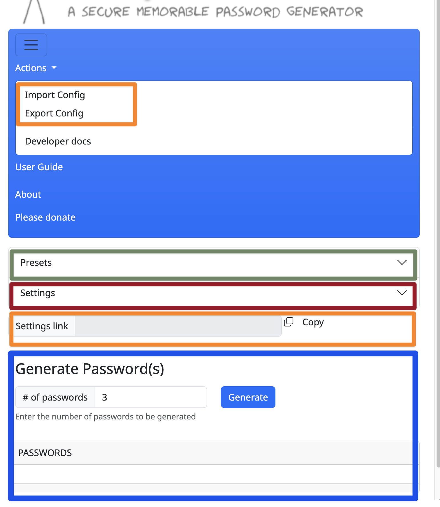

As explained in the [previous instalment](https://pbs.bartificer.net/pbs170) the new XKPasswd-js code uses the Model View Controller (MVC) pattern to structure the code. This instalment will explain this in more detail and also some of the choices why this was done.

In the very first web version of XKPasswd-js, the UI was 99% static HTML. Life was easy because the only action needed was the push of the Generate button. It took only a little bit of code to add the generated passwords to the text area that was already created in the HTML, with an `id` set for easier reference.

Thanks to the use of Bootstrap version 5, there were already a dropdown menu, a responsive hamburger menu, and an accordion to hold the configuration information. All these elements contained placeholders but all were already fully functional. The focus was on getting the actual password generation code to work.

Slowly, over time the placeholders were replaced by working code and the main file, `index.mjs`, grew bigger and became more complex. It was time to break the code up into multiple classes.  There are many reasons to break up a complex file.

When a file has hundreds of lines and you need to refer to a different part of the file, you are either scrolling up and down through the file, inevitably losing your editing spot or you need an editor that can display different locations of a single file side by side.

 Oftentimes, in such a file, you tend to create long functions that perform long and complex tasks. Before you know it, you even need to scroll within a function to reference some code.

Put this code aside for a few weeks and by the time you get back to it, you'll be scratching your head on where to begin adding new features or fixing bugs.

When you get tired of scrolling and of losing hair from scratching you will start to break up long functions into shorter ones, but then you also need a kind of table of contents of all the functions you've created, because there will be many. 

Sure, any good IDE, e.g. VSCode, will provide this functionality but scrolling is now replaced by jumping around using the table of contents. By the way, the IDE will usually call such a table of contents an overview. 

Another reason for breaking up a long and complex file is unit testing. A unit test is, as the name implies, a test that checks the functionality of a single unit. A unit in code is a function or method. It is very difficult to write unit tests for complex functions that call other functions you also need to test. This means, it becomes very difficult to test the various functions in isolation.

It also becomes almost impossible to unit test a function if that function also manipulates the UI. For example, one function handles the button press, generates the passwords AND updates the text area with the passwords.

Time for the implementation of the Model View Controller or MVC pattern.

## Layout of the project

Before we dive into the MVC pattern, let's step back and review the project structure. 


In the diagram you can see the structure of the project. The source code lives in the `src` directory. The scripts, defined in `package.json`, generate a webapp from the source code and place it in the `dist` directory.
The other directories contain documentation and diagrams. These provide additional information to the developers, but they are not the focus of this instalment. 
So, running the application is done from the `dist` directory and editing the application's source code is done in the `src` directory.

The `src` directory contains several directories and files. We will only focus on the files and directories that are relevant for the source code.
The files in the `src` directory are the `index.html` file and the `index.mjs` file.
The `index.html` file contains the code for the UI of the application and the `index.mjs` file the Javascript code that serves as the entry point to our app.

The `lib` directory contains the classes for the actual password generator, aka the port from Perl to Javascript. 
Each class lives in its own file with the same name, so the `XKPasswd` class can be found in the `xkpasswd.mjs` file. 
The convention here is to name the file after the classname but in lowercase with an extension of `mjs` to indicate it's an ES6 class.
As per Jest conventions the file that contains the tests for the `XKPasswd` class is called `xkpasswd.test.mjs` and can be found in the same directory.

The `web` directory contains the classes that drive the UI of the application. These classes follow the MVC pattern.

All these classes are initialized in `index.mjs` in the `XKP` object. This object serves a wrapper around all the code in the `index.mjs` file to prevent it from being in the global namespace.

## The MVC pattern


Usually, the MVC pattern leads to a trio of classes: the Model class, the Controller class, and the View class. Together they take care of some aspect of the application or of the entire functionality of the application, depending on the size and complexity of the application.

In XKPasswd-js there is just one Model, but multiple Controller and View pairs.


### A Model and a Gateway design pattern

The heart of the application, aka the business logic aka the reason for its existence, is the port from the old Perl library to Javascript. As we learned last time, this is the Model in the MVC pattern. In the diagram above you see the Model depicted as a cylinder shape in the center of the diagram.

Before we go on, we need to take a side step.

The Model is actually not one class, but all the classes in the `src/lib` directory together. 
There is one class, `XKPasswd`, that serves as the entrance to the other classes.
This means that the other classes in this directory are only accessed by the `XKPasswd` class and all requests for the functionality of the other classes have to go to the `XKPasswd` class. In fact, the `lib` directory becomes a black box to the rest of the code with only one door, the `XKPasswd` class. 
This is also a design pattern, like the MVC pattern, and this pattern is called Gateway pattern.

This Gateway setup allows us to take contents of the `lib` directory any time in the future and create a command line application out of it by simply adding one or more classes that become the command line 'view' the user interacts with.

This Gateway setup also allows us to keep the Model and various Views (both web and command line) in one git repository and still build various versions of the application.

Finally, because the classes in the `lib` directory only deal with the business logic, it is very easy to test them with Jest tests.
Writing tests for UI manipulation is the hardest part of testing. 
By separating the Model from the View and the Controller it becomes much easier to write tests for the Model.

So back to our diagram, the cylinder represents all of the classes in the `lib` directory with the `XKPasswd` class as the Gateway.

Due to this setup, there is just one Model which is used by all the Controllers.


## Views and Controllers

Rule of thumb for the UI of XKPasswd is _if it can be done in static HTML, it will be added to index.html_. This reduces the Javascript part of the view to change visibility and CSS classes of existing objects and to fill or empty the input fields.
These functions are usually so trivial they don't need any unit tests. So less unit tests to write.
All the Views and Controllers are in the `web` directory. 



XKPasswd has two main areas in the UI, the part where the configuration can be changed and the part where the passwords are generated and displayed along with the statistics. 
The configuration part can be separated in the preset part and the individual settings part.
The classes in the `lib` directory also match this separation.

The Preset part is very straightforward. 
It displays the available presets along with the description of that preset. 
The selected preset is displayed in the header of the box.

The Password part is also quite simple. 
It handles the input of the number of passwords and displays the generated passwords and the statistics. 
Finally it handles the copy actions of the passwords and the switch between list and textarea.

The most complicated part is the Settings part with a lot of input fields which need to be shown or hidden based on the value of other fields and show error messages when the input is not correct and hide them again when the error is corrected.

To keep the code manageable it was also divided in three parts with a View and a Controller pair for each part.

If you look at the screenshot of the UI you will see the Preset part is marked with a green box. The Settings part with a purple box and the Password part with a blue box.
These colors match with the colors of the controller/view pairs in the diagram above.

Let's have a more detailed look into the views and controller classes.


## Views

The constructor of the Views classes initialise class variables with jQuery objects of the HTML elements that are relevant to the part they focus on. So e.g. the PresetView class has variables for the header of the preset box, the element that holds the buttons and the element that holds the description.

These Views classes also have one or more functions with a name that starts with 'bind'. This function binds an event handler to the relevant HTML elements. It takes one parameter called `handle`. This is a reference to a function of the Controller to handle the action that this event initiated.
In this project these functions are called bind functions, because the word 'bind' is in the name and it binds an event handler in the View class to a function in the Controller class.

Finally these Views classes contain helper functions to make showing/hiding of UI parts or other actions easier to call.

## Controllers

In the constructor of the Controller classes several class variables are initialized with references to the Model class (the `XKPasswd` class) and the respective View class. If necessary, the Controller also has variables for the other Controllers it needs to address.

The constructor also calls the bind function of the View class and passes its own function that needs to handle the data that is created by the user through the View. 

If necessary the Controller class has one or more helper functions that in turn call a helper function in its View class. These Controller helper functions can be called by other Controllers in case the UI needs to change and that change is not the responsibility of the Controller that wants to change the UI.

# Example

To get a better idea of how such a bind function works, let's look at the bind function of the PasswordView class, because that's the easiest one.

```javascript
bindGeneratePassword(handle) {  
      
      $('form#generatePasswords').on('submit', (e) => {  
        e.preventDefault();  
        e.stopPropagation(); // stop the event bubbling  
      
        let num = parseInt(this.#numberOfPasswords.val());  
        if (isNaN(num) || num < 1) {  
          num = 1;  
          this.#numberOfPasswords.val(num);  
        }  
        handle(num);  
      });  
    };
```

It creates a submit handler for the form with the number of passwords. This submit handler reads the number of passwords, checks if it's a positive number, if not, sets the number to 1, and passes the number to the `handle` function.

The PasswordController calls this `bindGeneratePassword` function and passes its own `generatePasswords` function as parameter.

```javascript
this.#view.bindGeneratePassword(this.generatePasswords);
```

In turn, the `generatePasswords` function calls the `XKPasswd` class, the Gateway class, to generate the number of passwords given and passes the result on to the PasswordView class to render the passwords. Rendering just means displaying the information in the predefined way.

This looks like a difficult way to perform an action, but by splitting the action over different classes, it becomes easier to change one of them, without affecting the others. E.g. we could totally change the way the number is entered and how the passwords are displayed, but there is no change in the way the PasswordController passes the number onto the `XKPasswd` class nor is there any change in the code that generates the passwords.
On the other hand, when we would change the way the Controllers are set up, there would be no change in code in the View class, nor in the `XKPasswd` class.

## A fourth Controller and View pair

In June of 2024 Luis Tavares, also known as _irsheep_, created a pull request to add a much requested feature: a way to store and retrieve the current settings. 
His implementation was to create an encoded blob that contains the settings and add that as a query parameter to the url of the XKPasswd website.
You can copy that url and bookmark it and Luis' code will decode the blob and fill the settings according to your preferences.

I was implementing a similar feature to import and export configuration as JSON files, and I was debating where to put the code for the View and the Controller actions. 

Luis' code was basically doing the same thing but starting from a different position and he created a Config class. So, why not combine the different ways to save and reuse a specific setting. 
The code is rearranged to create a ConfigView and a ConfigController class.

It doesn't matter that the import and export of the JSON files are in the menu and the settings link is under the Settings box. That is for the ConfigView to handle. 

The ConfigController handles the reading and writing of the JSON files and the encoding and decoding of the settings link. It also tells the SettingsController to display the custom settings. 
Finally, it takes care of updating the settingslink. 
So whenever the settings change, the SettingsController calls the ConfigController to update the settings link.

If you look at the image you will see two orange boxes around the menu items and the settings link. In the diagram there is an orange Controller/View pair. 

At the time of this episode, this pair is slightly paler than the other pairs, because it's not yet fully working. That is, the functionality is available on the website, but it hasn't been tested yet by many people.
