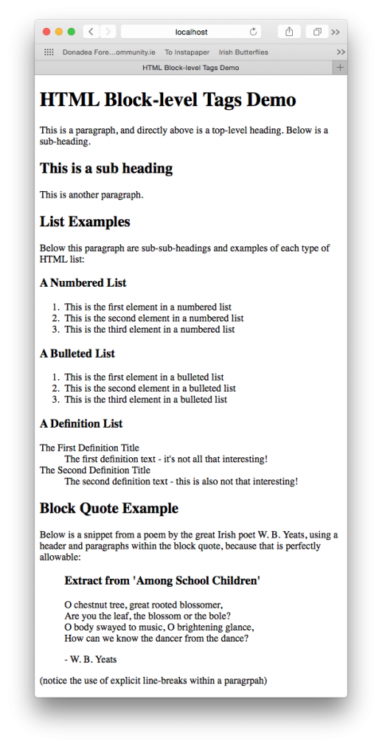

In the previous instalment we introduced HTML, learned about HTML tags in the abstract, and looked at a basic template for all HTML pages. Over the next few instalments we’ll be working our way through the common HTML tags.

There are two major types of HTML tags, block-level tags, and inline tags, though it should be noted that there is a much less common third type which is a hybrid of the two, referred to as inline-block. For now, we’ll be ignoring these oddballs.

Block level tags define regions of content – things like titles, paragraphs, lists, list items, and so on. Inline tags affect parts of a block – for example, a few words within a paragraph can be marked for emphasis. With practice the distinction will become obvious, especially when we get to the more advanced aspects of CSS, but the difference in type can be confusing. A handy way of remembering the difference is that opening a new block-level tag will always start a new line on your page.

In this instalment we’ll start with some of the most common block-level tags.

## Matching Podcast Episode 411

Listen along to this instalment on [episode 411 of the Chit Chat Across the Pond Podcast](http://www.podfeet.com/blog/2015/11/ccatp-411/)

<audio controls src="http://media.blubrry.com/nosillacast/traffic.libsyn.com/nosillacast/CCATP_2015_11_08.mp3">Your browser does not support HTML 5 audio 🙁</audio>

You can also <a href="http://media.blubrry.com/nosillacast/traffic.libsyn.com/nosillacast/CCATP_2015_11_08.mp3?autoplay=0&loop=0&controls=1" >Download the MP3</a>

## Headings

There are six heading tags in HTML – `<h1>`, `<h2>` … `<h6>`, with `<h1>` being top-level heading, `<h2>` a sub-heading, `<h3>` a sub-sub-heading, and so on.

As a general rule, pages generally have just one top-level heading, a few sub-headings, and perhaps the odd sub-sub-heading. You’ll very rarely need to use the higher-numbered heading tags. Search engines use heading tags to help them understand what a page is about.

<!-- vale Vale.Repetition = NO -->

No other block-level tags should be contained within heading tags, but inline tags can be (not that that is often desired).

<!-- vale Vale.Repetition = YES -->
## Paragraphs

Paragraphs of text should be contained within `<p>` tags.

No other block-level tags should be contained within paragraph tags, but inline tags can, and often are, contained within paragraph tags.

## Lists

There are three types of list within HTML: bulleted lists, numbered lists, and definition lists.

### Bulleted Lists – AKA Unordered Lists

A bulleted list is defined by the `<ul>` tag – this stands for _unordered list_.

Each block of bulleted text should be contained within `<li>` tags – this stands for _list item_.

`<ul>` tags should only contain `<li>` tags. `<li>` tags can contain other block-level tags, including other lists to create nested lists, as well as inline tags.

```html
<ul>
  <li>The first item in a bulleted list</li>
  <li>The second item in a bulleted list</li>
</ul>
```

### Numbered Lists

A numbered list is defined by the `<ol>` tag – this stands for _ordered list_.

As with bulleted lists, each block of text in the list should be contained within `<li>` tags. Note that the browser viewing the page takes care of the actual numbers. This makes it very easy to reorganise the list without getting the numbers out of order.

Again, like with `<ul>`, `<ol>` tags should only contain `<li>` tags.

Example:

```html
<ol>
  <li>The first item in a numbered list</li>
  <li>The second item in a numbered list</li>
</ol>
```

### Definition Lists

Think of a definition list as being like a dictionary – there is a term, and then there is a definition of what that term means.

The entire list should be contained within `<dl>` tags. Terms should be contained within `<dt>` tags (for _definition title_), and each definition should be contained within `<dd>` tags (for _definition data_).

If multiple terms have the same definition, you can have a number of consecutive `<dt>` tags followed by a single `<dd>` tag.

`<dl>` tags should only contain `<dt>` and `<dd>` tags, `<dt>` tags should only contain inline tags, and `<dd>` tags can contain any other tags, including block-level tags.

```html
<dl>
  <dt>HTML</dt>
  <dd>The Hyper Text Markup Language is a computer language for defining the content of a web page.</dd>
  <dt>CSS</dt>
  <dd>Cascading Style Sheets are used to define how an HTML web page looks.</dd>
</dl>
```

### Nested Lists

Because `<li>` and `<dd>` tags can contain any other tags, lists can be inserted into list items to create nested lists. A nested list can contain a mixture of all the different list types.

```html
<ul>
  <li>
    This top-level bulleted list item contains a numbered list:
    <ol>
      <li>This is the first element in a nested numbered list</li>
      <li>This is the second element in a nested numbered list</li>
    </ol>
  </li>
  <li>
    <h2>This is a heading within a bulleted list</h2>
    <p>This is a paragraph within a bulleted list, and below this paragraph is a definition list also contained within the same bulleted list item.</p>
    <dl>
      <dt>First Definition Title</dt>
      <dd>This is the first definition in a definition list contained within a bulleted list.</dd>
      <dt>Second Definition Title</dt>
      <dd>This is the second definition in a definition list contained within a bulleted list.</dd>
    </dl>
  </li>
</ul>
```

## Block Quotes

The `<blockquote>` tag is designed to mark a block of text as being some form of quotation.

Block quotes can contain both block and inline tags, including other block quotes.

```html
<blockquote>
  <h2>Extract from "Lines Written on a Seat on the Grand Canal, Dublin"</h2>

  <p>O commemorate me where there is water,<br />
  Canal water, preferably, so stilly<br />
  Greeny at the heart of summer. Brother<br />
  Commemorate me thus beautifully<br />
  Where by a lock niagarously roars</p>

  <p>- Patrick Kavanagh</p>
</blockquote>
```

## Final Example

Let’s finish with a final working example.

Start by adding a folder called `pbs3` to the document root of your web server. In there, create a file called `index.html` with the following contents:

```html
<!DOCTYPE html>
<html>
<head>
  <meta charset="UTF-8" />
  <title>HTML Block-level Tags Demo</title>
</head>
<body>

<h1>HTML Block-level Tags Demo</h1>
<p>This is a paragraph, and directly above is a top-level heading. Below is a sub-heading.</p>

<h2>This is a sub heading</h2>
<p>This is another paragraph.</p>

<h2>List Examples</h2>
<p>Below this paragraph are sub-sub-headings and examples of each type of HTML list:</p>

<h3>A Numbered List</h3>
<ol>
  <li>This is the first element in a numbered list</li>
  <li>This is the second element in a numbered list</li>
  <li>This is the third element in a numbered list</li>
</ol>

<h3>A Bulleted List</h3>
<ul>
  <li>This is the first element in a bulleted list</li>
  <li>This is the second element in a bulleted list</li>
  <li>This is the third element in a bulleted list</li>
</ul>

<h3>A Definition List</h3>
<dl>
  <dt>The First Definition Title</dt>
  <dd>The first definition text - it's not all that interesting!</dd>
  <dt>The Second Definition Title</dt>
  <dd>The second definition text - this is also not that interesting!</dd>
</dl>

<h2>Block Quote Example</h2>

<p>Below is a snippet from a poem by the great Irish poet W. B. Yeats, using a header and paragraphs within the block quote, because that is perfectly allowable:</p>

<blockquote>
  <h3>Extract from 'Among School Children'</h3>

  <p>O chestnut tree, great rooted blossomer,<br />
  Are you the leaf, the blossom or the bole?<br />
  O body swayed to music, O brightening glance,<br />
  How can we know the dancer from the dance?</p>

  <p>- W. B. Yeats</p>
</blockquote>

<p>(notice the use of explicit line-breaks within a paragraph)</p>
</body>
</html>
```

Make sure your web server is started, and then visit `http://localhost/pbs3/` in your favourite browser to see what this page looks like. It should look something like:


