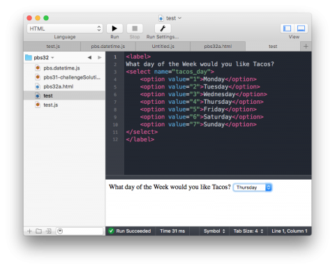

In this instalment we’ll continue our twin-track approach of mixing a little JavaScript revision with learning some new HTML. In this case, we’ll revise JavaScript’s error handling mechanism (`throw`, `try` & `catch`), and learn how to use the HTML `<select>` tag to create drop-down menus and multiple-selection lists.

We won’t be updating our date and time prototypes, but we will be using them in example HTML pages. So in this instalment our two tracks come into direct contact with each other for the first time. We’ll use an HTML page with multiple drop-downs to allow users to select a date, and then render that date in many formats using our `pbs.Date` prototype. We’ll also use JavaScript’s error handling features to respond appropriately when a user attempts to render an impossible date like the 31st of February 2010.

Finally, the challenge set at the end of this instalment will also combine our prototypes with HTML forms, and JavaScript error handling.

You can download my solution to the challenge set in the previous instalment, and all the code samples for this instalment in a single ZIP file [here](https://www.bartbusschots.ie/s/wp-content/uploads/2017/03/pbs32.zip) or [here on GitHub](https://cdn.jsdelivr.net/gh/bbusschots/pbs-resources/instalmentZips/pbs32.zip).

## Matching Podcast Episode 480

Listen Along: Chit Chat Across the Pond Episode 480

<audio controls src="https://media.blubrry.com/nosillacast/traffic.libsyn.com/nosillacast/CCATP_2017_03_15.mp3">Your browser does not support HTML 5 audio 🙁</audio>

You can also <a href="https://media.blubrry.com/nosillacast/traffic.libsyn.com/nosillacast/CCATP_2017_03_15.mp3?autoplay=0&loop=0&controls=1" >Download the MP3</a>

## Solution to PBS 31 Challenge

The challenge set at the end of [the previous instalment](https://pbs.bartificer.net/pbs31) was to add four static functions to the date and time prototypes we’ve been building up over recent instalments. Because the code for these prototypes is now very long, I’m only including the relevant excerpts below. You can find my full solution in this instalment’s ZIP file (`pbs31-challengeSolution.js`).

```javascript
// init name space
var pbs = pbs ? pbs : {};

// define all prototypes within an anonymous self executing fuction
(function(pbs, undefined){
	//
	// ==== Define Needed Helper Functions ===
	//

	// ...

	//
	// === Define Time prototype ===
	//

	// ...

	// add static function for checking if arbitrarily many times are the same
	pbs.Time.areEqual = function(){
		// if we don't have at least two arguments, they can't possibly be equal
		if(arguments.length < 2){
			return false;
		}

		// if the first argument is not a pbs.Time, they can't all possibly be equal times
		var firstT = arguments[0];
		if(!(firstT instanceof pbs.Time)){
			return false;
		}

		// if we got here, check the first time against all the others, if a single one is
		// not equal, return false
		for(var i = 1; i < arguments.length; i++){
			if(!firstT.equals(arguments[i])){
				return false;
			}
		}

		// if we made it here, all the arguments must be equal
		return true;
	};

	//
	// === Define Date prototype ===
	//

	// ...

	// add the static function isLeapYear
	pbs.Date.isLeapYear = function(y){
		// make sure we were passed a plausible year
		if(!isValidInteger(y)){
			throw new TypeError('the year must be an integer');
		}

		// figure out if the year is a leapyear or not
		if(y % 4 === 0){
			// year is divisible by 4, so might be a leap year
			if(y % 100 === 0){
				// a century, so not a leap year unless divisible by 400
				if(y % 400 === 0){
					return true;
				}
			}else{
				// divisible by four and not a century, so a leap year
				return true;
			}
		}

		// if we got here, the year is not a leap year
		return false;
	};

	// add the static function leapYearsBetween
	pbs.Date.leapYearsBetween = function(y1, y2){
		// make sure both years are at least sane
		if(!(isValidInteger(y1) && isValidInteger(y2))){
			throw new TypeError('both years must be an integers');
		}

		var ans = []; // an empty array

		// figure out where to start and end the loop
		var startYear = 0;
		var endYear = 0;
		if(y1 <= y2){
			startYear = y1;
			endYear = y2;
		}else{
			startYear = y2;
			endYear = y1;
		}

		// loop through all the years in the range, and save the leap years
		for(var y = startYear; y <= endYear; y++){
			if(pbs.Date.isLeapYear(y)){
				ans.push(y);
			}
		}

		// return the leap years
		return ans;
	};

	// add static function for comparing arbirarily many Dates
	pbs.Date.areEqual = function(){
		// if we don't have at least two arguments, they can't possibly be equal
		if(arguments.length < 2){
			return false;
		}

		// if the first argument is not a pbs.Date, they can't all possibly be equal dates
		var firstD = arguments[0];
		if(!(firstD instanceof pbs.Date)){
			return false;
		}

		// if we got here, check the first date against all the others, if a single one is
		// not equal, return false
		for(var i = 1; i < arguments.length; i++){
			if(!firstD.equals(arguments[i])){
				return false;
			}
		}

		// if we made it here, all the arguments must be equal
		return true;
	};

	//
	// === Define DateTime prototype ===
	//

	// ...

	// add static function for comparing arbirarily many DateTimes
	pbs.DateTime.areEqual = function(){
		// if we don't have at least two arguments, they can't possibly be equal
		if(arguments.length < 2){
			return false;
		}

		// if the first argument is not a pbs.DateTime, they can't all possibly be equal dates
		var firstDT = arguments[0];
		if(!(firstDT instanceof pbs.DateTime)){
			return false;
		}

		// if we got here, check the first DateTime against all the others, if a single one is
		// not equal, return false
		for(var i = 1; i < arguments.length; i++){
			if(!firstDT.equals(arguments[i])){
				return false;
			}
		}

		// if we made it here, all the arguments must be equal
		return true;
	};
})(pbs);

//
// Test Code
//

// PBS 31 - part 1
console.log("The Leap Years between 2000 and 2100 (inclusive):");
pbs.Date.leapYearsBetween(2000, 2100).forEach(function(ly){
	console.log("* " + ly);
});

// PBS 31 - Part 2a
var t1 = new pbs.Time();
var t2 = new pbs.Time();
var t3 = new pbs.Time(15);
var t4 = new pbs.Time(15);
var t5 = new pbs.Time(15);
console.log(pbs.Time.areEqual(t1, t2)); // true
console.log(pbs.Time.areEqual(t1, t2, t3)); // false
console.log(pbs.Time.areEqual(t3, t4, t5)); // true

// PBS 32 - Part 2b
var d1 = new pbs.Date();
var d2 = new pbs.Date();
var d3 = new pbs.Date(25, 12, 1980);
var d4 = new pbs.Date(25, 12, 1980);
var d5 = new pbs.Date(25, 12, 1980);
console.log(pbs.Date.areEqual(d1, d2)); // true
console.log(pbs.Date.areEqual(d1, d2, d3)); // false
console.log(pbs.Date.areEqual(d3, d4, d5)); // true

// PBS 32 - Part 2c
var dt1 = new pbs.DateTime();
var dt2 = new pbs.DateTime();
var dt3 = new pbs.DateTime(d5, t5);
var dt4 = new pbs.DateTime(d5, t5);
var dt5 = new pbs.DateTime(d5, t5);
console.log(pbs.DateTime.areEqual(dt1, dt2)); // true
console.log(pbs.DateTime.areEqual(dt1, dt2, dt3)); // false
console.log(pbs.DateTime.areEqual(dt3, dt4, dt5)); // true
```

## JavaScript Error Handling (Revision)

When writing code, errors are very much a game of two halves – determining that something has gone wrong and deciding what to do in response. To write good code, you need the ability to separate the code for these two very different tasks from each other. This is always true, but it is especially true when you are writing reusable code like custom JavaScript prototypes. The same prototype should be usable in all kinds of scenarios – you should be able to use it on any web page, in shell scripts, in server-side JavaScript code, and so on.

What you absolutely do not want to end up writing is something like:

```javascript
function divBy(x, y){
  if(y == 0){
    $('#errors').text("You can't divide by zero!");
    return;
  }
  return x/y;
}
```

What is wrong with this code? Well – it will only work on a web page with an element with the ID `errors`. Also whether you want it or not, your response to trying to divide by zero will always be writing out the message _“You can’t divide by zero!”_. Needless to say, this function will not behave properly when used in a shell script or within server-side Javascript code.

We have totally blended the detection of the error with our response, and that’s the problem.

In JavaScript, the mechanism for separating error detection from the response to that error relies on the three related keywords `throw`, `try` & `catch`.

### Flagging an Error (`throw`)

When your code detects an error, it should respond by throwing an error using the `throw` keyword. You’ll find lots of examples similar to the one below throughout my versions of our date and time prototypes:

```javascript
pbs.Time.prototype.hours = function(h){
  if(arguments.length === 0){
    return this._hours;
  }
  if(!isValidInteger(h, 0, 23)){
    throw new TypeError('the hours value must be an integer between 0 and 23 inclusive');
  }
  this._hours = h;
  return this;
};
```

You use the `throw` keyword to throw an object representing the error that has occurred. You can define your own error prototypes if you like, but you don’t have to (and we haven’t been, and won’t be in this series). JavaScript provides a number of error prototypes we can choose from on a case-by-case basis as appropriate, including the following:

<dl>
<dt><code>Error</code></dt>

<dd>The generic error prototype – you can always use this prototype. Many programmers never use any error prototype other than this one.</dd>

<dt><code>RangeError</code></dt>

<dd>Appropriate when a value is of the expected type, but its value falls outside some acceptable range. For example, you got a negative number, but you need a positive one.</dd>

<dt><code>TypeError</code></dt>

<dd>Appropriate when a value is not of the expected type. For example, you need a boolean but you got a string, or you need an array and you got a callback.</dd>
</dl>

JavaScript defines a number of other error prototypes, but they are for JavaScript’s own use rather than for our use as programmers, e.g. `SyntaxError`, when we write code that the JavaScript interpreter can’t understand.

The constructors for all these prototypes expect a string describing the error as the first argument, in other words, they expect an error message as the first argument.

### Responding to an error (`try` & `catch`)

We don’t have to write our own code for catching errors that are thrown if we don’t want to. We can let the JavaScript interpreter deal with them. If an error is not dealt with by our code and is left to the interpreter to deal with, we call it an _unhandled error_. When running as a shell script an unhandled error will cause the interpreter to halt execution of the script and print out an error message, perhaps including a stack trace. When running in a web page unhandled errors result in the thread of execution that experienced the error halting, and an error message being written to the web/error/JavaScript console. In reality, that makes unhandled exceptions on the web utterly invisible to users – their experience is simply that the page stops behaving as expected for no obvious reason. As a general rule, unless you’re writing shell scripts, you probably want to handle your errors so you can provide some meaningful information to the user.

To handle your own errors, you need to wrap the code that could generate an error inside a `try` block, and add your code for dealing with that error inside the matching `catch` block.

For example, save the following file into the same folder as `pbs.datetime.js` (from this instalment’s ZIP file), and run it with NodeJS (or in an editor that supports code execution like [CodeRunner](https://coderunnerapp.com)):

```javascript
// code to suck our browser-targeted date & time prototypes into NodeJS
// (this is a dirty hack to get code written for the browser into Node)
fs = require('fs');
eval(fs.readFileSync('./pbs.datetime.js').toString());

// create a pbs.Date object
var myDate = new pbs.Date();

// try set it to an impossible date
myDate.european(30, 2, 2017);
```

This produces an unhandled error.

We can turn this into a handled error like so:

```javascript
// code to suck our browser-targeted date & time prototypes into NodeJS
// (this is a dirty hack to get code written for the browser into Node)
fs = require('fs');
eval(fs.readFileSync('./pbs.datetime.js').toString());

// create a pbs.Date object
var myDate = new pbs.Date();

// try set it to an impossible date
try{
	myDate.european(30, 2, 2017);
}catch(err){
	console.log("oops - that's not a legal date!");
}
```

In the parentheses after the keyword `catch` we define a name for the object representing the error thrown from within the `try` block. The scope of this name will be the `catch` block. Think of this as naming the arguments to functions.

All the standard JavaScript error objects contain a data attribute named `.message` which holds the error message as a string. We can use this to add extra information into our error messages to users:

```javascript
// code to suck our browser-targeted date & time prototypes into NodeJS
// (this is a dirty hack to get code written for the browser into Node)
fs = require('fs');
eval(fs.readFileSync('./pbs.datetime.js').toString());

// create a pbs.Date object
var myDate = new pbs.Date();

// try set it to an impossible date
try{
  myDate.european(30, 2, 2017);
}catch(err){
  console.log("oops - can't do that! (" + err.message + ")");
}
```

Executing this code now results in the following being written to the console:

`oops - can't do that! (invalid day, month, year combination)`

These are all very contrived examples. To get a better idea of what’s going on, let’s use our date & time prototypes within a web page. Open the file `pbs32a.html` from this instalment’s ZIP file in a browser (make sure the file `pbs.datetime.js` exits in the same folder).

This page lets you specify a date using three drop-down menus, and then render that date in four different formats. We’ll look at how the drop-downs work in the second half of this instalment. For now, what I want to draw your attention to is what happens when you press the button to render the date. If you press the button with a sane date like the 5th of April 2017, you’ll see the page displays that date in International, European, American, and English formats. It probably won’t surprise you to learn that it does so using our `pbs.Date` prototype.

Now, let’s see what the page does when you ask it to do the impossible – to render the 31st of February 2001.

You’ll see that the page responds in a sane way. It doesn’t just write something to the console (where you’ll probably never see it) and then die. The button’s event handler catches the error and uses jQuery to show a human-friendly error message and set the content of each of the output regions to three question marks.

Below is the entire click handler for the button:

```javascript
// add a click handler to the button
$('#render_btn').click(function(){
  // assume there will be no error, so blank the error message
  var $error = $('#error_out');
  $error.text('').hide();

  // create a date object
  var d = new pbs.Date();

  // try set it to the value represented by the form
  try{
    d.year($years.val());
    d.month($months.val());
    d.day($days.val());
  }catch(err){
    $error.text('Failed to interpret date with error: ' + err.message);
    $error.show();
    $('#dates_list dd').text('???');
    return;
  }

  // render the date
  $('#inter_out').text(d.international());
  $('#eur_out').text(d.european());
  $('#usa_out').text(d.american());
  $('#eng_out').text(d.english());
}).click();
```

For now, please accept that `$years.val()`, `$months.val()` & `$days.val()` return the values selected in the drop-down menus, and focus instead on how errors are dealt with.

The handler starts by creating a `pbs.Date` object using all default values (no arguments passed to the constructor). Then, the handler does all the risky stuff, i.e. dealing with user input within a `try` block. Accompanying that `try` block is the `catch` block which specifies what to do should the code inside the `try` block throw an error.

The key point is that, when we wrote the `pbs.Date` prototype, we had no idea that it might one day be used on a web page where errors should be written to a `<div>` with the ID `error_out`. The code within the prototype simply detects that there is a problem, and throws an error. How that error should be responded to is defined within the page using the API, not within the API itself.

## HTML Selects

In HTML, drop-down menus like those used in the above example are known as _selects_, and they are defined using the HTML tags `<select>` & `<option>`. The drop-down menu itself is described by the `<select>` tag, and each option within the drop-down by a separate `<option>` tag.

As we discussed in the previous instalment, all HTML form inputs are designed to produce name-value pairs. With drop-downs, the name attribute is set on the `<select>` tag, and each `<option>` tag defines the value it represents. Like checkboxes and individual radio buttons, drop-downs should be labeled with a `<label>` tag, either by wrapping the entire drop-down and the text describing it within a `<label>` tag, or by giving the drop-down an ID, and associating a separate `<label>` tag to the drop-down with the `for` attribute.

The text the user sees for each option is independent of the value that option represents, as illustrated with the following sample drop-down:

```html
<label>
What day of the Week would you like Tacos?
<select name="tacos_day">
  <option value="1">Monday</option>
  <option value="2">Tuesday</option>
  <option value="3">Wednesday</option>
  <option value="4">Thursday</option>
  <option value="5">Friday</option>
  <option value="6">Saturday</option>
  <option value="7">Sunday</option>
</select>
</label>
```

The user sees the contents of the `<option>` tags, while the value part of the name-value pair is determined by the `value` attribute on the selected option.

> ### Aside:
>
> A quick note for those of you using the CodeRunner editor: if you set the execution language to HTML (the drop-down next to the run button, not the syntax highlighting setting), you can _‘run’_ HTML directly in the CodeRunner console as shown in this screenshot:
>
> 

By default, the first option in a drop-down is automatically selected, but you can have any option be the default by adding the attribute `selected="selected"` to the `<option>` tag of your choice.

Options can also be arranged into labeled groups with the `optgroup` tag. For example, we can enhance our example above like so:

```html
<label>
What day of the Week would you like Tacos?
<select name="tacos_day">
	<optgroup label="Weekdays">
		<option value="1">Monday</option>
		<option value="2">Tuesday</option>
		<option value="3">Wednesday</option>
		<option value="4" selected="selected">Thursday</option>
		<option value="5">Friday</option>
	</optgroup>
	<optgroup label="Weekend">
		<option value="6">Saturday</option>
		<option value="7">Sunday</option>
	</optgroup>
</select>
</label>
```

Note that the groupings are purely for presentation. The group labels can’t be selected because they are not actually options within the menu.

HTML selects don’t have to be rendered as a drop-down menu. They can also be rendered as a scrollable list. You can switch between modes using the `size` attribute. If the size is 1, you have a drop-down. If the size is greater than 1, you have a scrollable list. The HTML 5 spec does not say sizes between 1 and 4 are not allowed, but some browsers (Safari for example) will never render a scrollable menu with a size smaller than 4, regardless of what value you give the `size` attribute. If you set it to 1 you get a drop-down; if you set it to 2 you get a four-row tall scrollable list; same if you set it to 3; and obviously the same if you set it to 4. For numbers above 4 Safari starts to behave as expected, expanding the scrollable list to the requested size.

Finally, selects can allow multiple values to be selected at the same time by setting the attribute `multiple="multiple"` on the `<select>` tag. Allowing multiple selections results in the select always being rendered as a scrollable list rather than a drop-down. To select multiple elements you have to use the same key combinations you would use to select multiple files in your OS’s file manager, so cmd+click on a Mac. When multiple options are selected, the form data will contain multiple name-value pairs for the select – the name of the select paired with each selected value.

Personally, I find scrollable lists ugly and multiple selection difficult for users to figure out. So I avoid using either the `size` or `multiple` attributes. If I need users to select multiple values, I prefer to give them a collection of checkboxes click on instead.

The file `pbs32b.html` in this instalment’s ZIP file contains a sample form with examples of both uses of the `<select>` tag, and a button to show the resulting name-value pairs. Both approaches to labelling are also demonstrated:

```html
<!DOCTYPE HTML>
<html>
<head>
	<meta charset="utf-8" />
	<title>PBS 32 B - HTML Select Example</title>
	<script src="https://code.jquery.com/jquery-3.1.1.min.js" integrity="sha256-hVVnYaiADRTO2PzUGmuLJr8BLUSjGIZsDYGmIJLv2b8=" crossorigin="anonymous"></script>
	<script type="text/javascript">
		// the DOM ready event handler
		$(function(){
			// add a click handler to the button
			$('#show_btn').click(function(){
				$('#formdata_out').text($('#taco_fm').serialize());
			}).click();
		});
	</script>
</head>
<body>
<h1>HTML Select Example</h1>

<form action="javascript:void();" id="taco_fm">
<fieldset role="form" aria-labelledby="taco_fm_desc">
	<legend id="taco_fm_desc">Taco Preferences</legend>

	<ul>
		<li>
			<label>
				I would like to eat Tacos every
				<select name="taco_day" id="taco_day_sel">
					<option value="1">Monday</option>
					<option value="2">Tuesday</option>
					<option value="3">Wednesday</option>
					<option value="4" selected="selected">Thursday</option>
					<option value="5">Friday</option>
					<option value="6">Saturday</option>
					<option value="7">Sunday</option>
				</select>
			</label>
		</li>
		<li>
			<label for="taco_fillings_sel">I enjoy the following fillings in my tacos:</label><br />
			<select name="taco_filling" id="taco_fillings_sel" multiple="multiple" size="6">
				<option value="beef" selected="selected">Minced Beef</option>
				<option value="chicken">Diced Chicken</option>
				<option value="cheese" selected="selected">Grated Cheese</option>
				<option value="beans" selected="selected">Beans</option>
				<option value="sweet_pepper" selected="selected">Fried Sweet Peppers</option>
				<option value="chilli_pepper">Fried Chilli Peppers</option>
			</select>
		</li>
	</ul>

	<p><button type="button" id="show_btn">(re)Generate Form Data</button></p>
</fieldset>
</form>
<h2>The Form Data</h2>
<pre id="formdata_out"></pre>
</body>
</html>
```

## Manipulating HTML Selects with jQuery

All examples in this section can be executed in the web console on `pbs32b.html` from this instalment’s ZIP file (shown above).

As with checkboxes and radio buttons, you can access the `name` of a `<select>` using jQuery’s `.attr()` function with the string `'name'` as the first argument. For example, you can get the name of the days drop-down with:

```javascript
$('#taco_day_sel').attr('name')
```

You can change the name by passing the new name as a second argument.

You can get the value of the currently selected option(s) within a `<select>` element by calling jQuery’s `.val()` function on the `<select>` element. Ordinarily, the value will be returned as a string, but, if the select allows multiple selections  (`multiple="multiple"`), `.val()` will always return an array, even when no options are selected or just one option is selected.

You can see `.val()`‘s normal behaviour in action by running the code below which gets the value of the currently selected day option:

```javascript
$('#taco_day_sel').val()
```

You can see how multi-selects behave with the following snippet which shows the values of all currently selected fillings:

```javascript
$('#taco_fillings_sel').val()
```

The `.val()` function can also be used to set one or more options by passing the appropriate value as an argument. For example, we can set the taco day to Sunday with:

```javascript
$('#taco_day_sel').val(7)
```

You can also use `.val()` to select multiple options in a multi-select. The code below sets the fillings to beef, cheese, beans, and sweet peppers:

```javascript
$('#taco_fillings_sel').val(["beef", "cheese", "beans", "sweet_pepper"])
```

Note that the value of individual options can be accessed and set by using `.val()` on a specific option rather than on the select as a whole.

You don’t have to control selection using `.val()` on the `select`. You can also use `.prop()` with a first argument of `'selected'` on `option` elements to get or set their selected status. For example, we can determine whether or not cheese is a selected filling with:

```javascript
$('option[value="cheese"]', $('#taco_fillings_sel')).prop('selected')
```

Note the use of the attribute selector we learned about in [instalment 28](https://pbs.bartificer.net/pbs28), and the use of the second argument to the `$()` function to limit the search to options within a specific select.

We can also use this technique to set the selected state of any given option by passing a second argument to `.prop()`. For example, we can set taco day to Monday and select chilli peppers as a filling with:

```javascript
$('option[value="1"]', $('#taco_day_sel')).prop('selected', true);
$('option[value="chilli_pepper"]', $('#taco_fillings_sel')).prop('selected', true);
```

Notice that regular selects behave rather like radio buttons – when a given option is selected, the others become unselected automatically. Multi-selects on the other hand behave more like independent checkboxes – selecting chilli peppers did not deselect any other options.

Finally, hand-coding long sequences of options can be very tedious. It’s often advantageous to add a DOM ready event handler to populate a select with options using some kind of loop. You can see three examples of this technique in action in the file `pbs32a.html` from this instalment’s ZIP file. The raw HTML does not define a single option in any of the three drop-downs:

```html
<ul>
  <li>
    <label>
      Day of Month
      <select id="day_sel"></select>
    </label>
  </li>
  <li>
    <label>
      Month
      <select id="month_sel"></select>
    </label>
  </li>
  <li>
    <label>
      Year
      <select id="year_sel"></select>
    </label>
  </li>
</ul>
```

Instead, all three of the drop-downs are populated using jQuery in a DOM ready event handler:

```javascript
// the DOM ready event handler
$(function(){
  // add the options to the day select
  var $days = $('#day_sel');
  for(var d = 1; d <= 31; d++){
    $days.append($('<option>').text(d).val(d));
  }
  $('option[value="1"]', $days).prop('selected', true);

  // add the options to the month select
  var month_abbrev_lookup = {
    1: 'Jan',
    2: 'Feb',
    3: 'Mar',
    4: 'Apr',
    5: 'May',
    6: 'Jun',
    7: 'Jul',
    8: 'Aug',
    9: 'Sep',
    10: 'Oct',
    11: 'Nov',
    12: 'Dec',
  }
  var $months = $('#month_sel');
  for(var m = 1; m <= 12; m++){
    $months.append($('<option>').text(month_abbrev_lookup[m]).val(m));
  }
  $('option[value="1"]', $months).prop('selected', true);

  // add the options to the year select
  var $years = $('#year_sel');
  for(var y = 2000; y <= 2100; y++){
    $years.append($('<option>').text(y).val(y));
  }
  $('option[value="2000"]', $years).prop('selected', true);

  // ...
}
```

Note the use of jQuery’s `$()` function with an HTML tag as the first argument to create new HTML elements, the use of jQuery’s `.val()` and `.text()` functions to set the value and text of the newly created `option` elements, and finally the use of jQuery’s `.append()` function to inject the newly created `option` elements into the `select` elements. Also notice that, for each drop-down, jQuery’s `.prop()` function is used to select an appropriate default option.

## A Challenge

Using the file `pbs32a.html` from this instalment’s ZIP file as either a starting point, or merely as a relevant example, create a web page that contains five drop-down menus allowing the user to select an hour, minute, day, month, and year, and a button that, when pushed, renders the selected date and time in ISO8601 format (the format outputted by `pbs.DateTime.prototype.toString()`), as well as all permutations of American and European date formats and 12 and 24 hour time formats. When the user chooses an impossible date, the page should handle that error in a sane way.

## Final Thoughts

On our JavaScript track we have now built a collection of pretty full-featured prototypes for representing dates and times, we’ve revised how JavaScript error handling works, and what’s better, we’ve brought our prototypes into the browser and combined them with HTML forms using jQuery.

We will soon be staring on a whole new suite of JavaScript prototypes, but before we do, we’ll learn our first formal piece of software engineering – Test Driven Development (TDD). All software written by humans will inevitably contain bugs, but that’s no reason not to use sound methodologies in an attempt to systematically reduce the number of mistakes we make. That’s where TDD comes in. With TDD you start by defining the tests that your finished functions must pass before you even write a single character of code for the function itself. Then, when the function is written, you can check whether or not it does what you intended it to do by running your predefined tests against it.

As well as learning about TDD, we’ll also continue to explore HTML forms in the next instalment. In particular, we’ll be focusing on basic text input with text boxes and text areas. As similar as they sound, those two are actually very different beasts in HTML!

 - [← PBS 31 — JS Static Functions \| Checkboxes & Radio Buttons](pbs31)
 - [Index](index)
 - [PBS 33 — JS Testing with QUnit →](pbs33)