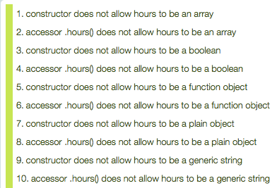

In [the previous instalment](https://pbs.bartificer.net/pbs33) we had our first look at [QUnit](http://qunitjs.com/), an open source unit testing framework for JavaScript by the jQuery project. In this instalment we’ll finish our exploration of QUnit with a look at a few more advanced QUnit features. We’ll be making regular use of QUnit in future JavaScript challenges.

Wrapping up our brief detour into testing a QUnit leaves us free to move back to HTML forms and more JavaScript practice in the next instalment. The aim is to slowly bring those two streams back together through a new multi-instalment project. Over the next few instalments we’ll be building up a web app that makes use of both web forms and JavaScript prototypes.

As usual, I’ve collected the code referenced in this instalment into a ZIP file which you can [download here](https://www.bartbusschots.ie/s/wp-content/uploads/2017/04/pbs34.zip) or [here on GitHub](https://cdn.jsdelivr.net/gh/bbusschots/pbs-resources/instalmentZips/pbs34.zip).

## Matching Podcast Episode 484

Listen Along: Chit Chat Across the Pond Episode 484

<audio controls src="https://media.blubrry.com/nosillacast/traffic.libsyn.com/nosillacast/CCATP_2017_04_30.mp3">Your browser does not support HTML 5 audio 🙁</audio>

You can also <a href="https://media.blubrry.com/nosillacast/traffic.libsyn.com/nosillacast/CCATP_2017_04_30.mp3?autoplay=0&loop=0&controls=1" >Download the MP3</a>

## Solution to PBS 33 Challenge

The challenge set at the end of the previous instalment was to write a QUnit test suite for all or part of some or all of the date and time related prototypes we built together over recent instalments – specifically `pbs.Date`, `pbs.Time` and `pbs.DateTime`. The reason I left the assignment so open-ended is that writing complete test suites for all the feature and functions of this quite large API is a mammoth task that involves quite a bit of repetition. Writing some of the tests will definitely help cement what we learned about QUnit in your minds, but writing everything would likely be too much repetition, and just make you cranky. I figure you guys would stop when you’d had enough, and call it a day.

Unfortunately, in order to provide a complete sample solution which covers all possible subsets of the API you guys could choose to write your tests for, I did have to do a complete test suite, and it was a lot of work, and there were times when it did make me a little cranky 😉

You’ll find my full sample test suite in the ZIP file for this instalment. It’s simply too big to copy-and-paste it all into the body of this post, but I will paste in a few snippets as illustrations throughout this instalment.

### A QUnit Test Suite is a Regular Web Page

There is nothing special about a web page that happens to import the QUnit framework. It is still a web page. That means that everything we have ever learned about HTML, CSS, and JavaScript can be incorporated into your test suites. You can declare variables if you find that a helpful thing to do. You can declare functions if you’d find that a helpful thing to do. And, you can of course use all the control structures you’ve learned about, including loops, to reduce the amount of copying-and-pasting in your test suites.

In short – you can use everything you know about JavaScript to make your test suites easier to write and more effective.

To illustrate this larger point, I want to draw your attention to a few aspects of my sample solution.

Firstly, because there is so much to test here, it made my life easier to split my test suite into multiple files. One file defines some variables and functions I make use of throughout my test suite, including a few very general tests. Then three separate files define the tests for each of the three prototypes. So, four `.js` files in total.

If you look at my QUnit test runner (`test/index.html`), you’ll see how easy it is to split up your tests – create the files, then import each into the test runner with a separate `<script>` tag:

```html
<!DOCTYPE HTML>
<html>
<head>
	<meta charset="utf-8" />
	<title>PBS Date &amp; Time Prototypes Test Suite</title>

	<!-- load the QUnit style sheet from the jQuery CDN -->
	<link rel="stylesheet" type="text/css" href="https://code.jquery.com/qunit/qunit-2.3.0.css" />

	<!-- load the API to be tested -->
	<script type="text/javascript" src="../pbs.datetime.js"></script>
</head>
<body>

<!-- Set up the DIVs required by QUnit -->
<div id="qunit"></div> <!-- This DIV will be transformed into the QUnit UI -->
<div id="qunit-fixture"></div> <!-- This DIV will serve as the fixture (empty this time) -->

<!-- Now that all the requirements are in place, load QUnit from the jQuery CDN -->
<script type="text/javascript" src="https://code.jquery.com/qunit/qunit-2.3.0.js"></script>

<!-- Finally, load our test suite -->
<script type="text/javascript" src="pbs.datetime.test.js"></script>
<script type="text/javascript" src="pbs.datetime.test1-Time.js"></script>
<script type="text/javascript" src="pbs.datetime.test2-Date.js"></script>
<script type="text/javascript" src="pbs.datetime.test3-DateTime.js"></script>
</body>
</html>
```

While writing my test suite, I quickly realised that I would need similar pieces of dummy data over and over again. Rather than redefining that dummy data each time, I chose to build a data structure to store it, which I named `DUMMY_DATA`.

The `DUMMY_DATA` variable is a plain object where the names are short abbreviations that describe the piece of sample data, and the values are themselves plain objects. These inner plain objects each contain two name-value pairs, a textual description of the piece of sample data with the name `desc`, and the actual piece of sample data with the name `val`.

For example, `DUMMY_DATA.num.desc` is `'a number'`, and `DUMMY_DATA.num.val` is `42`. Similarly, `DUMMY_DATA.str.desc` is `'a generic string'`, and `DUMMY_DATA.str.val` is `'boogers!'`.

Here’s a snippet of the definition of this variable:

```javascript
DUMMY_DATA = {
  undef: {
    desc: 'undefined',
    val: undefined
  },
  bool: {
    desc: 'a boolean',
    val: true
  },
  num: {
    desc: 'a number',
    val: 42,
  },
  str_empty: {
    desc: 'an empty string',
    val: ''
  },
  str: {
    desc: 'a generic string',
    val: 'boogers!'
  },
  // ...
};
```

When I had this collection of sample data built up, I soon realised that a subset of that data was different to the rest – when testing argument validation, I needed samples of each of the basic data types in JavaScript over and over again. I needed to be able to quickly check that the function throws an error on all the basic types except for the one or two that the function expects.

For example, the `.hours()` accessor function in the `pbs.Time` prototype should throw an error when given any basic type except a number or the special value `undefined`.

To make these basic type checks easier, I created another global variable named `DUMMY_BASIC_TYPES` with the exact same structure as `DUMMY_DATA`, but with fewer entries. Because the entries needed were the same, I copied them from `DUMMY_DATA`, hence the definition of `DUMMY_BASIC_TYPES` looks like this:

```javascript
DUMMY_BASIC_TYPES = {
  undef: DUMMY_DATA.undef,
  bool: DUMMY_DATA.bool,
  num: DUMMY_DATA.num,
  str: DUMMY_DATA.str,
  arr: DUMMY_DATA.arr,
  obj: DUMMY_DATA.obj,
  fn: DUMMY_DATA.fn
};
```

Note that `DUMMY_DATA.str` and `DUMMY_BASIC_TYPES.str` both contain references to the same plain object, which contains the two name-value pairs `desc` and `val`. I.e. `DUMMY_DATA.str.val` and `DUMMY_BASIC_TYPES.str.val` are both `'boogers!'`.

Next, I added a helper function that will return the list of all basic types except those passed as arguments:

```javascript
// -- Function --
// Purpose    : return the names of all dummy basic types not explicitly
//              excluded as an array.
// Returns    : An array of strings.
// Arguments  : 1..n) OPTIONAL - names to exclude from the returned array
// Throws     : NOTHING
// Notes      :
// See Also   :
function dummyBasicTypesExcept(){
    // build and exclusion lookup from the arguments
    var exclude_lookup = {};
    for(var i = 0; i < arguments.length; i++){
        exclude_lookup[arguments[i]] = true;
    }

    // build the list of type names not excluded
    var ans = [];
    Object.keys(DUMMY_BASIC_TYPES).sort().forEach(function(tn){
        if(!exclude_lookup[tn]){
            ans.push(tn); // save the type name if not excluded
        }
    });

    // return the calculated list
    return ans;
}
```

So, with these data structures and this helper function in place, I was able to save myself a lot of copying and pasting. To illustrate this point, let’s look at the tests for the data validation for hours in the `pbs.Time` prototype.

The first thing to note is that the prototype supports two ways to get an hour value into an instance of `pbs.Time`: the constructor and the `.hours()` accessor. The same inputs should be accepted or rejected, regardless of which route is used. So it makes sense to group the assertions for both together within the one test.

The logic of this test breaks down as follows – first make sure that the basic types that should throw an error do. In other words, if anything other than a number or the special value `undefined` gets passed, throw an error. Once those assertions have run, you have ruled out most of the possible invalid values, but not all. All valid hours are numbers, but not all numbers are valid hours. So the test next makes sure that hours that are not whole numbers throw an error. Next, the test checks that numbers outside the range of zero to twenty-three throw errors. Finally, the test makes sure that valid whole numbers do not throw errors.

I particularly want to draw your attention to the first step in this process because I implemented it by calling the helper function and then looping through the returned types, testing that each type that should throw an error does indeed do so. Here’s the test in full:

```javascript
QUnit.test('hours validation (via constructor & .hours() accessor)', function(a){
  // make sure all basic types except numbers throw
  var must_throw = dummyBasicTypesExcept('undef', 'num');
  a.expect((must_throw.length * 2) + 10);
  must_throw.forEach(function(tn){
    var basic_type = DUMMY_BASIC_TYPES[tn];
    a.throws(
      function(){
        var t = new pbs.Time(basic_type.val);
      },
      Error,
      'constructor does not allow hours to be ' + basic_type.desc
    );
    a.throws(
      function(){
        var t = new pbs.Time();
        t.hours(basic_type.val);
      },
      Error,
      'accessor .hours() does not allow hours to be ' + basic_type.desc
    );
  });

  // make sure invalid numbers throw
  a.throws(
    function(){
      var t = new pbs.Time(Math.PI);
    },
    Error,
    'constructor does not allow hours to be non-integers'
  );
  a.throws(
    function(){
      var t = new pbs.Time();
      t.hours(Math.PI);
    },
    Error,
    'accessor .hours() does not allow hours to be non-integers'
  );
  a.throws(
    function(){
      var t = new pbs.Time(-1);
    },
    Error,
    'constructor does not allow hours to be less than zero'
  );
  a.throws(
    function(){
      var t = new pbs.Time();
      t.hours(-1);
    },
    Error,
    'accessor .hours() does not allow hours to be less than zero'
  );
  a.throws(
    function(){
      var t = new pbs.Time(24);
    },
    Error,
    'constructor does not allow hours to be greater than 23'
  );
  a.throws(
    function(){
      var t = new pbs.Time();
      t.hours(24);
    },
    Error,
    'accessor .hours() does not allow hours to be greater than 23'
  );

  // make sure valid extremes do not throw
  a.ok((function(){ var t = new pbs.Time(0); return true; })(), 'constructor allows hours 0 (min valid value)');
  a.ok((function(){ var t = new pbs.Time(); t.hours(0); return true; })(), '.hours() accessor allows hours 0 (min valid value)');
  a.ok((function(){ var t = new pbs.Time(23); return true; })(), 'constructor allows hours 23 (max valid value)');
  a.ok((function(){ var t = new pbs.Time(); t.hours(23); return true; })(), '.hours() accessor allows hours 23 (max valid value)');
});
```

Let’s look more closely at the loop at the start of the function.

Firstly, we use the `dummyBasicTypesExcept()` helper function to get a list of all basic types that should result in an error being thrown, i.e. all of them except `undefined` and a number:

```javascript
var must_throw = dummyBasicTypesExcept('undef', 'num');
```

Until we know how many basic types must throw errors, we can’t know how many assertions to expect. Hence, this function call is made before the call to `a.expect()`, and the calculation of the value passed to `a.expect()` incorporates the length of the `must_throw` array:

```javascript
a.expect((must_throw.length * 2) + 10);
```

We can now loop over the values in the `must_throw` array to check that both the constructor and the `.hours()` accessor do indeed throw an Error when passed each of the basic data types they should throw an error for:

```javascript
must_throw.forEach(function(tn){
  var basic_type = DUMMY_BASIC_TYPES[tn];
  a.throws(
    function(){
      var t = new pbs.Time(basic_type.val);
    },
    Error,
    'constructor does not allow hours to be ' + basic_type.desc
  );
  a.throws(
    function(){
      var t = new pbs.Time();
      t.hours(basic_type.val);
    },
    Error,
    'accessor .hours() does not allow hours to be ' + basic_type.desc
  );
});
```

The above snippet of code produces the following output when the test suite is run:



You’ll find this same basic approach used to test validation through all three of the prototypes.

### Testing Cloning with `assert.propEqual`

To avoid bizarre _spooky action at a distance_ errors, it’s very important to test that the `.clone()` instance function really does return a proper clone of the instance of the prototype it was called on, and not merely a reference to the object.

A proper clone has three distinctive characteristics:

1.  The clone is not a reference to the original object – i.e. the equality operators (`==` and `===`) do not consider the original object and its clone to be equal.
2.  The clone has the prototype of the original object.
3.  Every value stored in the clone is the same as that stored in the original object.

We know how to easily test for non-equality (`assert.notEqual()` or `assert.notStrictEqual()`), and we can use `assert.ok()` in conjunction with the `instanceof` operator to test the clone’s prototype. However we have not yet met a good assertion for testing that the attribute values match. That’s precisely what `assert.propEqual()` is for. The assertion expects three arguments – two objects, and a description. If all the properties in both objects have the same value, the assertion passes. You can see this assertion in use in the test for the `.clone()` function in the `pbs.Time` prototype:

```javascript
QUnit.test('cloning works', function(a){
  a.expect(3);
  var to = new pbs.Time(20, 10, 5);
  var tc = to.clone();
  a.notEqual(to, tc, 'clone is a true clone, not merely a reference');
  a.ok(tc instanceof pbs.Time, 'clone has correct prototype');
  a.propEqual(to, tc, 'all data properties the same in the original and clone');
});
```

## Callbacks & Hooks

QUnit allows you to specify custom code that will be executed whenever various events occur during the execution of a suite of tests. There are six main functions that each take an anonymous function/callback as the only argument:

<dl>
<dt><code>QUnit.begin(callback)</code></dt>

<dd>The callback passed to this function will get executed once at the beginning of the execution of the test suite.</dd>

<dt><code>QUnit.done(callback)</code></dt>

<dd>The callback passed to this function will get executed once at the end of the execution of the test suite.</dd>

<dt><code>QUnit.moduleStart(callback)</code></dt>

<dd>The callback passed to this function will get executed each time the test suite starts processing a module.</dd>

<dt><code>QUnit.moduleDone(callback)</code></dt>

<dd>The callback passed to this function will get executed each time the test suite finishes processing a module.</dd>

<dt><code>QUnit.testStart(callback)</code></dt>

<dd>The callback passed to this function will get executed before each test in the test suite.</dd>

<dt><code>QUnit.testDone(callback)</code></dt>

<dd>The callback passed to this function will get executed each time the test suite finished processing a test.</dd>
</dl>

When QUnit runs the callbacks, it will pass them one argument, a plain object containing relevant details. You can see each of these callbacks in action by adding the following to one of your test suites – note that this will generate a **lot** of alerts, and will be very annoying!

```javascript
QUnit.begin(function(details){
  window.alert('Starting test suite with ' + details.totalTests + ' tests');
});
QUnit.done(function(details){
  window.alert('Finished processing the test suite - ' + details.failed + ' tests failed, and ' + details.passed + ' passed');
});
QUnit.moduleStart(function(details){
  window.alert('Starting module ' + details.name);
});
QUnit.moduleDone(function(details){
  window.alert('Finished module ' + details.name + ' - ' + details.failed + ' tests failed, and ' + details.passed + ' passed');
});
QUnit.testStart(function(details){
  window.alert('Starting test ' + details.name + ' in module ' + details.module);
});
QUnit.testDone(function(details){
  window.alert('Finished test ' + details.name + ' in module ' + details.module + ' - ' + details.failed + ' tests failed, and ' + details.passed + ' passed');
});
```

In general, these callbacks are most useful when integrating QUnit with some kind of logging system. However, they do have other uses, so it's good to know they exist.

In fact, my sample solution makes use of one of these callback functions – `QUnit.testStart()`. The two helper variables DUMMY\_DATA and DUMMY\_BASIC\_TYPES are both defined in the global scope, but they are created without any contents:

```javascript
var DUMMY_DATA = {};
var DUMMY_BASIC_TYPES = {};
```

The dummy data is defined, or rather redefined, before every test because the values for both of these variables are set within the anonymous function passed to `QUnit.testStart()`:

```javascript
QUnit.testStart(function() {
    DUMMY_DATA = {
        undef: {
            desc: 'undefined',
            val: undefined
        },
        // ...
        fn: {
            desc: 'a function object',
            val: function(a,b){ return a + b; }
        }
    };
    DUMMY_BASIC_TYPES = {
        undef: DUMMY_DATA.undef,
        bool: DUMMY_DATA.bool,
        num: DUMMY_DATA.num,
        str: DUMMY_DATA.str,
        arr: DUMMY_DATA.arr,
        obj: DUMMY_DATA.obj,
        fn: DUMMY_DATA.fn
    };
});
```

The reason for redefining these variables before every test is to help ensure atomicity – if the code under test messes with an object passed as an argument, then all tests that run after that test will be working with altered data. By redefining the variables after each test, we can be sure they are clean. Basically, we’re protecting ourselves from weird _spooky action at a distance_ bugs.

As useful as these global callbacks are, note that the same code gets executed before every test, and before every module. You are not defining per-module actions.

The second argument to `QUnit.module`, the so-called hooks object, allows you to specify module-specific callbacks. The following four hook names are supported:

<dl>
<dt><code>before</code></dt>

<dd>Executed once during each run of the test suite when processing of the module starts.</dd>

<dt><code>after</code></dt>

<dd>Executed once during each run of the test suite when processing of the module ends.</dd>


<dt><code>beforeEach</code></dt>

<dd>Executed before each test within the module.</dd>


<dt><code>afterEach</code></dt>

<dd>Executed after each test within the module.</dd>

</dl>

Using the following as the second argument to QUnit.module() somewhere within your test suite will illustrate when these hooks get executed. Again, this code will generate a lot of alerts and be very annoying!

```javascript
{
  before: function(){
    window.alert('starting to process the module');
  },
  after: function(){
    window.alert('finished processing the module');
  },
  beforeEach: function(){
    window.alert('starting to process a test');
  },
  afterEach: function(){
    window.alert('finished processing a test');
  }
}
```

Just a reminder that so far, in all our sample code, we’ve been passing an empty object (`{}`) as the second argument in all our calls to `QUnit.module()`. From now on you can pass as an object that defines as many or as few of the four possible hooks as you require – it’s not a case that you have to pass all the hooks or none of them. It’s fine to only pass one, or two, or three.

Note that QUnit ensures that the special `this` variable accessible within each of these four hooks is the same `this` variable that’s available within each test within the module. So, if you set `this.x` to some value within the `before` or `beforeEach` hooks, then you can access that variable from within any test within the module. This mechanism allows you to define some standard pieces of data which you can use in each of a set of related tests.

My sample test suite contains a number of examples of the use of these hooks, including the one below which shows the use of the `before` hook in a module containing the tests for the string generation functions in the `pbs.Time` prototype:

```javascript
//
//--- pbs.Time Tests for the string generation functions  -----------------
//
QUnit.module(
  'String Generation Functions',
  {
    before: function(){ // prep sample objects for use in all tests
      this.tmn = new pbs.Time(0, 0, 0);
      this.tam = new pbs.Time(3, 4, 5);
      this.tn = new pbs.Time(12, 0, 0);
      this.tpm = new pbs.Time(15, 4, 5);
    }
  },
  function(){
    // test the basic toString()
    QUnit.test('.toString()', function(a){
      a.expect(4);
      a.equal(this.tmn.toString(), '00:00:00', 'Midnight renders correctly');
      a.equal(this.tam.toString(), '03:04:05', 'AM time renders correctly');
      a.equal(this.tn.toString(), '12:00:00', 'Noon renders correctly');
      a.equal(this.tpm.toString(), '15:04:05', 'PM time renders correctly');
    });

    // test the 12 hour format
    QUnit.test('.time12()', function(a){
      a.expect(4);
      a.equal(this.tmn.time12(), '12:00:00AM', 'Midnight renders correctly');
      a.equal(this.tam.time12(), '3:04:05AM', 'AM time renders correctly');
      a.equal(this.tn.time12(), '12:00:00PM', 'Noon renders correctly');
      a.equal(this.tpm.time12(), '3:04:05PM', 'PM time renders correctly');
    });

    // test the 24 hour format
    QUnit.test('.time24()', function(a){
      a.expect(4);
      a.equal(this.tmn.time24(), '00:00:00', 'Midnight renders correctly');
      a.equal(this.tam.time24(), '03:04:05', 'AM time renders correctly');
      a.equal(this.tn.time24(), '12:00:00', 'Noon renders correctly');
      a.equal(this.tpm.time24(), '15:04:05', 'PM time renders correctly');
    });
  }
);
```

Notice that we declare four `pbs.Time` objects and save them into the special `this` variable within the `before` hook. We then use those four `pbs.Time` objects in the assertions within each of the four tests, accessing the objects via that special `this` variable. If the tests were to alter the objects, we should define them in the `beforeEach` hook instead of the `before` hook.

## Using the Fixture to Test DOM-Manipulating Code

So far, we’ve been testing JavaScript code that doesn’t interact with the browser in any way. In other words, the code we’ve tested so far doesn’t interact with the DOM. QUnit can, of course, be used to test code that does interact with the DOM because it was created by the jQuery people to test jQuery, which is all about DOM manipulation!

The key to testing code that interacts with the DOM is the QUnit \*fixture\*. Every QUnit test runner page must contain an HTML element with the ID `qunit-fixture`. This is where you should add the HTML that the code you’re testing will interact with. What QUnit promises is that each time a new test starts, the fixture will have been restored to its original state. So, think of the fixture as a little sandbox that gets put back exactly as it was when the page loaded between each test finishing and the next one starting. Your tests can mess around with it as much as they want, but nothing they do will have any effect on future tests, because QUnit will have restored the fixture to its original state after every test finishes.

Let’s illustrate the concept with a practical example – let’s make a start at writing some tests for the [bartificer.linkToolkit API](https://github.com/bbusschots/bartificer_linkToolkit_js) we developed earlier in the series.

You can find a copy of the code in this instalment’s ZIP file, or you can download a copy from the API’s GitHub page. The code for the API is contained in the file `bartificer.linkToolkit.js` in the `lib` folder. We’ll add our test suite in a new folder which we’ll name `test`, which will contain two files – our QUnit test runner (`index.html`), and our QUnit tests (`test.js`).

We’ll start with a blank `test.js`, and a basic `index.html` that imports the API to be tested, the QUnit framework, and our currently empty test suite:

```html
<!DOCTYPE HTML>
<html>
<head>
  <meta charset="utf-8" />
  <meta name="viewport" content="width=device-width" />
  <title>bartificer.linkToolkit.js QUnit Test Runner</title>

  <!-- Load the QUnit CSS from the jQuery CDN -->
  <link rel="stylesheet" href="https://code.jquery.com/qunit/qunit-2.3.2.css" />

  <!-- Load jQuery from their CDN -->
  <script type="text/javascript" src="https://code.jquery.com/jquery-3.1.1.min.js" integrity="sha256-hVVnYaiADRTO2PzUGmuLJr8BLUSjGIZsDYGmIJLv2b8=" crossorigin="anonymous"></script>

  <!-- Load URI.js from a CDN -->
  <script src="https://cdnjs.cloudflare.com/ajax/libs/URI.js/1.18.3/URI.min.js" integrity="sha256-F0EBsZw531Ic566O5qfXoMLeSRgH2lkS5GYuUn+jkiY=" crossorigin="anonymous"></script>
  <script src="https://cdnjs.cloudflare.com/ajax/libs/URI.js/1.18.3/jquery.URI.min.js" integrity="sha256-oXQ7kOcuQWuS1Haoc7SRvZm/Vid3a8Kf+jAvtUSJrqE=" crossorigin="anonymous"></script>

  <!-- Load bartificer.linkToolkit.js -->
  <script type="text/javascript" src="../lib/bartificer.linkToolkit.js"></script>

  <style type="text/css">
    /* Style External link icons */
    img.bartificer-externalLink{
    	vertical-align: text-top;
    }
  </style>
</head>
<body>
<div id="qunit"></div>
<div id="qunit-fixture"></div>
<script src="https://code.jquery.com/qunit/qunit-2.3.2.js"></script>
<script src="tests.js"></script>
</body>
</html>
```

A key feature of this API is that it tries to classify links as being _local_ or _external_. For our tests to work reliably we need to know where the test suite is running. The only solution I could come up with to address this requirement was to simply decree that the test suite must always be run from `localhost`.

To make this decree obvious, let’s start our `test.js` file with a callback that will be executed before the test suite runs and that will complain if the test runner is running on any domain other than `localhost`:

```javascript
//
// === Pre-flight checks ======================================================
//

// Complain if we're not being run on localhost
QUnit.begin(function(){
    var pageUrlObj = new URI();
    if(pageUrlObj.hostname() !== 'localhost'){
        window.alert("WARNING - this test suite is designed to be run from the domain localhost, but it is currently running from the domain '" + pageUrlObj.hostname() + "'\nResults will not be accurate.");
    }
});
```

You can verify that this callback works as expected by opening the HTML file directly in a browser so its URL starts with `file://` and has no current domain. Then copy the test suite into your local web server’s document root, and access the file via a URL that starts with `http://localhost/` – you should get an alert when you open the file directly, but not when you access the file via `localhost`.

The next thing we should add to our test suite is a simple test to make sure the namespace exists:

```javascript
//
// === General Tests ==========================================================
//

QUnit.test('namespace exists', function(a){
    a.strictEqual(typeof bartificer, 'object', 'bartificer namespace exists');
    a.strictEqual(typeof bartificer.linkToolkit, 'object', 'bartificer.linkToolkit namespace exists');
});
```

The most critical function within the API is `bartificer.linkToolkit.isLocalUrl()` – this function should correctly identify which URLs lead to a page on the same site as the current page, and which URLs don’t. Since this function doesn’t interact with the DOM, we already know everything we need to implement some tests for it:

```javascript
//
// === Tests for bartificer.linkToolkit.isLocalUrl() ==========================
//
QUnit.module('isLocalUrl()', {}, function(){
    // create a short alias for the function being tested
    var isLocalUrl = bartificer.linkToolkit.isLocalUrl;

    QUnit.test('function exists', function(a){
        a.strictEqual(typeof isLocalUrl, 'function', 'has type function');
    });

    QUnit.test('default behaviour', function(a){
        a.equal(isLocalUrl(''), true, 'empty string is a relative URL');
        a.equal(isLocalUrl(42), true, 'a number is considered a relative URL');
        a.equal(isLocalUrl('#frag'), true, 'A URL with just a fragment is considered local');
        a.equal(isLocalUrl('?a=b'), true, 'A URL with just a query string is considered local');
        a.equal(isLocalUrl('a.html'), true, 'A URL with just a file name is considered local');
        a.equal(isLocalUrl('/'), true, "The URL '/' is considered local");
        a.equal(isLocalUrl('/a.html'), true, 'A URL beginging with / is considered local');
        a.equal(isLocalUrl('./a.html'), true, 'A URL beginging with ./ is considered local');
        a.equal(isLocalUrl('../a.html'), true, 'A URL beginging with ../ is considered local');
        a.equal(isLocalUrl('http://localhost/'), true, 'The base localhost URL is considered local');
        a.equal(isLocalUrl('http://localhost/a.html'), true, 'An absolulte URL on localhost is considered local');
        a.equal(isLocalUrl('http://www.localhost/a.html'), true, 'An absolute URL on a sub-domain of localhost is considered local');
        a.equal(isLocalUrl('ftp://localhost/'), true, 'An absolute FTP URL on localhost is considered local');
        a.equal(isLocalUrl('http://localhost:8080/'), true, 'A absolute URL to another port on localhost is considered local');
        a.equal(isLocalUrl('http://bartb.ie/'), false, 'An absolute URL to a domain that is not localhost nor a subdomain of localhost is not considered local');
        a.equal(isLocalUrl(false), false, 'a boolean is not considered a local URL');
        a.equal(isLocalUrl([1, 2]), false, 'an Array is not considered a local URL');
        a.equal(isLocalUrl({boogers: 'snot'}), false, 'a plain object is not considered a local URL');
        a.equal(isLocalUrl(function(){}), false, 'a callback is not considered a local URL');
    });

    QUnit.test('the subDomainsLocal option', function(a){
        a.equal(isLocalUrl('http://www.localhost/a.html', {subDomainsLocal: true}), true, 'a subdomain of localhost is considered local when subDomainsLocal is set to true');
        a.equal(isLocalUrl('http://www.localhost/a.html', {subDomainsLocal: false}), false, 'a subdomain of localhost is considered local when subDomainsLocal is set to false');
    });

    QUnit.test('the localDomains option', function(a){
        a.equal(
            isLocalUrl('http://bartb.ie/a.html', {localDomains: ['bartb.ie']}),
            true,
            'URL on single listed local domain is considered local'
        );
        a.equal(
            isLocalUrl('http://bartbusschots.ie/?foo=bar', {localDomains: ['bartb.ie', 'bartbusschots.ie']}),
            true,
            'URL on one of multiple listed local domain is considered local'
        );
        a.equal(
            isLocalUrl('http://podfeet.com', {localDomains: ['bartb.ie']}),
            false,
            'non-localhost domain not listed in localDomains list is not considered local'
        );
        a.equal(isLocalUrl(
            'http://www.bartb.ie/', {localDomains: ['bartb.ie']}),
            false,
            'subdomain of a listed local domain is not considered local'
        );
    });
});
```

Notice that, to save a lot of typing, and to make the code more readable, I created a local variable named `isLocalUrl` to store a reference to the function `bartificer.linkToolkit.isLocalUrl`. This means that the following two lines of code are effectively identical:

```javascript
window.alert(bartificer.linkToolkit.isLocalUrl('/boogers.html'));
window.alert(isLocalUrl('/boogers.html'));
```

I made heavy use of the documentation for the function when designing these tests. In general, documentation describes how a given function or prototype should behave, so it makes a great reference when implementing test suites. [You can find the documentation for `bartificer.linkToolkit.isLocalUrl()` on GitHub](https://bbusschots.github.io/bartificer_linkToolkit_js/bartificer.linkToolkit.html#.isLocalUrl).

Next, let’s try write some tests for the `bartificer.linkToolkit.noopenerFix()` function ([also documented on GitHub](https://bbusschots.github.io/bartificer_linkToolkit_js/bartificer.linkToolkit.html#.noopenerFix)).

This function searches some or all of an HTML document for links to URLs that are not local that have a `target` of `_blank`, but whose `rel` attribute doesn’t contain `noopener`, and adds `noopener` to the `rel` attribute. In other words, the function alters the DOM (by adding new `rel` attributes or altering the values of existing ones).

This means that, for the first time in our exploration of QUnit, we need to make use of the so-called _fixture_.

What should be put into our fixture? That decision is very much driven by what the code being tested does – in this case, our API is all about links, so we should create a nice selection of links with various attributes – some relative links, some absolute links to `localhost`, some to other sites, some with a `target` attribute specified, some without, some with a `rel` attribute specified, some without, and so on. We also need to give the links IDs so we can easily address them individually from within our tests.

In reality you’ll probably find that you continue to tweak your fixture as you write your tests. Below is the fixture I ended up with at the end of the process:

```html
<div id="qunit-fixture">
  <ul>
    <li><a href="a.html" id="rl_nt_nr">A relative link, no target, no rel</a></li>
    <li><a href="a.html" target ="_blank" id="rl_tb_nr">A relative link, <code>target="_blank"</code>, no rel</a></li>
    <li><a href="http://localhost/a.html" id="al_nt_nr">An absolute link to localhost, no target, no rel</a></li>
    <li><a href="http://localhost/a.html" target="_blank" id="al_tb_nr">An absolute link to localhost, <code>target="_blank"</code>, no rel</a></li>
    <li><a href="http://www.localhost/a.html" id="as_nt_nr">An absolute link to a subdomain of localhost, no target, no rel</a></li>
    <li><a href="http://www.localhost/a.html" target="_blank" id="as_tb_nr">An absolute link to a subdomain of localhost, <code>target="_blank"</code>, no rel</a></li>
    <li><a href="http://bartb.ie/a.html" id="ab_nt_nr">An absolute link to <code>bartb.ie</code>, no target, no rel</a></li>
    <li><a href="http://bartb.ie/a.html" target="_blank" id="ab_tb_nr">An absolute link to <code>bartb.ie</code>, <code>target="_blank"</code>, no rel</a></li>
    <li><a href="http://podfeet.com/a.html" id="ap_nt_nr">An absolute link to <code>podfeet.com</code>, no target, no rel</a></li>
    <li><a href="http://podfeet.com/a.html" target="_blank" id="ap_tb_nr">An absolute link to <code>podfeet.com</code>, <code>target="_blank"</code>, no rel</a></li>
    <li><a href="http://podfeet.com/a.html" target="_blank" rel="nofollow" id="ap_tb_rf">An absolute link to <code>podfeet.com</code>, <code>target="_blank"</code>, <code>rel="nofollow"</code></a></li>
    <li><a href="http://podfeet.com/a.html" target="_blank" rel="noopener" id="ap_tb_ro">An absolute link to <code>podfeet.com</code>, <code>target="_blank"</code>, <code>rel="noopener"</code></a></li>
    <li><a href="http://podfeet.com/a.html" target="_blank" rel="noopener nofollow" id="ap_tb_r2">An absolute link to <code>podfeet.com</code>, <code>target="_blank"</code>, <code>rel="noopener nofollow"</code></a></li>
    <li><a href="http://podfeet.com/a.html" target="_blank" id="ap_tb_nr_ib" class="bartificer-ignore">An absolute link to <code>podfeet.com</code>, <code>target="_blank"</code>, no rel, <code>class="bartificer-ignore"</code></a></li>
    <li><a href="http://podfeet.com/a.html" target="_blank" id="ap_tb_nr_in" class="bartificer-noopener-ignore">An absolute link to <code>podfeet.com</code>, <code>target="_blank"</code>, no rel, <code>class="bartificer-noopener-ignore"</code></a></li>
    <li><a href="http://podfeet.com/a.html" target="_blank" id="ap_tb_nr_im" class="bartificer-markExternal-ignore">An absolute link to <code>podfeet.com</code>, <code>target="_blank"</code>, no rel, <code>class="bartificer-markExternal-ignore"</code></a></li>
  </ul>
</div>
```

Given this fixture, here are my tests for the `bartificer.linkToolkit.noopenerFix()` function:

```javascript
//
// === Tests for bartificer.linkToolkit.noopenerFix() =========================
//
QUnit.module('noopenerFix()', {}, function(){
    QUnit.test('function exists', function(a){
        a.strictEqual(typeof bartificer.linkToolkit.noopenerFix, 'function', 'has type function');
    });

    QUnit.test('default options', function(a){
        // call the function on the fixture with the default options
        bartificer.linkToolkit.noopenerFix($('#qunit-fixture'));

        // make sure the links without a target were ignored as expected
        a.equal(
            $('#rl_nt_nr').attr('rel'),
            undefined,
            'no rel added to a relative link without a target'
        );
        a.equal(
            $('#al_nt_nr').attr('rel'),
            undefined,
            'no rel added to an absolute link to localhost without a target'
        );
        a.equal(
            $('#as_nt_nr').attr('rel'),
            undefined,
            'no rel added to an absolute link to a subdomain of localhost without a target'
        );
        a.equal(
            $('#ab_nt_nr').attr('rel'),
            undefined,
            'no rel added to an absolute link to an external domain without a target'
        );

        // make sure local links with a target were also ignored
        a.equal(
            $('#rl_tb_nr').attr('rel'),
            undefined,
            'no rel added to a relative link with a target'
        );
        a.equal(
            $('#al_tb_nr').attr('rel'),
            undefined,
            'no rel added to an absolute link to localhost with a target'
        );
        a.equal(
            $('#as_tb_nr').attr('rel'),
            undefined,
            'no rel added to an absolute link to a subdomain of localhost with a target'
        );

        // make sure external links with a target but with the ignore classes are also ignored
        a.equal(
            $('#ap_tb_nr_ib').attr('rel'),
            undefined,
            'no rel added to an absolute link to an external domain with a target but with the class bartificer-ignore'
        );
        a.equal(
            $('#ap_tb_nr_in').attr('rel'),
            undefined,
            'no rel added to an absolute link to an external domain with a target but with the class bartificer-noopener-ignore'
        );

        // make sure a rel of nooperer was added to an external link without an existing rel
        a.equal(
            $('#ap_tb_nr').attr('rel'),
            'noopener',
            'rel set to noopener on an absolute link to an external domain with a target'
        );

        // make sure the rel was not doubled up on an external link with an existing rel of noopener
        a.equal(
            $('#ap_tb_ro').attr('rel'),
            'noopener',
            'rel left unchanged on an absolute link to an external domain with a target that already had rel="noopener"'
        );

        // make sure the rel was not doubled up on an external link with an existing rel of noopener and nofollow
        a.equal(
            $('#ap_tb_r2').attr('rel'),
            'noopener nofollow',
            'rel left unchanged on an absolute link to an external domain with a target that already had rel="noopener nofollow"'
        );

        // make sure the rel was appended to when it existed but was not noopener
        a.equal(
            $('#ap_tb_rf').attr('rel'),
            'nofollow noopener',
            'rel correctly appended on an absolute link to an external domain with a target that already had rel="nofollow"'
        );
    });

    QUnit.test('option ignoreLocalLinks=false', function(a){
        // call the function on the fixture with the ignoreLocalLinks option set to false
        bartificer.linkToolkit.noopenerFix($('#qunit-fixture'), {ignoreLocalLinks: false});

        // make sure the local links with a target had their rel set
        a.equal(
            $('#rl_tb_nr').attr('rel'),
            'noopener',
            'rel set to noopener on relative link with a target'
        );
        a.equal(
            $('#al_tb_nr').attr('rel'),
            'noopener',
            'rel set to noopener on absolute link to localhost with a target'
        );
    });

    QUnit.test('options ignoreLocalLinks=true & subDomainsLocal=true', function(a){
        // call the function on the fixture with the options to be tested
        bartificer.linkToolkit.noopenerFix(
            $('#qunit-fixture'),
            {
                ignoreLocalLinks: true,
                subDomainsLocal: true
            }
        );

        // make sure the link to a subdomain of localhost with a target did not get their rel set
        a.equal(
            $('#as_tb_nr').attr('rel'),
            undefined,
            'rel not set on absolute link to a subdomain of localhost with a target'
        );
    });

    QUnit.test('option ignoreDomains', function(a){
        // call the function on the fixture with the ignoreDomains option
        bartificer.linkToolkit.noopenerFix(
            $('#qunit-fixture'),
            { ignoreDomains: ['bartb.ie', 'podfeet.com'] }
        );

        // make sure links to the ignored domains did not get their rel set
        a.equal(
            $('#ab_tb_nr').attr('rel'),
            undefined,
            'rel not set on absolute link to bartb.ie with a target'
        );
        a.equal(
            $('#ap_tb_nr').attr('rel'),
            undefined,
            'rel not set on absolute link to podfeet.com with a target'
        );
    });
});
```

Remember that the fixture gets reset after every test, not after every assertion, so, each test starts by calling the function under test on the fixture. Again, the structure of my tests was very much dictated by the documentation for the function. First, I test the function without any options specified to check that its default behaviour is as expected. Then I test each option listed in the documentation in turn, defining a separate test for each.

Also notice the use of jQuery within the various assertions to determine whether or not the DOM was altered as required.

The ZIP file for this assignment contains the test suite for this API up to this point.

## Assignment

We’ve just finished writing the tests for the [`isLocalUrl()`](https://bbusschots.github.io/bartificer_linkToolkit_js/bartificer.linkToolkit.html#.isLocalUrl) and [`noopenerFix()`](https://bbusschots.github.io/bartificer_linkToolkit_js/bartificer.linkToolkit.html#.noopenerFix) functions. Either starting from scratch, or using the code in this instalment’s ZIP file as a starting point, write tests for some more of the functions in the [`bartificer.linkToolkit`](https://bbusschots.github.io/bartificer_linkToolkit_js/bartificer.linkToolkit.html#.noopenerFix) API. I would suggest starting with the function [`markExternal()`](https://bbusschots.github.io/bartificer_linkToolkit_js/bartificer.linkToolkit.html#.markExternal).

## Final Thoughts (And Two Book Recommendations)

We’ve now learned all we need to learn about QUnit, and we’re ready to return our focus to HTML forms and continuing to practice our JavaScript skills.

In the next instalment we’ll learn about HTML text input fields, and, we’ll make a start on a new, and I think fun and exciting, web app – we’re going to implement a seminal piece of computer science history – [Conway’s Game of Life](https://en.wikipedia.org/wiki/Conway%27s_Game_of_Life)!

It’s going to take us quite a few instalments to build up this web app, but when complete our web app will contain both HTML forms and JavaScript APIs, unifying the two parallel tracks we’ve been on for some time now.

You don’t need to understand the historical or scientific context for Conway’s Game of Life to continue with the series. But, I think you’ll get a lot more out of the finished web app if you do. To that end, I want to recommend two books which together will provide a full and detailed context for the game of life:

1.  [_Chaos: Making a New Science_, by James Gleick](https://en.wikipedia.org/wiki/Chaos:_Making_a_New_Science)
2.  [_Complexity: The Emerging Science at the Edge of Order and Chaos_ by M. Mitchell Waldrop](https://smile.amazon.com/COMPLEXITY-EMERGING-SCIENCE-ORDER-CHAOS/dp/0671872346?_encoding=UTF8&%2AVersion%2A=1&%2Aentries%2A=0&deviceType=desktop&ie=UTF8&pldnNewCustomer=1&ref_=smi_ge_s_cnf_smi_T2)

These two books are by different authors, but they compliment each other perfectly. Both have a similar narrative style where you learn about the science by following the researchers on their journeys of discovery – you get to see real people go from _huh – that’s odd’_ to _I wonder what would happen if …_ through to _aha!_. _Complexity_ picks up the story at pretty much the exact point in the story where _Chaos_ finishes.

 - [← PBS 33 — JS Testing with QUnit](pbs33)
 - [Index](index)
 - [PBS 35 — HTML Text Input \| Introducing ‘Life’ →](pbs35)