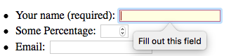
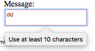
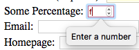
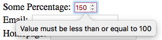
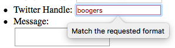

In this instalment we’ll be taking a break from our parallel approach and focusing almost exclusively on HTML5 form validation. We’ll dedicate the entirety of the next instalment to getting our cellular automaton prototypes up and running, so we can actually ‘play’ the game of life.

While we won’t be continuing work on our Cellular Automata prototypes this time, I will share my solution to the challenge I set way back in [instalment 36](https://pbs.bartificer.net/pbs36).

Also, before we get stuck into new content, I’ll be taking a small diversion to explain a slight change in my approach to HTML coding, and how that will affect the sample code you see for the remainder of this series.

As usual, I’ve collected the example file for this instalment and the starting point for the challenge together into [a ZIP file which you can download here](https://www.bartbusschots.ie/s/wp-content/uploads/2017/09/pbs39.zip) or [here on GitHub](https://cdn.jsdelivr.net/gh/bbusschots/pbs-resources/instalmentZips/pbs39.zip).

## Matching Podcast Episode 501

Listen Along: Chit Chat Across the Pond Episode 501

<audio controls src="https://media.blubrry.com/nosillacast/traffic.libsyn.com/nosillacast/CCATP_2017_09_15.mp3">Your browser does not support HTML 5 audio 🙁</audio>

You can also <a href="https://media.blubrry.com/nosillacast/traffic.libsyn.com/nosillacast/CCATP_2017_09_15.mp3?autoplay=0&loop=0&controls=1" >Download the MP3</a>

## PBS 36 Challenge Solution

Back in instalment 36 I set the challenge of writing a QUnit test suite for the `bartificer.ca.Automaton` prototype given the source code and the JSDoc documentation as input.

Rather than including my solution in this instalment’s ZIP file, I’m going to get you into the habit of using [GitHub](https://github.com) – a cloud-based GIT server and client. [GIT](https://en.wikipedia.org/wiki/Git) is an open source distributed version control system invented by Linus Torvalds to manage the code for the Linux kernel. It’s my version control system of choice these days (I started on [CVS](https://en.wikipedia.org/wiki/Concurrent_Versions_System), moved to [SVN](https://en.wikipedia.org/wiki/Apache_Subversion), and am now on GIT).

From now on I’ll be creating a repository on GitHub for each coding project we work on as part of this series. I’ll be creating linkable releases for the starting points and solutions to each challenge. So, [here is my solution to the challenge I set in instalment 36](https://github.com/bbusschots/bartificer_ca_js/tree/PBS36-Challenge-Solution).

You can browse the code online, or you can click the big green download button to download it as a ZIP file. You can also use any GIT client (e.g. [GitHub Desktop](https://desktop.github.com), a free client from GitHub themselves, or my current favourite, the free version of [GitKraken](https://www.gitkraken.com)) to clone the repository to your local computer, and, if you set up a free GitHub account, you can fork a copy of the repository into your own account.

## Sidenote – Fully Embracing HTML5

Up until now, I’ve been reluctant to give up my old XHTML habits. All the HTML we’ve written in the series has been valid HTML5, but only because HTML5 is backwards compatible with XHTML in some ways. I’ve been insisting on closing empty tags, quoting all attribute values, and giving boolean attributes explicit values. In other words, I’ve been writing things like `<br />` and `<option value="4" selected="selected">Four</option>`.

Not anymore – over our little summer hiatus I’ve decided it’s time to get with the times and fully embrace the more concise HTML5 syntax. So, from now on I’ll be writing my empty tags without the trailing `/`, I won’t be quoting attribute values religiously, and I won’t be giving values to boolean attributes. In other words, from now on I’ll be writing things like
`<br>` and `<option value=4 selected>Four</option>`.

## HTML5 Form Validation

One of the most glaring shortcomings of earlier versions of the HTML spec (pre-HTML5) was a complete lack of client-side data validation. Originally, the only way to give feedback to the user about the validity of the data they entered into a form was to submit that form to a server, have the server process it, and respond back to the user with the results. JavaScript made it possible for web developers to add their own client side data validation, but in effect, every developer had to build their own validation from scratch every time. It’s like buying a car and having to vulcanise your own rubber for the tyres!

HTML5 has taken us a long way forward in this regard – adding built-in form validation features to the spec for the first time. The validation available is not perfect, and not complete, but it’s so much better than what we had before – nothing!

In HTML5, all form elements are always in one of two validation states – _valid_, or _invalid_. It’s up to the browser to determine the state of each form element at any given moment. How the browser decides the state is controlled through the form element’s HTML markup, and how the browser displays that state is controlled with CSS. This means that there are two distinct aspects to HTML5 form validation – a collection of HTML attributes for applying constraints to form elements, and a collection of CSS pseudo-classes for controlling presentation.

The HTML5 specification lays out what a browser should do when a user tries to submit a form. The browser should start by checking that every form element is in a valid state. The first one encountered that is not halts the submission process. The browser should highlight the problem field to the user at this point. In theory, the user then makes the requested change, and tries to submit the form again, when the whole process repeats. Only when all form elements pass validation does the form finally get submitted.

The exact details of how the browser presents the validation errors to the user is left to browser makers to decide. Each browser does things a little differently. In this instalment all the screenshots will be from Safari on macOS.

### The `:valid` & `:invalid` CSS Pseudo-classes

Let’s start with the simplest aspect of form validation, the two CSS pseudo classes provided to facilitate styling based on validation state. If a form element is in the _valid_ state then the CSS pseudo-class `:valid` will apply to that element. Similarly, if a form element is in the _invalid_ state, the CSS pseudo-class `:invalid` will apply to that element.

By default, browsers don’t render invalid elements any differently to how they render valid elements. It’s entirely up to the developer to decide whether and how to distinguish the display of valid and invalid elements on a page.

As a practical example, you could have the text on all text inputs be green when valid and red when invalid with the following CSS statements:

```css
input[type="text"]:valid{
    color: DarkGreen;
}
input[type="text"]:invalid{
    color: DarkRed;
}
```

### Required Text Fields

The most basic type of form validation is the ability to mark a text box or text area as being required. You do this with the HTML5 boolean attribute `required`. To mark an input as required, you specify the attribute. To mark it as not required, i.e. optional, you omit the attribute.

So, the following text box is not required:

```html
<label>Something Optional: <input type="text" name="somethingOptional" ></label>
```

And the following is:

```html
<label>Something Required: <input type="text" name="somethingRequired" required ></label>
```

There are two matching CSS pseudo-classes that can be used to style form elements differently depending on whether or not they are required – `:required` & `:optional`.

When a form containing required text fields is submitted, the browser must check that all the required fields contain text before allowing the form to submit. If a required value is missing, the form won’t submit, and the offending text input will be highlighted to the user by the browser in some way.

The following snippet from `pbs39.html` from this instalment’s ZIP file shows the HTML markup for a required text box:

```html
<label for="name_tb">Your name (required):</label>
<input type="text" name="name" required id="name_tb">
```

If you try submit the form without entering a value in this text box while using Safari, you’ll see the following:



### Length Requirements

On text boxes and text areas you can use the HTML5 attributes `minlength` and `maxlength` to define acceptable length ranges. These attributes count lengths in characters. Text fields that contain an invalid number of characters will have the `:invalid` CSS pseudo-class applied to them.

The following snippet from `pbs39.html` shows a text area with both a minimum and maximum lengths specified:

```html
<label for="msg_ta">Message:</label><br />
<textarea name="message" id="msg_ta" minlength=10 maxlength=140></textarea>
```

In general browser will prevent users from entering more characters than `maxlength`. If you enter too few characters and try submit the form Safari shows the following error:



### Numeric Bounds

On `input` elements with `type="number"`, the `max` and `min` attributes are considered by the browser when determining if an entered value is valid or not.

The following snippet from `pbs39.html` shows a numeric text area with a defined valid range:

```html
<label for="percent_tb">Some Percentage:</label>
<input type="number" name="percent" id="percent_tb" min=0 max=100>
```

If you enter a nonnumeric value and try to submit the form, Safari shows the following error:



If you enter a number outside of the valid range, Safari gives error messages of the following form:



### Text Patterns

In [instalment 36](https://pbs.bartificer.net/pbs36) we learned that the `input` element supports a number of special values for the `type` attribute to indicate that a certain type of data is expected. Specifically we learned about `type="number"`, `type="url"`, `type="email"`, and `type="tel"`. If you use one of these types, and the value entered by the user isn’t a valid number, URL, email address, or telephone number, the browser will apply the `:invalid` CSS pseudo-class to the `input` element.

These special input types combined with the `required` attribute and length constraints are often all you need, but, if you do need more powerful text validation, you can use regular expressions! The pattern attribute can be used to specify a JavaScript-style regular expression.

The following snippet from `pbs39.html` shows a text area that requires a valid Twitter handle, including the leading `@` be entered:

```html
<label for="twitter_tb">Twitter Handle:</label>
<input type="text" name="twitter" id="twitter_tb" pattern="^[@][\w]+$" placeholder="@username">
```

While browsers can give very meaningful error messages when you use predefined text types like email or URL, they can’t be nearly as smart with generic patterns. Hence, Safari shows the following very generic message when you enter an invalid value in the above text box and hit submit:



### Validation Example

The code below is included in this instalment’s zip file as `pbs39.html`.

```html
<!DOCTYPE HTML>
<html>
<head>
    <meta charset="utf-8">
    <title>PBS 39 - HTML5 Form Validation</title>

    <!-- Import the jQuery API -->
    <script src="https://code.jquery.com/jquery-3.2.1.slim.min.js" integrity="sha256-k2WSCIexGzOj3Euiig+TlR8gA0EmPjuc79OEeY5L45g=" crossorigin="anonymous"></script>

    <!-- Add the jQuery event handlers to bring the form to life -->
    <script type="text/javascript">
        // add a document ready event handler
        $(function(){
            // add a click handler to the submit button to blank the output area
            $('#submit_btn').click(function(){
                $('#output').text('');
            });

            // add a submission event handler to the form to render
            // the serialised form data to the ouput area
            $('#pbs39_fm').submit(function(){
                $('#output').text($(this).serialize());
            });
        });
    </script>

    <!-- Style the form elements -->
    <style type="text/css">
        /* Mark required fields with a yellow background */
        input:required{
            background-color: lightyellow;
        }

        /* Mark text fields with invalid data with a red border and text */
        input:invalid, textarea:invalid{
            color: darkred;
            border-color: red;
            border-width: 1px;
            border-style: solid;
        }

    </style>
</head>
<body>
<h1>PBS 39 - HTML5 Form Validation Demo</h1>

<form action="javascript:void(0);" id="pbs39_fm">
<fieldset>
    <legend>Dummy Form</legend>
    <ul>
        <li>
            <label for="name_tb">Your name (required):</label>
            <input type="text" name="name" required id="name_tb">
        </li>
        <li>
            <label for="percent_tb">Some Percentage:</label>
            <input type="number" name="percent" id="percent_tb" min=0 max=100>
        </li>
        <li>
            <label for="email_tb">Email:</label>
            <input type="email" name="email" id="email_tb">
        </li>
        <li>
            <label for="url_tb">Homepage:</label>
            <input type="url" name="homepage" id="url_tb">
        </li>
        <li>
            <label for="tel_tb">Phone Number:</label>
            <input type="tel" name="phone" id="tel_tb" pattern="^[+]\d+([ -]\d+)*$" placeholder="+353-1-1234567">
        </li>
        <li>
            <label for="twitter_tb">Twitter Handle:</label>
            <input type="text" name="twitter" id="twitter_tb" pattern="^[@][\w]+$" placeholder="@username">
        </li>
        <li>
            <label for="msg_ta">Message:</label><br />
            <textarea name="message" id="msg_ta" minlength=10 maxlength=140></textarea>
        </li>
    </ul>
    <p><button type="submit" id="submit_btn">Submit!</button></p>
    <p>Submitted Data:</p>
    <pre id="output"></pre>
</fieldset>
</form>

</body>
</html>
```

## Useful Links

*   MDN’s Form Validation Tutorial – [developer.mozilla.org/…](https://developer.mozilla.org/en-US/docs/Learn/HTML/Forms/Form_validation)

## A Challenge

Using the HTML file in the pbs39-challenge-startingPoint folder in this instalment’s ZIP file, create a web form for entering information about a movie into a hypothetical movie database. I’ll leave the details of what information you want to collect, and what form elements you think would work best to collect them to you. Feel free to use all the different form elements we’ve learned about in the last few months – checkboxes, radio buttons, selects, and text inputs of all kinds. Whatever form elements you choose to use, be sure to use HTML5 form validation to make your form as robust as possible.

## Final Thoughts

We have now covered the vast bulk of the HTML and CSS we will be learning in this series. We’ve certainly covered enough of both that you should now be in a position to pick up any of the details we omitted from the relevant documentation, or from web searches.

When it comes to the web technologies, our focus will now shift to third-party libraries that build on the basic technologies we know to make the building of beautiful and feature-rich web apps easier. The first of these will be Bootstrap 4, but we may well visit others as the series progresses.

In terms of our exploration of JavaScript, we first need to finish our Cellular Automata prototypes before we are ready to move on and learn some new things. The first thing we’ll focus on once we’ve finished our CAs is a selection of new features added to the core language as part of version 6 of the official JavaScript specification.

 - [← PBS 38 — Taking Stock](pbs38)
 - [Index](index)
 - [PBS 40 — HTML5 Custom Validations with jQuery →](pbs40)