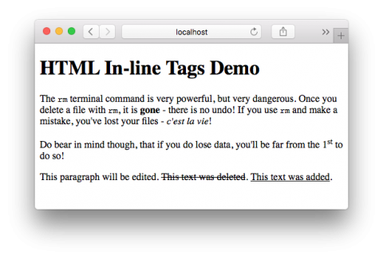

In [the previous instalment](https://pbs.bartificer.net/pbs3) we introduced the concept of block-level tags, and in-line tags. Block level tags define blocks of text like headers, paragraphs, and lists. Starting a new block-level tag generally starts a new line in the page. On the other hand, in-line tags effect a part of a block, and opening an in-line tag generally doesn’t start a new line. In the previous instalment we looked at some of the most important block-level tags, in this instalment we’ll look at some of the most common in-line tags.

## Matching Podcast Episode 413

Listen along to this instalment on [episode 413 of the Chit Chat Across the Pond Podcast](http://www.podfeet.com/blog/2015/11/ccatp-413/)

<audio controls src="http://media.blubrry.com/nosillacast/traffic.libsyn.com/nosillacast/CCATP_2015_11_21.mp3">Your browser does not support HTML 5 audio 🙁</audio>

You can also <a href="http://media.blubrry.com/nosillacast/traffic.libsyn.com/nosillacast/CCATP_2015_11_21.mp3?autoplay=0&loop=0&controls=1" >Download the MP3</a>

## Drawing Attention to Text

I don’t want to sound like a stuck record, but remember that HTML is for marking up the semantics of a page, not defining the presentation. As such, you should’t think in terms of marking words as bold or italic, but making them strong, or emphasising them. To this end, the two relevant tags are `<strong>` and `<em>`.

By default, strong text is rendered in bold, but that default can be overridden using CSS. Similarly, emphasised text is renders in italics by default, but that too can be overridden using CSS. (We’ll cover CSS in future instalments). Old legacy tags for explicitly marking text as bold or italic do exist, but you should never use then, and we won’t be mentioning them in this series.

## SubScripts & SuperScripts

The `<sup>` and `<sub>` tags are used to turn text into superscript and subscript respectively.

## Highlighting Content Edits

Humans make mistakes; so it’s inevitable that, if you write articles for the web, you’ll make mistakes, and have to make alterations. It’s good journalistic practice to make those changes in a transparent way, highlighting both old text that you’ve removed, and new text you’ve added to the article. Since HTML4, there have been dedicated tags for marking up these kinds of edits – `<del>`, for deleted text, and `<ins>` for inserted text.

By default, text inside `<del>` tags is rendered with a strikethrough, and text inside `<ins>` tags with an underline. Again, these defaults can be overridden with CSS, and it’s very common practice to make `<del>` tags red, and `<ins>` tags green.

## The `<code>` Tag

By default, text on a web page is rendered in a variable width font. This is great for reading ordinary text, but terrible for reading precise technical terms. In variable width fonts, it is often very difficult to tell the difference between an upper case `i` and a lower case `L`, or the upper case letter `O` and the digit `0`. In situations where text needs to be rendered in such a way that each individual character can be clearly distinguished, you should use the `<code>` tag. It’s a tag I use a lot in these tutorials, for example, when writing the name of a tag.

By default code tags are rendered using a fixed width font, but again, CSS can be used to alter the rendering of `<code>` tags. You’ll notice that the CSS for this site renders `<code>` tags in navy blue as well as in a fixed width font.

## Final Example

Create a folder called `pbs4` in the document root of your web server, and save the following into that folder as a file called `index.html`:

```html
<!DOCTYPE html>
<html>
<head>
  <meta charset="UTF-8" />
  <title>HTML In-line Tags Demo</title>
</head>
<body>

<h1>HTML In-line Tags Demo</h1>

<p>The <code>rm</code> terminal command is very powerful, but very dangerous. Once you delete a file with <code>rm</code>, it is <strong>gone</strong> - there is no undo! If you use <code>rm</code> and make a mistake, you've lost your files - <em>c'est la vie</em>!</p>

<p>Do bear in mind though, that if you do lose data, you'll be far from the 1<sup>st</sup> to do so!</p>

<p>This paragraph will be edited. <del>This text was deleted</del>. <ins>This text was added</ins>.</p>

</body>
</html>
```

Once the file is saved, and your web server started, you should be able to browse to the page at `http://localhost/pbs4/`, and it should look something like:



 - [← PBS 3 — HTML Block Elements](pbs3)
 - [Index](index)
 - [PBS 5 — Images & Links →](pbs5)