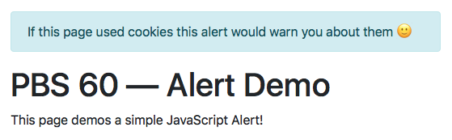
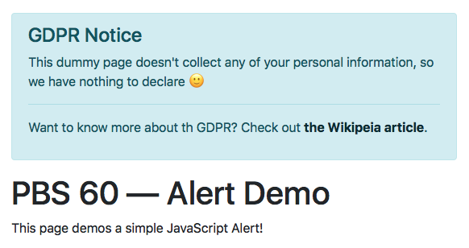
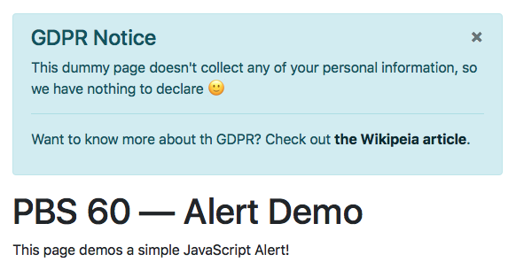

So far we’ve looked at three out of the four aspects of Bootstrap — the utility CSS classes, the so-called _content_ CSS classes for styling standard HTML components, and Bootstrap’s layout functionality (the grid & the breakpoints). So far, it’s all been pure CSS; we’ve not even imported the Bootstrap JavaScript library yet!

That changes in this instalment when we make a start on Bootstrap’s final aspect, so-called _components_. These are reusable generic website components. They rely on JavaScript for some or all of their functionality. To get the ball rolling we’ll take a look at just one very simple component, the Bootstrap _alert_.

You can [Download this instalment’s ZIP file here](https://www.bartbusschots.ie/s/wp-content/uploads/2018/08/pbs60.zip) or [here on GitHub](https://cdn.jsdelivr.net/gh/bbusschots/pbs-resources/instalmentZips/pbs60.zip).

## Matching Podcast Episode 558

Listen along to this instalment on [episode 558 of the Chit Chat Across the Pond Podcast](https://www.podfeet.com/blog/2018/08/ccatp-558/)

<audio controls src="https://media.blubrry.com/nosillacast/traffic.libsyn.com/nosillacast/CCATP_2018_08_12.mp3">Your browser does not support HTML 5 audio 🙁</audio>

You can also <a href="https://media.blubrry.com/nosillacast/traffic.libsyn.com/nosillacast/CCATP_2018_08_12.mp3?autoplay=0&loop=0&controls=1" >Download the MP3</a>

## Challenge Solution

The challenge set at the end of the previous instalment was to continue improving the recipe you’ve been working on for the past few challenges.

In the case of my recipe, the biggest outstanding problem was the header. It worked fine on large screens, but not on small ones.

This is how the header started:

```html
<header class="container sticky-top mt-3">
  <div class="row align-items-center bg-white border-bottom">
    <div class="col-12 col-lg-9">
      <h1 class="display-1">Roasted Cucumber<br> <small class="text-muted">with Red Onion &amp; Dill</small></h1>
    </div>
    <div class="col">
      <h2 class="sr-only">Description</h2>
      <p class="lead">An unusual roasted vegetable dish that's refreshingly tangy and will pair well with fish.</p>
    </div>
  </div>
</header>
```

The sticky top was only really there to illustrate how those work. So I started by removing it and removing the top margin needed to make it work as a sticky top. That left a regular but very large display heading. The large heading is perfect on large screens, but terrible on small ones.

Ideally I would have liked to have the heading change size depending on the breakpoint. Unfortunately that’s not possible without extending Bootstrap with a custom theme, and we can’t do that without learning a whole new language, SASS. We will get there, but not just yet!

As a workaround, I added a second heading, one with a size that works on smaller screens, and then used the break-point-aware display utilities to hide and show the appropriate heading at the appropriate break points. To avoid confusing screen readers, I marked the second heading as being hidden from screen readers using the `aria-hidden` HTML attribute we learned about a long time ago:

```html
<header class="container">
  <div class="row align-items-center bg-white border-bottom">
    <div class="col-12 d-xl-none">
      <h1 class="display-4">Roasted Cucumber <small class="text-muted">with Red Onion &amp; Dill</small></h1>
    </div>
    <div class="d-none col-9 d-xl-block" aria-hidden="true">
      <h1 class="display-1">Roasted Cucumber<br> <small class="text-muted">with Red Onion &amp; Dill</small></h1>
    </div>
    <div class="col">
      <h2 class="sr-only">Description</h2>
      <p class="lead">An unusual roasted vegetable dish that's refreshingly tangy and will pair well with fish.</p>
    </div>
  </div>
</header>
```

The first of the two headers defaults to full width and displayed, but hides at the largest breakpoint. The second header is hidden by default and only three quarters wide, but shows at the largest breakpoint. The lead paragraph has an automatic width.

Together what this means is that, for all breakpoints below extra large, the first heading is visible and takes up the full width of the page with the lead paragraph wrapped to the next line. At the extra large breakpoint, that first header is hidden and the second bigger but narrower one appears. The lead paragraph now has room not to wrap, so it doesn’t, and settles next to the big header.

## Introducing Bootstrap’s JavaScript Features

Up to this point in our exploration of Bootstrap it’s been all CSS all the time. I did mention that Bootstrap is also a JavaScript library when I introduced it, but there’s been no mention of JavaScript since then. The reason for that is simple — until now we’ve been focused on how Bootstrap improves existing HTML functionality. That’s very powerful and very useful, but Bootstrap goes further than that, providing reusable generic functionality that browsers either don’t provide at all, don’t provide well, or are in some way browser-specific.

Bootstrap didn’t reinvent the wheel. Instead, it’s built on top of two other open-source JavaScript libraries, [jQuery](http://jquery.com), and [Popper.js](https://popper.js.org) (which is also built on jQuery). This means that, to enable Bootstrap’s JavaScript functionality, you must first include jQuery, then Popper.js, and only then Bootstrap’s JavaScript file.

You can load all three from their respective Content Delivery Networks (CDNs) like so:

```html
<script src="https://code.jquery.com/jquery-3.3.1.slim.min.js" integrity="sha384-q8i/X+965DzO0rT7abK41JStQIAqVgRVzpbzo5smXKp4YfRvH+8abtTE1Pi6jizo" crossorigin="anonymous"></script>
<script src="https://cdnjs.cloudflare.com/ajax/libs/popper.js/1.14.3/umd/popper.min.js" integrity="sha384-ZMP7rVo3mIykV+2+9J3UJ46jBk0WLaUAdn689aCwoqbBJiSnjAK/l8WvCWPIPm49" crossorigin="anonymous"></script>
<script src="https://stackpath.bootstrapcdn.com/bootstrap/4.1.3/js/bootstrap.min.js" integrity="sha384-ChfqqxuZUCnJSK3+MXmPNIyE6ZbWh2IMqE241rYiqJxyMiZ6OW/JmZQ5stwEULTy" crossorigin="anonymous"></script>
```

_**Note:** the above example was correct as of 12 August 2018. To get the most recent versions, [copy and paste the code from the Bootstrap docs](http://getbootstrap.com/docs/4.1/getting-started/introduction/)._

Where should you include the above code in your file? That depends!

If you include the code in the `<head>` section of your website then the browser has to fetch and process all that JavaScript before it can render any of the page, but if you include it at the end of the page’s content the browser can render the page before it gets to the JS, making the page visible, but without any of the JavaScript features enabled.

Which of those two is least-bad? That depends! A web app that’s visible but doesn’t work is probably more of a frustration than a help, but a blog post that you can start to read before the fancy features becomes active is probably much less frustrating. Most of the web is for reading, so the advice in the Bootstrap docs is to include the above three imports as the last three lines of the `<body>` section of your page.

## JavaScript without JavaScript (unless you want it)

You can use most of Bootstrap’s JavaScript features without writing a single line of JavaScript! How is that possible? Simple, Bootstrap uses jQuery’s document ready event handler to scan through the document looking for Bootstrap CSS classes and HTML Data attributes and uses those to configure the needed event handlers to enable the desired behaviour.

This works great for HTML tags that are part of the page’s original content. This doesn’t work at all for HTML content injected into the page after it loads using JavaScript. If you’re already using JavaScript to inject things into the page, then you’re obviously happy to use JavaScript, so no problem!

Bootstrap makes its JavaScript functionality available by adding so-called plugins into jQuery. In effect, Bootstrap adds features to jQuery. So if you’re comfortable using jQuery, you’ll feel right at home using Bootstrap’s JavaScript features.

## A Basic Example — Bootstrap Alerts

An alert is a chunk of clearly delineated text designed to catch the user’s eye and deliver them a short message. Alerts might be dismissible. You’ve probably seen them all over the web. A very common example these days is cookie and other GDPR notices. Another example would be in web apps like web mail clients. You might compose an email and hit send, your inbox would then reload, but with an alert at the top of the screen to tell you that your message was sent.

Basic Bootstrap alerts that are not dismissible and are displayed when the page loads don’t require any JavaScript. You can convert any HTML element into an alert by giving it the CSS class `alert` along with a secondary alert class to specify the kind of alert it is, e.g. `alert-info`. All the usual Bootstrap colours are available: `alert-primary`, `alert-secondary` , `alert-success`, `alert-danger`, `alert-warning`, `alert-info`, `alert-light`, & `alert-dark`.

To help screen readers and other assistive technologies interpret your alert, you should give it the ARIA role `alert` using the `role` attribute.

Here’s a very basic example:

```html
<div class="alert alert-info" role="alert">
  If this page used cookies this alert would warn you about them 🙂
</div>
```

This is what it looks like within a page:



We can add appropriately styled headers by giving them the class `alert-heading`, appropriately styled links by giving them the class `alert-link`, and we can break our alert into sections with the `<hr>` tag:

```html
<div class="alert alert-info" role="alert">
  <h4 class="alert-heading">GDPR Notice</h4>
  <p>This dummy page doesn't collect any of your personal information, so we have nothing to declare 🙂</p>
  <hr>
  <p>Want to know more about th GDPR? Check out <a href="https://en.wikipedia.org/wiki/General_Data_Protection_Regulation" class="alert-link" target="_blank" rel="noopener">the Wikipedia article</a>.</p>
</div>
```

Our alert now looks like this:



So far we’ve not used any JavaScript functionality yet. Let’s add some, but without writing a single line of JavaScript code. Let’s use Bootstrap’s support for data attributes to add a close button to our alert. This can be done by adding a `<button>` with the HTML data attribute `data-dismiss` with a value of "alert". This tells Bootstrap’s document ready handler that we want this button to dismiss the alert that it’s contained within.

The snippet below is straight from the example in the Bootstrap docs. We’ve not looked at forms in Bootstrap yet, so for now, the only thing to note is the data attribute:

```html
<button type="button" class="close" data-dismiss="alert" aria-label="Close">
  <span aria-hidden="true">&times;<span>
</button>
```

We now have a dismissible alert!



You can find the full code for a sample page containing this dismissible alert in the ZIP as `pbs60a.html`.

### Creating and Controlling Alerts with JavaScript

As mentioned previously, Bootstrap exposes its JavaScript functionality through a series of jQuery plugins. What this means is that Bootstrap adds functions to jQuery so you can use jQuery to select or create HTML elements and then initialise them as Bootstrap components. As a general rule, the name of the jQuery plugin will be the same as the name of the Bootstrap component.

In this case that means we’ll be working with a jQuery plugin named `.alert()`.

We’ll use alerts to illustrate the three most common JavaScript interactions with Bootstrap:

1.  Adding new Bootstrap components to a page dynamically and initialising them.
2.  Responding to user interactions with a Bootstrap component.
3.  Interacting with a Bootstrap component programmatically.

Let’s work through these three things with a worked example. You’ll find the full source code in the file `pbs60b.html` in the ZIP file. Note that, because this file loads remote JavaScript libraries, you’ll need to copy the folder into your local web server as we did in the previous JavaScript instalments.

Our example page has two buttons, one to add dismissible alerts to the page, and one to dismiss all alerts at once. Note that we’ve not looked at Bootstrap forms yet. So these buttons are a little sneak peek at what’s to come later.

Note the overall structure of the page. The Bootstrap CSS is loaded in the `<head>` section. The visible content of the page is at the top of the body section along with an empty `<div>` with the ID `insert_here` (this is where the alerts will get injected into the page). This is followed by the script tags to import jQuery, Popper.js, and the Bootstrap JavaScript library.

Finally, after all that, our custom JavaScript for the page is added. All our code is included inside a jQuery document ready handler.

### Dynamically Adding

If you look inside the document ready handler, the first thing you’ll see is a click handler for the button to add new alerts. The code starts by creating a new alert using jQuery and saving it as `$a`:

```javascript
// add a document ready handler
$(function(){
  // add an event handler to the Add button
  $('#alertBtn').click(function(){
    // build an alert
    const $a = $('<div>').text("Well done, you added an alert!");
    $a.addClass('alert alert-success');

    // ...
  });

  // ...
});
```

Next a close button is injected into the newly created alert:

```javascript
// inject a dismiss button
$a.prepend($('<button type="button" class="close" data-dismiss="alert" aria-label="Close"><span aria-hidden="true">&times;</span></button>'));
```

Then comes the important bit, the bit where we use the `.alert()` jQuery plugin to initialise our new alert:

```javascript
// tell Bootstrap to treat our new alert as an alert
$a.alert();
```

When called with no arguments, the `.alert()` plugin searches the HTML element it’s called on for buttons with an HTML data attribute named `data-dismiss` with the value `alert`. If it finds any, it adds the appropriate event handler to make the button dismiss the alert.

At this stage we can add the newly-minted alert into the page:

```javascript
// inject it into the page
$('#insert_here').append($a);
```

Putting it all together, our document load handler now looks like this:

```javascript
// add a document ready handler
$(function(){
  // add an event handler to the Add button
  $('#alertBtn').click(function(){
    // build an alert
    const $a = $('<div>').text("Well done, you added an alert!");
    $a.addClass('alert alert-success');

    // inject a dismiss button
    $a.prepend($('<button type="button" class="close" data-dismiss="alert" aria-label="Close"><span aria-hidden="true">&times;</span></button>'));

    // tell Bootstrap to treat our new alert as an alert
    $a.alert();

    // inject it into the page
    $('#insert_here').append($a);
  });
});
```

### Event Handlers

When Bootstrap components allow users to interact with them, they generally provide matching event handlers. While it looks a little odd at first, the events are generally named `EVENT.bs.PLUGIN` (`bs` for Bootstrap).

In the case of dismissible alerts, the obvious event to listen for is the alert being dismissed, and Bootstrap provides just such an event, which it has named `close.bs.alert` (notice how it follows the naming convention, `close` is the event, followed by `.bs.` followed by the plugin name, `alert`).

We could do anything when this event fires, but as a simple example, let’s just write to the web console:

```javascript
// add a document ready handler
$(function(){
  // add an event handler to the Add button
  $('#alertBtn').click(function(){
    // build an alert
    const $a = $('<div>').text("Well done, you added an alert!");
    $a.addClass('alert alert-success');

    // inject a dismiss button
    $a.prepend($('<button type="button" class="close" data-dismiss="alert" aria-label="Close"><span aria-hidden="true">&times;</span></button>'));

    // tell Bootstrap to treat our new alert as an alert
    $a.alert();

    // add a listener to the alert's close event
    $a.on('close.bs.alert', function(){
      console.log('an alert was closed!');
    });

    // inject it into the page
    $('#insert_here').append($a);
  });
});
```

### Interacting with Alerts Programmatically

Bootstrap’s jQuery plugins will generally provide functionality to programmatically do whatever a human can do with the relevant component. In the case of dismissible alerts, that means dismissing the alert.

The way Bootstrap plugins work is that, when you invoke them on an HTML element with no arguments, they initialise that element with the given plugin. Then you can interact with the newly initialised elements by calling the plugin on them again, but with the thing you want to do passed as the first argument. So, if we had a reference to an initialised alert stored in a variable named `$a`, we could close it with `$a.alert("close");`.

To see this in action, let’s add an event handler for the button to close all alerts to our document ready handler:

```javascript
// add a document ready handler
$(function(){
  // ...

  // add an event handler to the close button
  $('#closeBtn').click(function(){
    // query for all alerts in our container
    $('#insert_here .alert').each(function(){
      // trigger the alert jQuery plugin's close functionality
      $(this).alert('close');
    });
  });
});
```

Again, you’ll find all the code for this example in `pbs60b.html` in the ZIP.

## Two Challenges

### Challenge 1

Add a dismissible alert into the recipe you’ve been working on for the last few instalments.

### Challenge 2 (Optional)

Create a blank HTML page and that imports the Bootstrap CSS and JavaScript functionality.

Add a text box into which the user can type some text, and a drop-down list with an entry for each of the Bootstrap alert styles (`alert-primary`, `alert-secondary` …).

Add a button that will create a new dismissible alert with the text from the text box and the style selected in the drop-down list.

Add a button to delete all the alerts.

## Final Thoughts

The most important thing to take out of this instalment is not the details of how the alert component works, but the concept of how components work in general. They are generic components consisting of both CSS and JavaScript which can be added to your web pages or web apps to save you reinventing the proverbial wheel.

Bootstrap minimises the amount of JavaScript code you need to write through the clever use of HTML data attributes, but for those who want to use JavaScript, Bootstrap exposes its functionality through a suite of jQuery plugins.

I suggest reading [the Bootstrap documentation for the alert component](http://getbootstrap.com/docs/4.1/components/alerts/). Hopefully you can now see how the descriptions on that page map to the reality in the browser, and to the code in the worked example.
