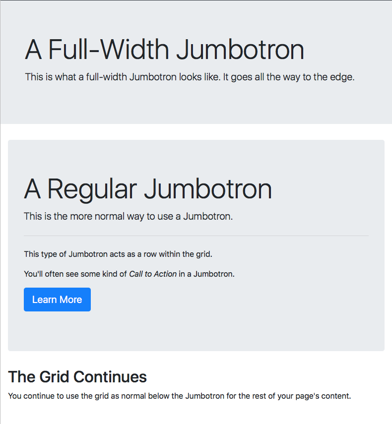
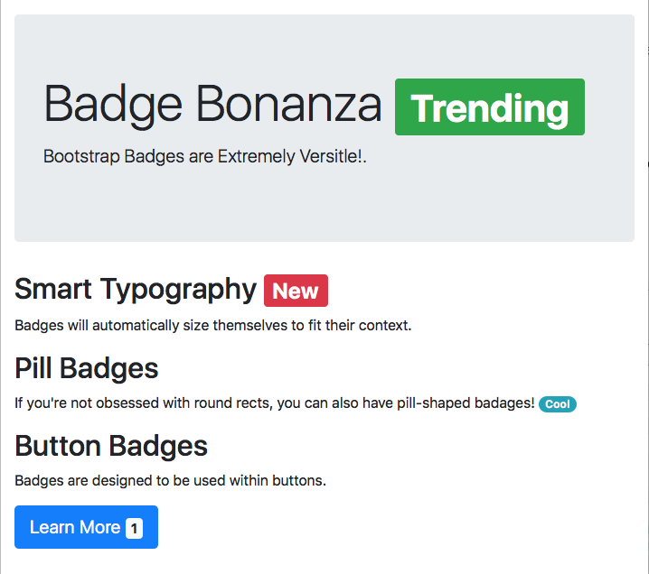

In the previous instalment we met our first so-called Bootstrap _Component_, the alert. This was our first example of a JavaScript enabled Bootstrap feature. As we learned last time, Bootstrap components are small generic pieces of functionality that are not provided by HTML out of the box. The aim is give website developers a leg up and save them from having to reinvent the same commonly-used proverbial wheels over and over again.

While many, probably most, Bootstrap components either require JavaScript to function at all, or require JavaScript for their more advanced features, that’s not true of all components. Some of the simpler ones are implemented in pure CSS. We’ll look at two such simple components in this instalment – the wonderfully named _Jumbotron_ and badges.

You can [Download this instalment’s ZIP file here](https://www.bartbusschots.ie/s/wp-content/uploads/2018/08/pbs61.zip) or [here on GitHub](https://cdn.jsdelivr.net/gh/bbusschots/pbs-resources/instalmentZips/pbs61.zip).

## Matching Podcast Episode 561

Listen along to this instalment on [episode 561 of the Chit Chat Across the Pond Podcast](https://www.podfeet.com/blog/2018/08/ccatp-561/)

<audio controls src="https://media.blubrry.com/nosillacast/traffic.libsyn.com/nosillacast/CCATP_2018_08_30.mp3">Your browser does not support HTML 5 audio 🙁</audio>

You can also <a href="https://media.blubrry.com/nosillacast/traffic.libsyn.com/nosillacast/CCATP_2018_08_30.mp3?autoplay=0&loop=0&controls=1" >Download the MP3</a>

## PBS 60 Challenge Solutions

At the end of the previous instalment I set two challenges, a quick and easy one, and a much more challenging one.

Let’s start with the easy one.

### Challenge 1

The first challenge was simply to add a dismissible alert to the recipe you’ve been working on for the past few challenges.

The first step is to include the Bootstrap JavaScript code at the bottom of the body of your page.

With that done adding a dismissible alert simply becomes a copy-and-paste task. I decided to style mine as successful, and to give a positive message:

```html
<p class="alert alert-success m-3">
  <button type="button" class="close" data-dismiss="alert" aria-label="Close">
    <span aria-hidden="true">&times;<span>
  </button>
  This page does not use cookies and does not collect any of your personal data.
</p>
```

For completeness I’ve included my full sample solution in the folder `pbs60-challenge1-solution` in this instalment’s ZIP.

### Challenge 2

The second challenge was a little more complex, but basically involved extending the example file `pbs60b.html` from the previous instalment. The example was a page with a button to add alerts, and one to dismiss all the alerts. The challenge was to create a similar page, but to allow the user to specify the text and style for the alerts.

I started by building a form to gather the needed information:

```html
<fieldset class="col" role="form" aria-labelledby="create_fm_desc">
  <legend id="create_fm_desc">Create Alerts</legend>

  <form class="form" action="javascript:void(0);" id="create_fm">

  <p class="form-group">
    <label for="alert_text_tb">Alert Text</label>
    <input type="text" class="form-control" id="alert_text_tb" placeholder="The text for your alert">
  </p>

  <p class="form-group">
    <label for="alert_style_sel">Alert Style</label>
    <select class="form-control" id="alert_style_sel">
      <option value="primary">Primary</option>
      <option value="secondary">Secondary</option>
      <option value="info" selected>Informational</option>
      <option value="success">Success</option>
      <option value="warning">Warning</option>
      <option value="danger">Danger</option>
      <option value="light">Light</option>
      <option value="dark">Dark</option>
    </select>
  </p>

  <p>
    <button class="btn btn-primary" id="alert_btn">Add Alert</button>
    <button class="btn btn-danger" id="close_btn">Close All Alerts</button>
  </p>
  </form>
</fieldset>
```

Notice the proper use of labels and ARIA attributes to make the form accessible.

There also needed to be a container into which to inject the alerts:

```html
<div class="col" id="insert_here"></div>
```

From the point of view of getting the JavaScript to work, the key points to note are the IDs given to the text field (`alert_text_tb`), drop-down (`alert_style_sel`), add button (`alert_btn`), close button(`close_btn`), and the element to inject the alerts into (`insert_here`).

The next step was to add an event handler for the add button (this is done inside a document ready event handler):

```javascript
// add an event handler to the Add button
$('#alert_btn').click(function(){
  // build an alert
  const $a = $('<div>').text($('#alert_text_tb').val() || "A sample Alert — enter text in the text box!");
  $a.addClass(`alert alert-${$('#alert_style_sel').val()}`);

  // inject a dismiss button
  $a.prepend($('<button type="button" class="close" data-dismiss="alert" aria-label="Close"><span aria-hidden="true">&times;</span></button>'));

  // tell Bootstrap to treat our new alert as an alert
  $a.alert();

  // add a listener to the alert's close event
  $a.on('close.bs.alert', function(){
    console.log('an alert was closed!');
  });

  // inject it into the page
  $('#insert_here').append($a);
});
```

Most of this code is very similar to that in `pbs60b.html`, but the two notable differences are where the code extracts the values from the text box and drop-down.

To get at the value of the text box I used:

```javascript
$('#alert_text_tb').val() || "A sample Alert — enter text in the text box!"
```

Remember, when you pass jQuery a CSS selector as a single string argument, it searches the entire document for elements matching that selector. In this case that would be exactly one thing, the text box with the ID `alert_text_tb`. I then call jQuery’s `.val()` function on that text box to get at the value. If there is no value, I default to the string `"A sample Alert — enter text in the text box!"`.

The other important line of code is the one that sets the style of the alert based on the drop-down:

```javascript
$a.addClass(`alert alert-${$('#alert_style_sel').val()}`);
```

This is very similar in that it uses jQuery to get the drop-down by ID and then get its value. This time there’s no need for a default since there is always something selected in the drop-down. Notice the use of ES6 template strings to inject the value into a larger string.

## The _Jumbotron_

Many websites today have a large showcase area at the top of their front page that shouts out the site’s main message. It usually has one or more calls to action. It could be the name of the company, their motto or catchphrase, and a call to sign up now.

We could mark that up with basic Bootstrap as a display heading, a lead paragraph, and a regular paragraph, and a button, but it wouldn’t really catch the eye as desired. That’s the problem that the so-called _Jumbotron_ component is designed to solve.

The Jumbotron comes in two flavours, one designed to replace a row in a Bootstrap layout, and the other to act as an edge-to-edge header outside the grid.

To use the more common form, simply replace the relevant row in your grid with an element with the class `jumbotron` and add your content directly into it.

To use the edge-to-edge form, you effectively reverse the process. You add a top-level element and give it the classes `jumbotron` and `jumbotron-fluid`, and then add an element directly within it with the class `container`. Contrary to how containers normally work, within a jumbotron you can choose not to add rows or columns and add your content directly into the container.

I’ve added a file demoing both flavours of Jumbotron to this instalment’s ZIP file (`pbs61a.html`). Here’s what it looks like:



Let’s look at the relevant code snippets, starting with the simple edge-to-edge Jumbotron:

```html
<div class="jumbotron jumbotron-fluid">
  <div class="container">
    <h1 class="display-4">A Full-Width Jumbotron</h1>
    <p class="lead">This is what a full-width Jumbotron looks like. It goes all the way to the edge.</p>
  </div>
</div>
```

The key points to note are that the Jumbotron is outside the container, and the Jumbotron’s content is directly contained within the container which is directly contained within the Jumbotron. This is one of the few exceptions where a Bootstrap container doesn’t contain rows which contain columns.

Now let’s move on to look at the second, more expansive example. This is the more commonly used variant of the Jumbotron, and I’ve added a little more content to make it a bit more realistic:

```html
<div class="container-fluid">
  <div class="jumbotron">
    <h1 class="display-4">A Regular Jumbotron</h1>
    <p class="lead">This is the more normal way to use a Jumbotron.</p>
    <hr class="my-4">
    <p>This type of Jumbotron acts as a row within the grid.</p>
    <p>You'll often see some kind of <em>Call to Action</em> in a Jumbotron.</p>
    <p><a class="btn btn-primary btn-lg" role="button" href="http://getbootstrap.com/docs/4.1/components/jumbotron/" target="_blank" rel="noopener">Learn More</a></p>
  </div> <!-- end Jumbotron -->
  <div class="row">
    <div class="col">
      <!-- ... -->
    </div>
  </div>
</div>
```

The key point to note is that this form of Jumbotron sits within the regular grid, acting as a special row.

Also, note the little sneak peek at the power of Bootstrap’s `btn` classes: they do more than just style buttons, they can also turn links into buttons!

## Badges

Something else you see all over the web are badges, little bubbles next to titles or within buttons with extra information. This is often simply a number, but sometimes a word like _New_ or a short phrase like _Best Value_.

Bootstrap’s _badge_ component gives you a really quick and easy way if adding these little pieces of metadata. You simply wrap the piece of text inside an inline element (usually a `<span>`) and give it the classes `badge` and one of `badge-primary`, `badge-secondary`, `badge-info`, `badge-success`, `badge-warning`, `badge-danger`, `badge-light`, or `badge-dark`.

By default badges are displayed as rounded rectangles, but if you prefer pill-shaped badges, just add the class `badge-pill`.

If you want to make actionable badges, then add the badge classes directly to an `<a>` tag and you’ll get subtle but nice hover behaviour.

The file `pbs61b.html` in the ZIP file contains a sampling of some different badges. The code is pretty self-explanatory, so I’ll just include a screenshot here:



## Challenges

1.  Replace the heading of the recipe you’ve been working on for recent challenges with a Jumbotron. Use whichever flavour you prefer.
2.  Update either your solution to the previous challenge, or my sample solution, so that the button to generate alerts contains a badge showing the number of alerts currently open. You’ll need to write event listeners to update the contents of the badge.

## Final Thoughts

In this instalment we took a little breather from JavaScript/jQuery, but next time we’ll be back to using all three of the stands that make up the internet’s backbone (HTML, CSS, & JavaScript) when we look at some more commonly used Bootstrap components.
