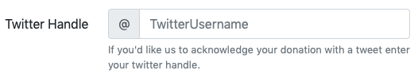
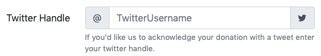
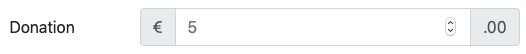
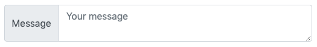
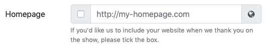
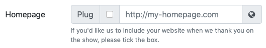
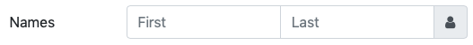
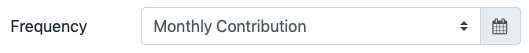
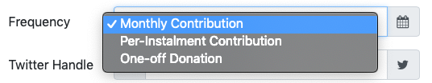
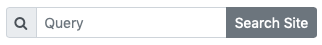

This will be the penultimate instalment of our introduction to Bootstrap forms. Today we’ll be looking at a really useful Bootstrap component for making form inputs clearer for the user, more powerful, and prettier. In the next instalment we’ll finish off with Bootstraps forms for the moment with a look at Bootstrap’s built-in form validation features.

You can [download this instalment’s ZIP file here](https://www.bartbusschots.ie/s/wp-content/uploads/2018/10/pbs65.zip) or [here on GitHub](https://cdn.jsdelivr.net/gh/bbusschots/pbs-resources/instalmentZips/pbs65.zip).

## Matching Podcast Episode 568

Listen along to this instalment on [episode 568 of the Chit Chat Across the Pond Podcast](https://www.podfeet.com/blog/2018/10/ccatp-568/)

<audio controls src="https://media.blubrry.com/nosillacast/traffic.libsyn.com/nosillacast/CCATP_2018_10_20.mp3">Your browser does not support HTML 5 audio 🙁</audio>

You can also <a href="https://media.blubrry.com/nosillacast/traffic.libsyn.com/nosillacast/CCATP_2018_10_20.mp3?autoplay=0&loop=0&controls=1" >Download the MP3</a>

## PBS 64 Challenge Solution

You’ll find my solution in this instalment’s ZIP file in the folder `pbs64-challenge-solution`.

The challenge was to add two forms to the recipe we built up over recent instalments. The first was an inline login form.

The markup was very much by-the-book, being basically the same as that in the small form example in the previous instalment:

```html
<footer class="mt-3 p-2 bg-light" role="form" aria-labelledby="login_desc">
  <form class="form-inline" action="javascript:void(0);">
    <label id="login_desc" class="mr-2">Admin Login:</label>
    <label for="uname_sm_tb" class="sr-only">Username</label>
    <input type="text" id="uname_tb" class="form-control form-control-sm mr-sm-1 mb-1" placeholder="Username">
    <label for="passwd_tb" class="sr-only">Password</label>
    <input type="password" id="password_tb" class="form-control form-control-sm mr-sm-1 mb-1" placeholder="Password">
    <button class="btn btn-secondary btn-sm form-control mb-1" id="login_btn">Login</button>
  </form>
</footer>
```

The only small extra addition in the challenge was a click handler for the login button:

```javascript
$(function(){
  $('#login_btn').click(function(){
    window.alert("Sorry, this is just a dummy form, there's nothing to actually log in to here!");
  });
});
```

The second form was a feedback form. You were free to use any layout that you felt worked well, as long as it was usable at all breakpoints. I chose to use a horizontal form:

```html
<fieldset class="col" role="form" aria-labelledby="share_fm_desc">
  <legend id="share_fm_desc" class="h2">Share via Email</legend>
  <form action="javascript:void(0)">
  <div class="form-group form-row">
    <label for="sender_name_tb" class="col-sm-5 col-md-4 col-lg-3 col-xl-2 col-form-label">Your Name</label>
    <div class="col">
      <input type="text" class="form-control" id="sender_name_tb" placeholder="Joe Blogs">
    </div>
  </div>
  <div class="form-group form-row">
    <label for="sender_email_tb" class="col-sm-5 col-md-4 col-lg-3 col-xl-2 col-form-label">Your Email Adddress</label>
    <div class="col">
      <input type="email" class="form-control" id="sender_email_tb" placeholder="jblogs@domain.com">
    </div>
  </div>
  <div class="form-group form-row">
    <label for="recipient_name_tb" class="col-sm-5 col-md-4 col-lg-3 col-xl-2 col-form-label">Recipient Name</label>
    <div class="col">
      <input type="text" class="form-control" id="recipient_name_tb" placeholder="Jane Doe">
    </div>
  </div>
  <div class="form-group form-row">
    <label for="recipient_email_tb" class="col-sm-5 col-md-4 col-lg-3 col-xl-2 col-form-label">Recipient Email Adddress</label>
    <div class="col">
      <input type="email" class="form-control" id="recipient_email_tb" placeholder="janed@domain.com">
    </div>
  </div>
  <div class="form-group form-row">
    <label for="message_ta" class="col-sm-5 col-md-4 col-lg-3 col-xl-2 col-form-label">Message</label>
    <div class="col">
      <textarea class="form-control" rows="5" id="message_ta" placeholder="You might enjoy this recipe."></textarea>
    </div>
  </div>
  <div class="form-row">
    <div class="col offset-sm-5 offset-md-4 offset-lg-3 offset-xl-2">
      <button class="form-control btn btn-primary" id="send_btn">Send</button>
    </div>
  </div>
  </form>
</fieldset>
```

To make the form behave well at all breakpoints, I simply varied the relative widths of the columns depending on the breakpoint by allowing the column containing the form elements to take all available space, and setting the labels to have specific widths at specific breakpoints with: `class="col-sm-5 col-md-4 col-lg-3 col-xl-2 col-form-label"`.

The click handler was basically the same as the one for the first form.

## Bootstrap Input Groups

Bootstrap provides a nice mechanism for enhancing text inputs with little additions. Since text boxes are created with `<input>` tag, the Bootstrap developers named these components _Input Groups_. For some bonus confusion, note that you can use `<textarea>` tags instead of `<input>` tags within input groups!

Note that, like most Bootstrap features covered in this series, this won’t be an exhaustive description of every single input group feature. We’ll just be looking at some of the highlights.

Like a button group, an input group takes the place of a single form element within a form. So it does not replace a Bootstrap form group.

Input groups are contained within an element given the class `.input-group`. You can use any tag you like for this, but `<div>`s are most commonly used.

## Input Group Text Add-ons

The simplest thing you can use button groups for is to append or prepend a text add-on to one or both sides of a text box or text area. You can do this to give additional context, or, in some instances, to remove the need for a separate visible label. Note that, if you do choose to replace a visible label with a text add-on, you still need provide a label for assistive devices. You have the usual three choices for this — a hidden label with the class `.sr-only`, or either an `aria-label` or `aria-labelledby` attribute on the text box itself.

Each add-on should be wrapped in a container with either the class `.input-group-prepend` or `.input-group-append`. Again, any tag can be used as this container, but `<div>` is most commonly used. The actual text within the add-on needs to be further wrapped in a tag with the class `.input-group-text`. Again, any element can be used, but `<span>`s are most common.

That sounds more complicated than it is — big-picture, you have an input group which contains one or more prepend add-ons, an input, and append add-ons. For now, each add-on contains add-on text, but as we’ll see later, they can contain other things too.

This all sounds very complicated. So let’s see some practical examples.

First, you can use a prepend to make it clear that you don’t want a user to enter some kind of prefix into the form by providing it for them in an add-on. A great example of this would be a Twitter handle where you could prepend the @ symbol to make clear you just want the bit after that:

```html
<div class="form-group form-row">
  <label for="twitter_tb" class="col-sm-3 col-form-label">Twitter Handle</label>
  <div class="col">
    <div class="input-group"> <!-- start of input group -->
      <div class="input-group-prepend">
        <span class="input-group-text">@</span>
      </div>
      <input type="text" class="form-control" id="twitter_tb" placeholder="TwitterUsername">
    </div> <!-- end of input group -->
    <small class="form-text text-muted">If you'd like us to acknowledge your donation with a tweet enter your twitter handle.</small>
  </div>
</div>
```

The above snippet shows an entire row from within a horizontal Bootstrap form. Note that we still have a `<label>` tag as normal, and that the form help text is outside of the input group.

This is what this input looks like:



Text inputs can also contain text-based icons like emoji or glyphicons, so we could improve our Twitter input by adding an Twitter icon as an append:

```html
<div class="input-group">
  <div class="input-group-prepend">
    <span class="input-group-text">@</span>
  </div>
  <input type="text" class="form-control" id="twitter_tb" placeholder="TwitterUsername">
  <div class="input-group-append">
    <span class="input-group-text"><i class="fa fa-twitter" aria-hidden="true"></i></span>
  </div>
</div>
```

The above snippet uses a Font Awesome glyphicon and looks like this:



Another very common way to show context with text add-ons is currency amounts. You can use a prepend add-on to show the currency, and an append add-on to show that you want the user to enter just the major part of the amount. For example, here is an input group asking for a Euro amount to the nearest Euro:

```html
<div class="form-group form-row">
  <label for="amount_tb" class="col-sm-3 col-form-label">Donation</label>
  <div class="col">
    <div class="input-group">
      <div class="input-group-prepend">
        <span class="input-group-text">&euro;</span>
      </div>
      <input type="number" class="form-control" id="amount_tb" placeholder="5">
      <div class="input-group-append">
        <span class="input-group-text">.00</span>
      </div>
    </div>
  </div>
</div>
```



You can use a text add-on as a label. Just remember to use the appropriate ARIA attributes to support assistive technologies:

```html
<div class="form-row">
  <div class="col form-group">
    <div class="input-group">
      <div class="input-group-prepend">
        <span class="input-group-text" id="message_ta_lbl">Message</span>
      </div>
      <textarea class="form-control" placeholder="Your message" aria-labelledby="message_ta_lbl"></textarea>
    </div>
  </div>
</div>
```

Note that the add-on text was given the ID `#message_ta_lbl`, and the text area specifies that ID as its label with the `aria-labelledby` attribute. This is what the text area looks like:



## Checkboxes/Radio Buttons as Input Group Add-ons

As mentioned previously, add-ons can be more than just text. They can also contain other related form elements like checkboxes or radio buttons. Rather confusingly, you simply add these extra elements into the .`input-group-text` element within the add-on.

A great example of why you might want to do this would be on a form where you ask a user for a piece of information that they may or may not want to do something with.

The following input asks the users for a homepage URL, and asks them whether or not to publish it:

```html
<div class="form-group form-row">
  <label for="url_tb" class="col-sm-3 col-form-label">Homepage</label>
  <div class="col">
    <div class="input-group">
      <div class="input-group-prepend">
        <div class="input-group-text">
          <input type="checkbox" aria-label="OK to Publish">
        </div>
      </div>
      <input type="url" class="form-control" id="url_tb" placeholder="http://my-homepage.com">
      <div class="input-group-append">
        <span class="input-group-text"><i class="fa fa-globe" aria-hidden="true"></i></span>
      </div>
    </div>
    <small class="form-text text-muted">If you'd like us to include your website when we thank you on the show, please tick the box.</small>
  </div>
</div>
```

Note the use of the `aria-label` attribute to give the checkbox a label for assistive devices. This is what the input group looks like:



## Multiple Inputs and Add-ons

While you can only have a single prepend or append add-on as such, each of those can actually contain multiple elements. Also, you can have multiple inputs in the same input group. We can improve our URL example by adding a second text add-on after the one that contains the checkbox:

```html
<div class="input-group">
  <div class="input-group-prepend">
    <span class="input-group-text"> Plug</span>
    <div class="input-group-text">
      <input type="checkbox" aria-label="OK to Publish">
    </div>
  </div>
  <input type="url" class="form-control" id="url_tb" placeholder="http://my-homepage.com">
  <div class="input-group-append">
    <span class="input-group-text"><i class="fa fa-globe" aria-hidden="true"></i></span>
  </div>
</div>
```



An example where you might want multiple inputs would be someone’s name:

```html
<div class="form-group form-row">
  <label class="col-sm-3 col-form-label">Names</label>
  <div class="col">
    <div class="input-group">
      <input type="text" class="form-control" id="name_first_tb" placeholder="First" aria-label="First Name">
      <input type="text" class="form-control" id="name_last_tb" placeholder="Last" aria-label="Last Name">
      <div class="input-group-append">
        <span class="input-group-text"><i class="fa fa-user" aria-hidden="true"></i></span>
      </div>
    </div>
  </div>
</div>
```

Note the use of `aria-label` attributes to give each input an individual label for assistive devices. This is what the input group looks like:



## Input Group Selects

You can add a drop-down into your input groups by giving it the class `.custom-select`.

```html
<div class="form-group form-row">
  <label for="type_sel" class="col-sm-3 col-form-label">Frequency</label>
  <div class="col">
    <div class="input-group">
      <select class="custom-select" id="type_sel">
        <option selected>Monthly Contribution</option>
        <option>Per-Instalment Contribution</option>
        <option>One-off Donation</option>
      </select>
      <div class="input-group-append">
        <span class="input-group-text"><i class="fa fa-calendar" aria-hidden="true"></i></span>
      </div>
    </div>
  </div>
</div>
```

Note that this is not a standard select, but a Bootstrap-special select that keeps its colour scheme more in tune with the input group as a whole. The difference is not that striking when the select is collapsed:



But it’s very noticeable when it's expanded:



## Input Group Buttons

You can also add buttons to input groups by adding them directly into add-ons.

A very common use-case is for search boxes (see example in next section).

## Input Group Sizes

Just like button groups, there are three sizes of input group: small, default, and large. You make an entire input group small by adding the class `.input-group-sm` to the containing tag, and you make one large by adding `.input-group-lg`.

As an example, let’s make a simple small search box:

```html
<p role="form" class="form-inline">
  <span class="input-group input-group-sm">
    <span class="input-group-prepend">
      <span class="input-group-text" id="message_ta_lbl"><i class="fa fa-search" aria-hidden="true"></i></span>
    </span>
    <input type="text" class="form-control" placeholder="Query" aria-label="search text">
    <span class="input-group-append">
      <button class="btn btn-secondary">Search Site</button>
    </span>
  </span>
</p>
```

Again, note the use of the `aria-label` attribute to label the text box for assistive technologies. This is what the entire form looks like:



## Challenge

Using your own solution to the previous challenge, or mine, improve both forms on the page using Bootstrap Input Groups.

## Final Thoughts

We’re now almost done with our introduction to forms in Bootstrap. We can take input from users in all sorts of very powerful and pretty ways, and we can lay out our forms in many and varied ways. What we haven’t learned how to do in a Bootstrap-way is validate our forms. So that’s what we’ll be looking at next time.
