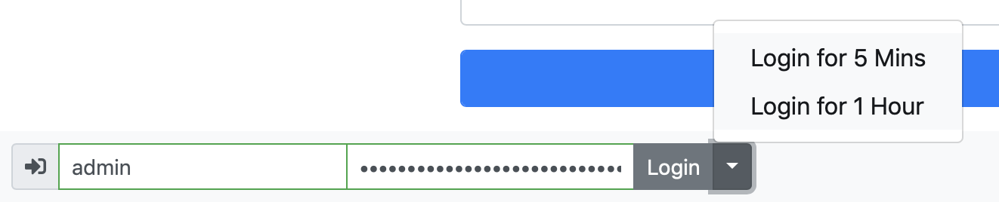
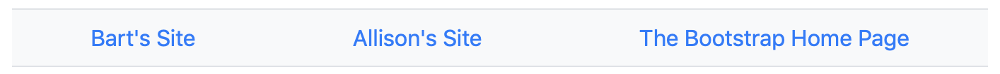
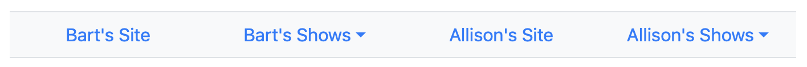
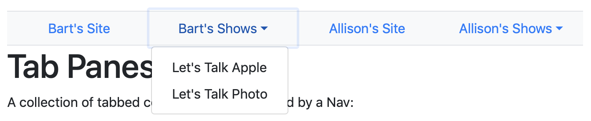
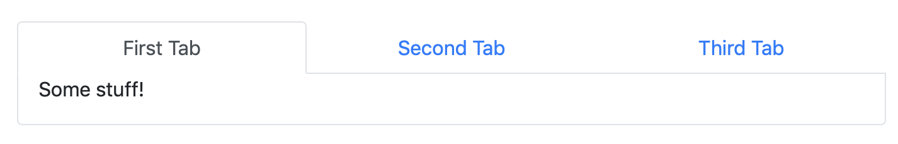

In this instalment we’ll get our first look at Bootstrap’s so-called _Nav_ component, a menu designed to facilitate navigation around a website, within a page, or within a web app. In the previous instalment we met Drop-downs for the first time, and saw how Drop-downs filled with buttons can be used within web app UIs. We ended by noting that Drop-downs come in two flavours, buttons and links. In this instalment we’ll learn how to use the link-flavour of Drop-downs within Navs. Finally, we’ll learn how to use Navs to create tabbed content regions within a web page or web app.

You can [download this instalment’s ZIP file here](https://www.bartbusschots.ie/s/wp-content/uploads/2018/12/pbs68.zip) or [here on GitHub](https://cdn.jsdelivr.net/gh/bbusschots/pbs-resources/instalmentZips/pbs68.zip).

## Matching Podcast Episode 575

Listen along to this instalment on [episode 575 of the Chit Chat Across the Pond Podcast](https://www.podfeet.com/blog/2018/12/ccatp-575/)

<audio controls src="https://media.blubrry.com/nosillacast/traffic.libsyn.com/nosillacast/CCATP_2018_12_15.mp3">Your browser does not support HTML 5 audio 🙁</audio>

You can also <a href="https://media.blubrry.com/nosillacast/traffic.libsyn.com/nosillacast/CCATP_2018_12_15.mp3?autoplay=0&loop=0&controls=1" >Download the MP3</a>

## PBS 67 Challenge Solution

The challenge set at the end of the previous instalment was simply to update the pretend login form at the bottom of our ever-expanding recipe page with a new feature — instead of simply having a single login button, that button should be expanded to become a split drop-down with logging in permanently as the default option, and two drop-down options to log in for shorter times, specifically 5 minutes and 1 hour.

As a quick reminder, this is what the code looked like when we last left it:

```html
<span class="input-group input-group-sm" style="position: relative">
  <span class="input-group-prepend">
    <span class="input-group-text"><i class="fas fa-sign-in-alt" aria-hidden="true"></i></span>
  </span>
  <input type="text" class="form-control" placeholder="Username" aria-label="Admin Username" required>
  <input type="password" class="form-control" placeholder="Password" aria-label="Password" required>
<div class="invalid-tooltip" id="login_invalid" style="top: -2.5em">Both username and password are required</div>
  <span class="input-group-append">
    <button type="submit" class="btn btn-secondary form-control" id="login_btn">Login</button>
  </span>
</span>
```

The entire form, a username text box, password box, and submit button, is contained within a single input group, with the single submit button as an appended input group add-on. There is also a nice icon prepended to the front of the group, also as add-on.

The only thing we need to change is the appended add-on, converting it from a single button to a split drop-down.

The first thing we’ll need to do is add a second button into the add-on to act as the trigger for the drop-down:

```html
<button type="button" class="btn btn-secondary dropdown-toggle dropdown-toggle-split" id="login_dd_t" data-toggle="dropdown" aria-haspopup="true" aria-expanded="false" type="button">
  <span class="sr-only">Toggle Dropdown</span>
</button>
```

The important things to note are that the button needs to have the classes `dropdown-toggle` & `dropdown-toggle-split` (in addition to the usual Bootstrap button classes), the data attribute `data-toggle="dropdown"`, and that for accessibility reasons, it should have an ID and define the ARIA attributes `aria-haspopup="true"` and `aria-expanded="false"`. Again, for accessibility reasons, note that the only thing the button contains is a `<span>` with a label describing what the button does that’s only visible to screen readers (i.e. has the Bootstrap utility class `.sr-only`).

The next piece of markup we need is the code for the drop-down itself. We add this after the newly added trigger button:

```html
<span class="dropdown-menu" aria-labelledby="login_dd_t">
  <button class="dropdown-item" type="submit">Login for 5 Mins</button>
  <button class="dropdown-item" type="submit">Login for 1 Hour</button>
</span>
```

The key points to note are that the `<span>` that’s serving as the drop-down menu has the class `dropdown-menu`, that the buttons within the menu have the class `dropdown-item`, and that, for accessibility reasons, there is an `aria-labelledby` attribute connecting the menu to the trigger (using the trigger’s ID).

We now have a visually functioning menu, and because both buttons in the drop-down have `type="submit"`, they both work to submit the form:



The challenge did have one small twist: the message displayed when the form is submitted should tell the user how long they would be pretend logged in for. The current submit event handler on the form always shows the same message, regardless of which button was used to trigger the login.

This is the starting code for the event handler:

```javascript
$loginForm.submit(function(e){
  if(validateLoginForm()){
    window.alert("Sorry, this is just a dummy form, there's nothing to actually log in to here!");
  }else{
    e.stopPropagation();
    $('input:invalid', $loginForm).first().focus();
  }
});
```

There are multiple ways to address this problem. For example, you could write separate event handlers for each button, but I decided to go a slightly different route that would scale more easily if there were more items in the menu.

I started by adding a hidden input to the form to store the login duration — no value would be interpreted as a permanent login, and any other durations would be represented by simple string values like `5 minutes` or `1 hour`:

```html
<input type="hidden" id="login_duration_hdn" value="">
```

Next I changed the buttons in the drop-down from `type="submit"` to `type="button"`, gave them both `value` attributes, and gave the menu as a whole and ID:

```html
<span class="dropdown-menu" aria-labelledby="login_dd_t" id="login_dd_m">
  <button class="dropdown-item" type="button" value="5 minutes">Login for 5 Mins</button>
  <button class="dropdown-item" type="button" value="1 hour">Login for 1 Hour</button>
</span>
```

The next step was to add an event handler to the buttons so they update the value of the hidden field when clicked, and then submit the form. Because each button now has a value attribute, the same handler can be added to all buttons within the menu. Since the menu now has an ID, we can use the CSS selector `#login_dd_m button` to select all buttons in the menu:

```javascript
$('#login_dd_m button').click(function(){
  $('#login_duration_hdn').val($(this).val());
  $loginForm.submit();
});
```

Notice that we simply use jQuery’s `.val()` function to read the value from the source of the click (accessible via `$(this)`) and write it to the hidden field. After that we simply submit the form.

The final step now is to update the form’ submit handler so it uses the value in the hidden field:

```javascript
$loginForm.submit(function(e){
  const $d = $('#login_duration_hdn');
  if(validateLoginForm()){
    let msg = "Sorry, this is just a dummy form, there's nothing to actually log in to here!\n\nIf the form were real you'd have been logged in "
    if($d.val()){
      msg += 'for ' + $d.val();
    }else{
      msg += 'indefinitely';
    }
    msg += '.';
    window.alert(msg);
  }else{
    e.stopPropagation();
    $('input:invalid', $loginForm).first().focus();
  }
  $d.val(''); // always blank the duration
});
```

Again, note the use of jQuery’s `.val()` function for reading the value from the hidden field and then using it to adjust the message. Also notice that the function always empties the hidden field at the end by calling `.val()` with an empty string as the only argument. This is important because otherwise the duration would be unexpectedly sticky, and the form would have a bug. Imagine that line was missing, and the user took the following steps:

1.  Clicked the 5 minute login button before entering a username and/or password, resulting in a validation error
2.  Entered a username and password
3.  Clicked the default login button

The expected outcome would be an indefinitely login, but the actual outcome would be a 5 minute login, because the hidden field would still contain the value `5 minutes`!

You can find the full code for my sample solution in the folder `pbs67-challenge-solution` in [this instalment’s ZIP](https://www.bartbusschots.ie/s/wp-content/uploads/2018/12/pbs68.zip) or [here on GitHub](https://cdn.jsdelivr.net/gh/bbusschots/pbs-resources/instalmentZips/pbs68.zip).

## Basic Bootstrap Nav Bars

A Bootstrap _Nav_ component is designed to allow a user to navigate in some way. Bootstrap Navs are implemented using CSS3 flex boxes, and come in a few different styles. Within a traditional website you might use them to allow your visitors move between sections of your site, and in a web app you might use them to move between different screens in your app, or even different panels within a pallette of controls or something like that.

Regardless of how simple or complex your nav, they will all be contained within a single tag, and that tag will have the class `.nav`. Navs contain items, and with one exception, nav items should have the class `.nav-item`. To make links within navs easier to click/tap, they should all be given the class `.nav-link` which gives them extra large padding and ensures they’re rendered appropriately.

For the very simplest of navs, the nav items can be omitted, so you can have a single tag with the class `.nav` containing only links with the class `.nav-link`.

For the simple pure-link variant of the nav bar, you could use any containing tag, but, from a semantic point of view, the obvious tag to use is the HTML5 `<nav>` tag (for _navigation_).

So, a basic nav really can be this simple:

```html
<nav class="nav">
  <a class="nav-link" href="http://www.bartb.ie/" target="_blank">Bart's Site</a>
  <a class="nav-link" href="http://www.podfeet.com/" target="_blank">Allison's Site</a>
  <a class="nav-link" href="http://www.getbootstrap.com/" target="_blank">The Bootstrap Home Page</a>
</nav>
```

Note that you’ll find this example and all the others below in the file `pbs68a.html` in [this instalment’s ZIP](https://www.bartbusschots.ie/s/wp-content/uploads/2018/12/pbs68.zip) or [here on GitHub](https://cdn.jsdelivr.net/gh/bbusschots/pbs-resources/instalmentZips/pbs68.zip).


A basic nav like this could almost be described as unstyled. It’s just a left-aligned horizontal list of links with very generous padding. You can add basic styling to your navs using the standard Bootstrap utility classes. The [flex utilities](http://getbootstrap.com/docs/4.1/utilities/flex/) are particularly relevant since Bootstrap navs are flex boxes!

Here’s a first practical example:

```html
<nav class="nav border-top border-bottom bg-light justify-content-around">
  <a class="nav-link" href="http://www.bartb.ie/" target="_blank">Bart's Site</a>
  <a class="nav-link" href="http://www.podfeet.com/" target="_blank">Allison's Site</a>
  <a class="nav-link" href="http://www.getbootstrap.com/" target="_blank">The Bootstrap Home Page</a>
</nav>
```



In this case I made use of the [colour utilities](http://getbootstrap.com/docs/4.1/utilities/colors/) to set a background colour, the [border utilities](http://getbootstrap.com/docs/4.1/utilities/borders/) to add a border top and bottom, and the flex utilities to justify the links across the bar nicely.

### Nav Pills

As well as using the standard utilities, Bootstrap also provides an additional custom style which allows the active item in a nav to be highlighted. For example, the current page on a website could be marked as active in a nav used for site navigation. You enable pills by giving the relevant nav the additional class `.nav-pills`, and the active link the class `.active`.

All navs, whether using pills or not, also support `.disabled` to mark an item in the navigation as being disabled.

### Controlling Nav Item Widths

By default the width of flex items is determined by their content. When using pills, the size of the active item becomes very obvious, so you might not want the default minimalist sizing.

Until now we have not used the `.nav-item` class at all, but we now need to. In simple navigations, the `<a>` tags can be made to do double-duty as both nav items and nav links by giving them both the `.nav-item` and `.nav-link` classes. We’ll need to do that in order to control the item widths.

Adding `.nav-fill` to an overall nav where each item has the class `.nav-item` will remove the empty space around each of the items. This won’t make them all the same width though. To do that, we should give the nav the class `.nav-justified` instead of `.nav-fill`.

Putting all that together, below is the markup for a simple justified nav including an active link and a disabled link:

```html
<nav class="nav nav-pills nav-justified">
  <a class="nav-item nav-link" href="https://www.bartbusschots.ie/s/2018/11/04/pbs-66-of-x-bootstrap-form-validation/" target="_blank">PBS 66</a>
  <a class="nav-item nav-link" href="https://www.bartbusschots.ie/s/2018/12/02/pbs-67-of-x-bootstrap-dropdown-menus/" target="_blank">PBS 67</a>
  <a class="nav-item nav-link active" href="" target="_blank">PBS 68</a>
  <a class="nav-item nav-link disabled" href="" target="_blank">PBS 69</a>
</nav>
```


### Nav Tabs

Now that our links are doing double duty as both nav items and nav links, we have one more display style at our disposal — tabs. To use tabs rather than pills, simply replace `.nav-pills` with `.nav-tabs`.

```html
<nav class="nav nav-tabs nav-justified">
  <a class="nav-item nav-link" href="https://www.bartbusschots.ie/s/2018/11/04/pbs-66-of-x-bootstrap-form-validation/" target="_blank">PBS 66</a>
  <a class="nav-item nav-link" href="https://www.bartbusschots.ie/s/2018/12/02/pbs-67-of-x-bootstrap-dropdown-menus/" target="_blank">PBS 67</a>
  <a class="nav-item nav-link active" href="" target="_blank">PBS 68</a>
  <a class="nav-item nav-link disabled" href="" target="_blank">PBS 69</a>
</nav>
```


## List-based Navs

Before we can move on to some more advanced nav features we need to loop back and learn the second markup option available to us — list-based navs.

A list-based nav consists of a containing tag with the class `.nav` (usually a `<ul>`) containing tags with the class `.nav-item` (usually `<li>`s) containing links with the class `.nav-link` as well as any additional markup needed for the more advanced features.

Rewriting the previous example, we get:

```html
<ul class="nav nav-tabs nav-justified">
  <li class="nav-item">
    <a class="nav-link" href="https://www.bartbusschots.ie/s/2018/11/04/pbs-66-of-x-bootstrap-form-validation/" target="_blank">PBS 66</a>
  </li>
  <li class="nav-item">
    <a class="nav-link" href="https://www.bartbusschots.ie/s/2018/12/02/pbs-67-of-x-bootstrap-dropdown-menus/" target="_blank">PBS 67</a>
  </li>
  <li class="nav-item">
    <a class="nav-link active" href="" target="_blank">PBS 68</a>
  </li>
  <li class="nav-item">
    <a class="nav-link disabled" href="" target="_blank">PBS 69</a>
  </li>
</ul>
```

The resulting Nav is visually identical to the original `<nav>`\-based version.

## Drop-down Menus for Navigation

Using the more advanced list-based navs, we can now add Drop-downs into our navs quite easily.

The nav item will become the container for the drop-down, so it should get the additional class `.dropdown`. The nav link will become the trigger for the drop-down, so it will get the additional class `.dropdown-toggle` as well as the usual data and ARIA attributes `data-toggle="dropdown"`, `aria-haspopup="true"` and `aria-expanded="false"`. In addition to all that, the link should also get `role="button"`, and it should be a link to the exact current location, i.e. `href="#"`. Finally, we should give the link an ID so we can use it as the ARIA label for the menu.

The menu should then be added into the nav item directly after the nav link. Since this drop-down is for navigation, we should use slightly different markup to what we saw in [the previous instalment](https://pbs.bartificer.net/pbs67). Rather than filling our menu with buttons, we’ll be filling it with links instead:

```html
<ul class="nav nav-justified bg-light border-top border-bottom">
  <li class="nav-item">
    <a class="nav-link" href="http://www.bartb.ie/" target="_blank">Bart's Site</a>
  </li>
  <li class="nav-item dropdown">
    <a class="nav-link dropdown-toggle" id="bb_pod_ddt" data-toggle="dropdown" href="#" role="button" aria-haspopup="true" aria-expanded="false">Bart's Shows</a>
    <div class="dropdown-menu" aria-labelledby="bb_pod_ddt">
      <a class="dropdown-item" href="https://www.lets-talk.ie/apple" target="_blank">Let's Talk Apple</a>
      <a class="dropdown-item" href="https://www.lets-talk.ie/photography" target="_blank">Let's Talk Photo</a>
    </div>
  </li>
  ...
</ul>
```





## Bootstrap Tabbed Regions

You might be wondering why Bootstrap comes with a nav styled to look like tabs. The answer is wonderfully simple, Bootstrap comes with built-in support for creating tabbed regions within a page that can be switched between using a nav bar!

Note that this feature requires that the Bootstrap JavaScript files be loaded into the page.

To create a tabbed region within a page, you’ll need two things — a nav to navigate between the tabbed panes, and a collection of panes to navigate among.

While the nav appears above the tab panes in the markup and on the page, let’s start with the tab panes.

All the panes to be tabbed between must be contained within a single element, usually a `<div>`, with the class `.tab-content`. Each pane is contained within its own element, again, usually a `<div>`, and must have the class `.tab-pane`. The pane that should default to being in front should also have the class `.active`. To make it possible for the nav to control the panes each one also needs an ID. Finally, to facilitate accessibility, each pane should have `role="tabpanel"` and have an `aria-labelledby` attribute to link it to the matching link within the nav bar.

Moving on to the nav bar, it’s mostly a regular nav bar, and can be either `.nav-tabs` or `.nav-pills`, but there are some changes needed.

The container for the nav should get `role="tablist"` to facilitate assistive technology.

When it comes to the individual links, there are a lot of requirements. Firstly, they all need to have IDs so they can be referenced by the `aria-labelledby` attributes on the matching panes. Next, they need to be connected to their matching pane by giving them the data attribute `data-toggle="tab"` (or `data-toggle="pill"` with `.nav-pills`) and setting their href attribute to the CSS selector for the ID of the pane they control. For example, for a pane with `id="tab1"`, the link should have `href="#tab1"`. For accessibility, each link should get `role="tab"`, an `aria-controls` attribute with the value of the ID of the matching pane, e.g. `aria-controls="home"` and an `aria-selected` attribute with a value of `true` if the controlled tab is currently shown, or `false` otherwise. Finally, if the link is controlling the tab that’s currently shown, it should also get the class `.active`.

For a nice visual effect, you probably want to add a border on three sides of the `.tab-content` container (all but the top), and to round the bottom two corners. You may also want to add a little padding to the sides. To achieve all this, I like to add the following utility classes: `.border` & `.border-top-0` to add a border on all sides, then remove the top one, `.rounded-bottom` to round just the bottom corners, and `px-3` to add just the sides.

That sounds very complicated, but it’s not actually that bad when you see it all together:

```html
<!-- the nav controlling the panes -->
<nav class="nav nav-tabs nav-justified" role="tablist">
  <a class="nav-item nav-link active" id="tab1-tab" data-toggle="tab" href="#tab1" role="tab" aria-controls="tab1" aria-selected="true">First Tab</a>
  <a class="nav-item nav-link" id="tab2-tab" data-toggle="tab" href="#tab2" role="tab" aria-controls="tab2" aria-selected="false">Second Tab</a>
  <a class="nav-item nav-link" id="tab3-tab" data-toggle="tab" href="#tab3" role="tab" aria-controls="tab3" aria-selected="false">Third Tab</a>
</nav>

<!-- The panes -->
<div class="tab-content border border-top-0 rounded-bottom px-3">
  <div class="tab-pane active" id="tab1" role="tabpanel" aria-labelledby="tab1-tab">
    <p>Some stuff!</p>
  </div>
  <div class="tab-pane" id="tab2" role="tabpanel" aria-labelledby="tab2-tab">
    <p>Some other stuff!</p>
  </div>
  <div class="tab-pane" id="tab3" role="tabpanel" aria-labelledby="tab3-tab">
    <p>Even more stuff!</p>
  </div>
</div>
```



## A Challenge

Using either your solution to the previous challenge or mine as your starting point, update the recipe page to make use of tabbed content panes in some way.

## Final Thoughts

We’ve seen how Bootstrap Navs can be used to make basic navigation menus, as well as somewhat more advanced navigation menus containing Drop-downs. We’ve also seen how we can use navs to create tabbed content panes, which can be a nice way of compressing content on a page, or of organising pallettes of form controls within a web app.

Bootstrap has one more nav-related trick up its sleeve though — what it refers to as the _Navbar_ component. This component is designed to be used as the navigation bar at the top of web pages or web apps. It supports simple links and Drop-downs just like a regular Nav, but it also supports the addition of small inline forms for things like login or site search functionality, non-link text, or a site logo. It even has built-in support for smaller devices through the now ubiquitous so-called _hamburger button_.

Because the Navbar is so powerful, we’ll be dedicating the entire next instalment to it.
