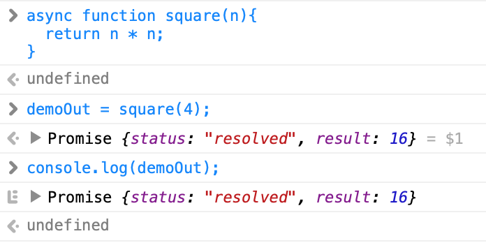

In this instalment we finish our exploration of promises with a look at the two new promise-related keywords added to JavaScript in ES 2017. These keywords allow us to write asynchronous code in a more human-friendly way.

You can [download this instalment’s ZIP file here](https://www.bartbusschots.ie/s/wp-content/uploads/2019/09/pbs82.zip) or [here on GitHub](https://cdn.jsdelivr.net/gh/bbusschots/pbs-resources/instalmentZips/pbs82.zip).

## Matching Podcast Episode 609

Listen along to this instalment on [episode 609 of the Chit Chat Across the Pond Podcast](https://www.podfeet.com/blog/2019/09/ccatp-609/)

<audio controls src="https://media.blubrry.com/nosillacast/traffic.libsyn.com/nosillacast/CCATP_2019_09_20.mp3">Your browser does not support HTML 5 audio 🙁</audio>

You can also <a href="https://media.blubrry.com/nosillacast/traffic.libsyn.com/nosillacast/CCATP_2019_09_20.mp3?autoplay=0&loop=0&controls=1" >Download the MP3</a>

## PBS 81 Challenge Solution

The challenge set at the end of the previous instalment was to update the number guessing game we have been working on so it loads its templates from external files using AJAX. Rather than loading the templates in series, they should be loaded in parallel using the `Promise.all()` utility function. The idea is to parallelise the loading of the templates, and then, only when they have all loaded, initialise the game.

You’ll find my sample solution in the `pbs81-challengeSolution` folder in this instalment’s ZIP file. Because we’re using AJAX to load the templates, the code won’t work directly from the file system (i.e. with a `file://` URL). You’ll have to run it inside your local web server (MAMP) so it has an `http://` URL.

Before making any changes, my solution stored the template strings in `<script>` tags within `index.html`. Inside the document ready handler, the code used jQuery’s `$()` function to read the strings from the `<script>` tags into a global object named `TEMPLATES`:

```javascript
// get and store the needed templates
TEMPLATES.gameMessage = $('#gameMessageTemplate').html();
TEMPLATES.guesses = $('#guessesDisplayTemplate').html();
TEMPLATES.guessPopover = $('#guessPopoverTemplate').html();
TEMPLATES.gameWon = $('#gameWonTemplate').html();
TEMPLATES.gameGrid = $('#gridTemplate').html();
TEMPLATES.gameInitError = $('#gameInitErrorTemplate').html();
TEMPLATES.confirmQuit = $('#confirmQuitTemplate').html();
```

Note that `TEMPLATES` is declared outside the document ready handler within the global scope:

```javascript
var TEMPLATES = { // Mustache template strings, loaded from script tags by document ready handler
  gameMessage: '',
  guesses: '',
  guessPopover: '',
  gameWon: '',
  gameGrid: '',
  gameInitError: '',
  confirmQuit: ''
};
```

Note that each template has a name within the `TEMPLATES` object. I decided to make use of this fact to simplify my solution. I created a folder named `view`, and created a file within that folder for each template. I named the files `TEMPLATE_NAME.tpl.txt`. So, the `gameMessage` template will be `./view/gameMessage.tpl.txt`. This is a very common approach, and makes it easier to load templates within a loop of some kind.

To load my templates I created a function named `loadTemplates()` which takes one or more template names as arguments, and returns a single promise that will resolve only when all templates are loaded. Note that the promise will reject if any one template fails to load. This function builds an array of promises, one for each template, then creates a final promise unifying them all into a single promise with `Promise.all()`:

```javascript
function loadTemplates(...templateNames){
  if(is.empty(templateNames) || !is.all.string(templateNames)){
    throw new TypeError('must pass one or more template names as strings');
  }
  const templatePromises = [];
  for(const tplName of templateNames){
    const tplURL = `./view/${encodeURIComponent(tplName)}.tpl.txt`;
    const tplPromise = $.ajax({
      url: tplURL,
      method: 'GET',
      dataType: 'text'
    }).then(function(tpl){
      // store the template
      TEMPLATES[tplName] = tpl;
      return tpl; // pass the template through
    });
    templatePromises.push(tplPromise);
  }
  return Promise.all(templatePromises);
}
```

With this change made it was simply a matter of rewriting the document ready handler so it called this function, then, only when the promise resolved, loaded the interface. This is my updated document ready handler with the new part highlighted:

```javascript
// The Document Ready Handler
$(function(){
  // get and store the needed page elements
  $GAME_MESSAGES = $('#gameMessageContainer');
  $MODAL = $('#theModal');
  $MODAL_CONTENT = $('.modal-content', $MODAL);
  $GAME_INTERFACE = $('#mainGameInterface');

  // save the spinner HTML for later re-use
  SPINNER_HTML = $GAME_INTERFACE.html();

  // add a click handler to the quit button
  $('#quitBtn').click(function(){
    quitGame();
  });

  // load the templates and if successful, reset the game
  loadTemplates('gameMessage', 'guesses', 'guessPopover', 'gameWon', 'gameGrid', 'confirmQuit').then(
    function(){
      // the template all loaded without error, so go ahead and reset (init) the game
      resetGame();
    },
    function(err){
      // something went wrong loading the templates
      $GAME_INTERFACE.empty().html(Mustache.render(
        TEMPLATES.gameInitError
      ));
      console.log('failed to load templates with error', err);
    }
  );
});
```

Note that, in order to show an error should the templates fail to load, I use the error template. For this reason I chose to hard-code that one template straight into the `TEMPLATES` object:

```javascript
var TEMPLATES = { // Mustache template strings, loaded from external files via AJAX by document ready handler
  gameMessage: '',
  guesses: '',
  guessPopover: '',
  gameWon: '',
  gameGrid: '',
  // error is hard-coded rather than loaded in case there is an error loading the templates!
  gameInitError: '<div class="alert alert-danger" role="alert"><h2 class="h4 alert-heading">Error</h4><p>Failed to initialise game 🙁</p></div>',
  confirmQuit: ''
};
```

## Reminder — The Problems Promises are Designed to Solve

At the root of everything is the need for JavaScript to support non-blocking I/O operations (input/output) like network requests.

Since non-blocking I/O is a negative term, let’s flip things around and look at what blocking I/O is.

Imagine the following pseudo-code:

```
const rate = fetchExchangeRate('EUR', 'USD');
loadIcon('#euro_placeholder', 'https://some.domain.tld/icons/usd.png');
loadIcon('#dollar_placeholder', 'https://some.domain.tld/icons/eur.png');
$('#rate_placeholder').text(rate);

```

The first line of code starts an I/O operation to fetch the current € to $ currency exchange rate from an imagined web service. The second and third lines call an imagined function which fetches image data from a URL and loads icons into the page. The final line writes the exchange rate into the page.

With blocking I/O each line would happen in order, one after the other, waiting for the operation to complete before moving on. This means the operation to fetch the exchange rate would have to finish before the operation to fetch the euro icon started. Similarly, the operation to fetch the dollar icon would not start until the operation to fetch the Euro icon had completed. Only when all three I/O tasks had completed would the final line happen and would the rate get written into the page.

This has the advantage that everything happens in a known order, but the disadvantage that everything always happens in series, which is very inefficient and slow. Given a typical web page often contains tens or even hundreds of little elements that need to be fetched from a URL, this would make the web unusably slow, and users understandably cranky!

This is why non-blocking I/O was incorporated into the JavaScript language by making some built-in functions operate _asynchronously_. When JavaScript meets one of these asynchronous built-in functions, it starts that function running in the background and immediately moves on to the next line and continues executing the script.

This asynchronous approach is non-blocking because the second line is not blocked from executing by the first. There is no waiting around, execution continues!

The asynchronous paradigm has the obvious advantage of being more efficient — doing many things at the same time definitely makes pages load faster! But, this efficiency comes at a price!

When you’re programming asynchronously, you have no guarantee of the order in which things happen, and you have no way of knowing when an operation will complete. In our above example, the 4th line of code can’t run until the operation initiated by the first completes. How can we ensure that in an asynchronous world? JavaScript’s answer to this was callbacks — i.e. asynchronous functions take a reference to a function as an argument, and they execute that function when the operation completes. If the operation produces output, that output gets passed to the callback when it’s executed.

To make our pseudo-code example work in an asynchronous world, we would need to rewrite it something like this:

```
const rate = fetchExchangeRate('EUR', 'USD', function(rate){ $('#rate_placeholder').text(rate); });
loadIcon('#euro_placeholder', 'https://some.domain.tld/icons/usd.png');
loadIcon('#dollar_placeholder', 'https://some.domain.tld/icons/eur.png');

```

Voila! Thanks to callbacks, we now have a more efficient world in which the icons can load while the exchange rate is fetched, and the rate will be written into the page the moment it becomes available.

This works fine when there are no interdependencies between the I/O operations. But, as we learned in [instalment 77](https://pbs.bartificer.net/pbs77), once you introduce interdependencies, you soon find yourself in a mess of spaghetti code scathingly referred to as _callback hell_.

As we’ve seen in the previous two instalments, promise chains and promise utility functions like `Promise.all()` allow us a way out of hell by allowing us to write our code in a more human-readable format.

While promise chains are definitely easier to read than nested callbacks, they are nowhere near as easy to read as our original pseudo-code example. Wouldn’t it be great if we could somehow use promises to give us asynchronous (non-blocking) code that’s as easy to read as synchronous code?

Enter ES 2017 (the update to the JavaScript language published in 2017)! This version of JavaScript introduced two new keywords which take the promise concept to the next level — `async` & `await`.

## Asynchronous Functions with `async`

Some built-in functions provided by Javascript have always worked in an asynchronous way using callbacks. Until ES2017 we’ve not had the ability to create our own truly asynchronous functions. Well, now we can, but the functions we can create will behave differently to the original built-in functions which continue to exist.

There’s an obvious danger for confusion here between the built-in functions and the ones we’ll be writing. To try minimise confusion, I’ll refer to the asynchronous functions we’ll be creating with the `async` keyword as _async functions_.

_**Note:** the example code snippets throughout the remainder of this section are intended to be executed in the JavaScript console on `pbs82a.html` from this instalment’s ZIP file. For the examples in this section the file can be opened directly, but for the worked example in the next section the file will need to be loaded via a local web server (e.g. [MAMP](https://www.mamp.info/))._

With those preambles out of the way, let’s start our exploration of what we’ll refer to as _async functions_.

In ES 2017 and later versions of JavaScript, functions can be explicitly marked for asynchronous execution by prefixing their definition with the keyword `async`. When an async function is called, it immediately returns a promise for its eventual result. JavaScript automatically creates this promise, and then executes the function in the background like it would its built-in asynchronous functions.

The way I like think of it is that **async functions are automatically promised**.

In practical terms, this means that whatever value the async function eventually returns, the automatically generated promise will resolve to that value. Also, should the async function throw an error, the automatically generated promise will reject with that error.

As we’ve already seen, JavaScript has no problem dealing with a promise that resolves to another promise. Async functions can return promises if that’s convenient or desirable.

As I’ve previously mentioned, functions are marked as async functions by prefixing their declaration with the `async` keyword. This works for all forms of function definition, i.e. [function statements](https://developer.mozilla.org/en-US/docs/Web/JavaScript/Reference/Statements/function), [function expressions](https://developer.mozilla.org/en-US/docs/web/JavaScript/Reference/Operators/function), and [arrow function expressions](https://developer.mozilla.org/en-US/docs/Web/JavaScript/Reference/Functions/Arrow_functions) (AKA _fat arrow functions_).

Here’s an example of a very simplistic async function defined using a function statement:

```javascript
async function square(n){
  return n * n;
}
```

Go ahead and paste the above function definition into the console on `pbs82a.html`.

Next, call this function and save the result in the pre-existing variable named `demoOut`:

```javascript
demoOut = square(4);
```

If this was a normal function, the value of `demoOut` would now be 16, but this is not a normal function; it’s an async function. So, what is the value of `demoOut`? Since async functions are automatically promised, `demoOut` is a promise for the result of executing the function with 4 as the only argument. You can see this for yourself:

```javascript
console.log(demoOut);
```



Below is an example of a similarly simple async function, but this time one declared with a function expression:

```javascript
cube = async function(n){
  return n * n * n;
};
```

Finally, the example below creates another simplistic async function using an arrow function expression (AKA _fat arrow function_):

```javascript
quad = async (n)=>{ return n * n * n * n };
```

We’ve not used arrow functions very often since learning about them in [instalment 46](https://pbs.bartificer.net/pbs46), so you might want to take a moment to refresh your memory.

Since async functions are automatically promised, we can directly call `.then()` on the value they return:

```javascript
quad(4).then((ans)=>{ console.log(ans) });
```

## Awaiting Promises with `await`

The second promise-related keyword ES 2017 introduced is `await`.

Before we go any further, it’s **vital** to know that **`await` can only be used within async functions**!

If you try to use the `await` keyword in the global scope or within a regular function, you’ll get an error.

So, what does the `await` keyword do? It does three things:

1.  `await` pauses execution of an async function and waits for a promise to resolve **in a non-blocking way**.
2.  If the awaited promise resolves, `await` evaluates to the value the promise resolved to. For example, `await square(4)` evaluates to 16.
3.  If the awaited promise rejects, `await` throws the error the promise rejected with.

The way I like to think of it is that **`await` waits for a promise and then unwraps its result**.

As a basic example, let’s create another simplistic async function that calls two of our earlier example async functions:

```javascript
async function squareCube(n){
  let ans = await cube(n);
  ans = await square(ans);
  return ans;
}
```

We can now call our function:

```javascript
squareCube(2).then((a)=>{console.log(a)});
```

So what’s happening inside the `squareCube()` function when we call it?

First, since we passed 2 as the only argument, within the `squareCube()` function, `n` now equals 2.

On the first line we see that a new variable named `ans` will store the value `await` eventually evaluates to. In this case `await` will pause execution of the function until the automatically generated promise of the result of calling the async function `cube()` resolves or rejects. Once the automatically generated promise resolves, `await` will take on the value resolved to and unpause the execution of `cube()`. This means that the value stored in `ans` is 2 cubed, i.e. 8. The key thing to remember is that `await` both waited and then unwrapped the promise. Although `cube()` returned a promise, `ans` contains the number 8, not a promise for 8.

A very similar things happens on the next line. This time `await` pauses and waits for the promise automatically generated by calling the async function `square()` to resolve. Since `ans` was 8, `await` evaluated to 8 times 8, or 64, and that value was then stored in `ans`, so `ans` became 64.

Note that we just made two interdependent asynchronous calls which are non-blocking but written to look like basic synchronous code. We were able to achieve this without any obvious callbacks or promise chains.

When used together, `async` and `await` really do let us eat our cake and have it!

One final but important subtlety to note — while it can only be used within an async function, **`await` can be used to await any promise**, regardless of its source.

### Example 1 — A Random Number of Random Numbers

Let’s tie everything we’ve learned so far together with a simple example that uses `async` and `await` to perform AJAX calls in series and parallel, making use of both jQuery’s `$.ajax()` function and the `Promise.all()` utility function.

Because this example is a little longer than the previous ones, I’ve included it in the source code for `pbs82a.html` as the function `randomNumOfRandomNums()`.

This function will use the random number web service running on my personal web server to first fetch a random number between 1 and 5, and then to get that many random numbers between 1 and 100. Note that this is a more real world example because it contains tasks that need to be executed both in series and parallel. We need to fetch the number of random numbers to fetch before we can fetch the actual random numbers, and then we should fetch all the random numbers in parallel.

Let’s have a look at how the function accomplishes this task.

The first thing the function does is declare an object to store the AJAX config we’ll use to fetch the random numbers. Declaring this object separately avoids code duplication and will make the important parts of the function easier to read:

```javascript
// define a re-usable AJAX config object
const ajaxConf = {
  url: 'https://bartbusschots.ie/utils/fakerWS/numberBetween/1/text',
  cache: false,
  data: {
    arg1: 1, // min value of random num
    arg2: 5 // max value of random num
  }
};
```

Next we need to get our first random number. This will be the number of random numbers we generate and return.

Because this is an async function, we can await the promise returned by jQuery’s `$.ajax()` function:

```javascript
// Get the number of random numbers to fetch
const numRandNums = await $.ajax(ajaxConf);
```

Now that we know how many random numbers to generate, we can generate a promise for each using jQuery’s `$.ajax()` function and store them in an array so we can use `Promise.all()` gather all the results together for returning.

Before we create the promises, we need to update our config object so it generates random numbers between 1 and 100 (rather than between 1 and 5):

```javascript
// update the ajax config to set max val to 100
ajaxConf.data.arg2 = 100;
```

We can now start the appropriate number of AJAX requests and store their matching promises in an array:

```javascript
const randNumPromises = [];
while(randNumPromises.length < numRandNums){
  randNumPromises.push($.ajax(ajaxConf));
}
```

Note that these AJAX requests are all running in parallel at this point.

We now need to wait for them all to finish before returning all the numbers in a single array:

```javascript
// wait for all the promoises to resolve
// (promises all running in parallel)
const randNums = await Promise.all(randNumPromises);

// return the random numbers
return randNums;
```

When you put it all together this is what the function looks like:

```javascript
async function randomNumOfRandomNums(){
  // define a re-usable AJAX config object
  const ajaxConf = {
    url: 'https://bartbusschots.ie/utils/fakerWS/numberBetween/1/text',
    cache: false,
    data: {
      arg1: 1, // min value of random num
      arg2: 5 // max value of random num
    }
  };

  // Get the number of random numbers to fetch
  const numRandNums = await $.ajax(ajaxConf);

  // -- get the appropriate number of random numbers --

  // update the ajax config to set max val to 100
  ajaxConf.data.arg2 = 100;

  // build the needed number of promises
  const randNumPromises = [];
  while(randNumPromises.length < numRandNums){
    randNumPromises.push($.ajax(ajaxConf));
  }

  // wait for all the promoises to resolve
  // (promises all running in parallel)
  const randNums = await Promise.all(randNumPromises);

  // return the random numbers
  return randNums;
}
```

We can execute this function by pushing the button on the page, or by entering the following into the console:

```javascript
randomNumOfRandomNums().then((rns)=>{console.log(rns)});
```

### Bonus Tip — Async IIFEs

Since `await` can only be used within async functions, you might think that you always need to create a named function to make use of it. Most of the time that’s not a problem because it’s what you’d do anyway, but sometimes, particularly when writing a small simple script, it would be convenient not to have to go to that effort.

<!-- vale Vale.Spelling = NO -->

A handy tip to remember is that, since `async` can be used when declaring any function, including anonymous ones, you can create async _‘self-executing functions’_, or IIFEs (**I**mmediately **I**nvoked **F**unction **E**xpressions). Making use of _fat arrow functions_, we can write them very succinctly like so:

<!-- vale Vale.Spelling = YES -->


```javascript
(async ()=>{
  window.alert(await $.get('https://api.ipify.org/'));
})();
```

In this example we call the free web service that reports your IP address which you’ll find at [https://api.ipify.org/](https://api.ipify.org/).

Note the use of the jQuery AJAX shorthand function `$.get(URL)`. This is simply a shorthand for `$.ajax({url: URL, method: 'get'})` ([more details in jQuery docs](https://api.jquery.com/jQuery.get/)).

## A Worked Example

Example 1 in the previous section was quite realistic, but over-simplified for clarity. To avoid cluttering the code, it did not do any error handling.

One of the nice things about using `async` and `await` is that you can use traditional `try`/`catch` blocks for handling asynchronous errors. I find this much more readable than pairs of success and error callbacks.

As a final worked example, let’s reimplement the function for getting your local weather from [instalment 80](https://pbs.bartificer.net/pbs80). In instalment 80 we used promise chains to achieve our ends. This time we’ll use the `async`/`await` approach.

You’ll find the full function in `pbs82a.html` as `fetchWeather()`.

The first thing we need to do is try to geolocate the user to a city. We’ll start by initialising the city to a default value, and then trying to use the free geolocation API from [ip-api.com](http://ip-api.com/) to get a correct value.

```javascript
// determine the location
let city = DEFAULT_CITY;
try{
  const geoData = await $.ajax({
    url: GEOLOCATION_URL,
    method: 'GET',
    dataType: 'json'
  });

  // store and report the city
  city = geoData.city;
  console.log(`successfully to geolocated to "${city}"`, geoData);
}catch(err){
  // failed to fetch a city
  outputMessage(`Failed to geolocate you 🙁, using default city "${city}"`, 'warning');
  console.log('geolocation error', err);
}
```

Notice we’re using `await` to wait for and automatically unwrap the promise returned by jQuery’s `$.ajax()` function. Because `await` converts rejected promises to thrown errors, we can use a traditional `try`/`catch` block for our error handling. This makes it easy to tell the difference between regular code and error handling code at a glance.

Now that we know where we are, we can fetch the weather using a similar AJAX request:

```javascript
// get the weather
try{
  const weather = await $.ajax({
    url: WEATHER_URL,
    method: 'get',
    dataType: 'text',
    data: {
      city: city,
      units: 'c' // change if you prefer 🙂
    }
  });
  outputMessage(weather, 'console');
}catch(err){
  // failed to fetch the weather
  outputMessage('Failed to retrieve your weather 🙁', 'warning');
  console.log('weather error', err);
}
```

Putting it all together we get the function:

```javascript
async function fetchWeather(){
  // determine the location
  let city = DEFAULT_CITY;
  try{
    const geoData = await $.ajax({
      url: GEOLOCATION_URL,
      method: 'GET',
      dataType: 'json'
    });

    // store and report the city
    city = geoData.city;
    console.log(`successfully to geolocated to "${city}"`, geoData);
  }catch(err){
    // failed to fetch a city
    outputMessage(`Failed to geolocate you 🙁, using default city "${city}"`, 'warning');
    console.log('geolocation error', err);
  }

  // get the weather
  try{
    const weather = await $.ajax({
      url: WEATHER_URL,
      method: 'get',
      dataType: 'text',
      data: {
        city: city,
        units: 'c' // change if you prefer 🙂
      }
    });
    outputMessage(weather, 'console');
  }catch(err){
    // failed to fetch the weather
    outputMessage('Failed to retrieve your weather 🙁', 'warning');
    console.log('weather error', err);
  }
}
```

We can call this function by clicking the button, or, directly on the console:

```javascript
fetchWeather();
```

## Challenge

Using either your solution to the previous challenge or mine, update the code so the game is initialised with an asynchronous function which awaits the templates before initialising the UI.

## Final Thoughts

This instalment wraps up our exploration of the concept of promises. We are now armed with the skills to write human-friendly asynchronous code in JavaScript, and that’s extremely important in modern JavaScript. With my work hat on, I write server-side JavaScript code and JavaScrip command line apps, and in both cases it’s all about promises!

In the next instalment we’ll loop back to Bootstrap to wrap up a few loose ends, but we’re almost finished our exploration of that topic too. After that we’ll take an instalment or two to catch up with some new features recently added to JavaScript, focusing on classes in particular.
