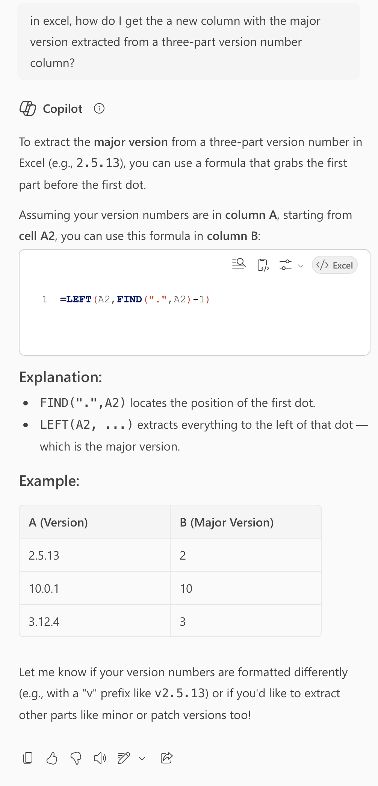
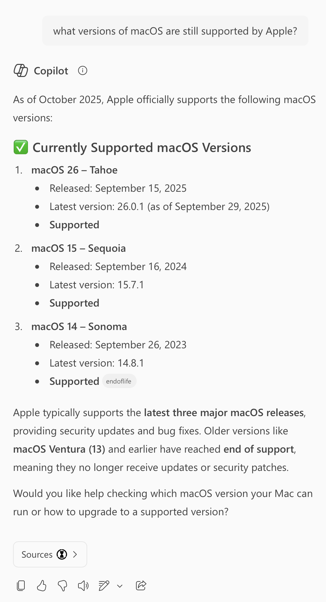
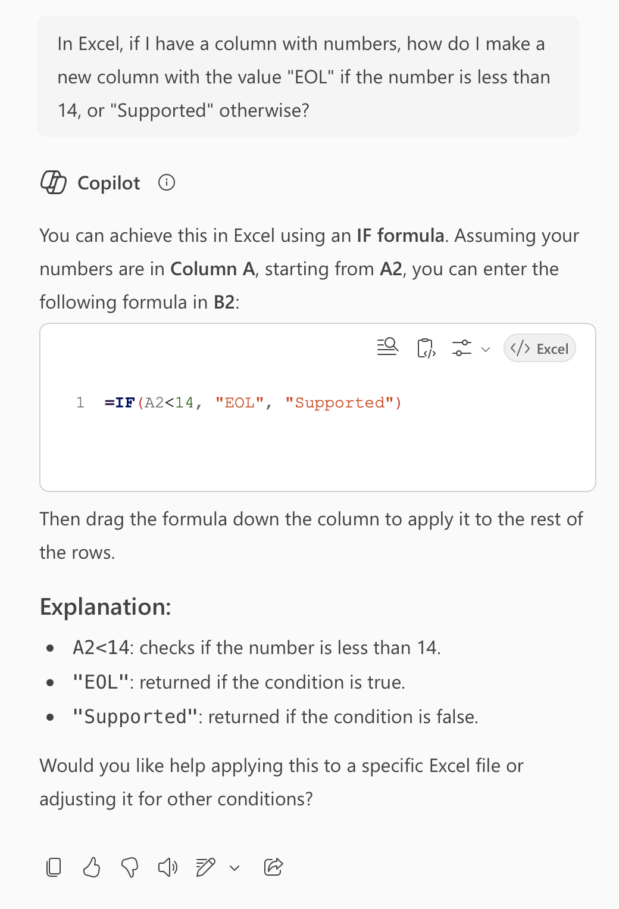
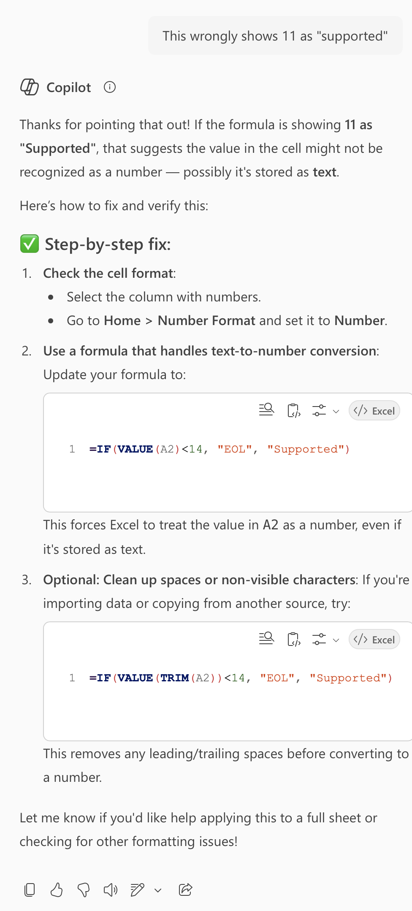
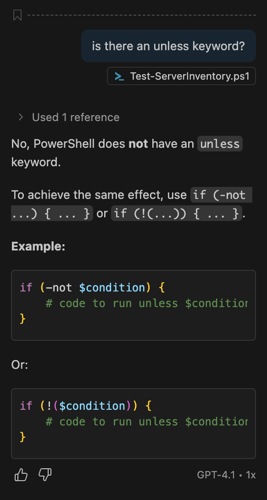
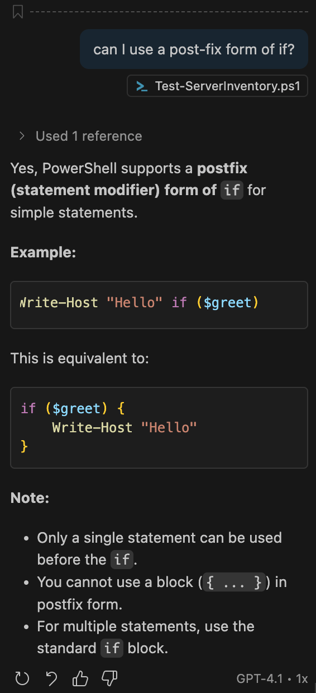

In a recent instalment of Allison's Chit Chat Across the Pond podcast we discussed my experiences with AI in general, and promised deeper dives into coding with AI and working on the terminal with AI. This the first of those promised deeper dives (the second will appear as an instalment of Taming the Terminal some time soon).

## Matching Podcast Episodes

<audio controls src="https://media.blubrry.com/nosillacast/traffic.libsyn.com/nosillacast/PBS_2025_07_19.mp3?autoplay=0&loop=0&controls=1">Your browser does not support HTML 5 audio 🙁</audio>

TO DO

## Instalment Resources

- TO DO (or more likely, delete!

## Some Context

My AI Journey began in work where I agreed with my manager that I would be make time in 2025 to experiment with AI so I'd have the needed first-hand experience to have meaningful discussions around the topic in my role as a cybersecurity specialist. Because of this work setting I couldn't just do what ever I wanted, I needed to comply with all our policies, most importantly our data protection policies. With my programming hat on that meant confining myself to the enterprise versions of Microsoft's Copilot suite, specifically the general-purpose Microsoft 365 chat bot in my Edge sidebar, and GitHub Copilot in VS Code.

It's almost been a year now, and I've really come to enjoy having these two Copilots help me with my various bits of coding work. This year that's meant getting some assistance while working with:

1. Some Excel formulas
2. Some JSON processing with `jq`
3. A little shell scripting with Bash
4. A lot of data processing and dashboard creation in Azure Log Analytics Workspaces with KQL
5. A lot of PowerShell scripting
6. And even more Linux automation with Ansible which involves:
   1. Lots of YAML files defining custom Ansible components like roles and playbooks
   2. INI files defining inventories
   3. Jinja2 template strings all over the place

If that sounds like a lot of different technologies, and a lot of confusing context switching, you'd be absolute right!

Earlier in my career as a dogs-body sysadmin I generally got to immerse myself deeply in just one or two languages, initially Bash and Perl, then later NodeJS JavaScript, which meant almost everything I needed was generally fresh in my mind and I could work away with little need to reference documentation. But in my current role I need to jump from tool to tools multiple times a week, or even, a day. That kind of context switching gets really confusing really fast. I still have lots of knowledge and experience buried deep in my brain, but I need some help triggering the right memory at the right time, and having the appropriate CoPilot sitting right there in my sidebar has proven invaluable!

I really like Microsoft's naming choice here, because there is simply no way these AIs are even close to replacing skilled humans working on real-world mission-critical code, but they are capable of providing valuable assistance to help those skilled humans be more effective. Think of them as force multiplies, not replacements.

## Big-Picture Advice

Large Language Models, or LLMs, are very much their own unique and special indescribable thing. But, when coding, I suggest you keep two abstractions in mind — think of the them as averaging and word association machines.

### LLMs are Averaging Machines

Our various bots have been trained on millions of lines of other people's code, and will produce code that's about as good as the average line of code out there. Sometimes *average* is more than you need, but sometimes it really isn't! 

When you're doing something quick and dirty it's probably just fine. If the code the bot spits out does the one thing you need to do in the moment, great! Job done,  move on with your day.

But when you're working on a production code base that's going to be deployed to the real world dealing with real data for years to come, average is not nearly good enough! In that kind of situation, you need to treat everything the LLM produces as a starting point to build from. 

You need to check the real meaning of every argument, parameter, flag, etc., to be sure it does what you think it does. You should also assume it's going to miss a bunch of edge cases, so you probably need to add some additional checks around the suggested code. And, you should assume it won't fail gracefully when it meets the real word, and add all missing error handling.

### LLMS are Word Association Machines

When you're working near the edges of your understanding, search engines can be infuriating to use because when you as value generic questions you get utterly useless results.

LLMs on the other hand can leverage their abilities to associate those same vague generic works with at least some relevant information, allowing them to give you at least somewhat helpful responses.

But, that does not mean that using the correct jargon is not important. On the contrary, the more accurately you use the appropriate jargon, the higher the quality of the information these robots will associate with it, and the more helpful and correct their replies will be.

When you don't know the right words to use, take cues from the helpful parts of the early answers in the conversation, as for clarifications between similar-sounding words, and fine-tone your responses to adopt ever more of the correct jargon.

### Conversations, not Questions

Speaking of conversations, LLMs are not search engines, they're chat bots! Unlike 2025 Siri, they **do remember** what you just said! Yes, they're excellent alternatives for search engines when you're trying to get conceptual answers rather than find specific resources, but they're not drop-in replacements. Don't treat the chat box like a search box — treat to your initial question as a conversations starter, and don't host accent there first response as the real answer. Ask follow-up questions — if the response is clearly off base, reply explaining **why** this is not what you need. If you don't understand some or all of the answer, ask for clarifications. If you're not sure if some suggested code will handle some specific edge case, ask!

Another useful thing to do is to ask for links to relevant parts of official documentation. If the conversation has led you to believe a specific library, or class, or function is the best fit, ask for a link to the docs so you can really understand what the library, class, or function actually does.

### Favour Chatbots that Show Their Sources

If you have the choice between two LLMs, one that doesn't show you links to the sources it used to construction it's reply, and ones that does, use the one that does! Firstly, the actual referenced website is a great initial indicator for the response's quality — if you're asking about PowerShell and the the sources are at `learn.microsoft.com`, there's a good chance they're accurate, but if they're simply based on `reddit.com` posts, increase your skepticism! But more than that, when the answer to your question is mission-critical, take the time to open the linked sources and verify the function calls, argument names, or what ever for yourself.

### Context is King

Now that you're thinking in terms of conversations and the tools having a memory, let's loop back to that first abstraction — the fact that LLMs act as averaging machines. The context you give the LLMs biases what it is they average against.

In the context of a chat interface that means code snippets, technologies, libraries, classes, functions, and what not mentioned earlier will be weighted more highly in the averages that appear as responses.

But LLMs don't just chat, they can also offer short little code completions and even suggest entire sections of code as you type. These suggestions are also influenced by context, but that context is coming from the tool they're integrated into.

When you use an AI-enabled development environment (IDE), the context of the code around the code your working on — your current file, all your open tabs, and in many tools, all the code in the currently open project. This means that if you have a consistent coding style, the suggestions will start to *sound* ever more like your own code. The bigger the project you're working on, the better the suggestions get! So, don't experiment with toy projects, experiment with those ancient codebases that go back decades that no one person full understands, that's where the tools can give the absolute most value!

### The Advantages an IDE Integration Brings

As I've just hinted, one of the biggest advantages integrations bring is automatic context — you don't have to tell the AI which tools you're using, because the AI sees your code already!

Not only can you save yourself some prompting, you can also refer directly to specific parts of your code more easily. You could ask *'why does line 42 give a divide by zero error?'*, but you don't even have to be that explicit, you can simply select the line or lines your question relates to and refer to it as simply *'this'*!

In terms of chatting then you get free context and quick and easy references to specific chunks of code, but what about the replies, can you do more with those too? Of course you can! When the bot returns suggested code you get buttons to copy the code, insert the code at your cursor, or, if the suggestion is a change, and option to automatically apply the change to your file or files! That last option sounds really scary, but VS Code's GitHub Copilot integration does it in a very explicit and safe way, it shows you what it will remove in red, what it will add in green, and gives you accept and reject buttons for each proposed change.

But you get value from an AI-enabled IDE without even enabling a chat box thanks to dramatically more powerful code completions, rather than just offering completions for the word you\'re currently typing, the AI will offer entire sections of code, including comments! Even when the suggestions are not perfect, it's often much less work to tweak a few details than it is to have to type it all out from scratch!

## An Important Warning — NEVER INCLUDE SECRETS IN YOUR CODE

It\'s always been bad practice to embed secrets into code. That goes double for code committed to remote repositories, and triple for code shared with an AI as context. If you're going to use AI coding tools, n**ever ever ever include secrets of any kind** (passwords, private keys, API keys, authentication tokens, etc.) **in your code!**

Different languages and environments have different best practices for secret management, so the real advice is to read the relevant documentation for the technologies you're using! But having said that, I will offer one piece of generic advice — most languages support environment variables, so they are often the right answer. In general, **I pass my secrets to my scripts and apps using environment variables**.

## Some Anecdotes from AI Programming Adventures

These are not some kind of definitive list of best examples, but rather some anecdotes that caught my eye at a point in time when I had the time, energy, and presence of thought to grab them. These anecdotes don't prove anything, but they do add colour to my thoughts above.

### Example 1 — Coding Help From a Regular Chat-Bot

As a first example, here's a recent positive experience I had using just the regular Microsoft 365 Copilot Edge sidebar to get some useful coding help.

To set the scene — I had a CSV export from a reporting tool that listed a while bunch of rows with macOS version numbers as major, minor, and patch numbers separated by dots, e.g. 15.6.1, and I needed to build some new columns to start aggregating the results into more useful buckets. First, I needed the major version as a column. I know Excel can split strings, but I couldn't remember the syntax, so I asked Copilot to help me with the formula. Since I was using a generic chatbot, I was careful to give all the needed context in my question — *"in excel, how do I get the a new column with the major version extracted from a three-part version number column?"*:



My data was in a different row, so I needed to change the coordinates in the formula, but the suggested formula worked perfectly, I now had my new column with major version number. That gave me a better feel for my data, but then I realised my real question was not what the major version number was, but whether the version in question was supported. At this stage I've utterly lost touch with what versions Apple does or does not support, so I started a new chat and asked *"what versions of macOS are still supported by Apple?"*:



OK, so major versions older than 14 are obsolete. My final step was to build a second new column marking each row as absolute or supported, so I started one more chat with the clear question *"In Excel, if I have a column with numbers, how do I make a new column with the value "EOL" if the number is less than 14, or "Supported" otherwise?"*:



The suggested formulate looked plausible to me, so I pasted it in and found that all versions of macOS were showing as *Supported*, even macOS 11 ... hmmm ... that's not right! So, I continued the same conversation with a nice clear followup — *"This wrongly shows 11 as "supported""*:



OK, so the first suggestion was so simple I'd actually already tried it before asking my followup question. I decided to skip right to the most robust possible third option (`=IF(VALUE(TRIM(A2))<14, "EOL", "Supported")`) and it worked perfectly! I could not conditionally format my spreadsheet to show obsolete OSes in a scary red colour, and supported OSes in a reassuring green colour 🙂

### Example 2 — Copilot Hallucinates, and may not be Best for Generic Programming Questions

Let's start by throwing some cold water on the AI hype and scare-mongering about replacing actual programmers with a prompt. Maybe some day, but not today or tomorrow!

To set the scene, I needed to go back and add a new feature to an existing PowerShell script. Specifically, to add support for  a `-Quiet` flag to suppress all output that's not an error or a warning. That meant implementing the human logic *'unless in quiet mode, print  …'* repeatedly. I like to write my code in the most English-life way the syntax allows, and I know some language have an `unless` keyword that acts like *'if not'*. When it's available, I really like to use it, but I couldn't remember of PowerShell was or wasn't one of the languages that supports this keyword.

Because this script is versioned in Git I was working in VS Code, so I the obvious place to ask my question was the GitHub Copilot sidebar. Because of the free context, I didn't need to tell GitHub that I was asking it a PowerShell query, so I could simply ask *"is there an unless keyword?"*.

Copilot broke that bad news that there is no such feature in PowerShell, but did helpfully show me how to combine `if` and `-not` to achieve the same results.



Fine, but I don't want to have three lines of code for each print statement, or, to have the text being printed so far off to the right bits of it would be hidden till I scrolled, so I had a followup question. Another feature some language support is a post-fix form of the `if` statement. That is, a special variant of `if` when you want to control the execution of just a single statement rather than a code block, and where the statement comes before the condition. This can make some statements read in a more English way, so I used it a lot when I was working in Perl, for example:

```perl
print "some mesasge" if ! $QuietModeEnabled;
```

So I continued my conversation with a simple followup — *"can I use a post-fix form of if?"*.

Copilot confidently told me I could, and gave me an example code snipped that looks just like what I was hoping would work, yay!



So I updated my script, and then tested my new `-Quiet` flag, and not only did it still print all the output I was trying to suppress, it also printed `if True` after ever line of output. Huh?

Turns out Copilot hallucinated the entire feature! What the code samples, and hence my updated code, actually do is pass three arguments to PowerShell's `Write-Host` command — the string I was trying to conditionally print, the string `'if'`, and the Boolean result of evaluating the condition, which should indeed be `True` when the`-Quiet` flag is set!

Out of curiosity I asked my favourite privacy-protecting stand-alone chatbot [Lumo](https://lumo.proton.me/) if PowerShell supported a post-fix form of `if`, and it quite correctly told that it does not, and suggested I just use the regular pre-fix form, which is what I ended up doing!

### Example 2 — A Bit of Everything

TO DO

## Final Thoughts

TO DO
