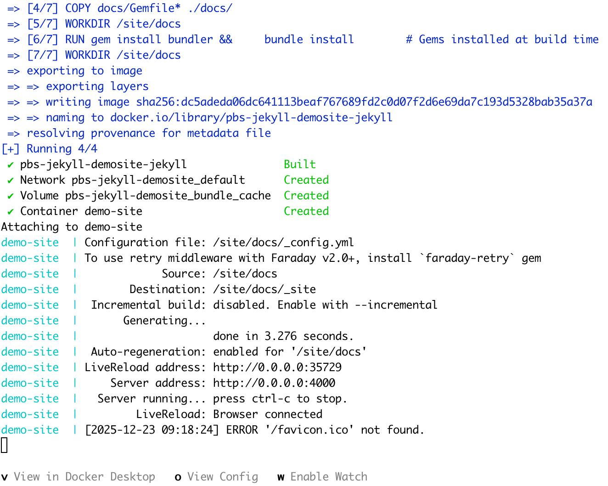

Now that we have the concepts clear, we can work on an actual example. The ultimate goal is to add a Docker-based build system to the PBS project, but let's start with a smaller task, which is replacing the virtual environment in the demo Jekyll site of episodes 177 through 181 with a Docker-based system.

macOS doesn't natively support Linux containers, so Docker needs a helper VM under the hood. The official tool is Docker Desktop, which is available at [docs.docker.com/get-started/get-docker/](https://docs.docker.com/get-started/get-docker/). So let's install it.

Once installed, start Docker Desktop, because it needs to run to be able to run the containers. You don't need to set up an account and sign in. The extra features you get from signing in are not necessary if you just keep your Docker images locally.

You might even never need to look at the GUI, but sometimes it comes in handy.

The other tool we are going to need is `make`. This tool is a golden oldie. It was created in 1976 out of frustration, according to Wikipedia. It has become the default build automation tool so long ago that it's part of your default macOS installation. To check it, open a terminal window and type

```shell
make
```

we will get an output like

```shell
make: *** No targets specified and no makefile found.  Stop.
```

To bring the pieces together, we will use Docker to create a self-contained environment for the local test of the website and we will use `make` to execute the scripts necessary to work with the Docker environment.

## Docker Setup

### Dockerfile

As explained before, a Docker container is an instance of a Docker image, so the first thing to do is to build the image. The image is configured using a `Dockerfile`.  To come back to our food prep analogy, the Dockerfile is the recipe to create an image.

Create a file named `Dockerfile` (it's case sensitive) in the project root with the following content

```Dockerfile
# 1. Base this image on the official Docker image for Ruby
FROM ruby:3.3

# 2. Install Node.js (needed for some Jekyll plugins)
RUN curl -fsSL https://deb.nodesource.com/setup_20.x | bash - && \
    apt-get install -y nodejs && \
    rm -rf /var/lib/apt/lists/*

# 3. Set working directory to project root
WORKDIR /site

# 4. Copy Gemfile from docs directory
COPY docs/Gemfile* ./docs/

# 5. Install bundler and dependencies
WORKDIR /site/docs
RUN gem install bundler && \
    bundle install        # Gems installed at build time

# 6. Expose Jekyll's default port
EXPOSE 4000

# 7. Default command
CMD ["bundle", "exec", "jekyll", "serve", "--host", "0.0.0.0", "--livereload", "--force_polling"]
```

In the previous part we briefly mentioned Docker layers. Here we see the layers in action. Basically every line that starts with a command in capitals is a layer. Docker tries to cache the layers so changing and rebuilding an image will be quick.

From top to bottom:

1. Take a Docker image called `ruby` and install version `3.3`. This is an officially maintained image that is based on a Debian distro with all the necessary tools, libraries and packages for working with Ruby projects already installed. As explained before, this image can be found in Docker Hub.
2. Run `curl` and `apt-get` to install node.js
3. Switch to the project root
4. Copy the Gemfile from the `docs` directory to a `docs` directory inside the image. We do not have any volume binding yet, so we need to make a basic setup inside the image.
5. Switch to the `/site/docs` directory and install bundler and all the gems required for our Jekyll site.
6. Expose the default port of `jekyll serve` to the outside
7. Define the default command. This means when the image is built and the container is up and running this command is executed already.

More information on the Dockerfile syntax can be found in the [docs](https://docs.docker.com/build/concepts/dockerfile/#dockerfile-syntax)

> **NOTE**
> This image assumes there is a docs directory in the current directory that contains a Gemfile.

Now that the image is defined, we can go on to define the specifics for the container. This is done with a `docker-compose.yml` file.

### Docker Compose

If you study the Dockerfile closely you notice that there is no concept of mounting your files in the container. That is left to the container definition which can be done using a `docker-compose.yml` file. While a `Dockerfile` is defining a single image, a `docker-compose.yml` file can actually use multiple images to combine them into a development stack. An example of such a stack would be a WordPress environment that consists of two containers, one for the webserver and all the PHP files that make the WordPress site go and one for the database that holds all the website content.

We are not going to dive deep into the syntax of `docker-compose.yml`, but we are only going to touch on the elements that are relevant for this example. More information on the complete syntax can be found in the [Compose file reference](https://docs.docker.com/reference/compose-file/) documentation.

Create a file called `docker-compose.yml` in the root directory of your project. In this case we are using the `pbs-jekyll-demoSite` project.

```shell
pbs-jekyll-demoSite
├── docker-compose.yml
├── Dockerfile
├── docs
│   ├── _config.yml
...
│   ├── Gemfile
│   ├── Gemfile.lock
└── README.md
```

Add the following content to the `docker-compose.yml` file.

```yaml
services:
  jekyll:
    build: . # Build from current project directory    
    container_name: demo-site
    ports:
      - "4000:4000"
      - "35729:35729"  # LiveReload port
    volumes:
      - .:/site
    working_dir: /site/docs
    command: bundle exec jekyll serve --host 0.0.0.0 --livereload --force_polling --drafts
    stdin_open: true
    tty: true
```

In `docker-compose.yml`, a container is called a service. In this config, we have one service called `jekyll`.  In a multi-container setup like the WordPress example, there would be a second service defining the database, usually called `db`, but any name will do.

The `build` element indicates the directory to be used for the build. This is where the Dockerfile can be found and all the files required for the image.

The `container_name` defines the name of this container. If this element is absent, a name is generated.

The `ports` element maps ports outside of the container to ports inside the container. The syntax is HOST:CONTAINER, so the first number defines the port on your computer and the second the port inside the container. In the first line port 4000 on your computer is mapped to port 4000 inside the container. This means that the jekyll site inside the container can be found on [http://localhost:4000](http://localhost:4000) in your browser. Just to make this syntax absolutely clear: if we would like to find the site on port 80 in our browser, the port mapping would be "80:4000".

The second port mapping is for Jekyll's LiveReload port so your browser will automatically refresh the site when any changes are noticed and processed.

The `volumes` element defines the mapping of the volumes.
The actual project files, aka your current project directory, are mapped to the `/site` directory inside the container. So the `./docs` directory will be at `/site/docs` inside the container.

Remember that we copied the Gemfile from the docs directory into image in the Dockerfile? That was necessary because this volume binding was not available yet. With the volume binding definition in the `docker-compose.yml` the `/site/docs` directory is replaced by the actual `docs` directory from the project directory.

The `working_dir` element defines the directory to use as current directory. Note that this is the absolute path inside the container.

The `command` element defines the command to execute the first time the container is started. Note that the Dockerfile has the same command, but any command in this element will override the one in the Dockerfile. In this case, this one has an extra argument, `--drafts`.

The `stdin_open` and `tty` elements are set to true. This means it's possible to send input to the container through the standard input and attach a pseudo-TTY to the container and therefore get access to the input and output features. This makes it possible to enter the container or tell the container to execute a command and provide the output.

## Starting the Container

Now that we have all the configuration files in place, it's finally time to start the container. We are using a `docker-compose.yml` file, so the command will be

```shell
docker compose up
```

Docker will first check if it already has an up-to-date image that matches the Dockerfile. If not, it will pull in all the necessary files and create the image. After that, the instructions in the `docker-compose` file will be executed and the container will mount the project files and run `bundle exec jekyll serve` with the appropriate flags. Once this is done your terminal window looks something like this



If we now go over to our favourite browser and go to `http://localhost:4000` we are greeted with the front page of the site.

To stop the jekyll server we can follow instructions on screen and press CTRL-C. This will also stop the container.

Restart the container with `docker compose up -d` to start the container in a detached mode. Stopping the container in this case can be done with the command `docker compose down`.

## Makefile

The commands to start and stop the container are relatively straightforward but they are more commands to remember and since Docker is designed to run from the command line it has a laundry list of flags that are necessary or handy to be used.

To make this easier on ourselves and to make it more consistent, we can start using the `make` command. This command allows us to basically create our own vocabulary to work with our project and the container.

### Makefile Syntax

We won't cover the full Makefile syntax in depth because there is an excellent tutorial available at [Learn Makefiles,](https://makefiletutorial.com/) and since the tool has existed for so long, there is plenty of documentation out there. Here, we will only look at the elements needed to create our own Makefile.

The short version to use the `make` tool: if the Makefile defines a build target called `install` it can be executed using `make install` in the same directory where the Makefile is.

Let's look at how such a build target is defined by creating a target for our 'start container' command.

In the project root, create a file called 'Makefile' with the following content:

```make
up: ## Start the Jekyll server in the background
	@docker-compose up -d
```

This creates the build target 'up'. Make calls a build target a _rule_.

Every line below this line will be executed as part of this rule. Note that all these lines should be indented with a TAB character, no spaces. Failing to comply means `make` will either complain, or the command will not be executed properly.

A line that starts with a '@' character tells `make` to stop echoing the command to the terminal.

We can now start our container with the command

```shell
make up
```

Adding a rule for stopping the container will be easy. Add the following below the `up` target.

```make
down: ## Stop the Jekyll server
	@docker-compose down
```

`make` has a concept of dependencies, which means that before a rule is executed, the rules it depends on are executed first. This makes it trivial to define a 'restart' rule.

```make
restart: down up ## Restart the Jekyll server
```

`make` was created for building software so it can check if files need to be recompiled. Therefore, the 'name' or target of a rule can be a filename. For example, a rule like this

```make
*.c: 
    @echo run this rule when any file with an extension of .c has changed.
```

will only be executed if there are one or more files in the current directory with an extension of `.c`  AND at least one of them is modified since the last time `make` was run.

Make basically assumes that all the targets in a rule (in our case 'up', 'down' and 'restart') are files. So if we happen to create a file with one of these names, the rule will not be executed any more.

To prevent this from happening we need to tell `make` that these are not actual files. For this we can use the keyword `.PHONY`.  By adding the following line at the top of our Makefile, we can tell `make` to ignore the search for files that have names that match our rule targets.

```make
.PHONY: up down restart 
```

Now we can go on and add more rules, e.g. for entering the container, for rebuilding the container when the Gemfile has changed and a lot of other handy snippets.

If we need to remember all these rules, what did we gain by introducing `make`?

To prevent losing our minds we can add another rule called `help` and make it our default rule. Put the following text above the first rule, below the `.PHONY` line. `make` considers the first rule in the Makefile to be the default rule, but we can add a `.DEFAULT_GOAL` keyword just to be sure.

```make
# Default target
.DEFAULT_GOAL := help

help: ## Show this help message
	@echo "Jekyll Docker Development Commands"
	@echo ""
	@grep -E '^[a-zA-Z_-]+:.*?## .*$$' $(MAKEFILE_LIST) | sort | awk 'BEGIN {FS = ":.*?## "}; {printf "  %-20s %s\n", $$1, $$2}'
```

So now, if we run `make help` or simply `make`, we will get a list of all available rules with their description. Note that the description is the text after the double hashes. This gives us an easy way to maintain documentation of the rules without having to constantly remember to update the help rule.
Note that the `grep` line uses the built-in variable MAKEFILE_LIST to get all rules in the Makefile.

With this knowledge we can spruce up our Makefile with colours by adding colour variables at the top of our Makefile.

```make
# Colors for output
GREEN  := \033[0;32m
YELLOW := \033[0;33m
NC     := \033[0m # No Color

# Default target
.DEFAULT_GOAL := help

help: ## Show this help message
	@echo "$(GREEN)Jekyll Docker Development Commands$(NC)"
	@echo ""
	@grep -E '^[a-zA-Z_-]+:.*?## .*$$' $(MAKEFILE_LIST) | sort | awk 'BEGIN {FS = ":.*?## "}; {printf "  $(YELLOW)%-20s$(NC) %s\n", $$1, $$2}'
```

When we run the `make` command now, the first line will be green and the rule targets will be yellow.

Let's add more rules, so the complete Makefile looks like this

```make
.PHONY: build up down restart shell clean install bundle-update serve serve-drafts logs help

# Colors for output
GREEN  := \033[0;32m
YELLOW := \033[0;33m
NC     := \033[0m # No Color

# Default target
.DEFAULT_GOAL := help

help: ## Show this help message
	@echo "$(GREEN)Jekyll Docker Development Commands$(NC)"
	@echo ""
	@grep -E '^[a-zA-Z_-]+:.*?## .*$$' $(MAKEFILE_LIST) | sort | awk 'BEGIN {FS = ":.*?## "}; {printf "  $(YELLOW)%-20s$(NC) %s\n", $$1, $$2}'

up: ## Start the Jekyll server in the background
	@docker-compose up -d
	@echo "$(GREEN)Jekyll server starting at http://localhost:4000$(NC)"
	@echo "$(GREEN)LiveReload available at http://localhost:35729$(NC)"

down: ## Stop the Jekyll server
	@docker-compose down

restart: down up ## Restart the Jekyll server

build: ## Build the Docker image
	@docker-compose build

serve: ## Start Jekyll in foreground with logs (no drafts)
	@docker-compose run --rm --service-ports jekyll bundle exec jekyll serve --host 0.0.0.0 --livereload --force_polling

serve-drafts: ## Start Jekyll in foreground with logs (include drafts)
	@docker-compose run --rm --service-ports jekyll bundle exec jekyll serve --host 0.0.0.0 --livereload --force_polling --drafts

shell: ## Open a bash shell in the Jekyll container
	@docker-compose run --rm jekyll bash

install: ## Install dependencies (after adding to Gemfile)
	@docker-compose run --rm jekyll bundle install
	@echo "$(GREEN)Dependencies installed. Run 'make restart' to apply changes.$(NC)"

bundle-update: ## Update all gems
	@docker-compose run --rm jekyll bundle update
	@echo "$(GREEN)Gems updated. Run 'make restart' to apply changes.$(NC)"

clean: ## Remove all containers, volumes, and generated site
	@docker-compose down -v
	@rm -rf docs/_site docs/.jekyll-cache docs/.jekyll-metadata
	@echo "$(GREEN)Cleaned up Docker containers, volumes, and Jekyll cache$(NC)"

logs: ## Show Jekyll server logs
	@docker-compose logs -f jekyll
```

Now it's possible to build the Docker image with `make build`, drop into the container with `make shell` and clean everything up with `make clean`.

## Reusing the Docker image

Now that we have our Jekyll development environment, we should be able to reuse it in the PBS project. After all, that is also a Jekyll site.

The simplest way is to simply copy the three files we created `Dockerfile`, `docker-compose.yml,` and `Makefile` to the root of the PBS project, and we're done. Especially since the `pbs-jekyll-demoSite` is just a temporary project and can be thrown away. But what if it's another important project we want to keep and develop further?

Although there is still nothing wrong with copying the files and reusing them in the PBS project, there are some caveats. First of all, you cannot run the containers side-by-side because they use the same container name and the same ports. Sure, that's easily fixed, but there are more subtle problems. Remember that the Dockerfile copied the Gemfile into the image and ran `bundle install`. This means that all gems inside the image are those defined by the Gemfile of the project we used when we built the image, aka the demoSite project. It's more than likely that the PBS site uses a lot more gems.

Now we can, of course, update the image with the gems necessary for the PBS site and rebuild the container for the demoSite based on the updated image, but that still means they share the gems in the library, or, going back to our analogy, two food trucks that share the available set of knives. That is not complete isolation, and of course, it also does not replicate the production environment because in production, both projects _are_ isolated and only have their own dependencies.

So we need to update the image to take out the command to install the gems in the image and move that to the container. That way each container has only its own set of requirements. Added bonus is that now, whenever the Gemfile changes, we no longer have to rebuild the image. We just need to rebuild the container, which is a lot faster.

For starters, we have to figure out how to make sure the `bundle install` is run before the `bundle exec jekyll serve` command is run, or we get errors about Jekyll not being available.

The easy solution is to remove the `jekyll serve` command from the container as well and run it manually from the Makefile. This works and will considerably simplify both the Dockerfile and the Docker Compose file, but it will put the mental load on us to remember that when the container is started, we need to run the bundle install and the jekyll serve commands.

Let's make this easier for ourselves by having Docker handling this. First, we add an entrypoint to the Dockerfile. An entrypoint is a way to configure a container to run as an executable. So if we tell the entrypoint to run a script, the script will automatically run on the start of the container.

The script to be run can be added to the Dockerfile as well, so we don't have to manage a separate script.

The Dockerfile now becomes

```Dockerfile
# Base this image on the official Docker image for Ruby
FROM ruby:3.3

# Install Node.js (needed for some Jekyll plugins)
RUN curl -fsSL https://deb.nodesource.com/setup_20.x | bash - && \
    apt-get install -y nodejs && \
    rm -rf /var/lib/apt/lists/*

# Install bundler
RUN gem install bundler

# Set working directory to project root
WORKDIR /site

# Smart entrypoint
COPY <<'EOF' /usr/local/bin/docker-entrypoint.sh
#!/bin/bash
set -e

# Only install/update if needed
if [ -f "Gemfile" ]; then
  if ! bundle check > /dev/null 2>&1; then
    echo "📦 Installing gems..."
    bundle install
  fi
fi

# Execute the main command
exec "$@"
EOF

# make the script executable
RUN chmod +x /usr/local/bin/docker-entrypoint.sh

# Expose Jekyll's default port
EXPOSE 4000

# Set the entrypoint to the script
ENTRYPOINT ["/usr/local/bin/docker-entrypoint.sh"]

# Default command
CMD ["bundle", "exec", "jekyll", "serve", "--host", "0.0.0.0", "--livereload", "--force_polling"]

```

We now took the command to run `bundle install` out of the Dockerfile and replaced it with a COPY command that copies the content of the here-document into a script that is stored in the image.
This script checks if the Gemfile exists, and if so, it runs `bundle install`. In turn, bundle will check if anything needs to be actually installed.

The `docker-compose.yml` file will now take care of the correct Gemfile that is used to install the gems. This file will also contain project specific information such as the name of the container and the local port sprinkled throughout the file.

Everybody knows the copy & paste bug: you copy a file and forget to change one or more of the variables. Let's try to avoid that by introducing variables for those project specific bits and pieces. This also makes our `docker-compose.yml` file more generic. The compose file supports environment variables so we can use the method of defining an `.env` file that define the variables for the project specific information and have a generic compose file that can pick up the variables and create a project specific container.

### Moving to Generic Files With a Reusable Image

Replace the content of the `docker-compose.yml` file with

```yaml
services:
  jekyll:
    image: ${BASE_IMAGE:-jekyll-base:latest}
    container_name: ${CONTAINER_NAME:-jekyll-site}
    ports:
      - "${JEKYLL_PORT:-4000}:4000"
      - "${LIVERELOAD_PORT:-35729}:35729"
    volumes:
      - .:/site
      - gems:/usr/local/bundle  # Simple name, Docker prefixes it automatically
    working_dir: /site/docs
    environment:
      - JEKYLL_ENV=${JEKYLL_ENV:-development}
    stdin_open: true
    tty: true

volumes:
  gems:  # Docker Compose creates it as {COMPOSE_PROJECT_NAME}_gems
```

And we need to add a `.env` file with the variables set to a value that works for this project. Let's move the original info to the `.env` file

```bash
# ============================================
# Project Configuration
# ============================================
# Unique identifier for this project
COMPOSE_PROJECT_NAME=demo_site

# Container name (must be unique across all running containers)
CONTAINER_NAME=demo-site

# ============================================
# Port Configuration
# ============================================
# Port for Jekyll site (4000 is default, use 4001+ for additional projects)
JEKYLL_PORT=4000

# Port for LiveReload (35729 is default, use 35730+ for additional projects)
LIVERELOAD_PORT=35729

# ============================================
# Image Configuration
# ============================================
# Base Docker image to use
BASE_IMAGE=jekyll-base:latest

# Path to base Dockerfile
# Default: ~/docker-images/jekyll-github-pages/Dockerfile
# Change this if your Dockerfile is in a different location
DOCKERFILE_PATH=./Dockerfile

# ============================================
# Jekyll Configuration
# ============================================
# Jekyll environment (development, production)
JEKYLL_ENV=development
```

### The Updated Makefile

```make
.PHONY: help rebuild-base ensure-base up down restart logs shell install update-gems clean clean-all status serve serve-drafts

# Load environment variables from .env
include .env
export

# Default Dockerfile location if not set in .env
DOCKERFILE_PATH ?= ~/docker-images/jekyll-github-pages/Dockerfile

# Extract directory from Dockerfile path
DOCKERFILE_DIR := $(dir $(DOCKERFILE_PATH))

# Colors
GREEN  := \033[0;32m
YELLOW := \033[0;33m
BLUE   := \033[0;34m
RED    := \033[0;31m
NC     := \033[0m

help: ## Show this help message
	@echo "$(GREEN)Jekyll Docker Commands for $(COMPOSE_PROJECT_NAME)$(NC)"
	@echo ""
	@echo "$(BLUE)Configuration (from .env):$(NC)"
	@echo "  Project:     $(COMPOSE_PROJECT_NAME)"
	@echo "  Container:   $(CONTAINER_NAME)"
	@echo "  Dockerfile:  $(DOCKERFILE_PATH)"
	@echo "  Jekyll URL:  http://localhost:$(JEKYLL_PORT)"
	@echo "  LiveReload:  http://localhost:$(LIVERELOAD_PORT)"
	@echo ""
	@echo "Available commands:"
	@grep -hE '^[a-zA-Z_-]+:.*?## .*$$' $(MAKEFILE_LIST) | \
		sort | \
		awk 'BEGIN {FS = ":"}; {split($$2,a,"## "); printf "  $(YELLOW)%-20s$(NC) %s\n", $$1, a[2]}'

rebuild-base: ## Rebuild base image from Dockerfile
	@echo "$(YELLOW)Rebuilding base image from $(DOCKERFILE_PATH)...$(NC)"
	@if [ -f "$(DOCKERFILE_PATH)" ]; then \
		if [ "$(VERBOSE)" = "1" ]; then \
			cd $(DOCKERFILE_DIR) && docker build -f $(DOCKERFILE_PATH) -t $(BASE_IMAGE) .; \
		else \
			cd $(DOCKERFILE_DIR) && docker build -f $(DOCKERFILE_PATH) -t $(BASE_IMAGE) . > /dev/null 2>&1 || \
			(echo "$(YELLOW)Build failed, showing output:$(NC)" && \
			 cd $(DOCKERFILE_DIR) && docker build -f $(DOCKERFILE_PATH) -t $(BASE_IMAGE) .); \
		fi; \
		echo "$(GREEN)✓ Base image rebuilt: $(BASE_IMAGE)$(NC)"; \
	else \
		echo "$(RED)Error: Dockerfile not found at $(DOCKERFILE_PATH)$(NC)"; \
		exit 1; \
	fi

ensure-base: ## Ensure base image exists (builds if missing)
	@if [ -z "$$(docker images -q $(BASE_IMAGE) 2>/dev/null)" ]; then \
		echo "$(YELLOW)Base image $(BASE_IMAGE) not found. Building...$(NC)"; \
		$(MAKE) rebuild-base; \
	fi

up: ensure-base ## Start Jekyll server
	@echo "$(GREEN)Starting Jekyll server for $(COMPOSE_PROJECT_NAME)...$(NC)"
	@docker-compose up -d
	@echo "$(GREEN)✓ Server started at http://localhost:$(JEKYLL_PORT)$(NC)"
	@echo "$(BLUE)Tip: Use 'make logs' to see output$(NC)"

down: ## Stop Jekyll server
	@echo "$(YELLOW)Stopping Jekyll server...$(NC)"
	@docker-compose down
	@echo "$(GREEN)✓ Server stopped$(NC)"

restart: down up ## Restart Jekyll server

serve: ensure-base ## Start Jekyll in foreground (with logs)
	@echo "$(GREEN)Starting Jekyll server in foreground...$(NC)"
	@echo "$(BLUE)Press Ctrl+C to stop$(NC)"
	@docker-compose up

serve-drafts: ensure-base ## Start Jekyll in foreground with drafts included
	@echo "$(GREEN)Starting Jekyll server with drafts in foreground...$(NC)"
	@echo "$(BLUE)Press Ctrl+C to stop$(NC)"
	@docker-compose run --rm --service-ports jekyll bundle exec jekyll serve --host 0.0.0.0 --livereload --force_polling --drafts

logs: ## Show Jekyll server logs (follow)
	@docker-compose logs -f jekyll

logs-tail: ## Show last 50 lines of logs
	@docker-compose logs --tail=50 jekyll

status: ## Show container status
	@echo "$(BLUE)Container Status:$(NC)"
	@docker-compose ps
	@echo ""
	@echo "$(BLUE)Volume Status:$(NC)"
	@docker volume ls | grep "$(COMPOSE_PROJECT_NAME)" || echo "No volumes found"

shell: ## Open bash shell in container
	@echo "$(BLUE)Opening shell in $(CONTAINER_NAME)...$(NC)"
	@docker-compose exec jekyll bash || docker-compose run --rm jekyll bash

install: ensure-base ## Install/update gems from Gemfile
	@echo "$(YELLOW)Installing gems for $(COMPOSE_PROJECT_NAME)...$(NC)"
	@docker-compose run --rm jekyll bundle install
	@echo "$(GREEN)✓ Gems installed$(NC)"

update-gems: ensure-base ## Update all gems to latest versions
	@echo "$(YELLOW)Updating all gems...$(NC)"
	@docker-compose run --rm jekyll bundle update
	@echo "$(GREEN)✓ Gems updated$(NC)"
	@echo "$(BLUE)Consider committing the updated Gemfile.lock$(NC)"

check-gems: ensure-base ## Check if gems are installed and up to date
	@echo "$(BLUE)Checking gem status...$(NC)"
	@docker-compose run --rm jekyll bundle check && \
		echo "$(GREEN)✓ All gems are installed and up to date$(NC)" || \
		echo "$(YELLOW)⚠ Some gems need to be installed. Run 'make install'$(NC)"

add-gem: ensure-base ## Add a gem (usage: make add-gem GEM=gem-name)
ifndef GEM
	@echo "$(RED)Error: Please specify GEM=gem-name$(NC)"
	@echo "Example: make add-gem GEM=jekyll-seo-tag"
else
	@echo "$(YELLOW)Adding gem: $(GEM)$(NC)"
	@docker-compose run --rm jekyll bundle add $(GEM)
	@echo "$(GREEN)✓ Gem added. Restart server with 'make restart'$(NC)"
endif

clean: ## Stop server and remove containers (keeps gems)
	@echo "$(YELLOW)Cleaning up containers...$(NC)"
	@docker-compose down
	@rm -rf docs/_site docs/.jekyll-cache docs/.jekyll-metadata
	@echo "$(GREEN)✓ Containers and generated files removed$(NC)"
	@echo "$(BLUE)Gems are preserved in volume$(NC)"

clean-all: ## Remove everything including gem cache
	@echo "$(RED)⚠ This will remove all gems and require reinstall!$(NC)"
	@read -p "Are you sure? [y/N] " -n 1 -r; \
	echo; \
	if [[ $$REPLY =~ ^[Yy]$$ ]]; then \
		echo "$(YELLOW)Removing containers and volumes...$(NC)"; \
		docker-compose down -v; \
		rm -rf docs/_site docs/.jekyll-cache docs/.jekyll-metadata; \
		echo "$(GREEN)✓ Everything removed$(NC)"; \
	else \
		echo "$(BLUE)Cancelled$(NC)"; \
	fi

# Default target
.DEFAULT_GOAL := help
```

### What Changed in the Compose File

Let's study the files more closely to understand the changes. As explained, several configuration elements are changed to a variable. All these variables have a default value, so the compose file still works when there is no `.env` file. The syntax to define the default values is similar to the way bash specifies defaults to variables.

The second change is the fact that the Jekyll service defines which image it uses. If the image is not present in the local Docker environment, as can be seen in the Docker Desktop dashboard, it will be searched in the Docker Hub online.

Another change is the definition of a named volume. It tells Docker to map `/usr/local/bundle` to this named volume and to manage it. This means that on spinning up the container, Docker creates storage somewhere labelled with the defined name and copies the content of `/usr/local/bundle` into it. The storage is not part of your project, aka there will not be any \<project\>/\<volume name\> directory, but Docker knows how to find it.

The previous sentence has been intentionally vague about the name of the volume, although it mentions 'gems' in the compose file. Because we have added a variable `COMPOSE_PROJECT_NAME` Docker will use that as prefix to this volume name. So in this example the volume name will become `demo_site_gems`.
This ensures that every container will get its own volume.

Using this volume allows the installed gems to persist across container restarts and even destruction. This ensures the slow process of installing the gems is only done in the initial start of the container or because the Gemfile is changed. In all other situations the container starts very quickly.

The easiest way to see and inspect the volume, or delete it, is to use the Docker Desktop Dashboard. Select 'Volumes' in the sidebar and find the `demo_site_gems`.

### What Changed in the Makefile

The Makefile has got a lot of changes, let's go through them.

#### Use of the `.env` Contents

Now that we have put the project-specific variables into a separate `.env` file, it is possible to use those variables in the Makefile. This also makes the Makefile more generic, and it allows us to add some info on the project to the help target. If you now run `make` or `make help`, you will see a nice display of the content of the `.env` file.

#### More and updated rules

The main change in the rules is the result of the fact that the compose file expects an image with a certain name to exist. This means we need to build that image before the container can actually use it. Yes, this is similar to before, but this time the compose file cannot default to the Dockerfile that is in the same directory as the compose file, because the compose file expects an image with a specific name.

We can add a rule in the Makefile to create the image with the specified name. This is the `rebuild-base` rule. And now that we use the `.env` contents, we can make sure the image name is the one expected by the compose file.

But what if we forget to build the image before we run `make up` to start the container? No problem, we just let Make handle this. We created a rule `ensure-base` that checks if the image exists, and if not, it calls the `rebuild-base` rule.

In the `up` rule, we now add a dependency on `ensure-base`. Together, this makes sure that whenever we run `make up`, `make` checks if the image exists and if not, builds it for us.

All the moving pieces are now in place so let's see if it all works by running `make up`. We expect that, just as before, we can open `http://localhost:4000` in our browser and see the front page of the demo site. If all is correct, the terminal shows

```shell
$make up
Starting Jekyll server for demo_site...
[+] Running 2/2
 ✔ Network demo_site_default  Created
 ✔ Container demo-site        Started
✓ Server started at http://localhost:4000
Tip: Use 'make logs' to see output
```

And all this with nice colours. A quick check of the website shows the demo site is up and running.

## Adding the Docker Configuration to the PBS Project

Now that we have created a setup that should be generic enough to be reused, we can put it to the test.
Although these containers should eventually be able to run side by side, let's not get ahead of ourselves and stop the demo site container using the `make down` command.

```shell
$make down
Stopping Jekyll server...
[+] Running 2/2
 ✔ Container demo-site        Removed
 ✔ Network demo_site_default  Removed
✓ Server stopped
```

Copy the `Dockerfile`, `docker-compose.yml`, `.env` and `Makefile` files to the root of the PBS project.
Without any changes if we run this configuration with `make up` we should get the PBS project in our browser.

Does it work? Yes and no. No, we don't see the website in our browser at `http://localhost:4000` but if we check the logs with `make logs`, we see that there is a problem with a missing repo. So the problem is in the Jekyll setup, not in our Docker configuration.

### Troubleshooting Differences Between GitHub Pages and Docker Environments

Do we call victory? Not yet. We also want to test if we can truly run both containers side-by-side, and for that, it would be nice if we could fix this repo problem so we can truly run both websites side-by-side.

The actual error in `make logs` shows

```
No repo name found. Specify using PAGES_REPO_NWO environment variables, 'repository' in your configuration, or set up an 'origin' git remote pointing to your github.com repository.
```

After some troubleshooting, the problem is clear: in GitHub Pages, the `PAGES_REPO_NWO` variable is set automatically, but locally it is not set. There are several solutions to this problem. One is to set this environment variable in the compose and `.env` files, or we can add the `repository` element to the `docs/_config.yml` file. The latter is either picked up or overridden by GitHub Pages, so there is no difference between GitHub Pages and our local Docker environment.

However, to make absolutely sure we don't accidentally break production, we can also override the config file with a dev version. This means we can actually make changes to the config file that are only picked up locally AND we can still add it to git where it is not picked up by GitHub Pages.

This sounds contradictory to the previous paragraph, but its advantages will become clear later on.

For now, we need to make a few changes:
1. create `docs/_config_dev.yml` and add the following line
   ```yaml
   repository: bartificer/programming-by-stealth
   ```
2. update the `docker-compose.yml` file to use this file by adding a `command` element that uses this config_dev file. By adding a similar command to the `docker-compose.yml` file, we override the default command from the image with a specific one for this docker-compose file.

The `docker-compose.yml` file now becomes

```yaml
services:
  jekyll:
    image: ${BASE_IMAGE:-jekyll-base:latest}
    container_name: ${CONTAINER_NAME:-jekyll-site}
    ports:
      - "${JEKYLL_PORT:-4000}:4000"
      - "${LIVERELOAD_PORT:-35729}:35729"
    volumes:
      - .:/site
      - gems:/usr/local/bundle  # Simple name, Docker prefixes it automatically
    working_dir: /site/docs
    environment:
      - JEKYLL_ENV=${JEKYLL_ENV:-development}
    command: bundle exec jekyll serve --host 0.0.0.0 --livereload --force_polling --config _config.yml,_config_dev.yml
    stdin_open: true
    tty: true

volumes:
  gems:  # Docker Compose creates it as {COMPOSE_PROJECT_NAME}_gems
```

There is a change in the compose file, so we need to rebuild the container.

```shell
make restart
```

Now, any change to any of these files will trigger Jekyll to rebuild the site and automatically update your browser, but sometimes the outcome does not meet the expectations either we see an error where we don't expect one or vice versa. The quickest way is to rebuild everything and start over, which can easily be done with:

```shell
make clean-all
```

### Fixing the Path to the Assets

As usual, once an error is fixed a new problem pops up. This time the website does load but there is no formatting nor images. When we inspect the code we see links like ``.

Surely, that path does not exist locally. The problem lies in the fact that the theme uses links like `{{site.github.baseurl}}/assets/logo.png`. The variable is resolved to `/pages/bartificer/programming-by-stealth`, which might work perfectly fine in GitHub Pages, but not in our local environment.

There are two ways to solve this problem, one is to modify the template file and the disable the GitHub behaviour. We will try both.

#### Overriding the Layout File

The best practice to solve this behaviour seems to be to replace all syntax like `{{site.github.baseurl}}/assets/logo.png` with `{{ '/assets/logo.png' | relative_url }}` in the `_layouts/default.html` template of the theme.

The theme, however, is a remote theme, in a separate repository. It is not clear if this theme is only used for the PBS project or also in other projects, so for now it's a no-go to modify the theme directly.

We can use the Jekyll override functionality and create a local  `docs/_layouts/default.html` file that has these changes. When we add this file, Jekyll will immediately rebuild, and all looks fine. However, we don't want to be tripped up by caching issues, so we start fresh after a `make clean-all`.

After `make up` the website is displayed with all the markup and images in place again.

We could declare the problem solved, but we have no way of testing if this works in production other than just push the change and hope GitHub Pages will not fall over in a heap. Let's leave that for a different moment.

For now, we will disable this file by simply renaming it so Jekyll will not recognise it as an override for the default template.

The other solution to the problem is to override the GitHub related path resolve functionality by adding the following to our `_config_dev.yml` file.

```yaml
# Manually set github values to prevent errors
github:
  baseurl: ""
```

This sets the `site.github.baseurl` to an empty string so the paths will be correct.

If we now do a final `make clean-all` and `make up` we should see the PBS site in a nice formatted form in our browser.

## Running Both Containers Side by Side

Now that the PBS website works, lets go back to our final test and try to run both containers (PBS and demo site) side by side. To make that work, we need to update some variables because each container needs to have a unique name and of course both servers need to use different ports.

Since we simply copied the `.env` file from the demo site to the PBS project, the container is still called `demo-site`, which is visible in the logs.

Let's correct that. Bring the container down with `make down` to avoid the container still being active when we change the name in the `.env` file and start it up again.

While we're changing the `.env` file let's also change the other moving parts:

- update `COMPOSE_PROJECT_NAME` to a more relevant name
- update `CONTAINER_NAME` to a more relevant name
- now that we're busy changing, we might as well change the `JEKYLL_PORT` to 8080 so that we can use the default port for temporary projects such as the demo site
- we can do the same for the `LIVERELOAD_PORT`.

So the updated version of the `.env` file looks like

```bash
# ============================================
# Project Configuration
# ============================================
# Unique identifier for this project
COMPOSE_PROJECT_NAME=pbs

# Container name (must be unique across all running containers)
CONTAINER_NAME=pbs

# ============================================
# Port Configuration
# ============================================
# Port for Jekyll site (4000 is default, use 4001+ for additional projects)
JEKYLL_PORT=8080

# Port for LiveReload (35729 is default, use 35730+ for additional projects)
LIVERELOAD_PORT=35730

# ============================================
# Image Configuration
# ============================================
# Base Docker image to use
BASE_IMAGE=jekyll-base:latest

# Path to base Dockerfile
# Default: ~/docker-images/jekyll-github-pages/Dockerfile
# Change this if your Dockerfile is in a different location
DOCKERFILE_PATH=./Dockerfile

# ============================================
# Jekyll Configuration
# ============================================
# Jekyll environment (development, production)
JEKYLL_ENV=development
```

Run `make up` and check that the PBS site is available at `http://localhost:8080`.

Now switch to the demo site project and run the container there too, but before we do that, we make one change: the location of the Dockerfile. Currently, both projects have a Dockerfile, and the `DOCKERFILE_PATH` has the path to the Dockerfile. If we want true reuse, we should have only one Dockerfile. Since the demo site is a temporary project, let's remove the Dockerfile there and update the `.env` file to point to the Dockerfile in the PBS project.

The updated `.env` file will be

```yaml
# ============================================
# Project Configuration
# ============================================
# Unique identifier for this project
COMPOSE_PROJECT_NAME=demo_site

# Container name (must be unique across all running containers)
CONTAINER_NAME=demo-site

# ============================================
# Port Configuration
# ============================================
# Port for Jekyll site (4000 is default, use 4001+ for additional projects)
JEKYLL_PORT=4000

# Port for LiveReload (35729 is default, use 35730+ for additional projects)
LIVERELOAD_PORT=35729

# ============================================
# Image Configuration
# ============================================
# Base Docker image to use
BASE_IMAGE=jekyll-base:latest

# Path to base Dockerfile
# Default: ~/docker-images/jekyll-github-pages/Dockerfile
# Change this if your Dockerfile is in a different location
DOCKERFILE_PATH=../programming-by-stealth/Dockerfile

# ============================================
# Jekyll Configuration
# ============================================
# Jekyll environment (development, production)
JEKYLL_ENV=development
```

To make sure we don't have any lingering `demo-site` related containers and installed gems, start fresh with

```shell
make clean-all
make up
```

The demo site is now at `http://localhost:4000` while the PBS site still runs at `http://localhost:8080`.

No image building was necessary for the demo site.

## Conclusion

With only four files added to existing projects and a minor tweak to the PBS project, we managed to create a reusable local development environment that allows us to build Jekyll sites locally, which mimics production as much as possible and keeps our local computer clean of all the necessary tools. And between Allison and Bart, they can use the same environment without having to worry about discrepancies in versions and subtle changes in their local setup.
