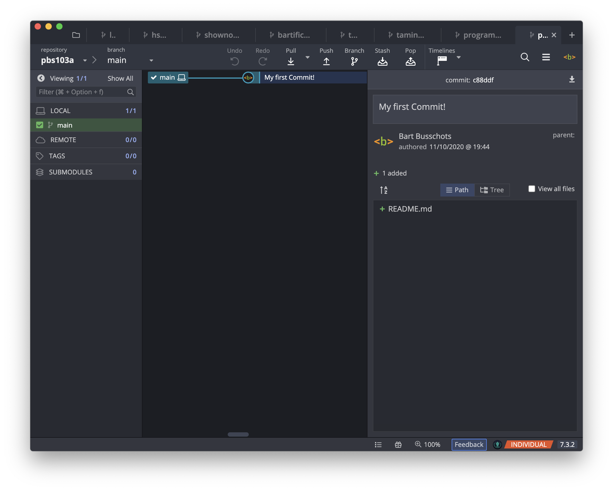

# PBS 103 of X — Getting Started With Git

In the previous instalment we looked at Git from a theoretical point of view — we look at what a repository is, and how data is stored. In this instalment we'll move from theory into practice, and create our first Git repository. 

If you'd like to play along you'll need to meet these two prerequisites:

1. You have installed a version of Git on your computer. The Git homepage list many options — [git-scm.com/…](https://git-scm.com/book/en/v2/Getting-Started-Installing-Git).
2. You are comfortable enough on the command line to navigate to a folder and execute some instructions. (Shameless plug for our free Taming the Terminal podcast & eBook — [ttt.bartificer.net/…](https://ttt.bartificer.net/) 😉).

Even if you don't meet these prerequisites, or if you only ever want to use a Git GUI, don't skip this instalment. Knowing what's happening under the hood will help you make better use of Git GUIs!

## Matching Podcast Episode

Listen along to this instalment on [episode 654 of the Chit Chat Across the Pond Podcast](https://www.podfeet.com/blog/2020/10/ccatp-656/).

<audio controls src="https://media.blubrry.com/nosillacast/traffic.libsyn.com/nosillacast/CCATP_2020_10_11.mp3?autoplay=0&loop=0&controls=1">Your browser does not support HTML 5 audio 🙁</audio>

You can also <a href="https://media.blubrry.com/nosillacast/traffic.libsyn.com/nosillacast/CCATP_2020_10_11.mp3" >Download the MP3</a>

## Some Quick Revision

The first vital take-away from the previous instalment is that a Git repository has three parts:

1. A **database** that permanently stores committed versions of your creative project.
2. A **working copy** of the files and folders that make up your creative project.
3. An **index** which manages the transition of changes made on the working copy into the database through the use of a staging area (and optional stashes which we'll ignore for now).

The second key takeaway is that a *commit* is a snapshot of the complete state of your creative project.

With the exception of the initial commit, commits are linked to the commit that came before them, creating a chain of changes that reaches all the way back to the initial commit. Many commits can share the same previous commit, so the end result is a branching collection of chains spreading out from the initial commit. Each path from the initial commit to the current final commit on one of these chains is referred to as a *branch*, and we get to name these branches.

## The Git Command

Rather than provide a suite of separate commands for each possible Git action, all Git's functionality is exposed via a single command — `git`. The first argument to `git` will always be the specific Git action you wish to perform, so you'll often see Git commands described with the first argument, e.g. *'use the `git commit` command to create a commit'*.

The different Git actions are referred to as *subcommands*, so in the example above, `commit` is the subcommand. While there is a `man` page for the `git` command, it's important to remember that there are separate `man` pages for each Git subcommand, and they are named `git-SUBCOMMAND`, e.g. `man git-commit` for the `commit` subcommand.

## Configuring Git

Git does not need much configuration, but it is important to understand how Git stores the few configuration settings it uses.

### Sections & Keys

Git's settings are grouped into related groupings called *sections*. Within each section the individual settings are key-value pairs. Git refers to each setting as `SECTION.KEY`. As a practical example, Git stores your name in a key named `name`  in the `user` section, so you reference the settings as `user.name`.

### Three Setting Levels 

When Git tries to figure out the value for any given setting it searches in three places, and it does that search in the following order:

1. Firstly, settings can be stored **within a repository**, which Git refers to as ***local***.
2. Secondly, settings can be stored within your operating system-level user account, which Git confusingly refers to as ***global***.
3. Finally, settings can be stored at the OS-level, which Git refers to as ***system***.

So, *local* settings are stored within a given Git repository, *global* settings with a given user account, and *system* settings within a given computer.

As a practical example, when Git needs to know what text editor it should use when asking you to enter a commit message it tries to find a value for the setting `core.editor`. It starts by checking if the folder your terminal is in is part of a Git repository, if it is, it checks that repository for a *local* key named `editor` in the `core` section. If it finds a value it uses it, if not, it checks for a user-account-wide or *global* value, again, if it finds one it uses it, if not, it checks at the OS or *system* level, and again, if it finds a value it uses it, otherwise it falls back on Git's default editor.

Under the hood Git saves all these settings in editable text files in INI format at specific OS-dependent paths, but you don't need to know that, because Git doesn't want you editing those files directly!

### Accessing & Editing Git's Settings with `git config`

The subcommand for reading and altering Git settings is `config`, so you can access the relevant `man` page with `man git-config`.

To see a list of all Git settings that apply in your current folder use:

```
git config --list
```

You can use the `--local`, `--global`, and `--system` flags to see only settings at that given level.

As an example, within my the copy of the PBS repository on my Mac I can see all the defined Git settings, regardless of the level they are coming from, with:

```
bart-imac2018:programming-by-stealth bart% git config --list         
credential.helper=osxkeychain
user.email=opensource@bartificer.net
user.name=Bart Busschots
core.bare=false
core.repositoryformatversion=0
core.filemode=true
core.ignorecase=true
core.precomposeunicode=true
core.logallrefupdates=true
remote.origin.url=https://github.com/bartificer/programming-by-stealth.git
remote.origin.fetch=+refs/heads/*:refs/remotes/origin/*
branch.master.remote=origin
branch.master.merge=refs/heads/master
branch.PBS93.remote=origin
branch.PBS93.merge=refs/heads/PBS93
branch.PBS94.remote=origin
branch.PBS94.merge=refs/heads/PBS94
branch.PBS95.remote=origin
branch.PBS95.merge=refs/heads/PBS95
bart-imac2018:programming-by-stealth bart%
```

I can see which settings are defined at each level by using the three level-related flags in turn:

```
bart-imac2018:programming-by-stealth bart% git config --list --local
core.bare=false
core.repositoryformatversion=0
core.filemode=true
core.ignorecase=true
core.precomposeunicode=true
core.logallrefupdates=true
remote.origin.url=https://github.com/bartificer/programming-by-stealth.git
remote.origin.fetch=+refs/heads/*:refs/remotes/origin/*
branch.master.remote=origin
branch.master.merge=refs/heads/master
branch.PBS93.remote=origin
branch.PBS93.merge=refs/heads/PBS93
branch.PBS94.remote=origin
branch.PBS94.merge=refs/heads/PBS94
branch.PBS95.remote=origin
branch.PBS95.merge=refs/heads/PBS95
bart-imac2018:programming-by-stealth bart% git config --list --global
user.email=opensource@bartificer.net
user.name=Bart Busschots
bart-imac2018:programming-by-stealth bart% git config --list --system
fatal: unable to read config file '/etc/gitconfig': No such file or directory
bart-imac2018:programming-by-stealth bart%
```

As you can see, most of my settings are repository-specific, but I do have two global settings which I use to identify myself. You can also see that my Mac doesn't have a system-wide settings file at all, so there are no system-wide settings in use.

You can see the current value for a given setting by passing that setting as the only argument:

```
bart-imac2018:programming-by-stealth bart% git config user.name
Bart Busschots
bart-imac2018:programming-by-stealth bart% 
```

### Defining Your Identity

Git commits include the name and email address of the commit's author. Git reads these values from the settings `user.name` and `user.email`. You could set these variables locally within each repository, but it makes a lot more sense to define them globally. So, the advice is that before you start using git you set these two variables.

We've already seen that we can use `git config` with one argument to see the value of a given setting. To set a value we pass the desired value as a second argument. Finally, we should tell Git where we'd like it to save the setting, so it's important to use one of the three level flags.

To get started, set the `user.name` and `user.email` flags globally using commands of the form:

```
git config --global user.name 'Bart Busschots'
git config --global user.email opensource@bartificer.net
```

### Editing Multiple Settings at Once

While Git discourages you from directly editing the config files, it does provide a mechanism for editing those files in a controlled way. You can use the `--edit` flag in conjunction with one of the level flags to edit a specific config file. The command will automatically figure out where the file is stored on your OS of choice, open the file in a text editor, and when you save your changes, validate the file's syntax for you.

Before we run the command to edit the global config file in a text editor it's important to note that the default text editor on Unix-like operating systems is the powerful but not particularly human-friendly command line editor [Vim](https://en.wikipedia.org/wiki/Vim_(text_editor)). Note that you can get a primer on Vim in [Taming the Terminal instalment 11](https://ttt.bartificer.net/book.html#ttt11)).

Note that Git will use this same setting each time it needs you to enter some text.

If you find Vim intimidating, I would suggest configuring Git to use a more human-friendly editor by globally setting `core.editor`.

If you're on a Unix-style operating system then `nano` is the obvious choice, which you can set with:

```
git config --global core.editor nano
```

If you're on a Mac you can have Git open the file in the TextEdit GUI editor via the `open` command with:

```
git config --global core.editor 'open -e -n -W'
```

The `-e` flag tells `open` to use TextEdit, the `-n` flag tells `open` to start a fresh instance of TextEdit, and the `-W` flag tells `open` to wait for that fresh copy of TextEdit to close before handing control back to Git. The thing to bear in mind is that you have to save the file and quit TextEdit before Git will validate and accept your changes.

Windows users can use `notepad.exe` as their editor with:

```
git config --global core.editor notepad
```

Ordinarily I'm happy to use Vim, but for this series I'll configure my Mac to use `nano`.

With my editor set, I can now edit my global config with:

```
git config --global --edit
```

This opens `nano` with the following content:

```
[user]
        email = opensource@bartificer.net
        name = Bart Busschots
[core]
        editor = nano
```

As you can see, sections are defined between square brackets, and key-value pairs are listed one per line with the key and value separated by an `=` symbol, so, the above config file defines values for three keys, `user.email`, `user.name`, and `core.editor`. Those of you who remember older versions of Windows might recognise this as the syntax used in INI files.

### More about `git config` Later!

We'll re-visit the `git config` command later in this instalment, after we've created our first repo.

## See the World from Git's POV with `git status`

To see where you are from a Git-point-of-view use the `git status` command. Since we haven't created a repository yet, all this command will tell us now is that we're not in a repository:

```
bart-imac2018:~ bart% git status
fatal: not a git repository (or any of the parent directories): .git
bart-imac2018:~ bart% 
```

## Creating a Git Repository with `git init`

Now that we've set our identity we're ready to create our first repository.

You can turn any folder into a Git repository by running the command `git init` from within the folder. In fact you don't even need to change into a folder to turn it into a repository, you can pass the path to the folder as the first argument to `git init`.

To create our first repository, start by creating a folder named `pbs103a` somewhere in your home account, I'm going to create mine in my temp folder (`~/Documents/Temp`). Once you've created your folder, change into it, and run `git init`, e.g.:

```
bart-imac2018:~ bart% mkdir ~/Documents/Temp/pbs103a
bart-imac2018:~ bart% cd ~/Documents/Temp/pbs103a 
bart-imac2018:pbs103a bart% git init
Initialized empty Git repository in /Users/bart/Documents/Temp/pbs103a/.git/
bart-imac2018:pbs103a bart%
```

Congratulations, we've just created your first Git repository!

As things stand, we have a completely empty repository with no commits in its database, no files in its working directory, and no changes tracked in the index. We can see what this looks like with `git status`:

```
bart-imac2018:pbs103a bart% git status
On branch master

No commits yet

nothing to commit (create/copy files and use "git add" to track)
bart-imac2018:pbs103a bart%
```

This output tells us that we're currently on the default branch for our version of Git, `master` in my case, but if you have a newer version of `git` you might be on `main`. We can also see that there are no commits in the database, and that the working director is empty because there's *'nothing to commit'*.

To make this series a little more future-proof, and, because I agree that the word *master* is encumbered with too much negative baggage, I'll be using `main` as the default branch in all examples.

If, like me, you have an older version Git, how do we convert `master` to `main`? Well, this is the ideal point in the procedure to do it, because there are no commits in the repository yet. This means that the `master` branch doesn't actually exist yet, it's just the name that will get used when we make our first commit. To switch to `main` we simply checkout a new branch named `main` with `git checkout -b main`. Running `git status` again will then show the changed branch:

```
bart-imac2018:pbs103a bart% git checkout -b main
Switched to a new branch 'main'
bart-imac2018:pbs103a bart% git status
On branch main

No commits yet

nothing to commit (create/copy files and use "git add" to track)
bart-imac2018:pbs103a bart%
```

## Creating Our First File

Now that we have an empty repository with a default branch named `main`, let's add our first file to this little create project.

By convention, git repositories generally contain a file named `README.md` which describes the repository. Services like GitHub and GitLab use this file as the main content on a repository's home page.

We're going to keep things simple, and create a traditional *'Hello World!'* file 🙂

You can create your file using your favourite plain-text editor, be that a CLI or GUI editor. I'm going to keep things simple and create the file on the Terminal with the `echo` command. Once the file is created, we can use `git status` again to see how things have change:

```
bart-imac2018:pbs103a bart% echo '# Hello World!' > README.md
bart-imac2018:pbs103a bart% git status
On branch main

No commits yet

Untracked files:
  (use "git add <file>..." to include in what will be committed)

	README.md

nothing added to commit but untracked files present (use "git add" to track)
bart-imac2018:pbs103a bart%
```

We still have no commits, but the index has now noticed that there's a file in our work space that's not yet included in the repository on any way. Git is also very helpfully telling us how we can add this file to the index and stage it for inclusion in a commit later.

## Staging Our First File 

As show by the output from `git status`, the `git add` command is used to stage new files. You simply pass the file or files to add as arguments. Once that's done you can use `git status` again to see the new state of the repository:

```
bart-imac2018:pbs103a bart% git add README.md 
bart-imac2018:pbs103a bart% git status
On branch main

No commits yet

Changes to be committed:
  (use "git rm --cached <file>..." to unstage)

	new file:   README.md

bart-imac2018:pbs103a bart%
```

The *change to be committed* section shows you the current state of the staging area.

## Committing Our First Version

Now that we have at least one change staged we can create our initial commit with the `git commit` command.

You can run `git commit` without any arguments, but when you do that Git will open a text editor and ask you to enter a commit message. Unless you've specifically specified an editor you like with the `core.editor` session, Git will default to a command line editor, `vim` on the versions running on my Mac. This is probably not what you want. I find it much easier to use the `-m` flag to specify the commit message as part of the command. Once we've committed the staged changes we can use `git status` again to see the new state of our repository:

```
bart-imac2018:pbs103a bart% git commit -m 'My first Commit!'
[main (root-commit) 335c300] My first Commit!
 1 file changed, 1 insertion(+)
 create mode 100644 README.md
bart-imac2018:pbs103a bart% git status
On branch main
nothing to commit, working tree clean
bart-imac2018:pbs103a bart% 
```

Notice that now that our repository is up and running the output from `git status` has become a lot quieter. No more helpful hints to get us started, just the facts — we're on the main branch, and there are no changes for us to stage and nothing staged waiting to be committed.

## More on Configuring Git

Now that we have a Git repository we can see Git's settings levels in action.

While inside our repository we can set a local value for `user.name` that will take precedence within this repository, and only within this repository by using the `--local` flag. You can see this in action in the sample output below:

```
bart-imac2018:pbs103a bart% git config user.name
Bart Busschots
bart-imac2018:pbs103a bart% git config --local user.name 'The Bartificer'
bart-imac2018:pbs103a bart% git config user.name
The Bartificer
bart-imac2018:pbs103a bart% cd ~
bart-imac2018:~ bart% git config user.name
Bart Busschots
bart-imac2018:~ bart% cd -
~/Documents/Temp/pbs103a
bart-imac2018:pbs103a bart% git config --local user.name
The Bartificer
bart-imac2018:pbs103a bart% git config --global user.name
Bart Busschots
bart-imac2018:pbs103a bart%
```

In the sequence of commands above I first set a local value for my name, then I show that from within the repository it's the local value that's seen. I then change to a different directory, and then show that it's the global value that's seen. Finally I change back to the repository's directory and show the use of the `--local` and `--global` flags to read the setting from the specified levels.

### Deleting a Setting

Sometimes you might want to delete the value for a given setting at a given level, you can do this by combining the `--unset` flag with one of the level flags.

For example, let's remove the local value for `user.name`:


```
bart-imac2018:pbs103a bart% git config user.name        
The Bartificer
bart-imac2018:pbs103a bart% git config --local --unset user.name
bart-imac2018:pbs103a bart% git config user.name                
Bart Busschots
bart-imac2018:pbs103a bart%
```

As you can see, before I remove the local setting it's the local setting that applies, then, once I remove the local setting, the global setting takes over again.

## View in GUI

Finally, now that we have a repository we can open it in any GUI Git client we like. Because Git repositories are entirely self-contained, you can simultaneously interact with them in as many different clients as you like. Simply open the folder in the client of your choice and work away!

Below is a screenshot of our new repository in my favourite client, [GitKraken](https://www.gitkraken.com/invite/qrmqe3p6) (this link has my referrer code in it, so if you use it you help me out 🙂).



## Final Thoughts

We've now learned how to configure Git and create our first repository. The next step will be to start making changes and recording them as commits, and organising those commits into branches.