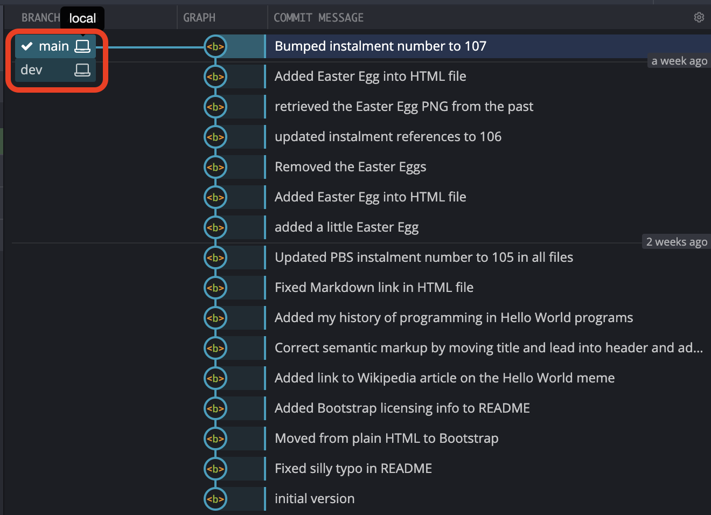
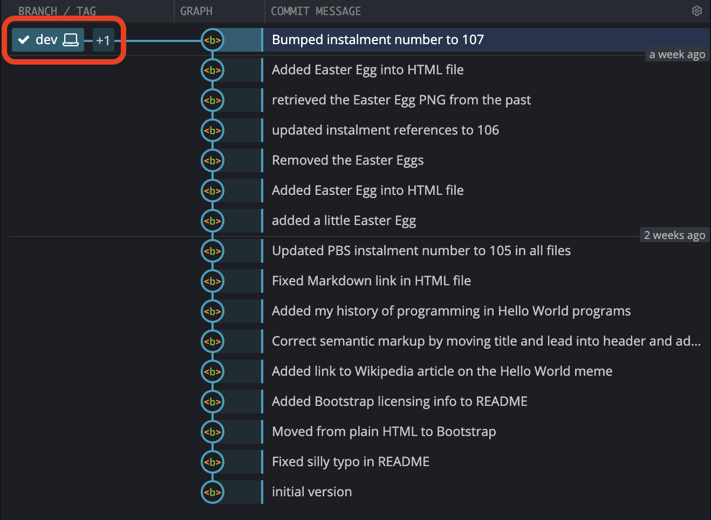
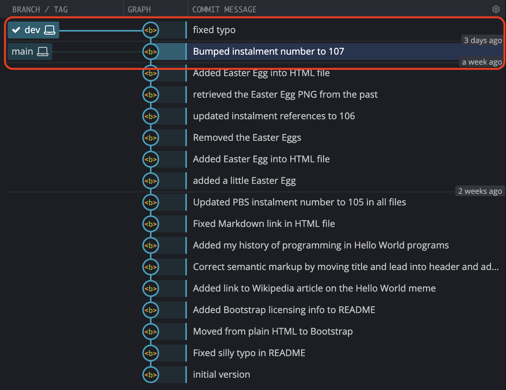

# PBS 107 — Git: Branching Basics

Just about every Git workflow depends on branching, but until now, we've all but completely ignored the concept. The majority of this instalment will focus on concepts and strategies, but we will get practical near the end, and this instalment lays the groundwork for a very practical next instalment.

## Matching Podcast Episode

Listen along to this instalment on [episode 663 of the Chit Chat Across the Pond Podcast](https://www.podfeet.com/blog/2020/11/ccatp-663/).

<audio controls src="https://media.blubrry.com/nosillacast/traffic.libsyn.com/nosillacast/CCATP_2020_11_29.mp3?autoplay=0&loop=0&controls=1">Your browser does not support HTML 5 audio 🙁</audio>

You can also <a href="https://media.blubrry.com/nosillacast/traffic.libsyn.com/nosillacast/CCATP_2020_11_29.mp3" >Download the MP3</a>

## Instalment Resources

* The instalment ZIP file — [pbs107.zip](https://github.com/bartificer/programming-by-stealth/raw/master/instalmentZips/pbs107.zip).

## Playing Along

If you'd like to play along with the examples you'll need to download this instalment's ZIP file and unzip it. Open a terminal and change into the folder you extracted the ZIP into. You'll find a file in there named `pbs107a.bundle`, this is a bundled version of the repository we created in the previous instalment, with an additional commit added to update the references to the instalment number from 106 to 107.

Like we did in the previous two instalments, we need to make a new repository and import all the commits from the bundle. We'll name our new repository `pbs107a`. To create this new repo we'll take the following steps:

1. create a folder named `pbs107a`
2. change into that folder
3. initialise it as a Git repo
4. if needed, change the default branch from `master` to `main`
5. import all the commits from the bundle into our new repository

The commands to do all this are

```
mkdir pbs107a
cd pbs107a
git init
[ `git symbolic-ref --short HEAD` = 'master' ] && git checkout -b main
git pull ../pbs107a.bundle
```

## A Correction: What `--` Really Means

In the previous instalment, as originally written, and as discussed in the matching podcast episode, we described using `git checkout` to retrieve specific files from a previous commit and bring them into the working copy.

We correctly stated that the command takes the form (where `HASH` is a commit hash, and `FILE_PATH(S)` the path to one or more files to retrieve):

```
git checkout HASH -- FILE_PATH(S)
```

The command was correct, but the explanation for the `--` flag was not. The notes in the previous instalment have been updated to correct the explanation, but a quick summary is as follows:

1. When ever at least one file path is passed to `git checkout` it switches from its default *'go to ...'* mode to it's '*fetch these*' mode — i.e. the current branch does not change.
2. In any `git` command, the flag `--` means *'nothing from here on is a flag to `git`, even if it looks like one'*.

The reason you should use the flag with `git checkout` is that file names can clash with `git` flags.

## Git Branching

Before we move on to the practicalities of creating a branch, let's take a moment to remind ourselves of the structure of a Git repository.

The atom of a Git repository's record of history is the commit — a complete snapshot of the current state of the creative project at a specific time. These commits are connected together by a simple relationship — **each regular commit has one parent commit** (the *initial commit* is an exception to this since it has no parent, and there's a special type of commit we'll meet later that has two or more parents).

So, every other regular commit has a link back to exactly one commit that came before it in time, which we refer to as its *parent commit*. A mathematician can instantly recognise the structure this creates as a graph (in the [graph theory](https://en.wikipedia.org/wiki/Graph_theory) rather than pretty picture sense) — a series of connected nodes.

To visualise a Git repo you can imagine the initial commit as your starting point, say on the left, and time moving forward from left to right. Each future commit will be to the right of the initial commit, and there will be a line connecting each to their parent, which will always be to their left (earlier in time).

Up to this point our example repositories have all looked like straight lines from left to right, with the initial commit in the left, the `HEAD` of the `main` branch on the right, and all our other commits chaining those two ends together. In this situation not only does every commit after the initial commit have one parent, but every commit apart from the most recent commit is also the parent of exactly one other commit. We're going to change both of those things soon, but in this instalment, we'll only change the second.

Arbitrarily many commits can share the same parent commit, so if you graph that out, you'll see the lines connecting the commits split each time one parent has more than one child. Graphed out, you see a series of branching lines, starting from a single origin.

In this structure, what is a branch? A branch is simply a line of commits that starts at a current *'newest'* commit, known as the *head* of the branch, and connects back through a line of parent commits to the initial commit. Every commit in your repository can be thought of as the *head* of a branch since every commit has a line of ancestry connecting it to the initial commit. While that's true in theory, we don't generally think that way, and instead choose to name only a handful of branches, and to do so for a reason.

Ultimately, inside the Git database, **a branch is nothing more than a named reference to the commit that is to be considered the head of the branch**. In effect you're telling Git to *"consider this commit to be the head of a branch with this name"*. When we say we have *checked out* a branch, what we mean is that the changes in the working copy will be calculated based on that branch's head commit, and most importantly, **when we create a new commit, the parent of the new commit will be the current head of the checked out branch, and the branch will be updated to consider the new commit to be its new head**.

## Branching Strategies

Branching is where Git goes from a science to an art!

You can create as many branches as you like, and name them anything you want, but if you're not careful, all you'll do is make things more confusing and your creative project harder to manage.

To save your sanity you need to **create branches for specific purposes**, and you need to **give them meaningful names**.

Developing a good branching strategy is important when you're working alone, but it's critical when you advance to using Git to facilitate group work. Every member of a group collaborating on a project with Git needs to understand and adhere to an agreed-upon branching strategy!

The only way to get good at choosing branching strategies is to experiment. Do what seems sensible, try it for a while, and figure out what works well, and what doesn't. Tweak, try again, tweak, try again …

To get good at branching you need to make lots and lots of different mistakes. As long as you're making new mistakes you're doing it right — it's only if you find yourself making the same mistakes over and over again that you need to worry!

The question is not whether or not you'll fail, but whether or not you'll succeed at failing well!

### Shifting the Focus to Managing Code

Git can be used to version any creative project, and your needs when it comes to managing a book will be different to your needs when managing a software project.

Up until this point in the series I've intentionally kept things general enough to apply to any type of creative project. From this point forward I'm shifting my focus purely to code. Why? Because this is *Programming by Stealth*, not *Git for Everyone* 🙂.

Because every project is different, and because every group of developers is different, no two branching strategies are likely to be identical. That doesn't mean there aren't lots of common concepts that are shared widely. Quite the contrary, the vast majority of branching strategies are simply a mix of a few common concepts. But, even more fundamental than shared concepts is a shared over-arching goal — clarity.

I would argue very strongly that the single more important feature of a successful branching strategy is clarity about which commits contain **functioning code**, and which contain non-functioning code.

You (and every other member of your team if you're working collaboratively) should be able to:

1. Look at the repository as a whole and know which branch or branches can be checked out to get the most recent working code.
2. Look at specific commits and know whether or not they contain working code.

If you're releasing your code as open source your strategy needs to be even clearer — random developers who stumble across your repo should be able to tell what they can check out to experiment with your software.
If I come to your open source repo and I can't tell which branches or commits contain functioning code, your strategy has failed!

When you look at lots and lots or repos, you'll discover that the goal of clarity is achieved by combining just a small handful of recurring strategies.

The strategies that most catch my eye are:

1. **Main + Dev** — this two-branch strategy is about as simple as it can get. The main branch is for functioning versions of the code, and all development work is done on a parallel development branch. This is really simple, but it only works if you're working alone and have the discipline to work only ever work on one new feature at a time!
2. **Feature Branches** — this is a slightly more complex version of the **main + dev** strategy. Main remains the place where functioning code lives, but instead of all development work taking place on a single dev branch, there are separate dev branches for each feature being worked on.
3. **Release Branches** — this strategy is only needed for major projects where there are multiple stable versions of the code that are being maintained in parallel. Instead of a single main branch that tracks a single variant of your codebase, you have multiple parallel branches that contain different functioning variants of your codebase. A real-world example of a project with this kind of structure is the [Moodle](https://www.moodle.org/) Virtual Learning Environment. Today (November 2020), there are four supported variants, each on their own branch. There is the current official release suggested for all new sites, Moodle 3.9 which is maintained on a branch named `MOODLE_39_STABLE`, there is also the previous official release, Moodle 3.8 which is still getting security fixes and is maintained on a branch named `MOODLE_38_STABLE`, there's also Moodle 3.5, a long-term support release that's also still getting security fixes which is maintained on a branch named `MOODLE_35_STABLE`, and finally, there's a beta version available which will become the official release in January, Moodle 3.10, and it's maintained in a branch named `MOODLE_310_STABLE`.

Notice that these strategies are not mutually exclusive. If you have release branches you might choose to have just a single dev branch for each of the legacy release branches, and to use feature branches on the most recent release branch.

You should also develop naming schemes so you can recognise branches for what they are. For example, as you can see above, the Moodle project appends `_STABLE` to the end of branches that contain functional code.

In this series we're going to keep things simple and limit ourselves to variants of the main+dev and feature branch approaches.

Before we start to get practical again, let's define what will be our first branching strategy:

### The PBS Branching Strategy — Take 1

We'll start with just three simple rules:

1. The `main` brach will only contain functioning commits. If it's on `main`, you can check it out and the code will function.
2. All development work will be done on a branch named `dev`.
3. Only one conceptual change will be worked on at any given time.

> # Now's a Good Time to Experiment with Git GUIs
>
> Once your Git repositories start to develop multiple branches, the additional value offered by a graphical user interface skyrockets. We introduced Git GUIs back in [instalment 102](/pbs102), but if you haven't done so already, this would be a great point in the series to start Using a GUI in parallel with the Git commands. When we execute commands in the terminal, you'll be able to see their effect in the GUI. You'll also notice that the buttons and menu items in the GUIs map directly to the commands we've been learning, and will continue to learn, on the Terminal.
>
> The screenshots in this instalment will be from my preferred GUI, [GitKraken](https://www.gitkraken.com).

## Listing & Creating Branches with `git branch`

Before we start creating new branches, let's look at how we see which branches exist in our repository.

### Listing Branches

The full command to list branches is `git branch --list`, but most conveniently, simply running `git branch` with no flags or arguments defaults to the same thing.

The output will be a list of branch names, one per line, with the currently checked out branch pre-fixed with an asterisk.

Running this in our repository we get:

```
bart-imac2018:pbs107a bart% git branch
* main
bart-imac2018:pbs107a bart%
```

As you can see, we have one branch named `main`, and it's checked out. The important thing about the asterisk is that it indicates the branch we would commit to if we did a `git commit`. Note that when you're in a *detached head* state you can't commit, and, `git branch` will show no branches as currently checked out, so you'll see no asterisk.

Again, before we create any branches, open our repo in your Git GUI(s), and see how this simple one-branch reality is represented. This is how GitKraken displays our repo:


Notice that the commits are stacked vertically, with the initial commit at the bottom, and the most recent commit at the top. Branches are shown as rectangular green labels to the left of their head commit. In this case there is just one branch, `main`. Also notice that the label for the currently checked out branch is pre-fixed with a tick-mark.

### Creating our First Branch

We can create a branch with passing the name of our new branch as the only argument to `git branch`.

Let's start using the main/dev branching strategy by creating a branch named `dev`:

```
git branch dev
```

To see what that command did, let's list the branches again:

```
bart-imac2018:pbs107a bart% git branch
  dev
* main
bart-imac2018:pbs107a bart%
```

Notice that we now have two branches, but, our current branch is still `main`.

How does this look in GitKraken?


Notice that at first glance we can't see our new branch. Right now, our new branch is identical to the branch `main`. Both have the same head, and both have the identical chain of commits back to the initial commit. Rather than showing two labels on the same commit, GitKraken shows the label for the currently checked out branch, and a `+1` icon to indicate that there is something else at that commit too. When you hover your mouse over the label it expands to show what the +1 really is:



### Moving Between Branches

To move from one branch to another we use `git checkout` with the name of the branch we want to move to as the only argument.

Let's move to our new branch and take a look around:

```
bart-imac2018:pbs107a bart% git checkout dev
Switched to branch 'dev'
bart-imac2018:pbs107a bart% git branch
* dev
  main
bart-imac2018:pbs107a bart% git status
On branch dev
nothing to commit, working tree clean
bart-imac2018:pbs107a bart%
```

In the GitKraken GUI the tick mark moves from `main` to `dev`, and `dev` replaces `main` as the single branch name displayed by default:



What ever GUI you choose to use, **it's vital that you familiarise yourself with the way your Git GUI indicates the current branch**!

## Merging Branches

The main/dev branching strategy hinges on making changes on dev, and then bringing the functioning commits into the main branch. In other words, as well as splitting branches apart, we also need to be able to combine them back together, or, in Git jargon, *merge* them.

### A Word on Merge Conflicts

If you run into problems while using Git, it's mostly likely to happen while you're merging branches. Git is very good at figuring out how to integrate changes automatically, but, when there are two edits to the same part of the same file, that's not theoretically possible. Git isn't capable of magic or mind-reading, so when this happens Git has to ask a human for help. In Git jargon, conflicting changes are referred to as *merge conflicts*.

The good news is that with a little discipline you can usually avoid merge conflicts, especially when you're working along. For example, if you stick rigidly to our current three-rule branching strategy, merge conflicts becomes impossible!

A lot of people find managing merge conflicts challenging, so I'm going to intentionally avoid them for a little longer. We will cover them, but not until we've had some more time to get comfortable with Git.

### Full Merges and Fast Forwarding

To preform a full-on merge between two (or more) branches Git uses a special type of commit known as a *merge commit*. What makes a merge commit special is that it has at least two parents (but it can have more). Merges of more than two branches are possible, and are referred to as *octopus commits*, but they're rarely used, so in reality, merge commits generally have two parents.

Merge commits use the head of one branch as the basis for a comparison to the head of one (or more) other branches, and apply the difference from those branches to the head of the first branch to produce a new commit on the first branch.

This processes means that merges are directional. If we use the commit at the head of the `main` branch as the commit to compare to we'll also write the new commit to the `main` branch. We say that the second branch was *merged into* the `main` branch.

If nothing has changed on the branch being merged into since the branch being merged in diverged, then there is actually no need to create a whole new commit to merge the changes in. Instead, the commits on the branch being merged can be moved to the branch being merged into, and the branching point slid forward to the latest commit. In other words, we can slide the branching point forward. Git refers to this simplified merge as a *fast forward*.

### Fast Forwarding in Action

Let's implement our branching policy to fix a typo I intentionally introduced into our example repo when I updated the instalment number to 107.

Before we make any changes, we want to be sure we're on our newly created `dev` branch:

```
bart-imac2018:pbs107a bart% git checkout dev
Already on 'dev'
bart-imac2018:pbs107a bart%
```

Open `README.md` and change *'instalment 1007'* to *'instalment 107'* and save the file.

We can now stage and commit this change:

```
bart-imac2018:pbs107a bart% git add README.md
bart-imac2018:pbs107a bart% git commit -m 'fixed typo'
[dev 8b5791c] fixed typo
 1 file changed, 1 insertion(+), 1 deletion(-)
bart-imac2018:pbs107a bart%
```

Before we merge our change into `main`, let's take a look at the graphical representation of the repo in GitKraken:



Notice that even though we have two branches, because `main` has not diverged from `dev`, but is simply one commit *behind*, Git Kraken chooses to draw the two branches as one line. This is just one of the ways in which GUIs can differ. Some clients would show `dev` and `main` as parallel lines, even though they have not diverged. Some people find the fact that GitKraken shows un-diverged branches as a single line confusing, others find showing un-diverged branches in parallel to be overly cluttered. There is no right answer — it's a matter of taste!

One thing I like about GitKraken's approach is that you can tell at a glance whether or not you can fast-forward. Is the two branches are on one line you can, if they're not, you can't!

Since our new commit is fully functional, and not some kind of in-between state, it belongs on the `main` branch according to our branching policy.

Regardless of whether you're doing a fast-forward or a merge commit, **you must have the branch you want to merge --into-- checked out**.

So, the first thing we have to do to merge our change is switch to `main`.

```
bart-imac2018:pbs107a bart% git checkout main
Switched to branch 'main'
bart-imac2018:pbs107a bart%
```

Because nothing has happened on `main` since `dev` branched off, and since there are no intermediate commits between this one and the branching point, we can merge `dev` into `main` by fast forwarding without breaking our branching policy.

We can now fast-forward `main` to `dev` using the `git merge --ff-only` command:

```
bart-imac2018:pbs107a bart% git merge --ff-only dev
Updating 4be9147..8b5791c
Fast-forward
 README.md | 2 +-
 1 file changed, 1 insertion(+), 1 deletion(-)
bart-imac2018:pbs107a bart%
```

One last look at GitKraken's graphical representation of the repo shows that `dev` and `main` are the same again:


## Final Thoughts

While we did create one branch, add one commit, and then fast-forward our original branch to the new branch, this was a mostly theoretical instalment. The next instalment will be much more practical, we'll learn how to do merge commits, and, we'll learn how we can make use of Git *tags* to improve our branching strategy to both make it clearer, and, easier to implement.

 - [← PBS 106 — Git: Time Travel](pbs106)
 - [Index](index)
 - [PBS 108 — Git: Merging & Tagging →](pbs108)
