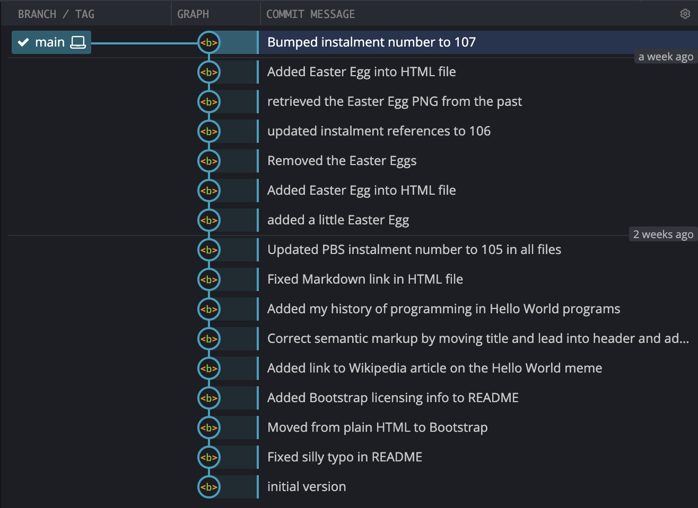
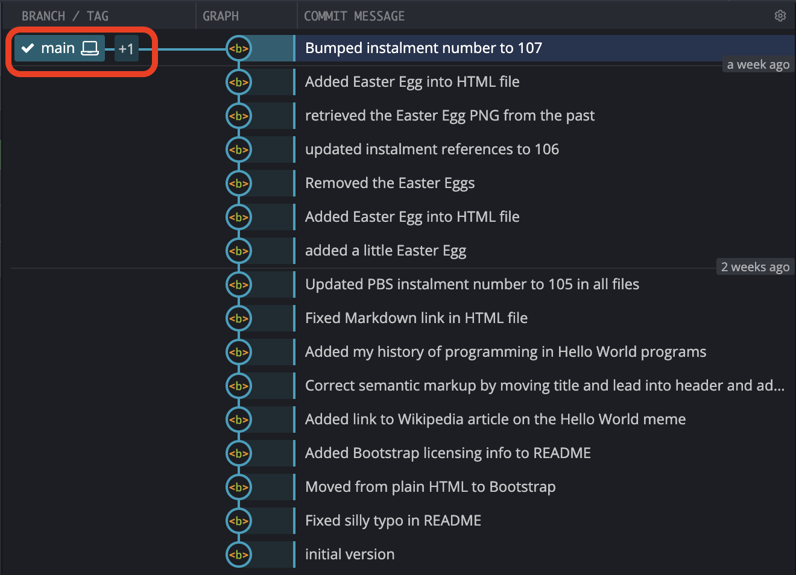

# PBS 107 of X — Time Travel with Git

TO DO

## Matching Podcast Episode

TO DO

## Instalment Resources

* The instalment ZIP file — [pbs107.zip](https://github.com/bartificer/programming-by-stealth/raw/master/instalmentZips/pbs107.zip).

## Playing Along

If you're like to play along with the examples you'll need to download this instalment's ZIP file and unzip it. Open a terminal and change into the folder you extracted the ZIP into. You'll find a file in there named `pbs107a.bundle`, this is a bundled version of the repository we created in the previous instalment, with an additional commit added to update the references to the instalment number from 106 to 107.

Like we did in the previous two instalments, we need to make a new repository and import all the commits from the bundle. We'll name our new repository `pbs107a`. To create this new repo we'll take the following steps:

1. create a folder named `pbs107a`
2. change into that folder
3. initialise it as a Git repo
4. if needed, change the default branch from `master` to `main`
5. import all the commits from the bundle into our new repository

The commands to do all this are

```
mkdir pbs106a
cd pbs107a
git init
[ `git symbolic-ref --short HEAD` = 'master' ] && git checkout -b main
git pull ../pbs107a.bundle
```

## A Correction: What `--` Really Means

In the previous instalment, as originally written, and as discussed in the matching podcast episode, we described using `git checkout` to retrieve specific files from a previous commit and bring them into the working copy.

We correctly stated that the command takes the form (where `HASH` is a commit hash, and `FILE_PATH(S)` the path to one or more files to retrieve):

```
git checkout HASH -- FILE_PATH(S)
```

The command was correct, but the explantation for the `--` flag was not. The notes in the previous instalment have been updated to correct the explanation, but a quick summary is as follows:

1. When ever at least one file path is passed to `git checkout` it switches from its default *'go to ...'* mode to it's '*fetch these*' mode — i.e. the current branch does not change.
2. In any `git` command, the flag `--` means *'nothing from here on is a flag to `git`, even if it looks like one'*.

The reason you should use the flag with `git checkout` is that file names can clash with `git` flags.

## Git Branching

Before we move on to the practicalities of creating a branch, let's take a moment to remind ourselves of the structure of a Git repository.

The atom of a Git history is the commit — a complete snapshot of the current state of your creative project at a specific time. These commits are connected together by a simple relationship, with the exception of the initial commit, **each commit has one parent commit**.

Your first commit, or *initial commit* on Git parlance is an orphan, but every other commit has a link back to exactly one commit the came before it in time, which we refer to as its *parent commit*. A mathematician can instantly recognise this as a graph (in the graph theory sense) — a series of connected items.

To visualise a Git repo you need to imagine the initial commit as your starting point, say on the left, and then time moves forward from left to right. Each future commit will be to the right of the initial commit, and there will be a line connecting it to its parent commit, which will always be to its left (back in time).

Up until this point our example repositories have all looked like straight lines from left to right, with the initial commit in the left, the `HEAD` of the `main` branch on the right, with all our other commits chaining those two ends together. In this situation not only does every commit after the initial commit have one parent, but every commit apart from the most recent commit is the parent of exactly one other commit. The first of those must always remain true, but the second is only true because we've been keeping things artificially simple!

Arbitrarily many commit can share the same parent commit, so if you graph that out, you'll see the lines connecting the commits split each time one parent has more than one child.

In this structure, what is a branch? A branch is simply a line of commits that starts at a current *'newest'* commit, known as the *head* of the branch, and connects back through a line of parent commits to the initial commit. Every commit in your repository can be thought of as the *head* of a branch since every commit has a line of ancestry connecting it to the initial commit. While that's true in theory, we don't generally think that way, and instead choose to name a handful of branches, and to do so for a reason.

Ultimately, inside the Git database, **a branch is nothing more than a named reference to the commit that is to be considered the head of the branch**. In effect you're telling Git to *"consider this commit to be the head of a branch with this name"*. When we say we have *checked out* a branch, what we mean is that the changes in the working copy will be calculated based on that branch's head commit, and most importantly, **when we create a new commit, the parent of the new commit will be the current head of the checked out branch, and the branch will be updated to consider the new commit to be its new head**.

## Branching Strategies

Branching is where Git goes from a science to an art! You can create as many branches as you like, and name them anything you want, but if you're not careful, all you'll do is make things more confusing and your creative project harder to manage.

To save your sanity you need to **create branches for specific purposes**, and you need to **give them meaningful names**.

Developing a good branching strategy is important when you're working alone, but it's critical when you move on to use Git to facilitate group work. Every member of a group collaborating on a project with Git needs to understand and adhere to an agreed-upon branching strategy!

The only way to get good at choosing branching strategies is to experiment. Do what seems sensible, try it for a while, and figure out what works well, and what doesn't. Tweak, try again, tweak, try again …

To get good at branching you need to make lots and lots of different mistakes. As long as you're making new mistakes you're doing it right — it's when you find yourself repeating the same mistakes over and over again that you need to worry 🙂

The question is not whether or not you'll fail, but wether or not you'll succeed at failing well!

### Common Building Blocks

Because every project is different, and because every group of developers is different, no two branching strategies are likely to be identical. That doesn't mean there aren't lots of common concepts that are shared widely. Quite the contrary, the vast majority of branching strategies are simply a mix of a few common concepts. But, even more fundamental than shared concepts is a shared over-arching goal — clarity.

I would argue very strongly that the single more important feature of a successful branching strategy is clarity about which commits contain **functioning code**, and which contain non-functioning code. 

When a stranger looks at your repository they should be able to:

1. Look at the repository as a whole and know which branch or branches can be checked out to get the most recent working code.
2. Look at specific commits and know whether or not they contain working code.

If I come to your repo and I can't tell what I can safely check out to experiment with your tool, your strategy has failed!

When you look at lots and lots or repos, you'll discover that the goal of clarity is achieved by combining just a small handful of recurring strategies.

The strategies that most catch my eye are:

1. **Main + Dev** — this two-branch strategy is about as simple as it can get. Only commits containing working code are allowed on the main branch. All development work is done on a parallel development branch, and when ever the code is in a working state it gets merged into the main brach. This is really simple, but it only works if you're working alone and have the discipline to work only ever work on one new feature at a time!
2. **Feature Branches** — this is a slightly more complex version of the **main + dev** strategy. Main remains a place where only working commits are allowed, but instead of all development taking place on a single dev branch, there are separate dev branches for each feature being worked on.
3. **Release Branches** — this strategy is only needed for major projects where there are multiple stable versions of the code that are being developed in parallel. Instead of a single main branch that contains all the working commits, you have multiple parallel branches that contain only working code, each providing a different version of the app. For example, if you develop a Mac app you may have a version 1.* branch that works on versions of macOS back as far as *el Capitan* but doesn't have any of the cool new features enabled by newer OSes, and a version 2.* branch that requires macOS *Big Sur* or newer and supports home screen widgets.

Notice that these strategies are not mutually exclusive. If you have release branches you might choose to have just a single dev branch for each of the legacy release branches, and to use feature branches on the most recent release branch.

You should also develop naming schemes so you can recognise branches for what they are.

In this series we're going to keep things simple and look at just the first two of those strategies, starting with a simple main+dev approach before moving on to feature branches.

## Now's a Good Time to Experiment with Git GUIs

Once your Git repositories start to develop multiple branches, the additional value offered by a graphical user interface skyrockets. We introduced Git GUIs back in instalment XXXX, but if you haven't done so already, this would be a great point in the series to start Using a GUI in parallel with the Git commands. We we execute commands in the terminal, you'll be able to see their effect in the GUI. You'll also notice that the buttons and menu items in the GUIs map directly to the commands we've been learning, and will continue to learn.

The screenshots in this instalment will be from my preferred GUI, [GitKraken](https://www.gitkraken.com).

## Listing & Creating Branches With `git branch`

Before we start creating new branches, let's look at how we see which branches exist in our repository.

### Listing Branches

The full command to list repositories is `git branch --list`, but most conveniently, simply running `git branch` with no flags or arguments defaults to the same thing.

The output will be a list of branch names, one per line, with the currently checked out branch pre-fixed with an asterisk.

Running this our our repository we get:

```
bart-imac2018:pbs107a bart% git branch
* main
bart-imac2018:pbs107a bart%
```

As you can see, we have one branch named `main`, and it's checked out. The important thing about the asterisk is that it indicates the branch we would commit to if we did a `git commit`. Note that when you're in a *detached head* state you can't commit, and, `git branch` will show no branches as currently checked out, so you'll see no asterisk.

Again, before we create any branches, open our repo in your Git GUI(s), and see how this simple one-branch reality is represented. This is how GitKraken displays our repo:



Notice that the commits are stacked vertically, with the initial commit at the bottom, and the most recent commit at the top. Branches are shown as rectangular green labels to the left of their head commit. In this case there is just one branch, `main`. Also notice that the label for the currently checked out branch is pre-fixed with a tick-mark.

### Creating our First Branch

We can create a branch with passing the name of our new branch as the only argument to `git branch`.

Let's start using the main/dev branching strategy by creating a branch named `dev`:

```
git branch dev
```

To see what that command did, let's list the branches again:

```
bart-imac2018:pbs107a bart% git branch
  dev
* main
bart-imac2018:pbs107a bart% 
```

Notice that we now have two branches, but, our current branch is still `main`.

How does this look in GitKraken?



Notice that at first glance we can't see our new branch. Right now, our new branch is identical to the branch `main`. Both have the same head, and both have the identical chain of commits back to the initial commit. Rather than showing two labels on the same commit, GitKraken shows the label for the currently checked out branch, and a `+1` icon to indicate that there is something else at that commit too. When you hover your mouse over the label it expands to show what the +1 really is:


### Moving Between Branches

To move from one branch to another we use `git checkout` with the name of the branch we want to move to as the only argument.

Let's move to our new branch and take a look around:

```
bart-imac2018:pbs107a bart% git checkout dev
Switched to branch 'dev'
bart-imac2018:pbs107a bart% git branch
* dev
  main
bart-imac2018:pbs107a bart% git status
On branch dev
nothing to commit, working tree clean
bart-imac2018:pbs107a bart%
```

In the GitKraken GUI the tick mark moves from `main` to `dev`, and `dev` replaces `main` as the single branch name displayed by default:


What ever GUI you choose to use, **it's vital that you familiarise yourself with the way your Git GUI indicates the current branch**!

### Create and Move to a New Branch in One Step

In reality, when you create a new branch you almost always want to check it out immediately. As we've just seen, you can do that by running `git branch` and then `git checkout`, but you can do it in one step by using the `-b` flag with `git checkout`. We could have created and jumped to our `dev` branch in one step with:

```
git checkout -b dev
```

## Merging Branches

The main/dev branching strategy hinges on making changes on dev, and then bringing the working commits into the main branch. In other words, as well as splitting branches apart, we also need to be able to combine them back together, or, in Git jargon *merge* them.

If you run into problems while using Git, it's mostly likely to happen while you're merging branches. While Git is very good at figuring out how to combine multiple changes together automatically, there are times when that's not possible. Git refers to this as a *merge conflict*, and you, the human, have to make intelligent decisions to resolve the conflict. Because this is such an important concept, we'll dedicate an entire instalment to this shortly. For now, I'll be intentionally avoiding merge conflicts by carefully choosing my changes between merges.

### Fast-forwarding, or *Merge Lite*

Before we look at full-on merges, let's look at fast-forwarding one branch to another. This is by no means official terminology, but I like to think of fast forwarding as a lite version of merging.

## Final Thoughts

TO DO