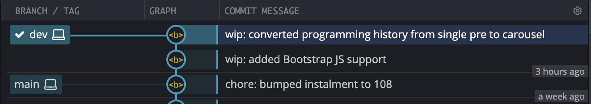
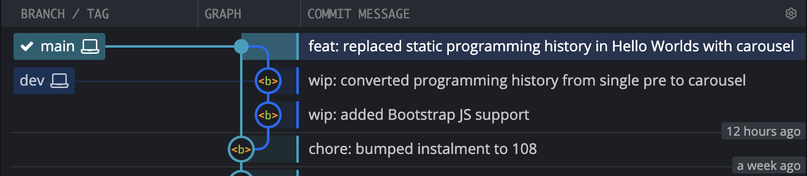
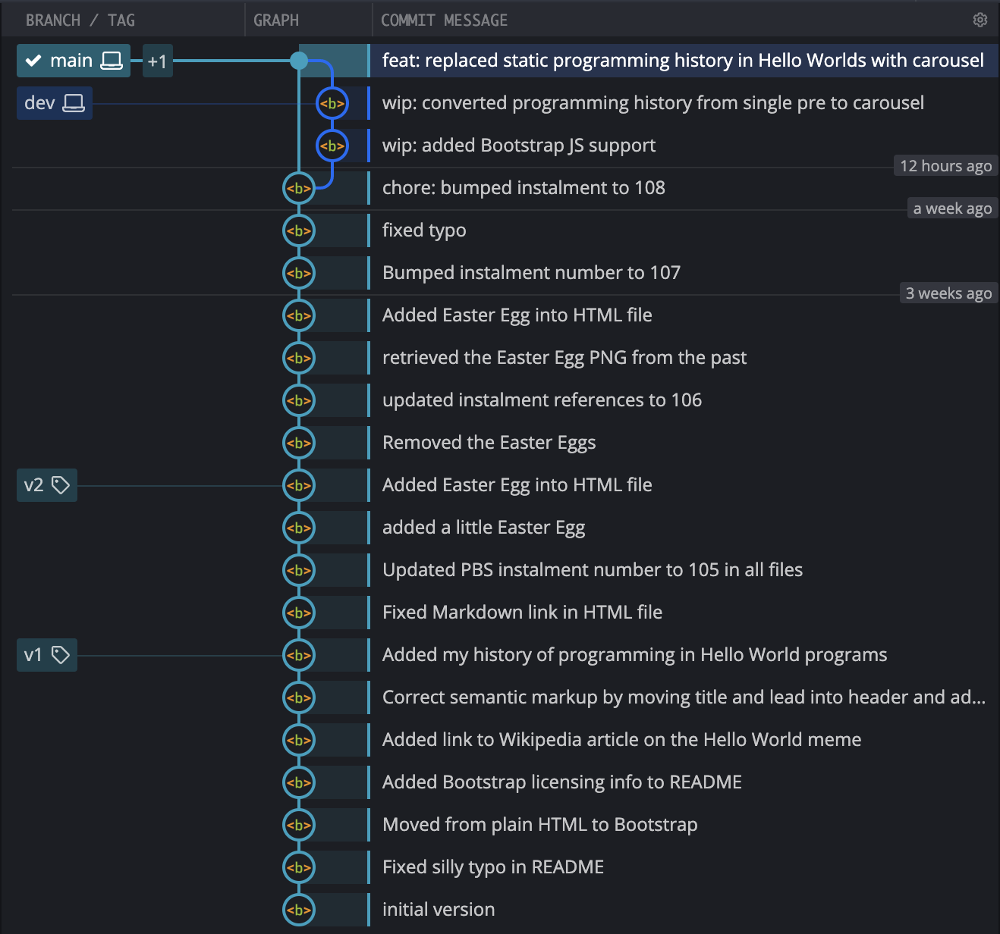

# PBS 108 — Git: Merging & Tagging

In the previous instalment we introduced the concept of a branching policy to guide your decisions on why to branch, when to branch, and how to merge your branches. We described a very simplistic initial branching policy for this series.

We learned how to create branches with `git branch`, and we learned that `git merge` supports two mechanisms for merging branches — full-on *merge commits*, and light-weight *fast forward merges*.

We implemented our branching policy by adding a `dev` branch to our example repo, adding a commit to that branch to fix a typo, and then using a fast-forward merge to bring that commit into the `main` branch.

In this instalment we'll take things a little further but using multiple commits on the `dev` branch to implement a feature, and then using a merge commit to bring only the final commit into the `main` branch, leaving the half-working intermediate commits to exist only on the `dev` branch.

We'll finish up by introducing another important concept for managing a project's history, tags, and use those to evolve our branching policy.

## Matching Podcast Episode

Listen along to this instalment on [episode 663 of the Chit Chat Across the Pond Podcast](https://www.podfeet.com/blog/2020/12/ccatp-665/).

<audio controls src="https://media.blubrry.com/nosillacast/traffic.libsyn.com/nosillacast/CCATP_2020_12_13.mp3?autoplay=0&loop=0&controls=1">Your browser does not support HTML 5 audio 🙁</audio>

You can also <a href="https://media.blubrry.com/nosillacast/traffic.libsyn.com/nosillacast/CCATP_2020_12_13.mp3" >Download the MP3</a>

## Instalment Resources

* The instalment ZIP file — [pbs108.zip](https://github.com/bartificer/programming-by-stealth/raw/master/instalmentZips/pbs108.zip).

## Playing Along

If you'd like to play along with the examples you'll need to download this instalment's ZIP file and unzip it. Open a terminal and change into the folder you extracted the ZIP into. You'll find a file in there named `pbs108a.bundle`, this is a bundled version of the repository we created in the previous instalment, with an additional commit added to update the references to the instalment number from 107 to 108.

Like we did in the previous two instalments, we need to make a new repository and import the `main` branch from the bundle. We'll name our new repository `pbs108a`. To create this new repo we'll take the following steps:

1. create a folder named `pbs108a`
2. change into that folder
3. initialise it as a Git repo
4. if needed, change the default branch from `master` to `main`
5. import the `main` branch from the bundle into our new repository

The commands to do all this are

```
mkdir pbs108a
cd pbs108a
git init
[ `git symbolic-ref --short HEAD` = 'master' ] && git checkout -b main
git pull ../pbs108a.bundle
```

## Two Useful Shortcuts

Some Git commands come in pairs so often that Git has incorporated shortcuts to allow you to do the two tasks at once. So far in this series-within-a-series I've been meticulously always performing each step separately, the idea being to highlight the fact that we are doing two things. Initially this makes things clearer, but, as you start to search the web for Git answers not knowing the most common usages will become ever more confusing, so let's take a moment now to learn about the two most common two-in-one commands.

### Branch & Change

When you create a new branch you almost always want to change to it. Until now we have created our branches, and then checked them out like so:

```
git branch myNewBranch
git checkout myNewBranch
```

We can create and checkout in one command with `git checkout -b`, the above two commands are synonymous with this single command:

```
git checkout -b myNewBranch
```

### Stage & Commit

Another very common thing to want to do is to commit all your changes at once.

Up until this point we have been using `git add` to explicitly stage each change, and then, once all our changes are staged, using `git commit` to commit the staged files.

Again, I chose to do this for clarity, but as you become more familiar with Git, the step evolves from useful clarity to monotonous drudgery!

We can stage and commit all our changes in one command by adding the `-a` flag to `git commit`. We always add messages to our commits with the `-m` flag, so in this series you'll see me *cuddle* the `-a` and `-m` flags like so:

```
git commit -am 'These changes were staged and committed in one command!'
```

**Be careful!** As useful as this shortcut is, it has a huge limitation that often catches people out — `git commit -a` **only automatically stages *changed* files**, it does **not** auto-stage ***new* files**!

## Adding a More Complex Feature — A Carousel

As a more real-world example, let's replace the list of *Hello World* code snippets with a sliding [Bootstrap Carousel](https://getbootstrap.com/docs/4.5/components/carousel/).

This will be a two-step process because we are currently only including the Bootstrap CSS in our page, not the Bootstrap JavaScript, and the Carousel component requires JavaScript.

Our first step will be to add support for Bootstrap JavaScript to our project, then, we'll convert the single large `<pre>` tag containing all the *Hello World* snippets to a carousel, with one snippet per slide.

### Before We Start — Create Our `dev` Branch

Because we only imported the `main` branch from the bundle into this new repository, we need to create a new `dev` branch. This gives us an opportunity to put the first shortcut we learned about into practice:

```
bart-imac2018:pbs108a bart% git checkout -b dev
Switched to a new branch 'dev'
bart-imac2018:pbs108a bart%
```

### Adding Support for Bootstrap JS Features

To add support for Bootstrap's JS I had to add both Bootstrap's own JS file, and jQuery. I did that by adding the additional files into the `contrib` folder, and then updating the HTML to include the newly added files by adding the following to the bottom of the page body:

```html
<!-- Include the jQuery & Bootstrap JS Libraries -->
<script src="contrib/jQuery3.5/jquery.min.js"></script>
<script src="contrib/Bootstrap4.5/bootstrap.bundle.min.js"></script>
```

You'll find a copy of my updated `contrib` folder and html file in the folder `pbs108a-v2` in this instalment's ZIP file. Completely replace the `contrib` folder in your working copy with this folder, and replace the `index.html` file in your working copy with the one in the folder.

Let's have a look at the state of the working copy now:

```
bart-imac2018:pbs108a bart% git status
On branch dev
Changes not staged for commit:
  (use "git add <file>..." to update what will be committed)
  (use "git checkout -- <file>..." to discard changes in working directory)

	modified:   index.html

Untracked files:
  (use "git add <file>..." to include in what will be committed)

	contrib/Bootstrap4.5/bootstrap.bundle.min.js
	contrib/Bootstrap4.5/bootstrap.bundle.min.js.map
	contrib/Bootstrap4.5/bootstrap.min.css.map
	contrib/jQuery3.5/

no changes added to commit (use "git add" and/or "git commit -a")
bart-imac2018:pbs108a bart%
```

Notice that we have un-tracked files as well as changed files. If we were to use the `git commit -am` shortcut now only the one changed file would get committed. We need to add the un-tracked files before we can use the shortcut:

```
bart-imac2018:pbs108a bart% git add contrib/Bootstrap4.5/bootstrap.bundle.min.js* contrib/Bootstrap4.5/bootstrap.min.css.map contrib/jQuery3.5/
bart-imac2018:pbs108a bart%
```

If we look at the status again we can see all files are now tracked:

```
bart-imac2018:pbs108a bart% git status
On branch dev
Changes to be committed:
  (use "git reset HEAD <file>..." to unstage)

	new file:   contrib/Bootstrap4.5/bootstrap.bundle.min.js
	new file:   contrib/Bootstrap4.5/bootstrap.bundle.min.js.map
	new file:   contrib/Bootstrap4.5/bootstrap.min.css.map
	new file:   contrib/jQuery3.5/LICENSE.txt
	new file:   contrib/jQuery3.5/jquery.min.js
	new file:   contrib/jQuery3.5/jquery.min.map

Changes not staged for commit:
  (use "git add <file>..." to update what will be committed)
  (use "git checkout -- <file>..." to discard changes in working directory)

	modified:   index.html

bart-imac2018:pbs108a bart%
```

Now we're ready to use our shortcut to stage and commit in one command:

```
bart-imac2018:pbs108a bart% git commit -am 'wip: added Bootstrap JS support'
[dev dda52e5] wip: added Bootstrap JS support
 7 files changed, 36 insertions(+)
 create mode 100644 contrib/Bootstrap4.5/bootstrap.bundle.min.js
 create mode 100644 contrib/Bootstrap4.5/bootstrap.bundle.min.js.map
 create mode 100644 contrib/Bootstrap4.5/bootstrap.min.css.map
 create mode 100644 contrib/jQuery3.5/LICENSE.txt
 create mode 100644 contrib/jQuery3.5/jquery.min.js
 create mode 100644 contrib/jQuery3.5/jquery.min.map
bart-imac2018:pbs108a bart%
```

### Adding the Carousel

We're now ready to add the carousel by updating `index.html` as described in the Bootstrap docs.

I opted for a carousel with almost all the bells and whistles, adding navigation buttons, place indicators, and setting a custom animation time of 3 seconds.

You'll find the updated copy of `index.html` in the folder `pbs108a-v3` in this instalment's ZIP. Replace the html file in your working copy with this file.

Let's look at the current state of the repo:

```
bart-imac2018:pbs108a bart% git status
On branch dev
Changes not staged for commit:
  (use "git add <file>..." to update what will be committed)
  (use "git checkout -- <file>..." to discard changes in working directory)

	modified:   index.html

no changes added to commit (use "git add" and/or "git commit -a")
bart-imac2018:pbs108a bart%
```

This time there are no untracked files, so we can immediately make use of the `git commit -am` shortcut to stage and commit with a single command:

```
bart-imac2018:pbs108a bart% git commit -am 'wip: converted programming history from single pre to carousel'
[dev 9c96f73] wip: converted programming history from single pre to carousel
 1 file changed, 71 insertions(+), 18 deletions(-)
bart-imac2018:pbs108a bart%
```

As seen in GitKraken, our repository now looks like this:



Notice that the `dev` branch is two commits ahead of the `main` branch, but they are displayed in a straight line because `main` can be fast forwarded to `dev`.

In this case the intermediate commit is not really a working version, it loads a bunch of JavaScript that goes completely un-used! If we were to fast forward we would add both commits to the `main` branch, so rather than fast forwarding, we'll force a merge commit.

In the previous instalment we used `git merge` with the `--ff-only` flag for force a fast forward, this time we'll use the `--no-ff` flag to prevent a fast forward and force a merge commit. We wish to merge `dev` into main, so we must first switch to `main`, then merge `dev`.

Because a merge commit is a commit, we need to add a message. Since we made two changes on the `dev` branch we need to add a more verbose commit message. This is a good opportunity to point out that multiple paragraphs can be added to a single commit message by adding multiple `-m` flags. The first one will be considered the heading, all the rest regular paragraphs. This works with both `git commit` and `git merge`.

Let's go ahead and merge our new feature into the main branch. To do that we first check out `main`, then merge `dev` into it without fast forwarding:

```
bart-imac2018:pbs108a bart% git checkout main
Switched to branch 'main'
bart-imac2018:pbs108a bart% git merge --no-ff dev -m 'feat: replaced static programming history in Hello Worlds with carousel' -m 'To facilitate the carousel the Bootstrap JavaScript libraries and their dependencies were also added.'
Merge made by the 'recursive' strategy.
 contrib/Bootstrap4.5/bootstrap.bundle.min.js     |  7 ++
 contrib/Bootstrap4.5/bootstrap.bundle.min.js.map |  1 +
 contrib/Bootstrap4.5/bootstrap.min.css.map       |  1 +
 contrib/jQuery3.5/LICENSE.txt                    | 20 +++++
 contrib/jQuery3.5/jquery.min.js                  |  2 +
 contrib/jQuery3.5/jquery.min.map                 |  1 +
 index.html                                       | 93 +++++++++++++++++++-----
 7 files changed, 107 insertions(+), 18 deletions(-)
 create mode 100644 contrib/Bootstrap4.5/bootstrap.bundle.min.js
 create mode 100644 contrib/Bootstrap4.5/bootstrap.bundle.min.js.map
 create mode 100644 contrib/Bootstrap4.5/bootstrap.min.css.map
 create mode 100644 contrib/jQuery3.5/LICENSE.txt
 create mode 100644 contrib/jQuery3.5/jquery.min.js
 create mode 100644 contrib/jQuery3.5/jquery.min.map
bart-imac2018:pbs108a bart%
```

Let's see how this looks in GitKraken now:



As you can see, a new commit has appeared on `main`, and that commit has two parent commits, one on `main`, and one on `dev`.

## Git Tags

Git allows us to give human-friendly names to commits. These names are called tags, and can be added to any commit.

There are actually two types of tags, *light-weight* tags that are literally just a name for a commit, and *annotated tags* that contain a message as well as a bunch of metadata about their creation.

### Showing all Tags

To see all the tags that exist in a repository, use `git tag` with no arguments:

```
bart-imac2018:pbs108a bart% git tag
bart-imac2018:pbs108a bart%
```

As you can see, our repository has no tags in it ATM.

### Adding a Light-weight Tag

We can add a light-weight tag to the head of the current branch by simply passing a name for our tag as the only argument to `git tag`. Let's create a tag named `youAreHere`:

```
git tag youAreHere
```

We can now see that this tag exists by listing all the tags again:

```
bart-imac2018:pbs108a bart% git tag
youAreHere
bart-imac2018:pbs108a bart%
```

When we ask Git to describe the tag it simply shows us the information from the commit it points to.

As we learned previously, we can use `git log` to see the details of the most recent commit on our current branch by passing it `-1` to limit the output to one commit, and `--oneline` to simplify the display of each commit to a single line:

```
bart-imac2018:pbs108a bart% git log -1 --oneline
42b42d6 (HEAD -> main, tag: youAreHere) feat: replaced static programming history in Hello Worlds with carousel
bart-imac2018:pbs108a bart%
```

Again, as we learned before, we can use `git show` to describe anything in a Git repo, if we ask it to show our most recent commit we get:

```
bart-imac2018:pbs108a bart% git show 42b42d6
commit 42b42d674716c55d25e4728a0fc8b25823a8e0ed (HEAD -> main, tag: youAreHere)
Merge: 235b86f c66d9bf
Author: Bart Busschots <opensource@bartificer.net>
Date:   Sun Dec 13 00:36:38 2020 +0000

    feat: replaced static programming history in Hello Worlds with carousel

    To facilitate the carousel the Bootstrap JavaScript libraries and their dependencies were also added.

bart-imac2018:pbs108a bart%
```

If we ask it to show the details of our new tag, we get the same information:

```
bart-imac2018:pbs108a bart% git show youAreHere
commit 42b42d674716c55d25e4728a0fc8b25823a8e0ed (HEAD -> main, tag: youAreHere)
Merge: 235b86f c66d9bf
Author: Bart Busschots <opensource@bartificer.net>
Date:   Sun Dec 13 00:36:38 2020 +0000

    feat: replaced static programming history in Hello Worlds with carousel

    To facilitate the carousel the Bootstrap JavaScript libraries and their dependencies were also added.

bart-imac2018:pbs108a bart%
```

### Deleting a Tag

Lightweight tags are often used to temporarily label something, so it's quite normal to delete them when they're no longer helpful. You can almost think of them as digital sticky notes!

To delete a tag simply use `git tag` with the `-d` flag:

```
bart-imac2018:pbs108a bart% git tag -d youAreHere
Deleted tag 'youAreHere' (was 42b42d6)
bart-imac2018:pbs108a bart%
```

### Adding Annotated Tags

You can create an annotated tag by using `git tag` with the `-a` flag (for *add*) in combination with the `-m` flag to add a message.

Annotated tags are generally used to mark significant milestones in your project, so it makes sense to add a message to them.

Let's tag the current commit as the third major version of our dummy project:

```
git tag -a v3 -m "V3 Upgrades the programming history to a pretty carousel"
```

When we show the details of an annotated tag we still see the details for the commit it points to, but only after the details for the tag itself, including who created it, and when:

```
bart-imac2018:pbs108a bart% git show v3
tag v3
Tagger: Bart Busschots <opensource@bartificer.net>
Date:   Sun Dec 13 12:17:08 2020 +0000

V3 Upgrades the programming history to a pretty carousel

commit 42b42d674716c55d25e4728a0fc8b25823a8e0ed (HEAD -> main, tag: v3)
Merge: 235b86f c66d9bf
Author: Bart Busschots <opensource@bartificer.net>
Date:   Sun Dec 13 00:36:38 2020 +0000

    feat: replaced static programming history in Hello Worlds with carousel

    To facilitate the carousel the Bootstrap JavaScript libraries and their dependencies were also added.

bart-imac2018:pbs108a bart%
```

### Tagging a Previous Commit

We've tagged this commit  as version 3, but we've not tagged any commits as versions 1 or 2, can we do that? We could of course check out the relevant commits, tag them using the syntax above, and then check out `main` again, but we don't have to do that, we can simply specify a commit hash as a final argument when creating the tag. This works for both light-weight and annotated tags.

If we look back at our entire project's history we can pick logical commits to tag as versions 1 and 2:

```
bart-imac2018:pbs108a bart% git --no-pager log --oneline
42b42d6 (HEAD -> main, tag: v3) feat: replaced static programming history in Hello Worlds with carousel
c66d9bf (dev) wip: converted programming history from single pre to carousel
fe1492f wip: added Bootstrap JS support
235b86f chore: bumped instalment to 108
8b5791c fixed typo
4be9147 Bumped instalment number to 107
cf47673 Added Easter Egg into HTML file
46e114a retrieved the Easter Egg PNG from the past
cef53ce updated instalment references to 106
9e0df06 Removed the Easter Eggs
43bca0f Added Easter Egg into HTML file
c50e09c added a little Easter Egg
27d4f35 Updated PBS instalment number to 105 in all files
ff15d67 Fixed Markdown link in HTML file
ff8bc62 Added my history of programming in Hello World programs
2e3a0ce Correct semantic markup by moving title and lead into header and adding a footer
80025b1 Added link to Wikipedia article on the Hello World meme
a6d4bfd Added Bootstrap licensing info to README
7cf6b0b Moved from plain HTML to Bootstrap
c88546e Fixed silly typo in README
d58f072 initial version
bart-imac2018:pbs108a bart%
```

The first major milestone is the addition of the programming history in *Hello World* snippets, and the second is the addition of the easter egg, i.e. commits `ff8bc62` and `43bca0f`, so let's go ahead and tag those:

```
bart-imac2018:pbs108a bart% git tag -a v1 -m "V1 Includes a History of Bart's programming journey in 'Hello World' snippets" ff8bc62
bart-imac2018:pbs108a bart% git tag -a v2 -m "V2 adds a little Easter Egg to the page" 43bca0f
bart-imac2018:pbs108a bart%
```

Now when we list our tags we see three meaningful tags:

```
bart-imac2018:pbs108a bart% git tag
v1
v2
v3
bart-imac2018:pbs108a bart%
```

Git GUIs generally also show tags, here's how our repo now looks in GitKraken:



Note that the tag `v3` is hidden by default because it's at the head of the `main` branch — it's the '+1', and is shown when the mouse is hovered over the icon for the branch.

### The PBS Branching Strategy — Take 2

Our first attempt at a branching strategy was very simplistic:

1. The `main` brach will only contain functioning commits. If it's on `main`, you can check it out and the code will function.
2. All development work will be done on a branch named `dev`.
3. Only one conceptual change will be worked on at any given time.

One of the areas this strategy falls short is that it's in conflict with the default behaviour of `git merge`. Git has been written to default to fast-forwarding when possible, so with our strategy we have to constantly override Git's default behaviour to keep intermediate commits off the `main` branch. This adds mental work for us, and, is very error prone.

As a general rule I try to avoid swimming up proverbial streams, so I'm well motivated to do better 🙂.

At the moment we use a commit's presence on the `main` branch to indicate that it's complete and functioning snapshot. We could use tags for that instead, allowing intermediate commits onto `main` without confusion. We still want the head of the `main` branch to always be complete and functional, so all development should still happen on `dev`, but once a feature is ready `main` can be fast-forwarded to `dev`, and the commit tagged as a working version.

This gives us an updated branching policy that's easier to use, but still nice and simple:

1. The commit at the head of the `main` branch must always be a functioning commit.
2. All development work will be done on a branch named `dev`.
3. Only one conceptual change will be worked on at any given time.
4. Each time a conceptual change is completed `main` will be fast-forwarded to `dev`, and the commit then at the head of `main` will be tagged with a version number.

This strategy works with Git's default merging behaviour and still meets our two primary goals:

1. We can look at the repository as a whole and know which branch we should check out to get the most recent working version of the code — `main`.
2. We know whether or not a commit contains complete working code by whether or not it has been tagged with a version number.

## Final Thoughts

While our new branching policy is a nice improvement, it still bakes in one extremely un-realistic assumption — that we'll only ever work on one conceptual change at a time! Some people may work like that in the real world, but I doubt many do, I certainly don't!

In the next instalment we'll update our branching policy again so as to support simultaneous work on multiple conceptual changes. This will give us the ability to put something on the back-burner for a while so we can work on other ideas, or, to pause work on a new feature to fix a bug that's just come to light.

This added flexibility comes at a cost though. Like our first branching policy, our second makes merge conflicts impossible. That will cease to be true as soon as we start working on multiple conceptual changes simultaneously.
