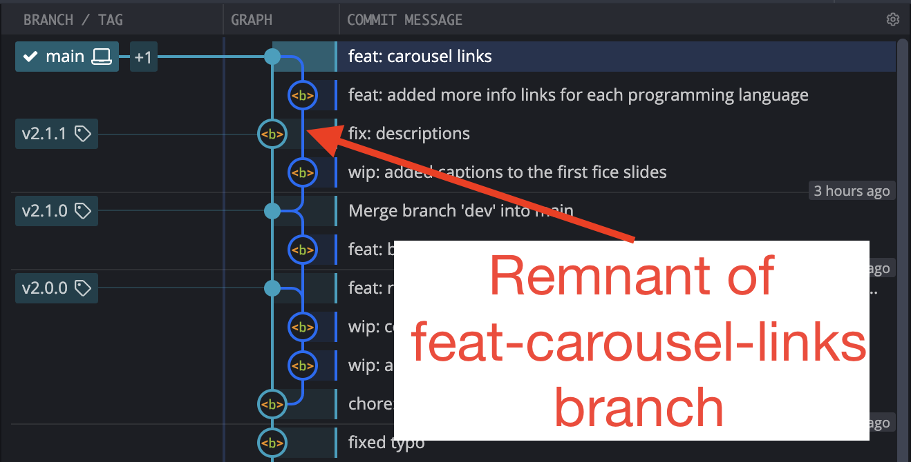

# PBS 109 of X — SemVer & Structured Commits

Our Git journey is progressing nicely — we can create repositories, commit our code, commit our changes, create branches, merge branches, and tag commits. We even have a branching strategy to add some structure to our repository and hopefully avoid chaos.

We've been slowly building up that branching strategy, starting from a very naive and unrealistic one, and working towards something more real-world. As things stand, our branching policy has one really glaring short-coming, the utterly un-realistic assumption that we will only work on one thing at a time!

In this instalment, we'll evolve our branching strategy to allow us to do multiple things at once in an orderly way, but to help us get there we'll learn about two very useful conventions — one for naming releases, and one for writing meaningful commit messages.

## Matching Podcast Episode

Listen along to this instalment on [episode 663 of the Chit Chat Across the Pond Podcast](https://www.podfeet.com/blog/2020/12/ccatp-666/).

<audio controls src="https://media.blubrry.com/nosillacast/traffic.libsyn.com/nosillacast/CCATP_2020_12_28.mp3?autoplay=0&loop=0&controls=1">Your browser does not support HTML 5 audio 🙁</audio>

You can also <a href="https://media.blubrry.com/nosillacast/traffic.libsyn.com/nosillacast/CCATP_2020_12_28.mp3" >Download the MP3</a>

## Instalment Resources

* The instalment ZIP file — [pbs109.zip](https://github.com/bartificer/programming-by-stealth/raw/master/instalmentZips/pbs109.zip).

## Playing Along

If you'd like to play along with the examples you'll need to download this instalment's ZIP file and unzip it. Open a terminal and change into the folder you extracted the ZIP into. You'll find a file in there named `pbs109a.bundle`, this is a bundled version of the repository we created in the previous instalment, with an additional commit added to update the references to the instalment number from 108 to 109, and with the names of the tags updated for reasons that will become obvious later.

Like we did in the previous two instalments, we need to make a new repository and import all the branches and tags from the bundle. We'll name our new repository `pbs109a`. To create this new repo we'll take the following steps:

1. create a folder named `pbs109a`
2. change into that folder
3. initialise it as a Git repo
4. if needed, change the default branch from `master` to `main`
5. import all branches and tags from the bundle into our new repository

The commands to do all this are

```
mkdir pbs109a
cd pbs109a
git init
[ `git symbolic-ref --short HEAD` = 'master' ] && git checkout -b main
git fetch --update-head-ok ../pbs109a.bundle '*:*'
git checkout main
```

Notice that the command to import from the bundle is different to the one used in previous instalments. The reason for this is that previously, we were only importing a single branch, now, we want to import everything.

## Naming Software Releases

We could probably dedicate an entire series within a series on the age-old question of how name specific releases of software. Everyone seems to be agreed that something at least partly numeric makes sense, but beyond that there seems to be very little agreement at all!

Because we generally agree that it makes sense to use numbers in our release names we tend to refer to these as *version numbers*, or *release numbers*, even if they're usually much more than just regular integer or decimal numbers. Some schemes make heavy use of English in their *'version numbers'* making use of words like *beta*, *alpha*, *stable*, *experimental*, *edge* (for *bleeding edge*), and so on. Others contain only numbers and symbols.

Fundamentally, I would argue that a good numbering system is one that's:

1. **Simple** — if you can't explain the meaning in a version number in few sentences it's unlikely your scheme is working!
2. **Consistent** — once you've picked your rules, stick to them!
3. **Meaningful** — different software projects need to communicate different types of information in their release numbers, the scheme you choose must capture the information that's meaningful to your project, and ideally avoid encoding information that's irrelevant, that's just clutter!
4. **Lexically Sortable** — this might sound silly, but it's actually very important when it comes to finding branches in a repository, files in releases folder, downloads in an automatically generated list, and so on, that alphabetic sorting yields a sensible list.

Personally, I'm drawn to the concept of reverse-date numbering where you number your software as `YYYYMMDD.R`, where `YYYY` is a four-digit year, `MM` a two digit month, `DD` a two-digit day-of-the-month, and `R` a release sequence number. It's easy, I don't have to think too hard about it, and it sorts perfectly. It contains very little information though! Is `20201227.1` a bug fix? A feature release, or a complete re-write?

### Three Types of Change

The insight at the root of the numbering system we'll be focusing on in this series is that software changes can be grouped into three categories:

1. **Fixes** — the specification remains completely un-changed, but a problem with the implementation is fixed so reality comes closer to theory. Basically, *'it should always have worked like this'*.
2. **New Features** — the specification is expanded to include something new. Nothing has been removed, the software still does everything it did previously, but now it does more. Basically *'you can keep doing what you're doing, but now you can do this too!'*
3. **Breaking Changes** — the specification has changed so that something which was once part of the specification isn't anymore. Basically, *'some of you will have to change how you do something'*

Whether you're a programmer consuming an API, or a user using an app, those three categories are equally as meaningful because they focus on the effects the change has on users. If you see that a new release contains only fixes, you know you can apply it without thinking about it. If you see that a new release has some new features it's worth your time to read the release notes to see if you can benefit from the new goodness, but you can install the update without fear of something breaking. Finally, if you see that a release contains breaking changes you know you need to read the release notes carefully to figure out how the change effects you.

Note that there's still a huge range within each category. Some bug fixes might require a complete re-write of the back-end code to the same thing in a much safer or more efficient way, or, it could be as simple as deleting a stray character in an obscure info panel or warning message. A new feature could be as simple as the option to do two things you can do already in a single action, or, the addition of an entire new set of features. Finally, a breaking change to an app could be as simple as the removal of a feature almost no one uses, or, it could be a complete re-write of the entire UI. Similarly, a breaking change to an API could be as simple as a change to the arguments to an obscure function almost no one uses, or it could be as big as the entire API switching from callbacks to promises!

### Semantic Versioning, or SemVer

An extremely popular release naming/numbering scheme is *Semantic Versioning*, or *SemVer*. You'll find the full specification at [semver.org](https://semver.org/), but really, the spec's official summary captures the basics perfectly:

> Given a version number `MAJOR.MINOR.PATCH`, increment the:
>
> 1. `MAJOR` version when you make incompatible API changes,
> 2. `MINOR` version when you add functionality in a backwards compatible manner, and
> 3. `PATCH` version when you make backwards compatible bug fixes.
>
>  Additional labels for pre-release and build metadata are available as extensions to the MAJOR.MINOR.PATCH format.

Note that officially, SemVer is for naming API releases, but the principles are broad enough that they can be applied to all software IMO.

Building on the summary above, the spec also reserves the `0` major version for initial development, and as long as that initial number is zero the software should not be considered stable, and breaking changes are perfectly acceptable without incrementing the major version. The major version number `1` is reserved for the first official release of the software.

Additionally, think of the three numbers are being in a hierarchy. When you increment the major number your release can include new features and patches too, and similarly, when you increment the minor number your release can include patches too. Also note that when you increment the major version both the minor and patch versions have to go to zero, and similarly, when you increment the minor version the patch version has to go to zero. In other words `1.2.3` can only be followed by `2.0.0`, `1.3.0`, or `1.2.4`.

Visually, the spec is very clear, no leading zeros, and any of the three parts of the SemVer can expand to multiple digits as needed, `1.0.9` does not become `1.1.0` for a patch release.

Pre-release versions can have additional information added, but the additional information should be grouped into dot-separated identifiers, and separated from the normal SemVer by a dash. E.g. `1.2.3-apha`, or even `1.2.3-beta.4`.

Finally, if your software has a complex enough build process that it makes sense to encode some metadata relating to that process into the version number, you can group it into dot-separated identifiers and append it to the end of the version number, separated from it by a plus symbol, e.g. `1.2.3+M1`, or even `1.2.3-alpha.2+202012271636.WIN64`.

In some circumstances SemVer goes beyond a convention into a requirement. A great example of this is NPM, the JavaScript package manager. All NPM package releases must be named using SemVer, and the auto-updater is aware of the three levels of change encoded into a SemVer, and can be configured accordingly. For example, you can instruct NPM to automatically apply all patch releases, or, all patch and all feature releases, but you'll always have to explicitly request major releases.

From this point on, when ever examples in this series require release names, we'll use SemVer.

## Meaningful Commit Messages

In an ideal world, commit messages should be meaningful to both humans and computers. A person should be able to read a commit message and understand the kind of change it represents, and, any automations in your project's software toolkit should be able to understand the commit messages too.

### Conventional Commits

To make this possible, a nice simple standard has been proposed — [Conventional Commits](https://www.conventionalcommits.org/).

The name can be a little confusing, but I think of it as *a convention for structuring commit messages*.

The basic structure of a conventional commit is very simple:

```
TYPE: DESCRIPTION

BODY

FOOTERS
```

The `TYPE` is either `fix` for a change that maps to a SemVer patch, `feat` for a change that adds a new feature, i.e. a SemVer minor version, and other commits can have descriptive `TYPE`s like `wip`, `docs`, or `test`.

The `DESCRIPTION` is mandatory and should be a one-line summary of the change.

The `BODY` is optional, can consist of multiple paragraphs, and can be in Markdown.

The `FOOTERS` are optional, and consist of name-value pairs separated by either a colon and a space, or a space and an octothorp (`#`). The names must be alpha numeric, and spaces should be replaced with dashes. You're generally free to invent your own footers, but there is one specially defined footer name, `BREAKING-CHANGE`. Just to add a little confusion, the spec defines one exception to the rule that footer names can't contain spaces, the name `BREAKING CHANGE` can be used instead of `BREAKING-CHANGE`.

If your project is big enough you can optionally add a *scope* to the `TYPE` by appending it wrapped in parentheses, e.g. `fix(ui)`.

You might expect that since `fix` and `feat` map nicely to SemVer, there would be a similar `TYPE` for breaking changes, but there isn't. Instead, breaking changes are indicated either by adding an exclamation point to the end of the `TYPE` and describing them breakage in the `DESCRIPTION`, and/or, by adding a `BREAKING-CHANGE` footer that describes the breakage.

This sounds more complicated than it really is — a few examples should make things clear:

#### Work-in-progress Commits

```
wip: made a start on the new boogers() function
```

```
wip: continued boogers() function

Added comments with the pseudo-code for the algorithm.
```

```
docs: documented the boogers() function
```

```
test: added unit tests for the boogers() function
```

#### Fix Commits

```
fix: stopped boogers() from throwing an error every second Tuesday
```

```
fix: upgraded dependencies to apply security fixes

Upgraded the following dependencies:
* `SomeLib` to 3.7.2
*  `SomeOtherLib` to 6.5.4.
```

#### Feature Commits (Breaking & Non-Breaking)

```
feat: added snot() function
```

```
feat: expanded add() function

The add() function originally only supported two arguments, now, any number of arguments can be passed, and the function will add them all together.
```

```
refactor!: changed add() function arguments

The add() function now requires the numbers to be added be passed as a single array.

BREAKING-CHANGE: add(number, number, ...) replaced with add(array)
```

## Updating the PBS Branching Strategy for SemVer & Structured Commits — Take 3

Our first attempt at a branching strategy was very simplistic:

1. The `main` brach will only contain functioning commits. If it's on `main`, you can check it out and the code will function.
2. All development work will be done on a branch named `dev`.
3. Only one conceptual change will be worked on at any given time.

Our first evolution of the strategy led to an updated version that made use if tags to make the policy more compatible with Git's default merge behaviour:

1. The commit at the head of the `main` branch must always be a functioning commit.
2. All development work will be done on a branch named `dev`.
3. Only one conceptual change will be worked on at any given time.
4. Each time a conceptual change is completed `main` will be fast-forwarded to `dev`, and the commit then at the head of `main` will be tagged with a version number.

Now that we know about SemVer and Conventional Commits, we can  improve our strategy yet again. We'll also make another very big change, we'll allow multiple changes be worked on in parallel by abandoning the use of the single development branch, and switching to using separate development branches for each piece of work.

### The PBS Branching Strategy — Take 3

* **Commits**
	1. All commits will be Conventional Commits.
	2. Commits of type `fix` or `feat` must be functional.
* **Development**
	1. All development work will be preformed on development branches, one for each task.
	2. Development branch names will consist of a commit type followed by a dash and a short descriptor. Dashes should be used instead of spaces in the descriptor. E.g. `fix-silly-typo`
	3. Only commits of type `fix` or `feat` may be merged into `main`.
	4. Development branches should be deleted when the task they were created for is completed.
* **Releases**
	1. Releases must be functional.
	2. Releases must be merge commits or regular commits of type `fix` or `feat`
	3. Releases will be named using SemVer.
	4. Releases must be on the `main` branch.
	5. All releases must be tagged with their SemVer pre-fixed with a lower-case `v`, e.g. `v1.2.3`

And again, this strategy meets our two primary goals:

1. We can look at the repository as a whole and know which branch we should check out to get the most recent working version of the code — `main`.
2. We know which commits contain complete working code — they have a type of `feat` or `fix`, or are tagged with a release name.

## Deleting Branches

It's important to remember that under the hood, Git stores a brach as a named pointer to the commit at the head of the branch. Creating a new branch just means creating a new pointer, so deleting a branch just means deleting a pointer, right? Yes, but ...

Imagine you created a branch from `main`, made a commit on it, and did nothing more. You now have a commit that only exists on your new branch. If you were to delete the branch you would have a commit which exists in the repository, but is not on a named branch. Git goes out of its way to avoid creating these kinds of orphaned commits, and it does so by defining the concept of an *un-merged branch*. If the commit at the head of a given branch is not also on another branch then the given branch is said to be un-merged.

By default, Git will not delete un-merged branches, but if you force it to, it will delete **both** the un-merged branch and the commits that would become orphaned.

You can delete a merged branch with `git branch -d`. As an example, let's delete the merged and now obsolete `dev` branch:

```
bart-imac2018:pbs109a bart% git branch -d dev
Deleted branch dev (was 5f12dcd).
bart-imac2018:pbs109a bart%
```

If you try the same command on an un-merged branch you'll get an error telling you the branch is not fully merged. You can force the deletion of the branch, and any otherwise orphaned commits by replacing the `-d` flag with `-D`.

## Example — Multiple Development Branches

Let's put the third version of our branching strategy into practice by starting a new feature, then switching to a bug fix, and then resuming work on the new feature.

Let's add a link to each slide on the *Hello World* carousel. We'll start by creating a new branch. Since we are adding new functionality, our branching strategy tells us we need to pre-fix the name with `feat-`:

```
bart-imac2018:pbs109a bart% git checkout -b feat-carousel-links
Switched to a new branch 'feat-carousel-links'
bart-imac2018:pbs109a bart%
```

Let's make a start on adding captions to each slide in the carousel. You'll find an updated copy of `index.html` with captions on the first five slides in the `pbs109a-feat-carousel-links-v1` folder in this instalment's ZIP. Replace `index.html` in your working copy with this file.

We now get an urgent call that there's a bug to be fixed — the project title is inconsistent across files, and the instalment numbers are not strictly speaking correct — the repo covers instalments 104 through 109, not just 109!

We need to drop what we're doing and switch to this new task.

The first thing we need to do is commit our work to this point on our first dev branch:

```
bart-imac2018:pbs109a bart% git commit -am "wip: added captions to the first five slides"
[feat-carousel-links adc5fb3] wip: added captions to the first five slides
 1 file changed, 15 insertions(+), 10 deletions(-)
bart-imac2018:pbs109a bart%
```

Now we need to create a new dev branch to perform the bug fix, but we should branch from `main`, not from our current dev branch, so we need to first checkout `main`, then create a new branch there:

```
bart-imac2018:pbs109a bart% git checkout main
Switched to branch 'main'
bart-imac2018:pbs109a bart% git checkout -b fix-descriptions
Switched to a new branch 'fix-descriptions'
bart-imac2018:pbs109a bart%
```

Again, notice the branch's name is in keeping with our branching policy.

You'll find updated copies of `index.html` and `README.md` in the `pbs109a-fix-descriptions-v1` folder in this instalment's ZIP that contains the fixed title. Replace `index.html` and `README.md` in your working copy with these files.

We can now commit these changes:

```
bart-imac2018:pbs109a bart% git commit -am 'fix: descriptions' -m 'Made titles consistent' -m 'corrected instalment numbers'
[fix-descriptions 069204c] fix: descriptions
 2 files changed, 4 insertions(+), 4 deletions(-)
bart-imac2018:pbs109a bart%
```

Notice this use of multiple `-m` flags to add paragraphs of text to the commit message.

We can now merge this fix into the `main` branch and delete the now redundant dev branch. Remember, we need to change to `main` before we merge:

```
bart-imac2018:pbs109a bart% git checkout main
Switched to branch 'main'
bart-imac2018:pbs109a bart% git merge fix-descriptions
Updating 4f085d3..069204c
Fast-forward
 README.md  | 4 ++--
 index.html | 4 ++--
 2 files changed, 4 insertions(+), 4 deletions(-)
bart-imac2018:pbs109a bart% git branch -d fix-descriptions
Deleted branch fix-descriptions (was 069204c).
bart-imac2018:pbs109a bart%
```

Notice that Git chose to do a fast-forward merge, but with our updated branching strategy, we no longer care who Git chooses to execute our merges.

We should tag this fix as a release. I mentioned earlier that the tags from the previous instalment had all been re-named, and that the reasons would become clear later. Let's list the tags that exist now:

```
bart-imac2018:pbs109a bart% git tag
v1.0.0
v1.1.0
v2.0.0
v2.1.0
bart-imac2018:pbs109a bart%
```

As you can see, I've updated the tags to match our new branching policy, so they are all using SemVer. The most recent version is 2.1.0, and this is a bug fix, so that means this release should be 2.1.1:

```
git tag v2.1.1
```

With that emergency dealt with, we can resume work on our new feature by checking out that branch again and continuing on:

```
bart-imac2018:pbs109a bart% git checkout feat-carousel-links
Switched to branch 'feat-carousel-links'
bart-imac2018:pbs109a bart%
```

You'll find an updated copy of `index.html` with captions on the remaining five slides in the `pbs109a-feat-carousel-links-v2` folder in this instalment's ZIP. Replace `index.html` in your working copy with this file.

We can now commit our finished feature:

```
bart-imac2018:pbs109a bart% git commit -am 'feat: added more info links for each programming language'
[feat-carousel-links 26b67ea] feat: added more info links for each programming language
 1 file changed, 5 insertions(+)
bart-imac2018:pbs109a bart%
```

Again, we should merge this change into `main`:

```
bart-imac2018:pbs109a bart% git checkout main
Switched to branch 'main'
bart-imac2018:pbs109a bart% git merge feat-carousel-links -m 'feat: carousel links' -m 'Added links for more information to each programming language in the carousel.'
Auto-merging index.html
Merge made by the 'recursive' strategy.
 index.html | 30 ++++++++++++++++++++----------
 1 file changed, 20 insertions(+), 10 deletions(-)
bart-imac2018:pbs109a bart%
```

Notice that this time a full merge commit was created. Why? Because `main` contained a new commit since our branching point (the fix), so fast forwarding was not possible.

Again, we should clean up after ourselves by deleting the now obsolete dev branch:

```
bart-imac2018:pbs109a bart% git branch -d feat-carousel-links
Deleted branch feat-carousel-links (was 26b67ea).
bart-imac2018:pbs109a bart%
```

Finally, we need to tag this as a release. The current version number is 2.1.1, we've added a new feature, so the new version is 2.2.0:

```
git tag v2.2.0
```

We created two dev branches in this instalment, but both have now been deleted. The branch for the fix has left no visible impact on the repo because it's one commit was fast-forwarded, but the feature branch has left an imprint, even though it's been deleted. You can see the structure of the branch in this screenshot from GitKraken:



One final point to notice is that when we merged the feature branch into `main`, the version of `index.html` on `main` contained changes made after we branched off, so there were two sets of changes to be reconciled when creating the final version of `index.html`. Because none of our edits conflicted, Git was able to do this entirely automatically. Git is very good at merging, so that's usually what happens.

## Final Thoughts

Our branching strategy is now realistic, and we have successfully used it to do two things at one and merge both changes into `main` when they were complete. This time, there was no merge conflict, and while that's usually the case, it's not always the case! We need to learn how to resolve conflicts when they do occur, and that's what the next instalment will be dedicated to.
