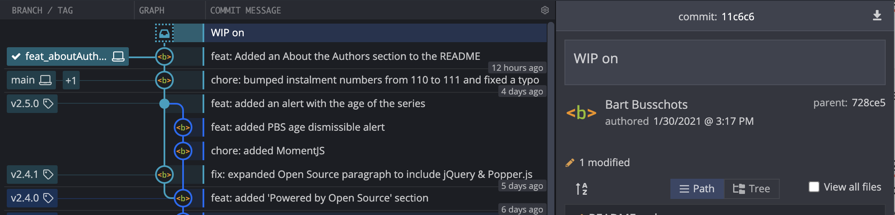

# PBS 111 — Git: Stashing Changes

The instructions in many recent instalments have involved the word *before* — *before you start work, check you're on the right branch*, *before you start work on a new feature, create a new branch*, *before you merge a change, make sure you have no uncommitted changes* and so on and so forth. The problem is we're all human, and we're just not good at remembering to do something *before* the thing we're actually trying to achieve! It's simply inevitable that we'll make changes that shouldn't be committed on the current branch, but absolutely should not be lost. Thankfully, Git has our backs with its *stashes* feature.

We're going to discover how to stash changes using a worked example. I've also engineered this example so it generates merge conflicts, that way we can consolidate our learning from the precious instalment, and hopefully continue to diminish any lingering fears of merge conflicts you might still have!

Because Git stashes are quite simple, I took this as an opportunity to throw in a little bonus material — our first look at some shell programming! Specifically, we'll learn how to use a shell variable to speed up the initialisation of the example repo from the bundle file.

## Matching Podcast Episode

Listen along to this instalment on [episode 669 of the Chit Chat Across the Pond Podcast](https://www.podfeet.com/blog/2021/01/ccatp-669/).

<audio controls src="https://media.blubrry.com/nosillacast/traffic.libsyn.com/nosillacast/CCATP_2021_01_31.mp3?autoplay=0&loop=0&controls=1">Your browser does not support HTML 5 audio 🙁</audio>

You can also <a href="https://media.blubrry.com/nosillacast/traffic.libsyn.com/nosillacast/CCATP_2021_01_31.mp3" >Download the MP3</a>

## Instalment Resources

* The instalment ZIP file — [pbs111.zip](https://github.com/bartificer/programming-by-stealth/raw/master/instalmentZips/pbs111.zip).

## Playing Along

If you'd like to play along with the examples you'll need to download this instalment's ZIP file and unzip it. Open a terminal and change to the folder into which you extracted the ZIP . You'll find a file in there named `pbs111a.bundle`, this is a bundled version of the repository we created in the previous instalment, with an additional commit added to bump the instalment number and fix a typo (the new commit is tagged `v2.5.1`).

Like we did in previous instalments, we need to make a new repository and import all the branches and tags from the bundle. We'll name our new repository `pbs111a`. To create this new repo we'll take the following steps:

1. create a folder named `pbs111a`
2. change into that folder
3. initialise it as a Git repo
4. if needed, change the default branch from `master` to `main`
5. import all branches and tags from the bundle into our new repository

Assuming you have extracted the ZIP file into a folder and opened a terminal in that folder, the commands to do this are:

```
mkdir pbs111a
cd pbs111a
git init
[ `git symbolic-ref --short HEAD` = 'master' ] && git checkout -b main
git fetch --update-head-ok ../pbs111a.bundle '*:*'
git checkout main
```

### Bonus — Be More Efficient on the Terminal with Shell Variables

Notice how often we repeat the name of the bundle and repository in the different commands. Putting our programming hat back on for a moment, that probably seems like a *bad smell*. If this was JavaScript we'd surely use a variable? Can we do the same on the terminal? Yes. Yes, we can!

Assuming you're using one of the standard Linux/macOS shells (SH, Bash, or Zsh), you can define a shell variable using the `=` operator, the syntax is simply:

```
varName=value
```

Note that there **must be no spaces around the `=` symbol**. Also note that if the value contains a space it will need to be quoted in single or double quotes.

To use a shell variable simply include it in your terminal commands pre-fixed with a `$` symbol, e.g.:

```
myFirstShellVar='boogers and poop! 😉'
echo $myFirstShellVar
```
Note that the `echo` command simply prints the value it was passed as an argument, so in this case it prints the value of our variable.

When you need to use quotes in shell commands you have the choice of using double or single quotes. For plain text there is basically no difference, but with variables there is. If you include a variable name in a string with double quotes the value of the variable is what's included in the string, if you use single quotes the name of the variable is what appears in the string:

```
bart-imac2018:pbs111a bart% echo 'single quoted var: $myFirstShellVar'
single quoted var: $myFirstShellVar
bart-imac2018:pbs111a bart% echo "double quoted var: $myFirstShellVar"
double quoted var: boogers and poop! 😉
bart-imac2018:pbs111a bart%
```

Two final thing to bear in mind. Firstly, variables that haven't had a value assigned evaluate to nothing — it's as if you typed nothing into the terminal command at the point you included the variable. You won't get any kind of error if you use a variable that has no value. E.g.:

```
bart-imac2018:pbs111a bart% echo $snot

bart-imac2018:pbs111a bart%
```

Secondly — shell variables are local to a specific shell, they only exist there. If you open another terminal the variable won't exist in it, and if you close your terminal, the shell variable is gone for ever! That also means that if you define variables with the same names in multiple shells they're completely separate variables — a value assigned in one shell won't affect the variable with the same name in another. You can prove this to yourself by opening a new terminal window:

```
bart-imac2018:~ bart% echo $myFirstShellVar

bart-imac2018:~ bart% myFirstShellVar='new value!'
bart-imac2018:~ bart% echo $myFirstShellVar
new value!
bart-imac2018:~ bart%
```

So, in the new shell there was no variable named `myFirstShellVar`, you then created one by giving it a value, and verified that the value had been stored with the `echo` command. Now, if you go back to your original shell you can see the variable named `myFirstShellVar` still has its original value:

```
bart-imac2018:pbs111a bart% echo $myFirstShellVar
boogers and poop! 😉
bart-imac2018:pbs111a bart%
```

### Initialising the Example Repo with a Shell Variable

OK, so let's use a shell variable to simplify our initialisation commands, and make them easier to update in each instalment:

```
repo=pbs111a
mkdir $repo; cd $repo
git init; [ `git symbolic-ref --short HEAD` = 'master' ] && git checkout -b main
git fetch --update-head-ok ../$repo.bundle '*:*'
git checkout main
```

The first line creates a shell variable named `repo`. The second line uses the `;` to separate two separate commands, one to create a new folder, and the other to change into it. Note the use of `$repo` to represent the repository name. The third line again uses a `;` to both initialise the newly created folder as a Git repository, and, rename the `master` branch to `main` if needed. The fourth line imports all branches and tags from the bundle, and again, notice the use of `$repo` to represent the name of the repository in the path to the bundle file. The command imports all branches and tags from `../$repo.bundle`. The `..` means *my parent folder*, and `$repo.bundle` represents `pbs111a.bundle`.

## Sometimes You Can Get Away With It

Sometimes when you forget a *before* you can just get away with it.

The most common example of this is starting work on a new feature while on the `main` branch without creating a new branch first. Assuming you realise your mistake before you stage or commit any of your changes, you can simply create a new branch and check it out, then stage and commit.

### Start a Feature on the `Main` Branch by Mistake

Let's start work on a simple feature with `main` checked out. We'll add links for Bart & Allison to `README.md`. Copy that file from the `pbs111a-2` folder in this instalment's zip into your working tree.

The `git status` command shows that we are on the `main` branch, but we should be on a feature branch, and, we have one un-staged change:

```
bart-imac2018:pbs111a bart% git status
On branch main
Changes not staged for commit:
  (use "git add <file>..." to update what will be committed)
  (use "git checkout -- <file>..." to discard changes in working directory)

	modified:   README.md

no changes added to commit (use "git add" and/or "git commit -a")
bart-imac2018:pbs111a bart%
```

No problem, let's simply make a new branch and switch to it before we do anything else:

```
bart-imac2018:pbs111a bart% git checkout -b feat_aboutAuthors
M	README.md
Switched to a new branch 'feat_aboutAuthors'
bart-imac2018:pbs111a bart%
```

Reminder — `git checkout -b` is a short-cut command that creates a new branch and checks it out in a single step.

The `git status` command now shows us on the new branch and our one un-staged change has come with us:

```
bart-imac2018:pbs111a bart% git status
On branch feat_aboutAuthors
Changes not staged for commit:
  (use "git add <file>..." to update what will be committed)
  (use "git checkout -- <file>..." to discard changes in working directory)

	modified:   README.md

no changes added to commit (use "git add" and/or "git commit -a")
bart-imac2018:pbs111a bart%
```

Let's now stage and commit our new feature (using the convenient `git commit -am` shortcut to do both actions at once):

```
git commit -am 'feat: Added an About the Authors section to the README'
```

### An Urgent Bug Fix Interrupts Our Work — We Forget to Start a New Branch

We're not quite done with this new feature — we actually need some more information about the authors really. But, we've just noticed a bug fix we should attend to ASAP, so we mentally switch gears to fixing the bug. *Before* we start work on the fix we *should* remember to create a new bug-fix branch from the last commit on `main`, but being human, we forget, and we simply start working on the bug fix.

The bug in question is that the licensing information has not been updated in the `README.md` file to match the inclusion of [jQuery](https://jquery.com/), [Popper.js](https://popper.js.org) & [Moment.js](https://momentjs.com/) in the previous instalments.

Without first checking out `main`, and without first creating a new fix branch, we start editing the licensing paragraph. Copy `README.md` from the folder `pbs111a-3` in the instalment's ZIP into your working tree.

The `git status` command shows that we're now on the wrong branch (our feature branch) with an un-staged change:

```
bart-imac2018:pbs111a bart% git status
On branch feat_aboutAuthors
Changes not staged for commit:
  (use "git add <file>..." to update what will be committed)
  (use "git checkout -- <file>..." to discard changes in working directory)

	modified:   README.md

no changes added to commit (use "git add" and/or "git commit -a")
bart-imac2018:pbs111a bart%
```

Unlike the last time we forgot to branch before we started, we're now not even at the desired branching point — the fix needs to branch off `main`, not off a half-completed feature branch!

 How do we get out of this mess? Git Stashes!

## Git Stashes

You can think of a Git stash as a temporary storage place for un-committed files. When you find that you have changes that you need to keep temporarily safe while you change branches or what not, you can simply stash them, do what you need to do, and then un-stash them.

The command to stash your un-staged changed files is simply `git stash push`, and the command to un-stash your files is simply `git stash pop`.

### A Note on Multiple Stashes

Those of you with some computer science training may well recognise  *push* and *pop* as terms used for stack manipulation. This is because Git permits you to store multiple stashes, and it stores them in a stack.

The most common way to describe a stack is like a pile of plates in a kitchen. Adding a plate to the pile is pushing onto the stack, and removing a plate is popping off from the stack. The last plate you add to a pile will be the first plate you take off, so computer scientists refer to stacks as LIFO (Last In First Out) data structures. (You can [learn more about stacks on Wikipedia](https://en.wikipedia.org/wiki/Stack_(abstract_data_type)))

So, if you create multiple Git stashes, the last set of files you stashed with `git stash push` will be the first set you get back when you use `git stash pop`.

Git names its stashes based on their position in the stack, so the *top* stash will be `stash@{0}`, the one *below* that `stash@{1}` and so on.

### Using a Git Stash

Let's use a stash to solve the problem we've just gotten ourselves into. The workflow will be quite straightforward:

1. stash the un-staged changes we made on the wrong branch
2. check out the `main` branch
3. create a new fix branch that diverges from `main`
4. un-stash our changes into this new fix branch
5. commit the changes on the new fix branch

Let's  get started by stashing our changes:

```
git stash push
```

This has removed the changes from our working tree, and saved them into a stash. In our case we had just one file with changes, `README.md`, so only that one file was included in the stash. The version of that file in our working tree is the one from the most recent commit. What that means is that we now have no un-staged changes in our working tree:

```
bart-imac2018:pbs111a bart% git status
On branch feat_aboutAuthors
nothing to commit, working tree clean
bart-imac2018:pbs111a bart%
```

Are we sure our changes are safe? Let's see of there are any stashes with the `git stash list` command:

```
bart-imac2018:pbs111a bart% git stash list
stash@{0}: WIP on feat_aboutAuthors: 728ce55 feat: Added an About the Authors section to the README
bart-imac2018:pbs111a bart%
```

This shows there's one stash (`stash@{0}`), and that it contains work in progress on a commit with a partial hash `728ce55` on the branch `feat_aboutAuthors`, and for good measure, it also shows the commit's message at the end of the line.

We can see exactly what has been stashed with the `git stash show` command:

```
bart-imac2018:pbs111a bart% git stash show
 README.md | 2 +-
 1 file changed, 1 insertion(+), 1 deletion(-)
bart-imac2018:pbs111a bart%
```

Git GUIs will generally also show you your stashes. For example, GitKraken represents a stash with an icon that looks like an email inbox to me, and it shows it connected to the commit it was pushed from with a dotted line:



Notice that the stash shows up in the tree in the middle pane, and when selected, you can see the details of the stash in the right pane.

We can now move back to the `main` branch and create a fix branch:

```
git checkout main
git checkout -b fix_missingLicenses
```

We're now in the place we should have been when making our changes, so let's retrieve our changes from the stash with the `git stash pop` command:

```
bart-imac2018:pbs111a bart% git stash pop
Auto-merging README.md
CONFLICT (content): Merge conflict in README.md
bart-imac2018:pbs111a bart%
```

Oh — our edits conflict with what was on `main` — no problem, we learned how to deal with that in [the previous instalment](pbs110).

The `git status` command shows that we have a conflict in `README.md`:

```
bart-imac2018:pbs111a bart% git status
On branch fix_missingLicenses
Unmerged paths:
  (use "git reset HEAD <file>..." to unstage)
  (use "git add <file>..." to mark resolution)

	both modified:   README.md

no changes added to commit (use "git add" and/or "git commit -a")
bart-imac2018:pbs111a bart%
```

Opening the file in our favourite text editor we can see that our stash contained both the fix we want, and, the half-baked *About the Authors* section. We can resolve this conflict by deleting the *About the Authors* section completely, and also deleting the old licensing paragraph as well as all the delimiter lines. On other words, use your favourite text editor to replace:

```
<<<<<<< Updated upstream
This project embeds a copy of the open source Bootstrap 4.5 CSS stylesheet created by [Twitter Inc.](https://twitter.com/) and released under the [MIT License](https://github.com/twbs/bootstrap/blob/main/LICENSE).
=======
This project embeds a copy of the open source Bootstrap 4.5 CSS & Javascript library created by [Twitter Inc.](https://twitter.com/). To meet Bootstrap 4's requirements this project also embeds [jQuery](https://jquery.com/) and [Popper.js](https://popper.js.org/). Finally, this project embeds a copy of the [Moment.js](https://momentjs.com) library. All of these open source libraries are released under the [MIT License](https://github.com/twbs/bootstrap/blob/main/LICENSE).

## About the Authors
[Bart](https://bart.busschots.ie/) writes the blog posts, and Bart & [Allison](https://www.podfeet.com/) record the matching podcast episodes.
>>>>>>> Stashed changes
```

With simply:

```
This project embeds a copy of the open source Bootstrap 4.5 CSS & Javascript library created by [Twitter Inc.](https://twitter.com/). To meet Bootstrap 4's requirements this project also embeds [jQuery](https://jquery.com/) and [Popper.js](https://popper.js.org/). Finally, this project embeds a copy of the [Moment.js](https://momentjs.com) library. All of these open source libraries are released under the [MIT License](https://github.com/twbs/bootstrap/blob/main/LICENSE).
```

We can now resolve the conflict by staging the updated `README.md` and committing:

```
git add README.md
git commit -m 'fix: updated licensing paragraph in README'
```

### Removing Stashes

When a stash is popped without conflict Git automatically deletes it, but, when there is a conflict Git retains the stash so you can back out of the conflict if you like. This is what has happened in our case:

```
bart-imac2018:pbs111a bart% git stash list
stash@{0}: WIP on feat_aboutAuthors: 728ce55 feat: Added an About the Authors section to the README
bart-imac2018:pbs111a bart%
```

Since we've successfully merged our stashed changes into our new fix branch, we can go ahead and delete the stash. We do this with the `git stash drop` command:

```
bart-imac2018:pbs111a bart% git stash drop
Dropped refs/stash@{0} (8e298e8b5b7b1606fb93b32a265cbb554faa16e2)
bart-imac2018:pbs111a bart% git stash list
bart-imac2018:pbs111a bart%
```

### Finishing Off Our Worked Example

We're done with stashes now, but for completeness, let's finish off our worked example.

Since our fix is now complete we're ready to merge our fix branch into the main branch and tag that with a new version.

To calculate the new version number, start by listing all the tags:

```
bart-imac2018:pbs111a bart% git tag
v1.0.0
v1.1.0
v2.0.0
v2.1.0
v2.1.1
v2.2.0
v2.3.0
v2.4.0
v2.4.1
v2.5.0
v2.5.1
bart-imac2018:pbs111a bart%
```

We can see that the most recent version is 2.5.1, and since this is a fix rather than a feature, the SemVer rules (see [instalment 109](pbs109)) require us to increment the third number, so the new version will be 2.5.2. We'll also tidy up after ourselves by deleting the  now obsolete fix branch. Remember, we have to check out `main` to merge our fix branch (`fix_missingLicenses`) into it:

```
git checkout main
git merge fix_missingLicenses
git branch -d fix_missingLicenses
git tag v2.5.2
```

We can now return to our work on the feature branch by checking that branch out:

```
git checkout feat_aboutAuthors
```

You'll find a version of `README.md` with a competed *About the Authors* section in the folder `pbs111a-4` in this instalment's ZIP, copy that file into your working tree.

We're now ready to commit our change and try merge it into the `main` branch:

```
bart-imac2018:pbs111a bart% git commit -am 'feat: added About the Authors section to README'
[feat_aboutAuthors ed4855e] feat: added About the Authors section to README
 1 file changed, 17 insertions(+), 1 deletion(-)
bart-imac2018:pbs111a bart% git checkout main
Switched to branch 'main'
bart-imac2018:pbs111a bart% git merge feat_aboutAuthors -m 'feat: added About the Authors section to README'
Auto-merging README.md
CONFLICT (content): Merge conflict in README.md
Automatic merge failed; fix conflicts and then commit the result.
bart-imac2018:pbs111a bart%
```

Oh dear, another merge conflict — we're getting pretty good at dealing with those now 🙂.

This time we need to replace the licensing section of the file from the feature branch (keeping that section from the main branch), and retain our new about the authors section.

Using your favourite text editor, replace:

```
<<<<<< HEAD
This project embeds a copy of the open source Bootstrap 4.5 CSS & Javascript library created by [Twitter Inc.](https://twitter.com/). To meet Bootstrap 4's requirements this project also embeds [jQuery](https://jquery.com/) and [Popper.js](https://popper.js.org/). Finally, this project embeds a copy of the [Moment.js](https://momentjs.com) library. All of these open source libraries are released under the [MIT License](https://github.com/twbs/bootstrap/blob/main/LICENSE).
=======
This project embeds a copy of the open source Bootstrap 4.5 CSS stylesheet created by [Twitter Inc.](https://twitter.com/) and released under the [MIT License](https://github.com/twbs/bootstrap/blob/main/LICENSE).

## About the Authors

The PBS Series is a collaboration between [Bart Busschots](https://bart.busschots.ie/) & [Allison Sheridan](https://www.podfeet.com/).

### Bart

Bart is a sysadmin who does some development by day (mostly Linux & JavaScript),  an open source developer and podcaster on eveings and weekends, and a keen amateur photographer when ever he gets a chance.

* Bart's Twitter: [@bbusschots](https://twitter.com/bbusschots)
* Bart's GitHubs: [bbusschots](https://github.com/bbusschots) (personal) & [bbusschots-mu](https://github.com/bbusschots-mu) (work)
* Bart's Stack Exchange Profile: [58440:bart-b](https://stackexchange.com/users/58440/bart-b)

### Allison

Allison is a retired IT manager with a deep-felt love of all things tech, albeit with an *ever so slight* Apple bias, and an insatiable appetite for learning.

* Allison's Twitter: [@podfeet](https://twitter.com/podfeet)
* Allison's GitHub: [NosillaCast](https://github.com/NosillaCast)
>>>>>>> feat_aboutAuthors
```

With:

```
This project embeds a copy of the open source Bootstrap 4.5 CSS & Javascript library created by [Twitter Inc.](https://twitter.com/). To meet Bootstrap 4's requirements this project also embeds [jQuery](https://jquery.com/) and [Popper.js](https://popper.js.org/). Finally, this project embeds a copy of the [Moment.js](https://momentjs.com) library. All of these open source libraries are released under the [MIT License](https://github.com/twbs/bootstrap/blob/main/LICENSE).

## About the Authors

The PBS Series is a collaboration between [Bart Busschots](https://bart.busschots.ie/) & [Allison Sheridan](https://www.podfeet.com/).

### Bart

Bart is a sysadmin who does some development by day (mostly Linux & JavaScript),  an open source developer and podcaster on eveings and weekends, and a keen amateur photographer when ever he gets a chance.

* Bart's Twitter: [@bbusschots](https://twitter.com/bbusschots)
* Bart's GitHubs: [bbusschots](https://github.com/bbusschots) (personal) & [bbusschots-mu](https://github.com/bbusschots-mu) (work)
* Bart's Stack Exchange Profile: [58440:bart-b](https://stackexchange.com/users/58440/bart-b)

### Allison

Allison is a retired IT manager with a deep-felt love of all things tech, albeit with an *ever so slight* Apple bias, and an insatiable appetite for learning.

* Allison's Twitter: [@podfeet](https://twitter.com/podfeet)
* Allison's GitHub: [NosillaCast](https://github.com/NosillaCast)
```

Save the file then stage and commit the change to complete the merge:

```
git commit -am "feat: added About the Authors section to README"
```

We can now delete the obsolete feature branch:

```
git branch -d feat_aboutAuthors
```

And finally, we should tag the current commit with a new version number. Again, `git tag` shows the current version number is 2.5.2, and since this is a feature release, the SemVer rules tell is we need to increment the second number and re-set the third to zero, so the new version should be 2.6.0:

```
git tag v2.6.0
```

With that we've added both our fix and our feature, and despite having forgotten to  move to the right branch before we got started each time, with the help of a Git stash we ended up with a repository that makes it look like we did everything perfectly first time around!

## Final Thoughts

We've come a long way on our Git journey. We are now comfortable using Git's staging area to transition our changes into a collection of meaningfully labeled commits, we're comfortable creating and merging branches to manage our workflow, and we can now use Git stashes to work around our inevitable whoopsies. We've also spent some time thinking about strategies for organising our repositories, allowing us to build up our own strategies for managing our branches, and, we've learned about some common conventions for describing commits and giving our code meaningful version numbers.

So far though, we have been working alone, on a virtual island if you will. Our repositories have been entirely stand-alone, and we have been the only people using them. This is not how Git generally gets used in the real world — it was invented to be a collaboration tool after all!

We learned in our introduction that Git was a peer-to-peer system where each collaborator would have their own copy of the repositories they're working on, and they can somehow send and receive changes between these copies.

In the next instalment we'll start to dip our toe into the collaboration waters by creating multiple related copies of our own repositories for backup and portability — we don't want the death of one of our computers to lose us all our hard work, and we want to be able to pick up where we left off from any of our multiple computers.
