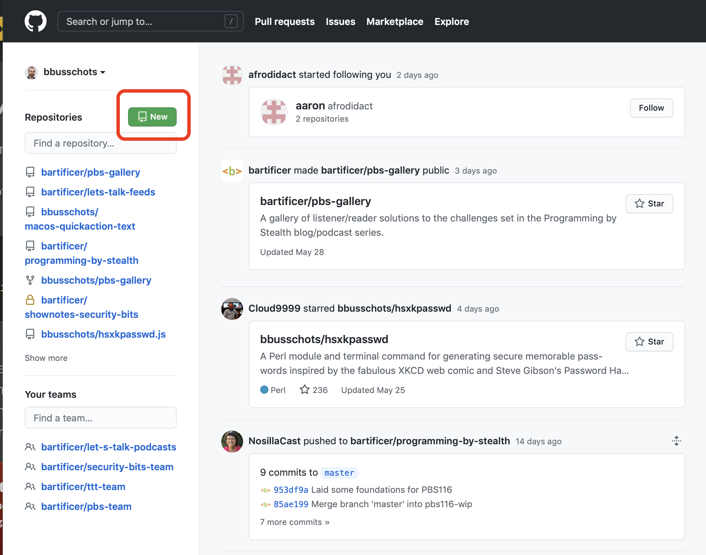
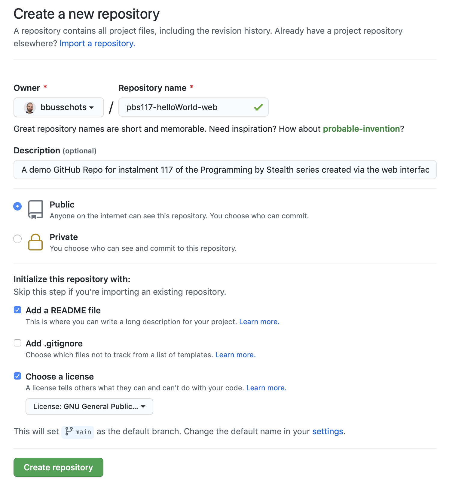
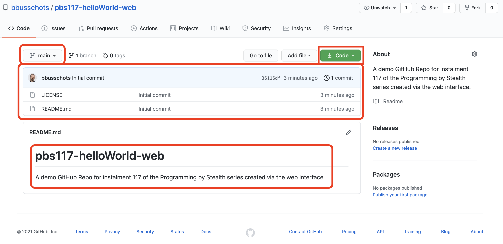
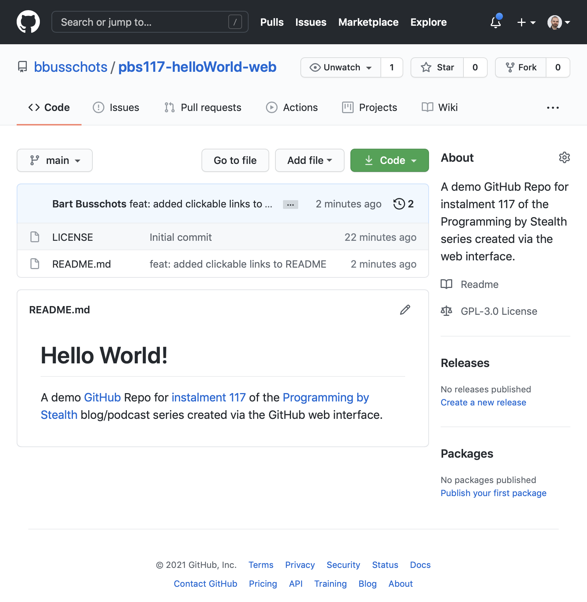
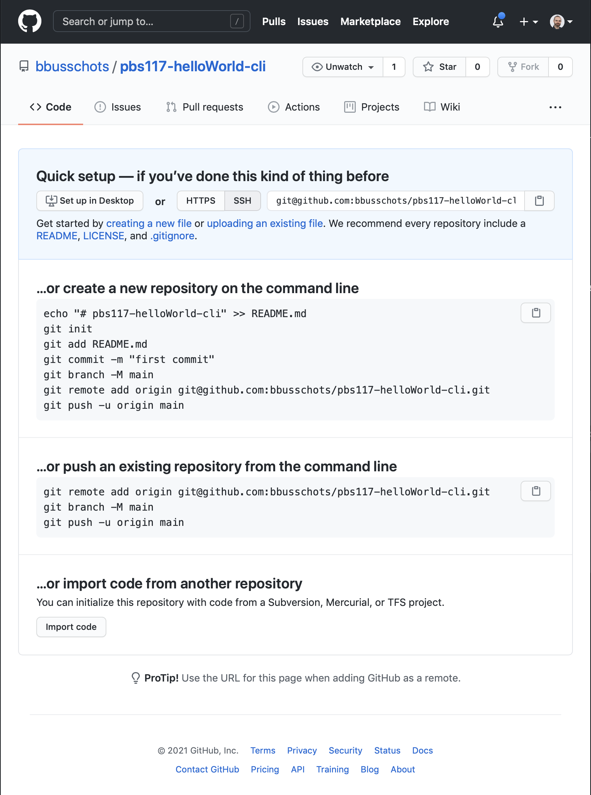
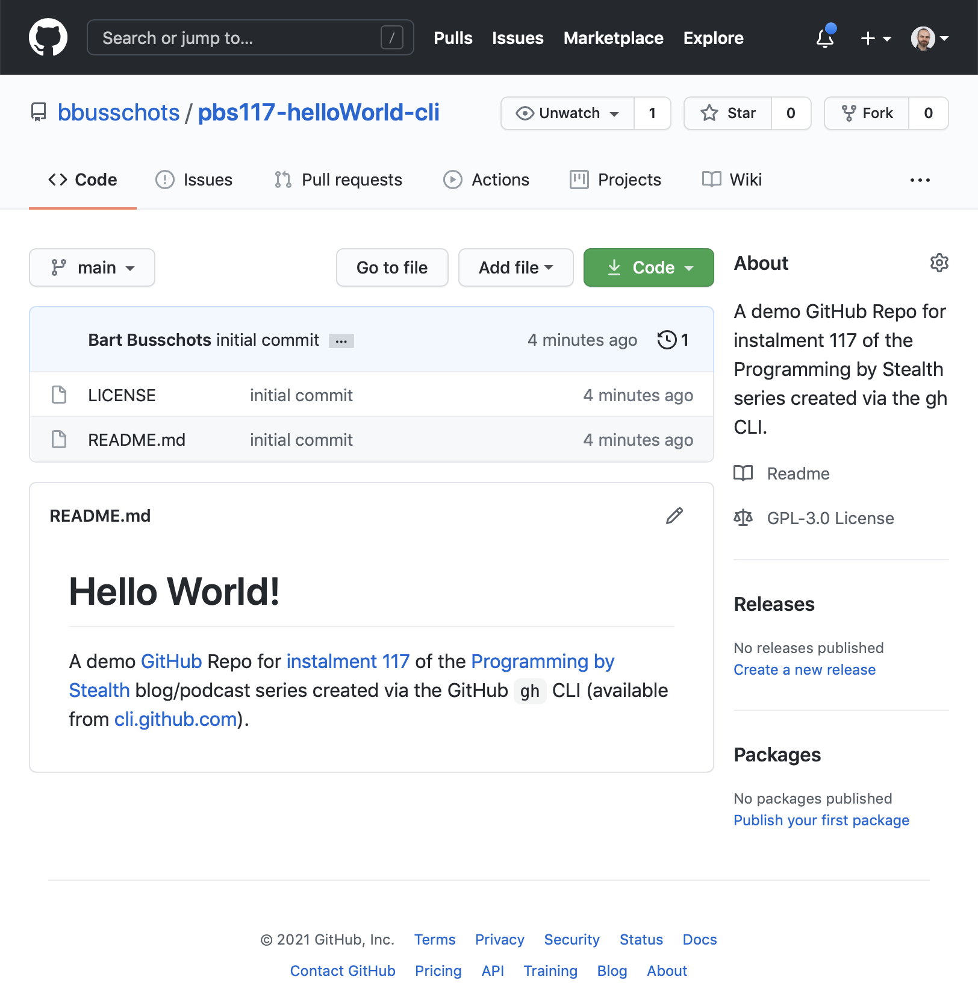

# PBS 117 — Git: Introducing GitHub

In [the previous instalment](./pbs116) we described how multiple people who all have full access to a repository can collaborate on a project. Each contributor cloned the repository to each of their development machines, then fetched, pushed, and pulled to keep all the changes in sync across the team. We also described a number of different approaches to hosting a shared repository that can act as a hub for this kind of collaboration. We described how you could run your own Git server, but these days, it's much more common to use a Software-as-a-Service (SaaS) approach and simply use someone else's Git server. There are all sorts of offerings on the market, ranging in price from free to eye-wateringly expensive. I linked to and described a few of the commonly used Git SaaS offerings in the previous instalment, but I ended by saying this series would pick just one to dive into a little more deeply — [GitHub](https://github.com/).

Why GitHub? Three reasons — it has a full-featured free tier, a long history of supporting open source developers, and, a business model that doesn't rely on tracking users and selling their data (i.e. it's not [FreePI](https://bartb.ie/freepi)). Because of this nice feature set and long history of being a good netizen, the open source community has embraced GitHub, and it's  become the go-to place to host open source software. Many high-profile open source projects are hosted on GitHub, including [jQuery](https://github.com/jquery/jquery), [Bootstrap](https://github.com/twbs/bootstrap), and the [PHP language](https://github.com/php/php-src) this series will soon be shifting its focus to soon.

In future instalments we'll learn how to use GitHub to interact with the open source community, but we need to get acquainted with GitHub before we can do that!

## Matching Podcast Episode

Listen along to this instalment on [episode 686 of the Chit Chat Across the Pond Podcast](https://www.podfeet.com/blog/2021/05/ccatp-686/).

<audio controls src="https://media.blubrry.com/nosillacast/traffic.libsyn.com/nosillacast/CCATP_2021_05_29.mp3?autoplay=0&loop=0&controls=1">Your browser does not support HTML 5 audio 🙁</audio>

You can also <a href="https://media.blubrry.com/nosillacast/traffic.libsyn.com/nosillacast/CCATP_2021_05_29.mp3" >Download the MP3</a>

## GitHub Overview

Before we can use GitHub to interact with the open source community, we need to get comfortable with GitHub itself.

At its most fundamental level GitHub is a service that allows you to host Git repositories in the cloud, and access them via any Git client. You create and manage your repositories on the GitHub website, and then you can clone them to your development computers using what ever Git tools you're using now, be it the Git CLI, a GUI app, or the Git features in your IDE (Integrated Development Environment).

As well as allowing you to create and manage repos, the GitHub interface also allows you to browse the contents of your repos. You can navigate through the various folders, view the various files, and switch between different branches, tags, and commits.

You can't just view your code on the GitHub website, you can edit it too! They have a web-based editor that does a decent job of syntax highlighting your code, and while I wouldn't recommend using the GitHub website as your primary code editor, it's great for making quick edits and fixes.

GitHub takes a more wholistic approach to hosting code — the problem they set out to solve is not *"how do we make Git hosting easier"*, but *"how do we make collaborating on code easier"*. Git is the foundation their solution is built on, but they've continued to add more and more tools over the years. GitHub repositories can contain Wikis, issue trackers, and even simple websites using GitHub Pages. In fact, this series is hosted on GitHub Pages!

Another useful feature is GitHub releases. When you tag a commit with a [semver-style](https://pbs.bartificer.net/pbs109) version number pre-fixed with the letter `v`, GitHub will automatically create pre-packaged snapshots of your repository and make them available for easy download.

GitHub have also moved into more advanced features like GitHub Actions which allow you to execute code in response to Git activities. This is part of a larger movement in software engineering towards an approach known as [CI/CD](https://www.redhat.com/en/topics/devops/what-is-ci-cd) or *Continuous Integration/Continuous Delivery* (the last D is also sometimes defined as *Deployment*). We're not going to be going that far in this series, but you might want to go explore on your own time. 🙂

## GitHub Resources

As a cloud-hosted service, GitHub is constantly changing and improving, so both the capabilities and the interface are perpetually in flux. It simply wouldn't make sense for me to waste my time in this series writing a GitHub tutorial when there are much better resources published and maintained by GitHub themselves!

The hub for all GitHub's copious documentation is [docs.github.com](https://docs.github.com/en).

You'll also find more GitHub tutorials than you can shake a proverbial stick at all over the web.

## Cloning a GitHub Repo — Authentication

Once you've set up your account on the GitHub websites and created your first repository, the next thing you'll want to do is clone it to your development computer.

Let's assume, for now, that we're using just the Git CLI, and see how we can do it from first principles.

GitHub publishes your repositories over two protocols, HTTPS, and SSH.

While it takes a little bit more work to set up, in my experience, you'll get the smoothest experience with SSH. GitHub's SSH support relies entirely on SSH keys, so there are no passwords involved.

Big-picture, the process works like this:

1. You generate an SSH Identity on your development computer (or you use an SSH identity you've already set up for SSHing to other computers). An SSH identity consists of two parts, a private key which is usually stored in a file named `id_rsa`, and a matching public key which usually stored in a file named `id_rsa.pub`. As its name suggests, you keep the private key on your computer(s), and **you never share it with anyone**!
2. You add your public key to your GitHub account (**Settings** → **SSH & GPG Keys**)
3. You open the repository on the GitHub site and get its SSH URL (by clicking the big green **Code** button and making sure the SSH tab is selected in the resulting popover)
4. You clone the repository using the `git clone` command, using the SSH URL from the previous step.

Once you have the repository cloned you can interact with it using all the standard Git commands like `git fetch`, `git pull`, and `git push`.

You might find [the chapter on SSH keys](https://ttt.bartificer.net/book.html#ttt30) in this series' older sibling series [Taming the Terminal](https://ttt.bartificer.net/) useful.

If you find the concept of SSH keys too daunting, or if you just don't like using SSH, you can use HTTPS Git URLS with GitHub, but be prepared for some faffing about, especially if you're using the standard Git CLI, or a GUI that does not support OAuth2 HTTPS authentication.

If you're using a sufficiently modern Git client you'll be able to log in to GitHub within the client quite easily using OAuth2. The client will open a web page for you, you'll log in to GitHub, grant the app permission to use your account, and then get redirected back to the app.

Many Git apps don't support OAuth2, including the current versions of the Git CLI. For those app you need to generate what GitHub calls as *Personal Access Token*, or PAT. You use a PAT as if it were a password, but it's a long randomly generated key, and it allows logins without 2FA so they work in apps that only provide a simple username and password field.

I get the impression GitHub would much prefer you not use PATs, because they're really hidden them quite well! You'll find them under **Settings** → **Developer Settings** → **Personal Access Tokens**. 

Note that if you use an HTTPS GitHub URL with the Git CLI you'll need to enter your PAT each time you fetch, pull, or push. This is why I strongly recommend using SSH URLs and SSH keys. 🙂

## Interacting with GitHub (4 Interfaces)

GitHub is becoming ever more flexible in how you interact with it. There are now four distinct ways of interacting with it — the web interface, the standard Git protocols, a special GitHub CLI, and a REST API.

### The GitHub Web Interface

Unless you need to automate the creation and/or management of GitHub repositories, the web interface is probably the simplest way to create and manage your repos.

A nice feature the web interface gives you is that if your repo contains a Markdown file named `README.md` in its root directory, a rendered version of that file is used as the body of the repos front page. This is a great place to add some basic documentation for your own future reference, or, a quick-start guide for any projects you share with others or the world.

The web can also be a good place to explore a repo and navigate around the files and folders, see what tags and branches exist, and on public repos, to explore the non-code aspects of the project, like the issues list and the wiki.

As mentioned before, you can edit code in the web interface, but it's not nearly as good an experience as using a native code editor or IDE.

### The Standard Git Protocols

Again, as previously mentioned, you can interact with GitHub repos using all the standard Git tools, be that the Git CLI, your favourite stand-alone Git GUI, or a code editor or IDE with Git support.

The advantage to doing this is that you can just continue to do everything you did when you were hosting your repositories locally. The down-side is that unless your client has added dedicated GitHub support, you'll only be able to access standard Git features, you won't use the added extras GitHub provides.

### The GitHub CLI

GitHub have developed their own command line tool for interacting with GitHub-specific features. Their CLI does not replace the standard Git CLI, but is designed to be used in parallel with it.

You use the `git` command to do the regular Git stuff, and the `gh` command to do the GitHub-specific stuff.

Like the Git CLI, the GitHub CLI is cross-platform, and you can get installation instructions and documentation at [cli.github.com](https://cli.github.com/).

### The GitHub REST API & GitHub-aware Apps

GitHub's API can be used by any developer to interact with GitHub. This is how it's possible for Git GUI apps to provide GitHub-specific functionality. Many popular Git GUI apps are starting to make use of this API, including my favourite, [Git Kraken](https://www.gitkraken.com/invite/qJbaN2yv).

GitHub also use this API to power their own cross-platform GUI apps. I find their apps a little too basic for my needs these days, but when I was new to Git I used the macOS GitHub app as my only Git interface. You can download the various apps from [desktop.github.com](https://desktop.github.com/).

## Worked Example 1 — Creating a Repo via the Web

To get settled in on GitHub, let's start by creating a simple Hello World repo, cloning it to our computer, making a simple edit, and pushing that back to the cloud.

### Prerequisites
1. You've created a GitHub account and logged in
2. You've configured either an SSH key or a PAT (Personal Access Token)

### Step 1 — Create the Repo

On the GitHub front page, click the green **New** button above the repository list on the left of the page.



On the resulting **New Repository** page, give your repository a name, optionally add a description, and for convenience, tick the box to add a README file. You might also want to add a license.

I chose the following:

* **Name**: `pbs117-helloWorld-web`
* **Description**: *A demo GitHub Repo for instalment 117 of the Programming by Stealth series created via the web interface.*
* I ticked the box to add a README
* I chose to include the GPL V3 license.



A note on naming repositories — GitHub does not allow spaces in repo names, if you try to include them they'll get replaced with dashes.

When you're happy, click the button to create the repo.

You'll get re-directed to the repository's front page which will show the list of files in the repo (the licence file and the README file in my case), and the default `README.md` file rendered as HTML below that.



You'll notice a dropdown menu above the file list that lets you switch branches, and next to that, some statistics about your repo.

You can navigate to a file by clicking on it in the list, and you can even edit a file once you open it. You'll also notice a button to add files.

### Cloning the Repo

For our purposes, the most important button on the repo's front page is the green one shouting for our attention labeled **Code**. When you click on that button a popover expands which allows us to download a snapshot of the repo, or, get the URLs for cloning it.


Notice that the SSH URL is displayed by default — another subtle nudge towards using SSH keys 🙂

Depending on whether you configured an SSH key or a PAT, copy and save the SSH or HTTPS URL.

Open your terminal,  change into a folder of your choice, and then clone the repo using the `git clone` command with the saved URL, e.g.:

```
bart-imac2018:Temp bart% git clone git@github.com:bbusschots/pbs117-helloWorld-web.git
Cloning into 'pbs117-helloWorld-web'...
Warning: Permanently added the RSA host key for IP address '140.82.121.4' to the list of known hosts.
remote: Enumerating objects: 4, done.
remote: Counting objects: 100% (4/4), done.
remote: Compressing objects: 100% (4/4), done.
remote: Total 4 (delta 0), reused 0 (delta 0), pack-reused 0
Receiving objects: 100% (4/4), 12.56 KiB | 12.56 MiB/s, done.
bart-imac2018:Temp bart%
```

Because I didn't specify a folder name as an optional extra argument, Git cloned the repository into a folder with the same name as the remote repository, i.e. `pbs117-helloWorld-web`.

Before continuing, change into your newly cloned repo, e.g.:

```
cd pbs117-helloWorld-web
```

Note that as is normal with the `git clone` command, a remote named `origin` that links back to the repo's GitHub URL has been automatically added, as has a tracking relationship between the local and remote `main` branches:

```
bart-imac2018:pbs117-helloWorld-web bart% git remote -v
origin	git@github.com:bbusschots/pbs117-helloWorld-web.git (fetch)
origin	git@github.com:bbusschots/pbs117-helloWorld-web.git (push)
bart-imac2018:pbs117-helloWorld-web bart% git branch -vv
* main 36116df [origin/main] Initial commit
bart-imac2018:pbs117-helloWorld-web bart%
```

We can now make our edits as desired. I chose to simply update `README.md` to make it a little more functional:

```markdown
# Hello World!

A demo [GitHub](https://github.com) Repo for [instalment 117](https://pbs.bartificer.net/pbs117) of the [Programming by Stealth](https://pbs.bartificer.net/) blog/podcast series created via the GitHub web interface.
```

I'm now ready to commit and push in the usual way:

```
bart-imac2018:pbs117-helloWorld-web bart% git commit -am 'feat: added clickable links to README'
[main 4fc0689] feat: added clickable links to README
 1 file changed, 3 insertions(+), 2 deletions(-)
bart-imac2018:pbs117-helloWorld-web bart% git push
Enumerating objects: 5, done.
Counting objects: 100% (5/5), done.
Delta compression using up to 4 threads
Compressing objects: 100% (3/3), done.
Writing objects: 100% (3/3), 469 bytes | 469.00 KiB/s, done.
Total 3 (delta 0), reused 0 (delta 0)
To github.com:bbusschots/pbs117-helloWorld-web.git
   36116df..4fc0689  main -> main
bart-imac2018:pbs117-helloWorld-web bart%
```

If I refresh the repo's front page on GitHub I now see the updated README:



Also notice that the file list shows the commit message of the last change to affect the each file in the file listing. The license has not been changed, so it still shows *'initial commit'*, but the README has been changed, and it shows the commit message I entered above.

## Worked Example 2 — Creating a Repo via the CLI

Let's finish by repeating the above demo using the GIT CLI rather than the web interface.

### Prerequisites
1. You've created a GitHub account
2. You've installed the `gh` CLI from [cli.github.com](https://cli.github.com/)

### A Very Quick Intro to the `gh` Command

Sensibly, GitHub chose to model their `gh` command after the `git` command, so it uses the same command-subcommand model. [The documentation](https://cli.github.com/manual/) is broken down into sections by command, `repo` for managing repositories, `auth` for managing your authentication to GitHub, and so on.

In general, the `gh` command does its best to be helpful, and it uses a lot of interactive prompts to guide you as needed. Obviously interactive prompts don't work when automating things, but don't worry, there are optional flags for answering all the questions up-front and working in an entirely non-interactive manner.

### Authenticating

Anyway, before you can start using `gh` you'll need to log in to GitHub from the CLI. As mentioned above, the command for managing your account is `auth`, and the sub-command for logging in is `login`. You can [read the full documentation here](https://cli.github.com/manual/gh_auth_login), but to do an interactive login simple run:

```
gh auth login
```

Once you're logged in, change to the folder you want your new repo created in.

### Creating & Cloning A Repo

Again, as mentioned above, the command for managing repositories is `repo`, and the sub-command to create a new repo is `create`. You can [get the full documentation here](https://cli.github.com/manual/gh_repo_create), but we can interactively create a repo with `gh repo create`, passing the name of the repo as the first argument. I like to use the `--description` flag to pre-populate the description, so in my case I used the following command to create a repo named `pbs117-helloWorld-cli`:

```
gh repo create pbs117-helloWorld-cli --description='A demo GitHub Repo for instalment 117 of the Programming by Stealth series created via the gh CLI.'
```

Again, because we didn't specify flags for all possible options, `gh` will ask us questions as we go. When asked, you do want to clone the repo.

Once the command completes, the repository will have been created in the cloud, and cloned into a new folder named with the same name as the repo. Change into that folder before continuing, e.g.:

```
cd pbs117-helloWorld-cli
```

Again, like when we used the web interface and then cloned, the remote named `origin` has been created for us, however, no tracking relationships have been set up:

```
bart-imac2018:pbs117-helloWorld-cli bart% git remote -v
origin	git@github.com:bbusschots/pbs117-helloWorld-cli.git (fetch)
origin	git@github.com:bbusschots/pbs117-helloWorld-cli.git (push)
bart-imac2018:pbs117-helloWorld-cli bart% git branch -vv
bart-imac2018:pbs117-helloWorld-cli bart% 
```

In fact, not only is there no tracking relationship, there are no branches at all — this is a completely empty repository!

If you browse to the repository in the web interface you'll see that it hasn't been initialised yet:



No problem, we can simply start working locally, then push and track our changes.

To be absolutely sure we use `main` and not `master` regardless of our Git version, it's a good idea to start by explicitly creating and checking out a `main` branch with the `git checkout -b` command:

```
bart-imac2018:pbs117-helloWorld-cli bart% git checkout -b main
Switched to a new branch 'main'
bart-imac2018:pbs117-helloWorld-cli bart%
```

Next we need to create a `README.md` file, and if desired, a `LICENSE` file. I started by copying both files from the repo I created earlier, then editing `README.md` to the following:

```markdown
# Hello World!

A demo [GitHub](https://github.com) Repo for [instalment 117](https://pbs.bartificer.net/pbs117) of the [Programming by Stealth](https://pbs.bartificer.net/) blog/podcast series created via the GitHub `gh` CLI (available from [cli.github.com](https://cli.github.com/)).
```

I could then add and commit the files in the normal way:

```
bart-imac2018:pbs117-helloWorld-cli bart% git add LICENSE README.md 
bart-imac2018:pbs117-helloWorld-cli bart% git commit -am 'initial commit'
[main (root-commit) 1658e33] initial commit
 2 files changed, 677 insertions(+)
 create mode 100644 LICENSE
 create mode 100644 README.md
bart-imac2018:pbs117-helloWorld-cli bart% 
```

At this point we have a local repository that's been initialised with a first commit that knows about a matching cloud repository, but there's no tracking relationship between any branches yet, and in fact, the cloud repository is still completely empty.

Let's push our new `main` branch to the cloud and track it:

```
bart-imac2018:pbs117-helloWorld-cli bart% git push -u origin main
Enumerating objects: 4, done.
Counting objects: 100% (4/4), done.
Delta compression using up to 4 threads
Compressing objects: 100% (4/4), done.
Writing objects: 100% (4/4), 12.26 KiB | 6.13 MiB/s, done.
Total 4 (delta 0), reused 0 (delta 0)
To github.com:bbusschots/pbs117-helloWorld-cli.git
 * [new branch]      main -> main
Branch 'main' set up to track remote branch 'main' from 'origin'.
bart-imac2018:pbs117-helloWorld-cli bart% 
```

Notice that the tracking relationship has been established, so we now have the same situation we had with our web-created repo:

```
bart-imac2018:pbs117-helloWorld-cli bart% git remote -v
origin	git@github.com:bbusschots/pbs117-helloWorld-cli.git (fetch)
origin	git@github.com:bbusschots/pbs117-helloWorld-cli.git (push)
bart-imac2018:pbs117-helloWorld-cli bart% git branch -vv
* main 1658e33 [origin/main] initial commit
bart-imac2018:pbs117-helloWorld-cli bart%
```

Also, if we refresh the repo's front page on the GitHub website we can now see our initial code:



## Final Thoughts

Hopefully you're now settled in and comfortable using GitHub to house repos in the cloud. You could leave it here and simply use GitHub for your personal projects, but why not capitalise on the power of GitHub and take thing up a notch or two?

In the next instalment we'll focus on one of the most useful features GitHub offers — free web hosting of client-side web sites and web apps. Using GitHub it's easy to develop and publish a client-side web app (HTML + CSS + JavaScript) entirely within a single repo. You get all the power of Git, and free web hosting! If you're prepared to register a domain, you can even get the free hosting on a custom domain of your choosing! All this is possible thanks to the power of [GitHub Pages](https://pages.github.com/), which will'll dive into in the next instalment.
