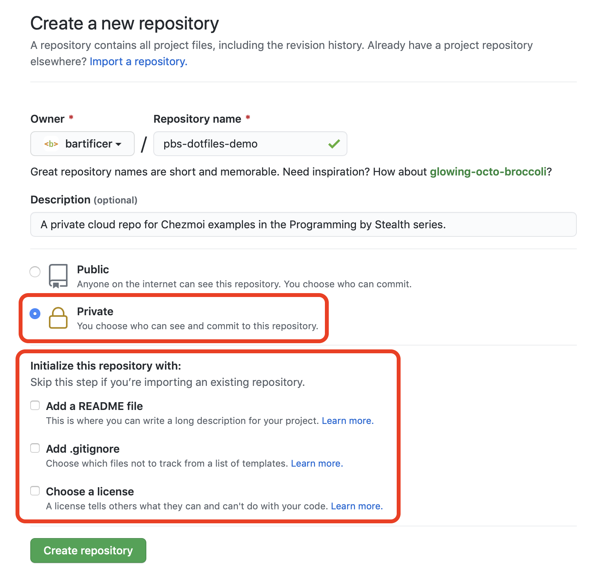
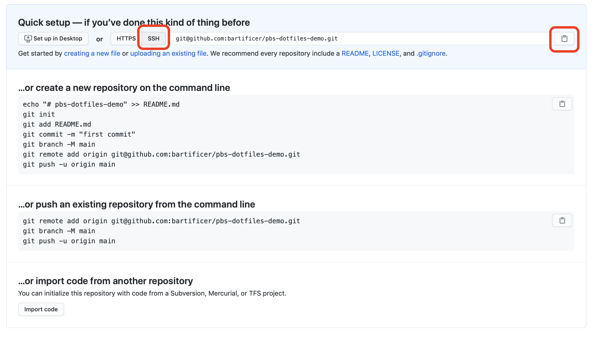

# PBS 123 of X — Backing up and Syncing Dot Files with Chezmoi

In [the previous instalment](./pbs122) we learned how to use [Chezmoi](https://www.chezmoi.io/) to do basic *dot file* management. We learned how to add targets to Chezmoi's source state, to edit targets in the source state, to apply the source state to the destination directory, and finally, to remove targets from the source state and optionally also the target directory. We also learned how to use the Git repo Chezmoi creates for us to version our dot files, and how to add a configuration file to tweak Chezmoi's behaviour. In short — we learned the Chezmoi basics.

Versioning your dot files on a single computer is valuable — it gives you a *get out of jail free* card should you mess up, but obviously there's more value in getting your dot files into the cloud at the very least, if not also synchronising your dot files across computers.

We'll start this instalment by leveraging Chezmoi's use of Git to back our dot files up to the cloud, but then we'll take what might seem like a strange turn — we'll explore Chezmoi's support for templates. Why? Because templates are critically important to getting your Git files to work well across multiple machines.

## Matching Podcast Episode

TO DO

## Backing Your Dot Files Up to the Cloud

There's no one way to get a Git repo from your local machine into the cloud, and at the end of the day, what ever works, works, but in my experience the following is the path of least resistance:

1. Create **empty** (uninitialised) **private** repo in the cloud
2. Add empty cloud repo to the local repo as a remote named `origin`
3. Push and track the current local branch

To get a good backup you don't have to use a hosted cloud service, you could use another computer on your home network, or a NAS of some kind, but the simplest option is probably a private repo on GitHub. That's what I'll be doing in this worked example.

### Step 1 — Create a Private Repo in the Cloud

Again, you could use any remote Git repo, I', just using GitHub because it's free and easy.

Create a new repository in GitHub. Give it a name and description that make sense to you, then be sure to select *Private* rather than the default of *Public*, and finally, be sure **not** to check **any** of the boxes in the *Initialise this repository with* section.



Once the repository is created you'll be presented with a screen showing various options for getting content into the empty repository. All we want from this screen is the repo's URL, for SSH if you have keys set up, or for HTTPS if you don't.



Armed with your repo's URL, open a Terminal and enter your Chezmoi source directory with the `chezmoi cd` command.

Remember that your Chezmoi source directory is a Git repo, so you can now use the regular Git commands to add your new repo as a remote named `origin`. Once the remote has been added, you want to push the current local branch to `origin` and set it up to track.

As an example, here's the entire process on my Mac:

```
bart-imac2018:~ bart% chezmoi cd
bart-imac2018:chezmoi bart% git remote add origin git@github.com:bartificer/pbs-dotfiles-demo.git
bart-imac2018:chezmoi bart% git push -u origin master
Enumerating objects: 13, done.
Counting objects: 100% (13/13), done.
Delta compression using up to 4 threads
Compressing objects: 100% (10/10), done.
Writing objects: 100% (13/13), 1.34 KiB | 1.34 MiB/s, done.
Total 13 (delta 4), reused 0 (delta 0)
remote: Resolving deltas: 100% (4/4), done.
To github.com:bartificer/pbs-dotfiles-demo.git
 * [new branch]      master -> master
Branch 'master' set up to track remote branch 'master' from 'origin'.
bart-imac2018:chezmoi bart%
```

Depending on your version of Git, your Chezmoi repo may have been created with `main` rather than `master`, you can check your branch name with `git status`.

That's all there is to it, you can now push all your changes as you would with any other repo.

### Automatically Pushing

In the previous instalment we learned that we could configure Chezmoi to automatically add new files to Git, and optionally automatically commit them too. Well, there is a third option, you can automatically push the automatic commits by setting the config variable `git.autoPush` to `true`. Just like `git.autoCommit` implies `git.autoAdd`, `git.autoPush` implies `git.autoCommit` which implies `git.autoAdd`.

Since I like to name and manage my own commits, I don't enable this setting.

## Templating Refresher

It's been a while since we used templates in this series, so it's worth taking a moment to remind ourselves of the basic concept. A templating engine takes template text containing some kind of placeholders and some data as input, and combines them to produce output text. So far in this series we've used just one templating engine — the JavaScript implementation of Moustache, but that's just one option of many.

## Templates in Chezmoi

The people behind Chezmoi very wisely chose not to invent their own templating language, but unfortunately for us, they didn't choose to use Moustache 🙁 Given that Chezmoi is written in the [Go language](https://golang.org), it's probably not surprising that they chose to use Go's [text/template package](https://pkg.go.dev/text/template).

The syntax is a little bit different to Moustache, but it's not more difficult. Unfortunately, the official documentation is not particularly human-friendly — it has all the information you could possibly need, but the intended audience is Go programmers using `text/template` directly, not sysadmins using it indirectly through a third-party tool like Chezmoi. But don't worry, we'll cover the basics later in this instalment.

## Template Data in Chezmoi

The template text will be the contents of our dot files in the source state, and the outputs of our templates will be the contents of our dot files in the destination directory, but where will the data come from? 

Chezmoi gives us some sensible data out-of-the-box, and we get to define any additional data we'd like to have available.

Regardless of where the data comes from, you can always see the data Chezmoi currently knows about with the `chezmoi data` command. By default this command outputs in JSON, which is perfect for us.

### Chezmoi's Standard Data

Before we add any data of our own, let's see what Chezmoi gives us out-of-the-box:

```
bart-imac2018:~ bart% chezmoi data
{
  "chezmoi": {
    "arch": "amd64",
    "fqdnHostname": "",
    "group": "staff",
    "homeDir": "/Users/bart",
    "hostname": "bart-imac2018",
    "kernel": {},
    "os": "darwin",
    "osRelease": {},
    "sourceDir": "/Users/bart/.local/share/chezmoi",
    "username": "bart",
    "version": {
      "builtBy": "Homebrew",
      "commit": "a3fb755a88315bbdecedba3d849324752989400d",
      "date": "2021-07-14T19:42:34Z",
      "version": "2.1.2"
    }
  }
}
bart-imac2018:~ bart% 
```

Notice that all the standard data is in an object named `chezmoi`.

### Adding Your Own Data

You have two choices for how to add your own data, and you can mix-and-match if you like. You can add data directly in your Chezmoi config file, or, into a stand-alone data file. For now, it makes no difference where you define your data, but when you start to use Chezmoi across multiple computers you'll find that it's best to define data that's universal in the stand-alone data file, and data that changes from computer to computer in the config file.

Let's start by adding some data directly into our config file. This worked example assumes you created a Chezmoi config file while following along with the previous instalment's examples. If not, the following command will create an empty Chezmoi config file if none exists already:

```
[[ -f ~/.config/chezmoi/chezmoi.json ]] || echo '{}' >> ~/.config/chezmoi/chezmoi.json
```

Now that we're sure we have a config file, let's edit it using `chezmoi edit-config` (see the previous instalment for setting the editor Chezmoi will use).

To add data, simply make a new section (top-level object) named `data`, and add any data you like. Here's what my config files looks like after I added my data section:

```json
{
  "edit": {
    "command": "/usr/bin/open",
    "args": ["-a", "/Applications/Smultron.app", "-F", "-n", "-W"]
  },
  "git": {
    "autoAdd": true
  },
  "data": {
  	"name": "Bart Busschots",
  	"organisation": "Bartificer Creations",
  	"email": "opensource@bartificer.net"
  }
}

```

If we now run the `chezmoi data` command again we should see the data we added:

```
bart-imac2018:~ bart% chezmoi data
{
  "chezmoi": {
    "arch": "amd64",
    "fqdnHostname": "",
    "group": "staff",
    "homeDir": "/Users/bart",
    "hostname": "bart-imac2018",
    "kernel": {},
    "os": "darwin",
    "osRelease": {},
    "sourceDir": "/Users/bart/.local/share/chezmoi",
    "username": "bart",
    "version": {
      "builtBy": "Homebrew",
      "commit": "a3fb755a88315bbdecedba3d849324752989400d",
      "date": "2021-07-14T19:42:34Z",
      "version": "2.1.2"
    }
  },
  "email": "opensource@bartificer.net",
  "name": "Bart Busschots",
  "organisation": "Bartificer Creations"
}
bart-imac2018:~ bart% 
```

As well as defining our own data in the config file, we can also add data via a dedicated data file. Like Chezmoi's config file, the data file can be in any of the formats Chezmoi supports, but the extension must match the format of the file's contents. Regardless of the format, the data file's base name must be `.chezmoidata`. Since we'll be using JSON, our file must be named `.chezmoidata.json`. 

The data file needs to be stored in the source directory, but it will not be part of the source state. That is to day, the data file will not get copied into the destination folder when we run `chezmoi apply`.

Because the data file is not part of the source state, we can't edit it with  the `chezmoi edit` command. Instead, we need to use our own text editor of choice. Remember that the `chezmoi source-path` command will show the location of your source directory, and `chezmoi cd` will open a new shell in your source directory.

An an example I created the following simple data file and saved it as `~/.local/share/chezmoi/.chezmoidata.json`:

```json
{
  "socialMedia": {
    "flickr:": "bbusschots",
    "twitter": "bbusschots"
  },
  "url": {
  	"personal": "https://bartb.ie/",
  	"podcasting": "https://lets-talk.ie/",
  	"consulting": "https://bartificer.net/"
  },
  "languages": ["English", "Nederlands", "Vlaams", "Gaeilge", "Français"]
}
```

And again, once this file is saved, the data defined within it becomes visible via the `chezmoi data` command.

```
bart-imac2018:~ bart% chezmoi data                                
{
  "chezmoi": {
    "arch": "amd64",
    "fqdnHostname": "",
    "group": "staff",
    "homeDir": "/Users/bart",
    "hostname": "bart-imac2018",
    "kernel": {},
    "os": "darwin",
    "osRelease": {},
    "sourceDir": "/Users/bart/.local/share/chezmoi",
    "username": "bart",
    "version": {
      "builtBy": "Homebrew",
      "commit": "a3fb755a88315bbdecedba3d849324752989400d",
      "date": "2021-07-14T19:42:34Z",
      "version": "2.1.2"
    }
  },
  "email": "opensource@bartificer.net",
  "languages": [
    "English",
    "Nederlands",
    "Vlaams",
    "Gaeilge",
    "Français"
  ],
  "name": "Bart Busschots",
  "organisation": "Bartificer Creations",
  "socialMedia": {
    "flickr:": "bbusschots",
    "twitter": "bbusschots"
  },
  "url": {
    "consulting": "https://bartificer.net/",
    "personal": "https://bartb.ie/",
    "podcasting": "https://lets-talk.ie/"
  }
}
bart-imac2018:~ bart%
```

Before we go any further, let's commit and push our data file!

```
bart-imac2018:~ bart% chezmoi cd
bart-imac2018:chezmoi bart% git status  
On branch master
Your branch is up to date with 'origin/master'.

Untracked files:
  (use "git add <file>..." to include in what will be committed)

	.chezmoidata.json

nothing added to commit but untracked files present (use "git add" to track)
bart-imac2018:chezmoi bart% git add .chezmoidata.json
bart-imac2018:chezmoi bart% git commit -am "Feat: added data file"
[master 5d61605] Feat: added data file
 1 file changed, 12 insertions(+)
 create mode 100644 .chezmoidata.json
bart-imac2018:chezmoi bart% git push
Enumerating objects: 4, done.
Counting objects: 100% (4/4), done.
Delta compression using up to 4 threads
Compressing objects: 100% (3/3), done.
Writing objects: 100% (3/3), 552 bytes | 552.00 KiB/s, done.
Total 3 (delta 0), reused 0 (delta 0)
To github.com:bartificer/pbs-dotfiles-demo.git
   4cef320..5d61605  master -> master
bart-imac2018:chezmoi bart% exit
bart-imac2018:~ bart% 
```

## Using Templates

Before we can start using Chezmoi's template syntax we need to learn how to tell Chezmoi to treat a target as a template rather than a plain file.

We can convert an exiting target from a plain file into a template with the `chezmoi chattr +template`, for change attribute, command (or the shortcut form `chezmoi chattr t`).

We can directly add a new target as a template using the `--template` flag with the `chezmoi add` comment, and we can even have Chezmoi automatically replace values with variables names when creating the template by using the `--autotemplate` flag instead.

## Chezmoi Template Basics

The easiest way to learn Chezmoi templates is with some worked examples.

The intention here is not to cover every possible thing you can do with Chezmoi templates, but instead, to teach you the 10% of what it can do that will give you everything you want 90% of the time. We'll learn about a few slightly more advanced features in the next instalment.

### Worked Example 1 — Converting an Existing Target to a Template with simple Variable Substitutions

This worked example assumes you already have a Git config file. If not, you can conditionally create a blank one with the following command:

```
[[ -f ~/.gitconfig ]] || echo '[core]' >> ~/.gitconfig
```

You can then add it to Chezmoi with:

```
chezmoi add ~/.gitconfig
```

Before we begin, let's remind ourselves how how Chezmoi stores targets in the source state, specifically, how it's storing our Git config file:

```
bart-imac2018:~ bart% ls -1 `chezmoi source-path` | grep gitconfig
dot_gitconfig
bart-imac2018:~ bart%
```

This command lists all the files in the source state one file per line, then filters for lines containing *gitconfig*.

As you can see, Chezoi has applied it's renaming rules, and the target `~/.gitconfig` is stored in the source state as `dot_gitconfig`.

Now let's convert it to a template:

```
chezmoi chattr +template ~/.gitconfig
```

How has that changed the target's representation in the source state?

```
bart-imac2018:~ bart% ls -1 `chezmoi source-path` | grep gitconfig
dot_gitconfig.tmpl
bart-imac2018:~ bart% 
```

The file name has changed from `dot_gitconfig` to `dot_gitconfig.tmpl`. The contents of the file has not been changed though:

```
bart-imac2018:~ bart% chezmoi status
bart-imac2018:~ bart%
```

Let's now edit the the target with `chezmoi edit ~/.gitconfig`.

If your file already has a `[user]` section, edit it so it contains at least the contents below, and if it doesn't add the contents below as a new section:

```
[user]
	email = {{ .email }}
	name = {{ .name }}
```

In Chezmoi templates, the syntax for inserting a piece of data is the path to the piece of data in the Chezmoi data object pre-fixed with a period, enclosed in double curly braces.

Now that we've updated our template, we need to apply it with `chezmoi apply`.

When I applied the change the `[user]` section of my `~/.gitconfig` was changed to:

```
[user]
	email = opensource@bartificer.net
	name = Bart Busschots
```

Before we continue, let's  commit this change:

```
bart-imac2018:~ bart% chezmoi cd              
bart-imac2018:chezmoi bart% git status
On branch master
Your branch is up to date with 'origin/master'.

Changes to be committed:
  (use "git reset HEAD <file>..." to unstage)

	renamed:    dot_gitconfig -> dot_gitconfig.tmpl

bart-imac2018:chezmoi bart% git commit -m "Feat: converted git config to a template"
[master 27f2e39] Feat: converted git config to a template
 1 file changed, 2 insertions(+), 2 deletions(-)
 rename dot_gitconfig => dot_gitconfig.tmpl (86%)
bart-imac2018:chezmoi bart% git push
Enumerating objects: 4, done.
Counting objects: 100% (4/4), done.
Delta compression using up to 4 threads
Compressing objects: 100% (3/3), done.
Writing objects: 100% (3/3), 541 bytes | 541.00 KiB/s, done.
Total 3 (delta 1), reused 0 (delta 0)
remote: Resolving deltas: 100% (1/1), completed with 1 local object.
To github.com:bartificer/pbs-dotfiles-demo.git
   5d61605..27f2e39  master -> master
bart-imac2018:chezmoi bart% exit
bart-imac2018:~ bart% 
```

Note that I used the `chezmoi cd` command to create a new shell in the source directory to do my Git work, then exited out of that new shell to return to where I was. Also note that because my config file sets `git.autoAdd` to `true` the changes were already staged and ready for me to commit.

## Worked Example 2 — Adding a New Target as a Template with Automatic Templating

For this next example I picked a dot file from deep in my past, `~/.plan`.

When I was at university, it was normal for IT Societies to run a central server that everyone would SSH into. On that server members could have an email account we'd interact with through a text-only mail client like Mutt or Pine, we'd chat using a text-only IRC client, we'd post to bulletin boards using a text-only NNTP client, and we'd send each other direct messages using the `write` command (or a nice wrapper around `write` called `hey`). We could also host web pages by placing HTML files in a folder named `public_html`, a convention you still see on some shared hosting plans.

Anyway, with everyone logged into the same server over SSH, how were supposed to find your friends? How were people supposed to figure out that the user `voyager` was actually me? (I chose the name in honour of the space craft, not the as-yet-unwritten Star Trek series!) The answer was the `finger` command. By default it showed basic info, but if you wanted to show more you could add a file to your home directory named `~/.plan`, and it would get appended to the bottom of the output when people fingered you. Your `.plan` file could be as long as you liked, so people often used them as microblogging services before anyone had ever even dreamed of something like Twitter or Medium.

Believe it or not, `finger` is still around, and even ships with modern Macs! To finger a user on your Mac, simply pass your username as the only argument. If you're not sure what your unix username is on your Mac, you can access it via the `$USERNAME` environment variable, so you can always see your own account information with:

```
finger $USERNAME
```

Before adding a `.plan` file, this is what my account information looks like:

```
bart-imac2018:~ bart% finger $USERNAME
Login: bart           			Name: Bart Busschots
Directory: /Users/bart              	Shell: /bin/zsh
On since Wed 11 Aug 16:24 (IST) on console, idle 9 days 22:59 (messages off)
On since Thu 19 Aug 23:49 (IST) on ttys000
On since Fri 20 Aug 00:05 (IST) on ttys001, idle 3:03
No Mail.
No Plan.
bart-imac2018:~ bart% 
```

Let's now create a basic `~/.plan` file. Using my favourite editor I created a file with the following contents:

```
Hi there, I'm Bart Busschots from Bartificer Creations.
```

Let's now add that file into Chezmoi and simultaneously convert it into a template:

```
chezmoi add --autotemplate ~/.plan 
```

It's important to note that the contents of the file contained text that is also stored in Chezmoi data fields, specifically, my name and organisation from the `.name` and `.organisation` fields. Because I used the `--autotemplate` flag the target was immediately added as a template, we can see that because the file has a `.tmpl` extension:

```
bart-imac2018:~ bart% ls -1 `chezmoi source-path` | grep plan
dot_plan.tmpl
bart-imac2018:~ bart% 
```

This would have been true has I used `--template` too, so what makes `--autotemplate` so automatic? Let's have a look at the contents of the file in the source directory:

```
bart-imac2018:~ bart% cat `chezmoi source-path ~/.plan`
Hi there, I'm {{ .name }} from {{ .organisation }}.
bart-imac2018:~ bart% 
```

All text matching my data has been replace with the appropriate variable!

Before we finish up for the day, let's expand our plan so we can see how to include more complex data in our templates.

### Looping over Arrays

First, let's loop over an array by editing the plan as follows:

```
Hi there, I'm {{ .name }} from {{ .organisation }}.

I speak:
{{ range .languages }}
* {{ . }}
{{ end }}
```

### Testing Templates

We could see how this looks by applying the change and then looking at the resulting file in our home directory, but that seems a lot of faffing about. Thankfully there is an easier way — we can use the `chezmoi cat` command to see what a target will look like when deployed:

```
bart-imac2018:~ bart% chezmoi cat ~/.plan
Hi there, I'm Bart Busschots from Bartificer Creations.

I speak:

* English

* Nederlands

* Vlaams

* Gaeilge

* Français
bart-imac2018:~ bart% 
```

OK, so we see that the section of the template between the `range` operator and the `end` tags has been repeated once for each element in the array named `.languages`, and, that the current element of the array is made available as the special variable `.`.

This does allow looping, but newline characters have not been handled well!

### Trimming White Space

One of my favourite features of the text/template syntax is it's built-in trim specifiers. If you want to automatically remove all white space characters (spaces, tabs, newlines, etc.) before or after a template tag, simply add a `-` directly inside the relevant side or sides of the tag.

In our case we don't want a newline character inserted before the `*` each time we go around the loop, so, we replace `{{ range .languages }}` with `{{ range .languages -}}`.

With that simple change, our template now works as desired:

```
bart-imac2018:~ bart% chezmoi cat ~/.plan
Hi there, I'm Bart Busschots from Bartificer Creations.

I speak:
* English
* Nederlands
* Vlaams
* Gaeilge
* Français
bart-imac2018:~ bart%
```

### Looping over Objects

Let's now use the `range` tag to loop over an object:

```
Hi there, I'm {{ .name }} from {{ .organisation }}.

I speak:
{{ range .languages -}}
* {{ . }}
{{ end }}
You'll find me on:
{{ range $key, $val := .socialMedia -}}
* on {{ $key }} as {{$val}}
{{ end }}
```

We're looping over the object named `.socialMedia` containing key-value pairs where the keys are the names of the social media site, and the values are usernames.  We do this by defining two variables that will change each time we loop, the first variable will contain the key, the second, the value. I chose to name my two variables `$key` and `$val`, but I could have named them anything I like (as long as its pre-fixed with a `$`). In fact, let's re-write the loop to use more intuitive names:

```
Hi there, I'm {{ .name }} from {{ .organisation }}.

I speak:
{{ range .languages -}}
* {{ . }}
{{ end }}
You'll find me on:
{{ range $site, $uname := .socialMedia -}}
* on {{ $site }} as {{$uname}}
{{ end }}
```

Let's see the final result:

```
bart-imac2018:~ bart% chezmoi cat ~/.plan
Hi there, I'm Bart Busschots from Bartificer Creations.

I speak:
* English
* Nederlands
* Vlaams
* Gaeilge
* Français

You'll find me on:
* on flickr: as bbusschots
* on twitter as bbusschots
bart-imac2018:~ bart% 
```

Now we're ready to apply and commit the change:

```
bart-imac2018:~ bart% chezmoi apply
bart-imac2018:~ bart% chezmoi cd                         
bart-imac2018:chezmoi bart% git status
On branch master
Your branch is up to date with 'origin/master'.

Changes to be committed:
  (use "git reset HEAD <file>..." to unstage)

	new file:   dot_plan.tmpl

bart-imac2018:chezmoi bart% git commit -m "Feat: added plan"
[master 1762f44] Feat: added plan
 1 file changed, 10 insertions(+)
 create mode 100644 dot_plan.tmpl
bart-imac2018:chezmoi bart% git push
Enumerating objects: 4, done.
Counting objects: 100% (4/4), done.
Delta compression using up to 4 threads
Compressing objects: 100% (3/3), done.
Writing objects: 100% (3/3), 425 bytes | 425.00 KiB/s, done.
Total 3 (delta 1), reused 0 (delta 0)
remote: Resolving deltas: 100% (1/1), completed with 1 local object.
To github.com:bartificer/pbs-dotfiles-demo.git
   27f2e39..1762f44  master -> master
bart-imac2018:chezmoi bart% exit
bart-imac2018:~ bart% 
```

Again, note that the new file was automatically added because I have the Chezmoi setting `git.autoAdd` set to `true`, so all I had to do was commit and push it.

Finally, let's see our plan in action!

```
bart-imac2018:~ bart% finger $USERNAME
Login: bart           			Name: Bart Busschots
Directory: /Users/bart              	Shell: /bin/zsh
On since Wed 11 Aug 16:24 (IST) on console, idle 10 days 0:03 (messages off)
On since Thu 19 Aug 23:49 (IST) on ttys000
On since Fri 20 Aug 00:05 (IST) on ttys001, idle 4:07
No Mail.
Plan:
Hi there, I'm Bart Busschots from Bartificer Creations.

I speak:
* English
* Nederlands
* Vlaams
* Gaeilge
* Français

You'll find me on:
* on flickr: as bbusschots
* on twitter as bbusschots
bart-imac2018:~ bart% 
```

## Final Thoughts

At this point in our Chezmoi journey we have our dot files safely backed up to the cloud, and we've started to inject values into our dot files using templates. We're now ready to take things to the next level and start to use a single set of dot files across multiple computers. To make this work in a practical and reliable way we'll need to learn how to incorporate conditional statements into our templates so we can have the same source state translate into different target states depending on the computer they're being applied on. This will be the focus of our next instalment.