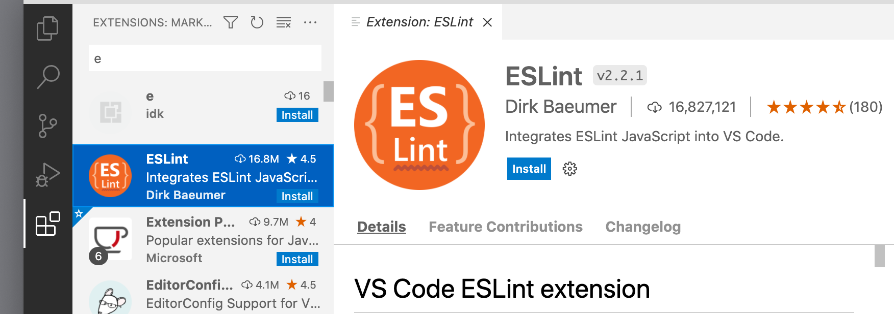
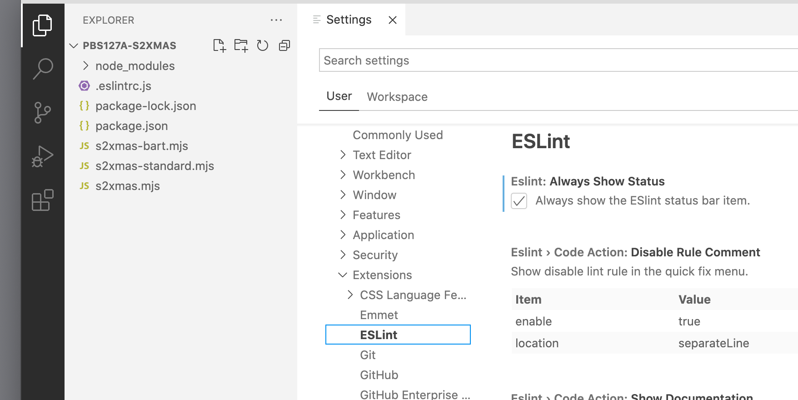
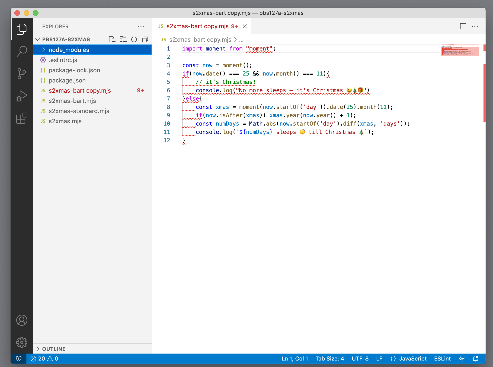
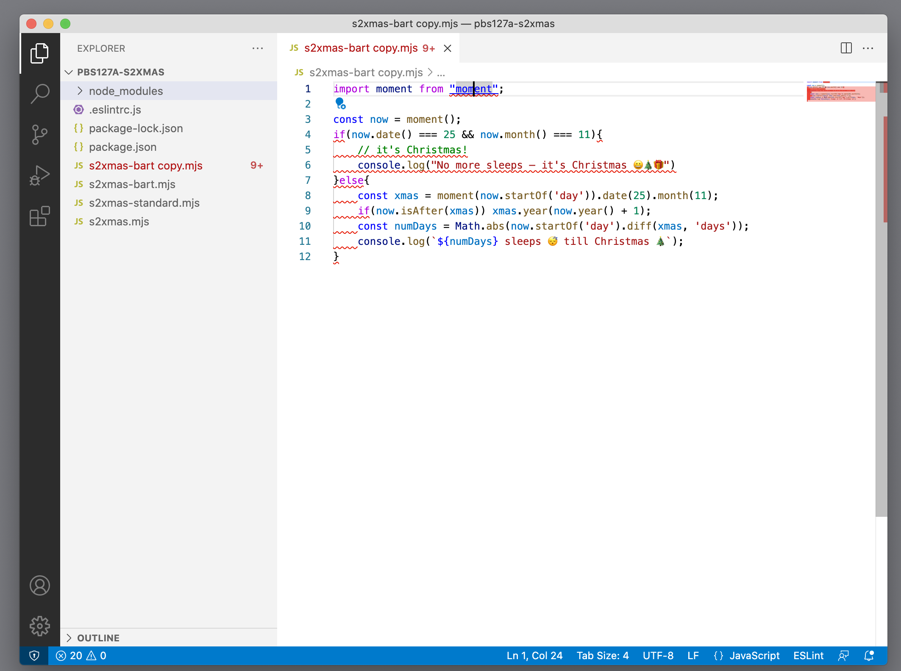
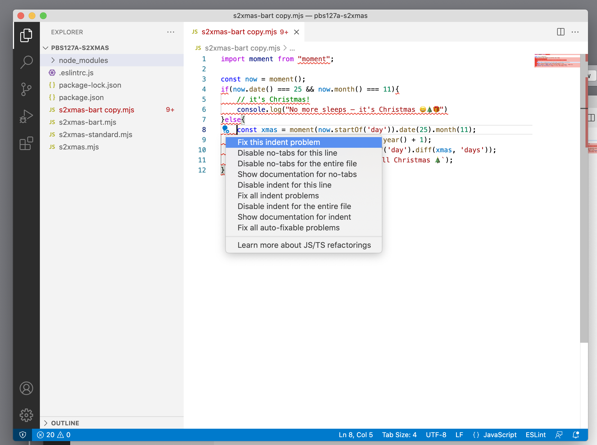
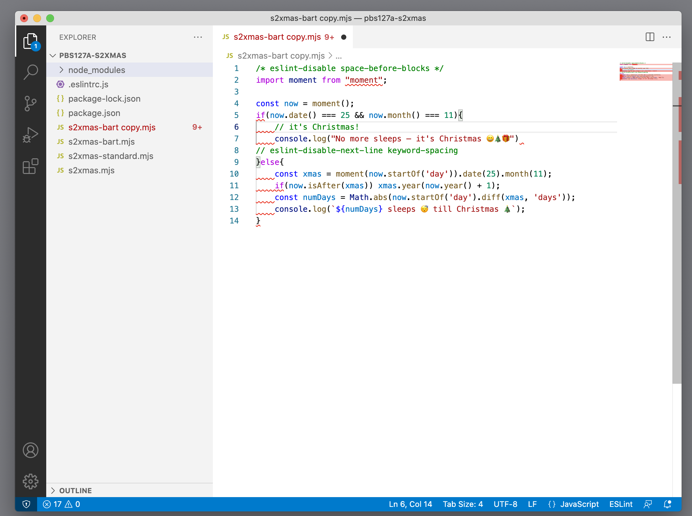

# ESLint tutorial

## A linter

This instalment we are going to expand our toolbox with a linter. A [linter](https://en.wikipedia.org/wiki/Lint_(software)) analyses your code for bugs and programming errors and suggests code improvements.
Think of it as your little helper that nudges you to write better and consistent code.
The name linter is actually derived from the fluff you find in your dryer and was invented in 1978, so the concept is really old, if you count in computer time. 😉

## Why do you need a linter?
You might wonder why you would need a linter. After all, you can do everything a linter does and of course you're trying your very best to write good and consistent code. All that is true, but how about you've nicely indented your code and then you have a bug to fix and all of your lines are changed. I find that manually reindenting my code gets old very fast.
Remember a bug in SSL Bart told us about ages ago? This was caused by a programmer who added a second line of code to an if-statement and forgot to add the squiggly brackets. These kind of bugs are very difficult to spot when your code is not properly indented.

A linter can do all these little chores for you and keep your code consistent. Consistent as in "do I put my opening squiggly bracket at the end of the if-statement or function declaration or on the line below?", "do I add spaces around operators or not?". Programmers can go to war on these questions.
It's a matter of picking a style and sticking with it and this is exactly what a linter can do for you: enforce the code style. 

## What is a code style?

A code style is nothing more than a set of rules that define things like, where does the opening squiggly bracket go, how much spaces to indent a line, whether to use spaces or tabs for indents, but also: always add squiggly brackets to an if-statement, always finish a line with a semicolon.
These rules can be wrapped up in a configuration that can be shared between projects and, more important, between team members. The latter prevents the wars on code styles and makes sure everyone is able to read the code another team member has written.
So basically it's an opinion about how the code should look like and the linter is there to help you make the code look like that opinion.


## What is ESLint?

ESLint is a linter, specifically written for JavaScript or ECMAScript. It's written in NodeJS, which is also JavaScript, so it's a matter of eat your own dog food. It's an open source project that has a plugin architecture so people can write and contribute their own plugins. In fact, each rule it needs to enforce is a separate plugin, so it's easy to turn them on or off, or add more by adding plugins.

## Installing ESLint

Let's get to work and install ESLint. The easiest way to install ESLint is to use `npm` (See [a previous instalment](https://pbs.bartificer.net/pbs127) on how to install that).

Go into your project root directory, and run the command below. If you don't have a project at hand, you can very well use the Sleeps to Christmas project from instalment [pbs127](https://pbs.bartificer.net/pbs127). I'll assume you've followed the instructions and now have a `pbs127a-sxmax` folder.

Start by entering the following command in your Terminal window.

```shell
npm install eslint --save-dev
```

This command tells `npm` to install ESLint in the dev part of `package.json`.  Since it's a tool that is not necessary for running the application, only while developing, `package.json` allows you to neatly separate the dev tools from the production dependencies.

ESLint does not impose a code style on you, but it does come with a standard configuration of sensible rules. For that you need to initialise a configuration for ESLint to work with.

```shell
./node_modules/.bin/eslint --init
```

You will be asked several questions. The first question is what you would like ESLint to do. You can go all in by selecting the last option `To check syntax, find problems, and enforce code style`. 
The next question is about the type of modules you use. The default `JavaScript modules (import/export)` is fine.
The project doesn't use any of the popular frameworks, so select `None of these` on the next question. The project also doesn't use TypeScript, so the default is correct too. This is a NodeJS project, so select `Node` for where the code runs.
The next question is about the style guide to use. Select `Use a popular style guide`. For now we will use `Standard`.
Next, in what format do you want your configuration written. I chose `JavaScript`.
ESLint asks if it can install more packages, because the chosen configuration depends on it. Just select the default answer `Yes`.
The result of this command is a `.eslintrc.js` configuration file. In my case I got an error and no eslintrc file, so I just ran the command again with the same answers and this time all went fine and the file was created. 

This is the content of my `.eslintrc.js`.
```javascript
module.exports = {
  env: {
    es2021: true,
    node: true
  },
  extends: [
    'standard'
  ],
  parserOptions: {
    ecmaVersion: 12,
    sourceType: 'module'
  },
  rules: {
  }
}
```

ESLint is now ready to get to work. First, make a copy of `s2xmas.mjs` to `s2xmas-bart.mjs` to remember the style Bart used.
Then, let's try ESLint.

```shell
./node_modules/.bin/eslint s2xmas.mjs
```

This is the output

```
/path/to/pbs127a-s2xmas/s2xmas.mjs
   1:20  error  Strings must use singlequote                      quotes
   1:28  error  Extra semicolon                                   semi
   3:21  error  Extra semicolon                                   semi
   4:1   error  Expected space(s) after "if"                      keyword-spacing
   4:44  error  Missing space before opening brace                space-before-blocks
   5:1   error  Unexpected tab character                          no-tabs
   5:1   error  Expected indentation of 2 spaces but found 1 tab  indent
   6:1   error  Unexpected tab character                          no-tabs
   6:1   error  Expected indentation of 2 spaces but found 1 tab  indent
   7:2   error  Expected space(s) before "else"                   keyword-spacing
   7:2   error  Expected space(s) after "else"                    keyword-spacing
   8:1   error  Unexpected tab character                          no-tabs
   8:1   error  Expected indentation of 2 spaces but found 1 tab  indent
   8:60  error  Extra semicolon                                   semi
   9:1   error  Unexpected tab character                          no-tabs
   9:1   error  Expected indentation of 2 spaces but found 1 tab  indent
   9:2   error  Expected space(s) after "if"                      keyword-spacing
   9:49  error  Extra semicolon                                   semi
  10:1   error  Unexpected tab character                          no-tabs
  10:1   error  Expected indentation of 2 spaces but found 1 tab  indent
  10:65  error  Extra semicolon                                   semi
  11:1   error  Unexpected tab character                          no-tabs
  11:1   error  Expected indentation of 2 spaces but found 1 tab  indent
  11:55  error  Extra semicolon                                   semi
  12:2   error  Newline required at end of file but not found     eol-last

✖ 25 problems (25 errors, 0 warnings)
  19 errors and 0 warnings potentially fixable with the `--fix` option.
```

According to our Standard code style, there is a lot that ESLint is not happy with. It shows a list of line and character positions where the code is found. The next column explains if it's an error or merely a warning. The third column is an explanation of why ESLint thinks it's wrong and the last column has the name of the rule that triggered the error.
As you can see there are a lot of errors caused by the same rules. And below is a helpful hint that most of the errors can be fixed using the `--fix` option. Let's try that:

```shell
./node_modules/.bin/eslint --fix s2xmas.mjs
```

The resulting `s2xmas.mjs` now looks like this:

```javascript
import moment from 'moment'

const now = moment()
if (now.date() === 25 && now.month() === 11) {
  // it's Christmas!
  console.log("No more sleeps — it's Christmas 😀🎄🎁")
} else {
  const xmas = moment(now.startOf('day')).date(25).month(11)
  if (now.isAfter(xmas)) xmas.year(now.year() + 1)
  const numDays = Math.abs(now.startOf('day').diff(xmas, 'days'))
  console.log(`${numDays} sleeps 😴 till Christmas 🎄`)
}
```

If you compare that to `s2xmas-bart.mjs` you will see more spaces around 'else', no trailing semicolons and 'moment' in the first line is now wrapped in single quotes, rather than double quotes.

## Customising
This looks much more consistent, but I personally prefer the semicolons at the end. There are 2 ways to do this. One is to add a configuration comment to the file. This is a command to tell ESLint to behave differently, but wrapped in comments so the JavaScript engine (whether a browser or NodeJS) doesn't get confused. The other method is to add a rule to `.eslintrc.js`.

In this case it doesn't matter whether to use a configuration comment or a rule in the configuration file, but when we have multiple files, the configuration file is the best option. So let's do that first. In order to find the rule we need, check the [Rules section](https://eslint.org/docs/rules/) of the ESLint User Guide. In this case it's the [semi](https://eslint.org/docs/rules/semi). Do read the explanation to find out if that is the correct rule and how to set it.
As we only want to change one rule of the `standard` code style, we use the [`extend` syntax](https://eslint.org/docs/user-guide/configuring/configuration-files#extending-configuration-files) and only add the rules we want to enforce differently to the `rules` section. ESLint has already set this up for use, so there is already an `extends` section and an empty `rules` section. We want the semicolons to be added and give an error when they are not there. So the correct configuration we want is:

```
"semi": ["error", "always"]
```

Add this to the `rules` section and the file looks like this.

```javascript
module.exports = {
  env: {
    es2021: true,
    node: true
  },
  extends: [
    'standard'
  ],
  parserOptions: {
    ecmaVersion: 12,
    sourceType: 'module'
  },
  rules: {
	  "semi": ["error", "always"]
  }
}
```

Now let's look what ESLint makes of this. First copy the `s2xmas.mjs` file to `s2xmas-standard.mjs` so you can see the difference later using `diff` or your favourite code editor.
First run the eslint command without the fix, so you can see that ESLint now complains about missing semicolons. Use the `--fix` option again, and now ESLint has added the semicolons.

## ESLint in the code editor

Running ESLint from the commandline gets tedious very fast. So we need a plugin for our code editor. I will use [VSCode](https://code.visualstudio.com) which is currently my editor of choice. And because it's free, you don't have to spring a lot of money to follow along with this instalment. However, nearly every code editor with support for plugins has an ESLint plugin.
Since this is not a tutorial on how to install and set up VSCode, I can only refer to the documentation on their website. For installing an extension (VSCode speak for a plugin) you can find information [in this section](https://code.visualstudio.com/docs/editor/extension-marketplace).
Install the ESLint extension. It's very popular, so a short search will reveal it quickly. 



Open the Settings for VSCode and update the ESLint configuration. You can do this at the user level, so you only have to do it once for all projects you work on in VSCode, or you can do it per workspace. In VSCode a workspace is a folder with a project in it.
If you prefer a setting per workspace, open the project directory first and then change the settings. If you might need to use different style guides for different projects, choose to run on a per workspace basis.



You can leave most at the default setting, but I prefer to have the ESLint status shown in my status bar, so I can see immediately when it has problems.
All settings you change from the default end up in a `settings.json` file, whether at user level or at workspace level, so rather than going through each setting, I'll just show my settings.json after making the correct changes. You can simply copy the contents of the file in your own `settings.json` if you want to use these too.
A quick way to get to the correct file in VSCode is to go to the Settings, select either User or Workspace and find a link `Edit in settings.json`.  Click the link and VSCode will open the correct settings.json.

```json
{
	"workbench.colorTheme": "Default Light+",
	"eslint.alwaysShowStatus": true,
	"eslint.format.enable": true,
	"eslint.lintTask.enable": true,
	"editor.formatOnSave": true,
	"editor.codeActionsOnSave": {
		"source.fixAll.eslint": true
	}
}
```

The first line sets the colorTheme. I like a light theme, but your mileage may vary. The next settings configure ESLint in VSCode. The first is to always show the status of ESLint in the statusbar. The second sets up ESLint as a code formatter, which means that ESLint will also take care of indents and spaces. `eslint.lintTask.enable` allows ESLint to analyse all files in the workspace.
Finally there are 2 settings I cannot live without. They make sure that when saving a file ESLint will fix all problems so your code doesn't get saved with lint errors.

Let's see how this works in VSCode. Make a copy of `s2xmas-bart.mjs` so we can repeat what we did at the command line, and open the copy in VSCode.
Every line or part of the line that ESLint has a problem with will be underscored with a red wavy line. Did you notice that the ESLint extension in VSCode picks up the ESLint configuration in `.eslintrc.js`?



If you click in each a wavy line, a little blue balloon-like icon is shown.



If you click the blue balloon icon, you will get a menu that shows several options on how to fix the problem. There are options to just fix the problem in the current line or in the entire file, fix all problems in the file, disable the problem for this line only or for the entire file and show documentation on the rules.



When you select 'Disable for this line' or 'Disable for the entire file' ESLint will add a configuration comment to the file. In the next screenshot you can see a configuration comment on line 1 that disables the rule 'space-before-blocks' for the entire file and on line 8 the rule 'keyword-spacing' is disabled only for the next line, aka line 9. As you can see the wavy line on line 9 is gone.



Because of the last settings in my `settings.json` all problems will be fixed automatically when I save the file.

## Setting up a different ESLint code style in VSCode

There are several popular code styles. Let's take a look at a different code style called the Airbnb JavaScript Style. They have a very detailed configuration, and also a great [Style Guide](https://airbnb.io/javascript/). Each setting is not only defined, but the reason behind it is also explained.  It is used by several big companies and results in consistent, readable code.

We are going to change the ESLint code style configuration from `standard` to `airbnb`.
There are various 'flavours' of the Airbnb code style. We are going to use the `airbnb-base` version, because we're not interested in the React packages.
The [install information](https://www.npmjs.com/eslint-config-airbnb-base) explains we need to run the following command in our Terminal.

```shell
npx install-peerdeps --dev eslint-config-airbnb-base
```

```note
Note that the command starts with `npx` not `npm`. `npx` is a command that can execute an npm package. More information can be found in the article [What are the differences between npm and npx ?](https://www.geeksforgeeks.org/what-are-the-differences-between-npm-and-npx/)
```

Finally, we need to change the configuration in `.eslintrc.js` to set extends to 'airbnb-base' instead of 'standard'.

```javascript
module.exports = {
  env: {
    es2021: true,
    node: true
  },
  extends: [
    'airbnb-base'
  ],
  parserOptions: {
    ecmaVersion: 12,
    sourceType: 'module'
  },
  rules: {
  }
};
```

I have removed the extra configuration comment for 'semi', because it's part of the default setting in `airbnb-base`.

If you now open a fresh copy of `s2xmas.mjs` you will see that ESLint reports different problems and even the version that was fine with the `standard` code style, now has wavy lines.

Once you set up your ESLint configuration, make sure you add your `.eslintrc` file (with whatever extension it has) to your git repository.

## Ignore files
Just like git has its `.gitignore` file, ESLint supports an `.eslintignore` file. There is more information in the [documentation](https://eslint.org/docs/user-guide/configuring/ignoring-code#the-eslintignore-file).

## Warning

Before ending this tutorial it's best to point out that in rare cases an ESLint rule might actually cause an unwanted change to your code. That's why it's best to try and test your code before you accept and commit the changes ESLint makes. 
If you're certain there are no unwanted changes, you can commit your code with the changes. If however there are unwanted changes, try adding a configuration comment above the line that causes the problem to tell ESLint 'hands off'.


## Final tips
ESLint works best if you add it very early on in your project when you have only a few files. If you add it when you already have hundreds of files, it becomes very tedious to check all of them. However, there is nothing stopping you from adding ESLint at any point. In fact, your code will greatly improve as it becomes more consistent. And if you use a code style like Airbnb you will probably find lots of little bugs ('lint') in your code that can cause very obscure side effects that are hard to find.

Another tip, especially when you introduce ESLint in a larger project, is to separate the ESLint code changes from the actual code fixes in your git commits. It is very hard to see which code has actually changed when ESLint has added changes to almost every line. 

A best practice is to have ESLint fix the linting problems, commit the changes with a commit message that indicates that all code changes were merely ESLint fixes, and then continue with the actual code change and commit that in a separate commit.
If future self reads the commit log it's easy to skip the ESLint changes and check the code commits.
