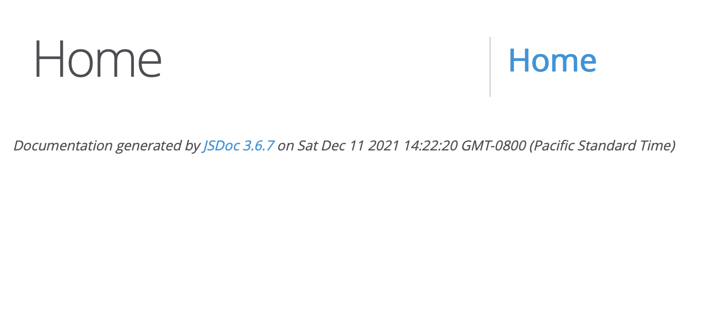

# PBS 131 of X — Introducing JSDoc

In the previous instalment we focused on the philosophy of documentation — who the audience is, why they need documentation, and what they need from it. We ended the instalment by introducing JSDoc, a tool for documenting JavaScript code.

The previous instalment was all about why we'll be using JSDoc, this instalment and the one after will focus on how use JSDoc.

## Matching Podcast Episode

TO DO

## Episode Resources

TO DO

## Some Fundamental Concepts

### Static Code Analysers

First and foremost — **JSDoc is a JavaScript static code analyser**. That is to say, it parses your JavaScript code and understands it, but doesn't execute it. A JavaScript interpreter like a web browser or NodeJS parses your code and then executes it, while a static analyser performs the same first step, but then it does something else. Without knowing it, you've probably already used many static code analysers.

You may have noticed that all IDEs (integrated development environments) are not equal — some seem positively smarter than others. The less smart ones use regular expressions to do syntax highlighting and little more, but the smart ones perform static code analysis so they can show you where you declared the variable you've currently selected, or list all the variables and functions in a side bar for quick access. IDEs that perform static code analysis can also suggest much more useful code completions because they don't just know that something is a name, but that it's a function, a variable, a class, etc.

You've also had a much more recent encounter with a static code analyser — ESLint! It has to understand your JavaScript to criticise it 😉

Why does it matter that JSDoc is a static code analyser? Firstly, because it means it can automatically discover a lot of information, saving us the need to enter it into the documentation manually. Secondly, because **if you have a syntax error in your code, JSDoc will fail**.

### JSDoc Name Paths

In order to be able to correctly link the various parts of your documentation together, JSDoc has to give every documented aspect of your code a unique name — every variable, function, class, module, etc. must have a unique name. For very basic code that's easy — everything you define sits in a flat universal namespace, but when you start nesting functions, or using modules and classes that stops being the case.

JSDoc uses three separators when building name paths:
* `#` for *instance* variables/functions, e.g. `MyClass#myInstanceVariable`
* `.` for *static* variables/functions, e.g. `MyClass.myStaticFunction`
* `~` for containment, or so-called *inner* functions, variables, or classes, e.g. `myFunction~myInnerFunction`

JSDoc also uses `:`-separated prefixes in the path names for some special elements. For our purposes the  most important of these is `module:` for modules.

Putting it all together, the name path for an instance function named `canHaz` from a class named `LOLCat` in a module named `memes` would be `module:memes~LOLCat#canHaz`.

## The JSDoc Syntax

With JSDoc you write your documentation in your source code, wrapping it in so-called *doc comments*. Those doc comments must appear directly above the item they document, and **items without doc comments are omitted from the documentation**.

Doc comments start with zero or more paragraphs of free-form text, and end with zero or more *block tags*. Both free-form text and block tags can contain *inline tags*.

Many doc tags expect *type expressions*, and these are generally surrounded in curly braces.

### Doc Comments

In JavaScript, `/*` starts a multi-line comment, and the comment continues until `*/`. Literally anything can come after that first star and it will be ignored by JavaScript.

Doc comments use this fact to introduce a special kind of comment that's ignored by JavaScript, but interpreted by JSDoc — the so-called *doc comment*. **<--Repeat of opening statement - not sure which one you want to keep.** Doc comments start with `/**`, and purely by convention, all lines within the comment are started with a `*`, they end with a regular `*/`.

```js
/*
 * A regular multi-line comment.
 */
 
 /**
  * A doc comment. That extra star is very important!
  */
```

### Block Tags

The vast majority of JSDoc tags are block tags. Block tags are all pre-fixed with the `@` symbol and must be the first significant character on a line. That is to say, the first thing after the indentation and the leading `*` symbol. Block tags can span multiple lines, continuing until the doc comment ends or a new block tag is started.

```js
/**
 * A function to return the closest thing a computer can to a pancake!
 * @returns {string} Returns a pancake emoji.
 */
 function getPancake(){
     return '🥞';
 }
```

Think of block tags as being the JSDoc equivalent of `<p>` or `<h1>` tags in HTML.

### Inline Tags

Inline tags can appear within free text paragraphs, and within the textual parts of block tags. Like block tags, inline tags are named with a pre-fixed `@` symbol, but the entire tag, name and all, is enclosed in curly braces.

For now, there is just one inline tag we need to know about `{@link}`, and we'll look at it in more detail later, but for now, here's a simple example to show what they look like:

```js
/**
 * A function to return the closest thing a computer can to a pancake!
 * @returns {string} Returns a pancake emoji.
 * @see {@link https://en.wikipedia.org/wiki/Pancake Wikipedia's page on pancakes} for more information that you probably want 🙂
 */
 function getPancake(){
     return '🥞';
 }
```

### Type Expressions

Type expressions are probably the single most important feature in JSDoc. Other people's code is like a black box. The only thing developers know is what goes in and what comes out, and type expressions are central to those descriptions.

Type expressions range from the wonderfully simple to the devilishly complex. The good news is that you can build up your level of detail over time as you get more comfortable. You can actually define and name your own type definitions, allowing you to avoid duplicating complex type expressions throughout your documentation.

We'll build up our understanding as we go, but to illustrate the point, here's an example of starting simple and improving the expression later:

```js
// A simple first pass

/**
 * The menu as an object. Note that all prices are in Euro.
 * @returns {Array} An array of objects indexed by `name`, `price` , and `description`.
 */
function getMenu(){
    // …
}

// a better second pass

/**
 *The menu as an array of objects. Note that all prices are in Euro.
 * @returns {Object[]} Each object is indexed by `name`, `price` , and `description`.
 */
function getMenu(){
    // …
}

// a correct third pass

/**
 *The menu as an array of records. Note that all prices are in Euro.
 * @returns {{name: string, price: number, description:string}[]} Each object is indexed by `name`, `price` , and `description`.
 */
function getMenu(){
    // …
}

// A re-usable custom type definition

/**
 * A menu item.
 * @typedef menuItem
 * @type {object}
 * @property {string} name - the item's name.
 * @property {number} price - the item's price in Euro.
 * @property {string} description - a short sentence describing the item.
 */
 
 /**
 *The menu as an array of items.
 * @returns {menuItem[]}.
 */
function getMenu(){
    // …
}
```

### Bookmark the Documentation!

There are a lot of JSDoc tags, and while their syntax is generally quite consistent and logical, you're never going to remember all the subtleties.

It takes a long time to become proficient in complex type expressions, so the most important page to bookmark in the JSDoc documentation is [the description of the `@type` tag](https://jsdoc.app/tags-type.html) which contains a table showing the different syntax options available for use.

Fair warning — the docs look like a throw-back to the 1990s, and some of the entries are a little sparse. However, the alphabetic tag listing is priceless, and clicking on any tag in the list will take you to that tag's documentation, which almost always includes useful examples.

If you're going to use JSDoc, **bookmark the official website: [jsdoc.app](https://jsdoc.app/).**

## Learning by Doing — a Worked Illustration

In the instalment zip you'll find a folder named `pbs131a`, this is a NodeJS package containing an example module that we'll be documenting.

Change into this folder and initialise it for use with the following commands:

```
npm ci
chmod +x main.mjs
```

The module we'll be documenting is named `Replicator` and is defined in the file `src/Replicator.class.mjs`. This module exports a class representing a Star Trek-like device that can make food appear as if by magic. The module provides a basic menu by default, and the ability to add items to the menu. Each replicator has a finite amount of energy, and each item on the menu costs a certain amount of energy to create. Replicators can create food as long as they have sufficient energy, and replicators can be re-charged with new energy.

The file `main.mjs` imports the module and demonstrate's it's use:

```
#!/usr/bin/env node

// import the class from the module
import Replicator from "./src/Replicator.class.mjs";

// create a replicator
const kitchenFriend = new Replicator();
console.log(`initial charge: ${kitchenFriend.charge}`);

// show the menu
console.log('The Menu:', Replicator.menu);

// make a pancake
console.log(kitchenFriend.replicate('pancakes'));
console.log(`remaining charge: ${kitchenFriend.charge}`);

// add tacos to the menu
Replicator.addMenuItem('taco', '🌮', '42');
console.log('The updated Menu:', Replicator.menu);

// have 2 tacos
console.log(kitchenFriend.replicate('taco', 2));
console.log(`remaining charge: ${kitchenFriend.charge}`);
```

You can see the code in action by executing `main.mjs`:

```text
bart-imac2018:pbs131a bart% ./main.mjs
initial charge: 100
The Menu: {
  pancakes: { energyCost: 11, icon: '🥞' },
  popcorn: { energyCost: 1, icon: '🍿' }
}
🥞
remaining charge: 89
The updated Menu: {
  pancakes: { energyCost: 11, icon: '🥞' },
  popcorn: { energyCost: 1, icon: '🍿' },
  taco: { energyCost: 42, icon: '🌮' }
}
🌮🌮
remaining charge: 5
bart-imac2018:pbs131a bart% 
```

The `package.json` file specifies JSDoc as a dev dependency, and the file `jsdoc.conf.json` defines a minimal configuration:

```
{
    "plugins": ["plugins/markdown"],
    "source": {
        "includePattern": ".+\\.(mjs|jsdoc)$"
    }
}
```

I was hoping not to need a config file at all for this instalment, but because we need to use the `.mjs` file extension to keep NodeJS happy, we need to tell JSDoc that it should process files with the `.mjs` or `.jsdoc` file extension. Without a customised `source.includePattern` definition in a config file, JSDoc only processes `.js` and `.jsdoc` files, **even if you explicitly specify other files in the arguments**.

Since I needed a config file anyway, I decided to also enable the optional Markdown support by adding `"plugins/markdown"` to the `plugins` array.

### The Null Example

Before we look at some appropriate doc comments for the module's code, let's see what JSDoc does if you don't add any doc comments at all!

The correctly documented version of the module is in the file `src/Replicator.class.mjs`, but there is a second completely undocumented copy of the code in the file named `src/Replicator.class.noDocs.mjs`. Let's run JSDoc on this version of the code:

```
npx jsdoc -c jsdoc.conf.json -d docs-v0 src/Replicator.class.noDocs.mjs
```

The `npx` command finds and runs executable files provided by NPM packages, so we're using it to execute the copy of the `jsdoc` command that was installed into the local `node_modules` folder by the `npm ci` command.

We're passing Node two flags, `-c` to specify the config file to use, and `-d` to specify a *destination* folder for the documentation. Finally, we're passing the files to be documented as arguments. In this case, that's just a single file.

After running this command a new folder will be created named `docs-v0`, and in there you'll find the website JSDoc created. Open `index.html` in your favourite browser, and observe that without doc tags JSDoc produced completely empty documentation.



### Generating the True Documentation

Now that we've see how little we get for free, let's generate the real documentation and then look at the doc comments that created it.

```
npx jsdoc -c jsdoc.conf.json -d docs -R README.md src/Replicator.class.mjs src/*.jsdoc
```

The command has changed a little from the one we used previously. The `-R` flag has been added to specify a Markdown file to use for the front page of the documentation, and the destination has been changed to `docs`. Also, the list of source files has been changed to `src/Replicator.class.mjs` and all `.jsdoc` files in the `src`. There's just one `.jsdoc` file, `src/typeDefs.jsdoc`, and it contains the custom type definitions used in some of the type expressions in the doc comments in `src/Replicator.class.mjs`.

When you run this command a folder named `docs` will be created, containing the generated documentation site. Open `docs/index.html` in your favourite browser to view the docs.

### Documenting the Module

All the content making up this final documentation site comes from one of four sources:

1. The file `README.md` (just the front page).
2. The doc comments in the file `src/typeDefs.jsdoc`.
3. The doc comments in the file `src/Replicator.class.mjs`
4. Inferences JSDoc made using static code analysis

Let's dive in and have a look at how the code was documented. Keep the generated site open as we go.

When you open the page you're greeted by a landing page with a description of the thing being documented taking up the majority of the page, and because we're using the default theme, a menu to the right.

The menu lists the big-ticket items your documentation covers, all the modules, classes, and perhaps a link for the global scope. In this case the list is very sparse since we have one package containing one class, and the global scope.

Let's start by clicking into the global scope. You'll see that it describes two custom types that will be used throughout the documentation — one for an amount of charge, and one for a menu item. 

Next let's click on the only module (*PBSReplicator*). We get a paragraph describing the module, a list of its dependencies, and some relevant external links at the top of the page. Then we get a list of all the package's classes (just one), followed by detailed descriptions of the one variable (referred to as a *member*) and the two functions (referred to as *methods*) the module contains.

The descriptions start with names possibly prefixed with some meta data, and followed by type information for variables, and the return type for functions. Items that are not exported from the module are pre-fixed with the keyword *inner* to indicate that they can't be used outside of the module itself. Also notice that the variable is marked as a constant. 

The function descriptions describe the arguments (referred to as *parameters*) they take, the value they return, and any errors they could throw.

Finally, let's have a look at the class. You'll see it's very similar to the module in that it starts with a description, then describes the constructor, and then lists the class's variables and functions. Again, note the prefixes used to convey metadata like the fact that the `menu` variable is static.

### Adding a Front Page

TO DO

### Defining Custom Types

TO DO

### Documenting a Module

TO DO

### Documenting a Variable (the Menu)

TO DO

### Documenting a Function

TO DO

### Documenting a Class

TO DO

## Final Thoughts

TO DO


## JSDoc Themes — MOVE TO PBS 132

https://www.npmjs.com/package/clean-jsdoc-theme