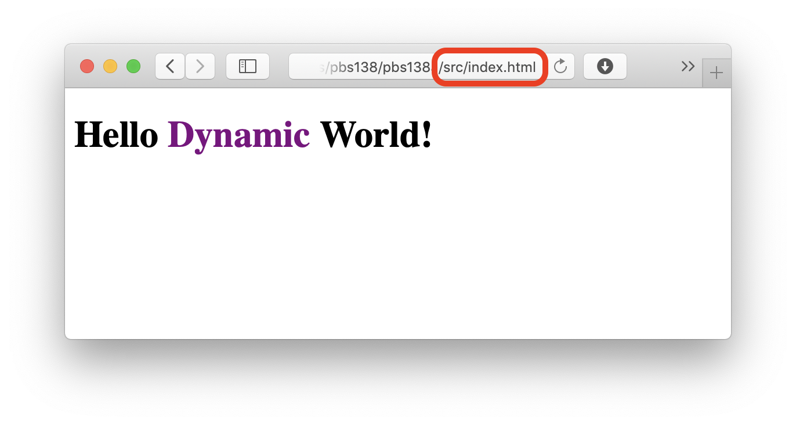
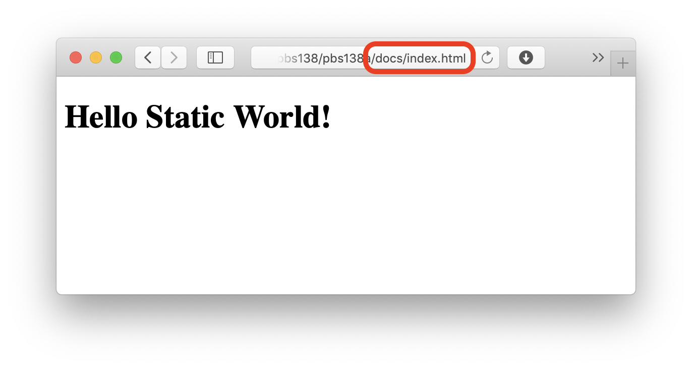
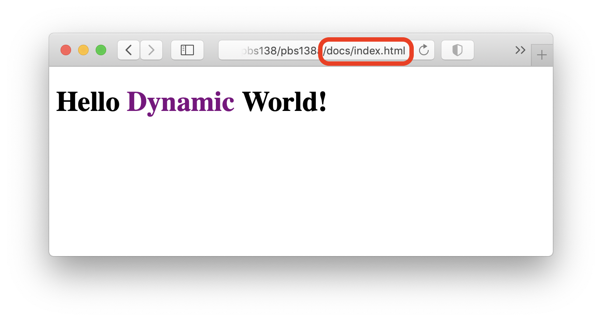
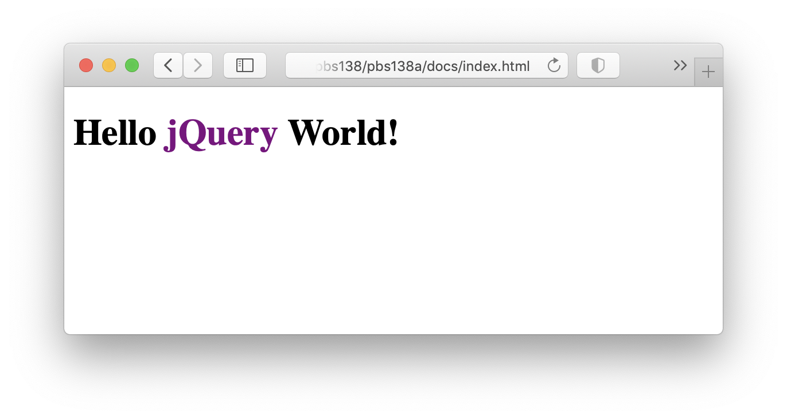
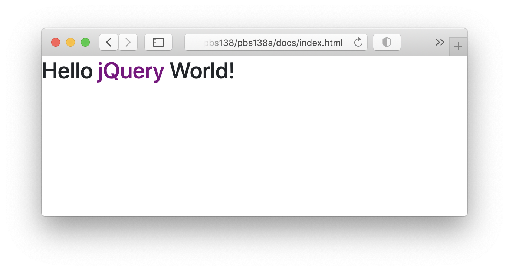
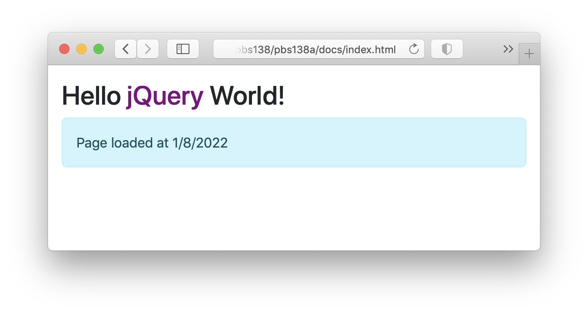

# PBS 138 of X — Bundling a Web App/Site with Webpack (Part 1)

In [the previous instalment](./pbs137) we looked at how to use Webpack to bundle a JavaScript library for sharing with the world. This is the Webpack use-case we'll need for the JavaScript port of the `Crypt::HSXKPasswd` Perl module. This is just one of the two most common use-cases for Webpack, the other being bundling client-side web apps or web sites. I'd originally intended to leave this second use-case until later in the series, when we'll be re-writing the [xkpasswd.net](http://www.xkpasswd.net/) web app to use the new JavaScript module we'll have built by then. But, based on the questions I'm being asked, and the personal projects myself and others in the PBS community are working on, I've decided to move the topic forward. 

While the tool is the same, and the fundamental theory is the same, the goals are different, and there are more kinds of things that need to be included in the generated output, so there's actually quite a bit to learn. To keep the pace manageable we'll split this topic over two instalments, and because the simplest way to learn things like this is to do them, the bulk of the two instalments will be dedicated to a worked example that builds a dummy client-side web app that makes use of many of the tools we've learned about in the series. Our dummy web app will consist of our own HTML, CSS & JavaScript which will import [jQuery](https://jquery.com/), [Luxon](https://moment.github.io/luxon/) ([Moment.JS](https://momentjs.com/)'s replacement), [Bootstrap 5](https://getbootstrap.com/), an icon font, and a web font. TO VERIFY

## Matching Podcast Episode

TO DO

## Episode Resources

TO UPDATE

* The instalment ZIP file — [pbs138.zip](https://github.com/bartificer/programming-by-stealth/raw/master/instalmentZips/pbs138.zip).

## A Quick Preamble

Before we start, just a brief note on terminology — a client-side web sites and web apps use the same technologies to achieve subtly different goals — a website is primarily about communicating something, and web app is primarily about some kind of interactive functionality, but both use the same fundamental building blocks — HTML, CSS & JavaScript — so they're the same from a Webpack POV. To keep the notes simple we'll use the term *web app* for the remainder of this instalment, but know that the very same techniques can be used to bundle web sites.

## Why do we need to Bundle Web Apps?

Up until this point in the series we've imported our dependencies into our web apps using CDNs (content delivery networks) by simply adding appropriate tags into our HTML markup. This has the advantage of being both simple to do and simple to understand — just add the tag, and the browser fetches the latest version of the third party code from the given URL.

What's wrong with this simple approach?

1. **Version management is difficult** — if we embed a URL for the latest version then we'll automatically get upgraded, but we'll have no control over the timing, so our app could just break at any moment. If we embed the URL for a specific version we have to manually check each dependency for upgrades and update our URLs which is a chore we're likely not to get to.
2. **We can't work off-line** — you need an internet connection to load resources from CDNs, so if we go that route we can't work in our code from places without internet access. Those are getting fewer and further between, but still, it would be nice to keep our work self-contained.

## Managing Dependencies with NPM

There are NodeJS packages for all the 3rd-party libraries we've used in this series, so we can use NPM to download copies of those libraries into our projects and manage their versioning. We can use `npm install` to install the packages we need, `npm outdated` to check for available updates, and `npm upgrade` to apply them.

Once you run `npm install` or `npm ci` all the dependencies will be downloaded, so you won't need network connectivity again until you want to update the dependencies you have, or add more.

At this point the dependencies will be installed in your `node_modules` folder. You could update your HTML to reference the new file paths in `node_modules` with relative URLs, but then to publish your site you'd need to publish your `node_modules` folder to your web server, which is inefficient at best.

## Bundling the Dependencies with Webpack

Similarly to how we converted source code in one folder (`/src`) to bundled code in another (`/dist`) when bundling a library in [the previous instalment](./pbs137), we need to write our HTML, CSS & JavaScript in a source folder, and then build bundled versions of the CSS & JavaScript with WebPack, and update our HTML to use the bundle(s).

Once everything is configured the process would be:

1. Edit the code in the source folder (we'll be using `/src`)
2. Build the code using Webpack (we'll configure it to work with `npm run build`)
3. Run the code from the destination folder (we'll be using `/docs` for GitHub Pages compatibility)

To get this to work there are some pre-requisites:

1. Your `package.json` file must specify an entry point by setting the value of the `main` key to the path of your primary JavaScript file (we'll be using `src/index.js`)
2. Your entry point must directly or indirectly import all your JavaScript & CSS dependencies. If you import and file that imports a file, that's an indirect import, and Webpack has no problem with nested imports like that.
3. You must have Webpack and its needed plugins installed as dev dependencies (`npm install --save-dev webpack webpack-cli css-loader style-loader copy-webpack-plugin`)
4. You need a basic Webpack config file (`webpack.config.js`) that specifies the entry point, output folder, copies your HTML file(s), and maps CSS files to the appropriate loaders
5. Your HTML file(s) need to use relative URLs to import the generated bundle(s)
6. You need to configure an NPM script named `build` that invokes `webpack` using `npx` (`"build": "npx webpack --mode=production"`)

## A Worked Example

This is much easier to show than to tell, so let's learn by doing and build up a dummy web.

Before we get started, a quick note on the files in the instalment's ZIP.

The final version of the dummy web app as we'll leave it at the end of this instalment is contained in the folder `pbs139a`. To see the app in action, open that folder in a terminal and build it with `npm ci && npm run build`. You can then run the app by opening the newly generated `docs/index.html` file in a browser.

If you'd like to play along and build up the app as you read/listen, you'll need to start with a blank folder, and add and update files as we go. To save you doing too much copy-and-pasting, the intermediate forms of the files are available in the `pbs138a-N` folders where `N` is a digit. These folders contain just changed files, they are not full replicas of the project. You should copy the appropriate files from these folders into your working copy of the project as you work through the example.

### Step 1 — Initialise an ES6 NodeJS Project

We'll start with an empty folder, and initialise it as a NodeJS project in ES6 mode.

Start by stepping through the standard NPM initialisation wizard by running the following terminal command in your empty folder:

```sh
npm init
```

You can answer what ever you like for most questions, but be sure to set the entry point to `src/index.js`.

The wizard will create and save a `package.json` file for you. This will set up a regular NodeJS project, but we want to work in ES6 mode, so edit  `package.json` and add the top-level key named `type` with the value `"module"`. Your final `package.json` should look something like the following, bearing in mind that the only two keys you must have identical to mine are `type` and `main` (the entry point):

```json
{
  "name": "pbs138a",
  "version": "1.0.0",
  "description": "An example project for instalment 138 of the Programming by Stealth series.",
  "main": "src/index.js",
  "type": "module",
  "scripts": {
    "test": "echo \"Error: no test specified\" && exit 1"
  },
  "author": "Bart Busschots",
  "license": "ISC"
}
```

### Step 2 — Create a Basic Page with HTML, CSS & JavaScript

Before we start adding code, note that we'll be storing all our source code in a folder named `src`, and we'll be using Webpack to transform that source into a web app that will get created in the folder `docs`. All our development work will be in the `src` folder, and we'll need to remember to re-build the `docs` folder after each source code change to see the results.

To get our example started, let's create a simple HTML page (`src/index.html`) that imports some CSS from an external file (`src/index.css`), and some JavaScript from another external file (`src/index.js`). You'll find copies of all three files in the `pbs138a-1/src` folder in the instalment ZIP, create a folder named `src` in your folder and copy these three files into it.

These files are very basic, they are purely intended to show that the page contains working CSS & JavaScript loaded from external files. Let's look at `index.html` first:

```html
<!doctype html>
<html lang="en">
  <head>
    <meta charset="utf-8">
    <meta name="viewport" content="width=device-width, initial-scale=1">
    <title>PBS 138 — Webpack Demo</title>
    <script src="./index.js"></script>
    <link rel="stylesheet" href="./index.css" type="text/css">
  </head>
  <body>
    <h1>Hello <span id="world-modifier">Static</span> World!</h1>
  </body>
</html>
```

This is simply an HTML 5 document that loads a single JavaScript file from `./index.js`, and a single CSS file from `./index.css`, and displays a single header that says *Hello Static World!*. The word *Static* is contained in a `<span>` tag with the ID `world-modifier`.

The CSS in `index.css` simply colours anything with the ID `world-modifier` purple:

```css
#world-modifier{
    color: purple;
}
```

And finally, `index.js` simply defines a plain JavaScript (no jQuery) document ready handler that finds anything with the ID `world-modifier` and replaces its contents with the string `'Dynamic'`:

```js
// a document ready handler in plain JavaScript (no JQuery)
document.addEventListener('DOMContentLoaded', function () {
    document.getElementById('world-modifier').innerText = 'Dynamic';
}, false);
```

If you open `index.html` in your browser you can verify that the HTML, CSS, and JavaScript are working. Look at the header, and if you see `Hello Dynamic World!` that means the JavaScript successfully executed, and if the word *Dynamic* is in purple, then the CSS was successfully applied.



**Take note of the importance of seeing the word *Dynamic* and the colour purple, we'll be using those two visual cues as tests for successful JavaScript and CSS bundling.**

### Step 3 — Install and Configure Webpack

We need to install both the core Webpack packages, and the loaders and plugins we'll need to transform our simple web app:

```sh
npm install --save-dev webpack webpack-cli css-loader style-loader copy-webpack-plugin
```

Next we need to create a simple Webpack config that will copy our HTML file and bundle our JS and CSS files:

```js
// Needed hackery to get __filename and __dirname in ES6 mode
// see: https://stackoverflow.com/questions/46745014/alternative-for-dirname-in-node-js-when-using-es6-modules
import path from 'node:path';
import { fileURLToPath } from 'node:url';

const __filename = fileURLToPath(import.meta.url);
const __dirname = path.dirname(__filename);

// import the Webpack copy plugin
import CopyPlugin from 'copy-webpack-plugin';

// export the Webpack config
export default {
    entry: './src/index.js',
    output: {
        path: path.resolve(__dirname, 'docs'),
        filename: 'bundle.js'
    },
    module: {
        rules: [
            {
                test: /\.css$/,
                use: [
                    'style-loader',
                    'css-loader'
                ]
            }
        ]
    },
    plugins: [
        new CopyPlugin({
            patterns: [
                { from: "src/index.html", to: "index.html" }
            ],
        })
    ]
};
```

The first seven lines are simply copied-and-pasted from [the previous instalment](./pbs137) — they are workarounds for some foibles with NodeJS's current (summer 2022) ES6 implementation.

The first new thing we see in this config is the import statement for the [Webpack copy plugin](https://webpack.js.org/plugins/copy-webpack-plugin/). This plugin allows us to copy files from our source folder (`src`) to our output folder (`docs`) without modifying them. We'll use it to copy `src/index.html` to `docs/index.html`.

The main body of our config starts by setting the entry point to our JavaScript file. This is because Webpack is first and foremost a JavaScript bundler, so it works best when you give it a JavaScript file as its starting point.

Next, we override the default output settings by specifying `docs` as the output folder (replacing the default of `dist`), and `bundle.js` as the file name for the generated bundle (replacing the default of `main.js`).

Again, because Webpack is primarily a JavaScript bundler, it bundles JavaScript by default, so no config is needed to tell it to do that. However, we want to do more than just bundle JavaScript, we also want to bundle CSS. The key to understanding how this works is to remember that we can use JavaScript to alter a page's style (we've done this using jQuery, but it can be done with plain JavaScript too). What Webpack can do, with the help of some additional modules, is translate CSS into JavaScript code that achieves the same outcome, and then include that generated JavaScript code in the generated bundle (`bundle.js`).

To bundle CSS we need to tell Webpack which file extensions to treat as CSS, and which additional modules we'd like it to use to process the CSS for us. This is done by adding a `rule` to the `module` definition for the generated bundle in the Webpack config file (`webpack.config.js`). We need the rule to apply to all files that end in `.css`, and we want those files to be processed by two loaders — [`css-loader`](https://webpack.js.org/loaders/css-loader/) which can read CSS files via an ES6 `import` statement, and [`style-loader`](https://webpack.js.org/loaders/style-loader/) which can generate JavaScript to inject styles into the DOM. 

To achieve our goals we need to add a new rule object to the `rules` array inside the `module` object representing our bundle. The rule object needs two keys — `test` which specifies a file pattern, and `use` which is an array of loader names to apply to the matching files:

```js
{
    test: /\.css$/,
    use: [
        'style-loader',
        'css-loader'
    ]
}
```

You'll find the complete Webpack config file (`webpack.config.js`) in  the `pbs138a-1` folder in the instalment ZIP, copy it into your folder.

Before we can start to use our new config we need to add a build script into our NPM config by adding a new key named `build` to the `scripts` array in `package.json` with the value `npx webpack --mode=production` (as explained in [the previous instalment](pbs137)). Your `package.json` file should now look something like:

```json
{
  "name": "pbs138a",
  "version": "1.0.0",
  "description": "An example project for instalment 138 of the Programming by Stealth series.",
  "main": "src/index.js",
  "type": "module",
  "scripts": {
    "build": "npx webpack --mode=production",
    "test": "echo \"Error: no test specified\" && exit 1"
  },
  "author": "Bart Busschots",
  "license": "ISC",
  "devDependencies": {
    "copy-webpack-plugin": "^11.0.0",
    "css-loader": "^6.7.1",
    "style-loader": "^3.3.1",
    "webpack": "^5.74.0",
    "webpack-cli": "^4.10.0"
  }
}
```

The two changes from before are the dev dependencies added by the `npm install --save-dev` command, and the build script.

If you'd like to use my `package.json` file rather than your own, you'll find it in the `pbs138a-1` folder in the ZIP, and you can copy it into your folder.

We can now test our build process by running:

```sh
npm run build
```

When you do this, a new folder named `docs` will be created, and it will contain two files; `index.html` & `bundle.js`. So far so good! But, if you open `docs/index.html` in your browser you'll notice that neither the CSS nor JavaScript are loading because the greeting says *Hello Static World!*, and there's no purple 🙁



Don't Panic!

We need to make two small changes to `src/index.html`:

1. We need to remove the `<link>` tag completely since our CSS is being bundled into our JavaScript bundle by the loaders we configured
2. We need to update the `<script>` tag to import the generated bundle

You'll find an updated version of the file in the `pbs138a-2/src` folder in the instalment ZIP, copy that over your existing `src/index.html` file.

The changes are all in the `<head>` which now looks like this:

```html
<head>
  <meta charset="utf-8">
  <meta name="viewport" content="width=device-width, initial-scale=1">
  <title>PBS 138 — Webpack Demo</title>
  <script src="./bundle.js"></script>
</head>
```

Re-build the bundle with `npm run build`, refresh your browser, and notice that our apps is now closer to working correctly — the JavaScript is running because the greeting is back to the correct *Hello Dynamic World*, but the CSS is still not working because there's no purple:


Again, don't panic!

Remember that Webpack figures out what to bundle by starting in the entry point (`src/index.js`), and then following all `import` statements to figure out what to include in the. bundle. Also remember that the `css-loader` gives Webpack the ability to load CSS via `import` statements. As odd as it may sound, we need to update our JavaScript file to import our CSS! We do this by simply adding an `import statement` for `index.css` in `index.js`:

```javascript
import './index.css';
```

You'll find the updated `index.js` in the `pbs138a-2/src` folder in the instalment ZIP, copy this file over your `src/index.js`.

Now we can run our build command again (`npm run build`) and refresh the browser to see our fully working page 😀



PROOF-READ TO HERE!!!

### Step 4 — Import jQuery

OK, so far we've simply translated our own code from one form into another. There's no real advantage to doing that, and it's added extra complexity to our processes. We are of course complicating our workflow so we can enable better management of 3rd-party dependencies, so let's actually do that!

As a first example, let's add jQuery into our little project.

We'll use NPM to install a copy of jQuery into our project that we'll then build into our bundle. That means the copy of jQuery installed by NPM will only be needed to build our code, not to run it, so, it is actually a dev dependency, not a true dependency. The same logic will apply to other third-party libraries, so we'll be using `npm install --save-dev` to install the third party modules.

Let's install jQuery as a dev dependency:

```sh
npm install --save-dev jquery
```

To start using jQuery we now simply import it into our JS file using an ES 6 import:

```js
// import jQuery
import $ from 'jquery';
```

We can now replace our plain JS document ready handler with a much shorter and easier to read jQuery one:

```js
// a jQuery document ready handler
$(()=>{
    $('#world-modifier').text('jQuery');
});
```

So we can easily verify that the new handler is working, I've change the inserted word from *Dynamic* to *jQuery*. We can now build our updated page with `npm run build`, and when we refresh we can see that jQuery is indeed bundled in and doing its thing:



You'll find the full updated JavaScript file in the `pbs138a-3/src` folder in the instalment ZIP.

### Step 5 — Import Bootstrap CSS

Next, let's import the other big library we've been using throughout this series, Bootstrap.

Again, we'll be bundling it into our app, so we install it as a dev dependency:

```js
npm install --save-dev bootstrap
```

Let's start with just the basics, the Bootstrap CSS without the optional JavaScript bells and whistles. We do this by importing the minified version of the Bootstrap CSS from within the installed package from within our JavaScript file:

```js
// import bootstrap CSS
import 'bootstrap/dist/css/bootstrap.min.css';
```

Once we re-build our app with `npm run build` we can immediately see that the Bootstrap CSS has been imported because its more pleasant default typography has been applied:



Before we go on, Bootstrap's styles expect to be used within a container of some kind, so let's update the HTML to wrap things in a containing tag with some basic Bootstrap classes:

```html
<!doctype html>
<html lang="en">
  <head>
    <meta charset="utf-8">
    <meta name="viewport" content="width=device-width, initial-scale=1">
    <title>PBS 138 — Webpack Demo</title>
    <script src="./bundle.js"></script>
  </head>
  <body>
    <div class="container p-3">
      <h1>Hello <span id="world-modifier">Static</span> World!</h1>
    </div>
  </body>
</html>
```

Now, let's go ahead and add a dismissible alert that says when the page was loaded. To make our lives a little easier, let's install and import Luxon, the successor to the venerable Moment.js time and date library:

```sh
npm install --save-dev luxon
```

And import it into our JavaScript file:

```js
// import Luxon
import { DateTime } from 'luxon'
```

We can then update our event handler to inject a dismissible Bootstrap alert into the end of our container like so:

```js
// a jQuery document ready handler
$(()=>{
    // update the greeting to show jQuery ran
    $('#world-modifier').text('jQuery');

    // build and add an alert with the loaded time
    const $alert = $('<p>').addClass('alert alert-info alert-dismissible');
    $alert.text(`Page loaded at ${DateTime.now().toLocaleString()}`);
    $('.container').append($alert);
});
```

When we re-build our page with `npm run build` we'll see our new alert.



You'll find the full updated HTML and JavaScript files in the `pbs138a-4/src` folder in the instalment ZIP.

## Final Thoughts

Apologies for the cliff-hanger, but this is where we leave our worked example until the next instalment.

So far we've looked at the theory behind using Webpack to bundle a web app or website, and we've created a working example that uses many of the tools we've used throughout this series. As things stand we're successfully bundling our own HTML, CSS & JavaScript, the JavaScript libraries jQuery & Luxon, and the Bootstrap CSS. The first thing we'll do in the next instalment is add the Bootstrap JavaScript to our bundle, and then we'll add an icon font and a web font. At that stage we'll have example of all the important components of a typical client-side web app or website — our own code, commonly used JavaScript libraries, commonly used CSS libraries, icon fonts, and web fonts.