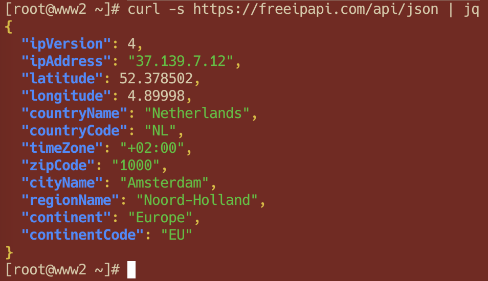

# PBS 155 of X — Introducing JSON Processing from the Shell with `jq`

JSON is a commonly used data format that has its origins in the JavaScript syntax. We first met it all the way back in [instalment 17](./pbs17), and we've bumped into it from time to time since then, for example, as the format used for NodeJS configuration files, and as the format for data returned by many of the web services we can interact with in JavaScript via AJAX.

[JSON](https://en.wikipedia.org/wiki/JSON) is a very powerful means of expressing even complex data, but it can be tricky to interact with from the command line or shell scripts because it doesn't lend itself to being queried by simple text-processing commands like `grep`. To work with JSON in a shell, you need a terminal command that truly understands JSON, and that's where `jq` comes in.

Don't be fooled by the shot name, there's nothing simplistic about `jq`! It's extremely powerful, but, rather like regard expressions, the syntax is very dense. You can do an awful lot with just a few characters, but there's a lot of nuanced understanding needed to understand what a `jq` command really does, or, to learn to use it yourself. 

It's going to take us a few instalments to explore the  `jq` terminal command. As usual, this won't be an exhaustive look at everything the command can do, instead, we'll focus on three key abilities `jq` provides:

1. Pretty-printing JSON, helping us to read the outputs from things like web services
2. Extracting information from JSON
3. Transforming JSON data from one form to anther

We'll explore these features as they relate to three common use cases:

1. APIs, particularly web services, that return data in JSON format
2. Reading information from simple JSON files like config files
3. Querying and processing large JSON-formatted data sets

## Matching Podcast Episodes

Listen along to this instalment on [episode 778 of the Chit Chat Across the Pond Podcast](https://www.podfeet.com/blog/2023/11/ccatp-778/).

<audio controls src="https://media.blubrry.com/nosillacast/traffic.libsyn.com/nosillacast/CCATP_2023_11_18.mp3?autoplay=0&loop=0&controls=1">Your browser does not support HTML 5 audio 🙁</audio>

You can also <a href="https://media.blubrry.com/nosillacast/traffic.libsyn.com/nosillacast/CCATP_2023_11_18.mp3" >Download the MP3</a>

Read an unedited, auto-generated transcript:  <a href="https://podfeet.com/transcripts/CCATP_2023_11_18.html">CCATP_2023_11_18</a>

## Episode Resources

* The instalment ZIP file — [pbs155.zip](https://github.com/bartificer/programming-by-stealth/raw/master/instalmentZips/pbs155.zip)

## Prologue — A Very Quick JSON Refresher

This instalment assumes fluency in JSON. If you've never met JSON before, don't worry, it's quite an intuitive format, and there are lots of online resources available to help you learn, for example:

* I wrote a simple intro to JSON a few years ago — [www.bartbusschots.ie/…](https://www.bartbusschots.ie/s/2015/08/08/json-a-quick-intro/)
* A good tutorial from FreeCodeCamp — [www.freecodecamp.org/…](https://www.freecodecamp.org/news/what-is-json-a-json-file-example/)

Having said that, here's a quick reminder of the basics!

Everything in JSON is one of six types:

1. A number, e.g. `42` or `3.1415`
2. A string, e.g. `"A boring string"`
3. A boolean, i.e. `true` or `false`
4. The null value, i.e. `null`
5. An array of zero or more values, e.g. `[true, 42, "some string"]`
6. A dictionary (AKA object) of key-value pairs, e.g. `{"key1": "value 1", "another_key": 42}`

Both arrays and dictionaries can be nested, allowing complex pieces of information to be represented, e.g., the details of a Nobel prize:

```json
{
  "year": "2023",
  "category": "chemistry",
  "laureates": [
    {
      "id": "1029",
      "firstname": "Moungi",
      "surname": "Bawendi",
      "motivation": "\"for the discovery and synthesis of quantum dots\"",
      "share": "3"
    },
    {
      "id": "1030",
      "firstname": "Louis",
      "surname": "Brus",
      "motivation": "\"for the discovery and synthesis of quantum dots\"",
      "share": "3"
    },
    {
      "id": "1031",
      "firstname": "Aleksey",
      "surname": "Yekimov",
      "motivation": "\"for the discovery and synthesis of quantum dots\"",
      "share": "3"
    }
  ]
}
```

## Introducing `jq`

This first point of confusion that needs to be addressed is that the name *jq* is itself overloaded (to borrow a programming term), it has two very different meanings — *jq* is firstly a language, and secondly the name of a terminal command for processing JSON strings with that language. I like to think of the name as being an acronym for *JSON Query* but the official website and documentation give no explanation of the name, and universally use it in all lower-case.

In a probably doomed attempt to minimise confusion between the language and the terminal command, I'm going to always use a fixed-width font for the terminal command, and a regular font for the language, so jq is the language, and `jq` is the terminal command.

Presumably because JSON is a relatively new format, at least compared to `sh`, `bash`, or even `zsh`, the need for a terminal command to process it is too new for a standard out-of-the-box command to emerge. The `jq` command is an open source third-party tool you'll need to install yourself.

### Useful Resources

* The official jq home page — [jqlang.github.io/jq/](https://jqlang.github.io/jq/)
* The official docs — [jqlang.github.io/manual/](https://jqlang.github.io/jq/manual/)
* A nice web version of the `jq` man page — [manpages.org/…](https://manpages.org/jq)
* The language's wikipedia page — [en.wikipedia.org/…](https://en.wikipedia.org/wiki/Jq_(programming_language)) (it has a nice summary of the syntax)
* A useful on-line jq playground — [jqplay.org/](https://jqplay.org/)

## Installing `jq ` (and `curl`)

Because the `jq` command doesn't ship as standard with the mainstream command shells, you'll need to install it. That's generally easiest on Linux where it's available from most distros standard package manager, e.g. `sudo yum install jq` or `sudo apt-get install jq`. Things are a little more complicated on Windows and the Mac.

The most common advice for Windows users is to use the [Chocolatey package manager](https://chocolatey.org). Once you have that installed you can install `jq` from a PowerShell terminal running as administrator with the command `choco install jq -y`.

Similarly, the most common advice for Mac users is to use the [Homebrew package manager](https://brew.sh). Once Homebrew is installed, you can install `jq` with the command `brew install jq`.

Because JSON is returned by so many web APIs, our examples will use the `curl` command to make web requests from the command line. The `curl` command ships as standard on the Mac, as well as on many Linux distributions (or it's available from the standard package manager). Windows users can get `curl` from Chocolatey with the command `choco install curl -y`.

## Using the `jq` Command

Conceptually, the `jq` terminal command is very simple — the inputs are JSON strings for processing and a so-called *jq filter* to apply those JSON strings, and the outputs are one or more other strings that may or may not also be in JSON format.

The *jq filter* is the jq code for processing the JSON, and it should be the first argument. The JSON to be processed can be read from `STDIN` or from one or more files specified as additional arguments. The command does support a few options, but we'll leave those for another time.

For reasons that defy logic, when Stephen Dolan developed the version of jq back in 2012 he chose to use characters that have special meaning on the command line as part of his jq syntax, most egregiously, the pipe (`|`). This means that most jq syntax needs to be quoted when used on the command line. To avoid getting into trouble my advice is to **always quote jq syntax when writing `jq` commands**!

Since we're going to be focusing on three common uses for JQ, let's' start with a simple example of each. You'll find the JSON files used in the examples in this instalment's ZIP file.

### Example 1 — Pretty-printing JSON from a Web Service

The very useful site [freeipapi.com/](https://freeipapi.com/) offers a web service API that returns information about your IP address in JSON format from the URL [https://freeipapi.com/api/json](https://freeipapi.com/api/json). We can call this API from the terminal using the `curl` command like so:

```bash
curl https://freeipapi.com/api/json
```

When you do you'll see it returns its JSON as a long single-line string, e.g. this is what's returned when I run the command on my web server:

```text
{"ipVersion":4,"ipAddress":"37.139.7.12","latitude":52.378502,"longitude":4.89998,"countryName":"Netherlands","countryCode":"NL","timeZone":"+02:00","zipCode":"1000","cityName":"Amsterdam","regionName":"Noord-Holland","continent":"Europe","continentCode":"EU"}
```

This is not very human-friendly, so to see the information nicely formatted we can pipe it through `jq` without any jq filter with the command:

```bash
curl -s https://freeipapi.com/api/json | jq
```

What we get now is nicely formatted and syntax-highlighted JSON:



### Example 2 — Extracting a Value from a Config File

We can use the `jq` command with a jq filter to extract a specific piece of information from a file, for example, we can extract the number of JavaScript dependencies for the `this-ti.me` website from is NPM package config file:

```bash
jq '.dependencies|length' this-ti.me-package.json
```

Notice that the jq filter is quoted, and, that it absolutely must be, because it contains the `|` symbol.

### Example 3 — Processing a JSON Data Set

The file `NobelPrizes.json` contains details of all Nobel prises ever awarded in JSON format. It is in effect a JSON-formatted database, and we can use the `jq` command to query that data base to find specific piece of information and assemble them into a desired output.

Before we query this database, let's use `jq` to pretty print the first entry in the database to show the structure of the records with the command `jq '.prizes[0]' NobelPrizes.json`:

```json
{
  "year": "2023",
  "category": "chemistry",
  "laureates": [
    {
      "id": "1029",
      "firstname": "Moungi",
      "surname": "Bawendi",
      "motivation": "\"for the discovery and synthesis of quantum dots\"",
      "share": "3"
    },
    {
      "id": "1030",
      "firstname": "Louis",
      "surname": "Brus",
      "motivation": "\"for the discovery and synthesis of quantum dots\"",
      "share": "3"
    },
    {
      "id": "1031",
      "firstname": "Aleksey",
      "surname": "Yekimov",
      "motivation": "\"for the discovery and synthesis of quantum dots\"",
      "share": "3"
    }
  ]
}
```

Now, let's use a complex jq filter to extract just the number of recipients for each prise in 2023 with the command:

```bash
jq '[.prizes[] | select (.year == "2023") | {prize: .category, numRecipients: (.laureates|length)}]' NobelPrizes.json
```

This produces the JSON:

```json
[
  {
    "prize": "chemistry",
    "numRecipients": 3
  },
  {
    "prize": "economics",
    "numRecipients": 1
  },
  {
    "prize": "literature",
    "numRecipients": 1
  },
  {
    "prize": "peace",
    "numRecipients": 1
  },
  {
    "prize": "physics",
    "numRecipients": 3
  },
  {
    "prize": "medicine",
    "numRecipients": 2
  }
]
```

Notice that we have not only filtered the data set down to just the records we are interested in, we have transformed those records into entirely new records that contain just two key-value pairs each, where none of the keys existed in the original data, and one of the values is copied directly, and the other computed.

We could achieve the same results with a JavaScript function, but it would take us a lot more code than that dense but powerful jq filter!

## Pretty Printing JSON with `jq`

Let's finish this first instalment by looking at some useful options for controlling how `jq` pretty-prints JSON.

To see these different flags in action, you can use the wonderful free weather API at `wttr.in` . 

To see the current weather conditions where you are in `jq'` default pretty-printed format use the command:

```bash
curl -s 'http://wttr.in/?format=j1' | jq '.current_condition[0]'
```

As you can see, by default, when outputting to a terminal, `jq` will uses syntax highlighting in its output, i.e. it will add colours to the text, you can disable that behaviour with the `--monochrome-output` or `-M` option:

```bash
curl -s 'http://wttr.in/?format=j1' | jq '.current_condition[0]' -M
```

The  `jq` command also defaults to spreading the output across multiple lines, you can stop it doing that with the `--compact-output` or `-c` flag:

```bash
curl -s 'http://wttr.in/?format=j1' | jq '.current_condition[0]' -c
```

Finally, by default `jq` uses two spaces as the indent, you can use tabs instead with the `--tab` flag:

```bash
curl -s 'http://wttr.in/?format=j1' | jq '.current_condition[0]' --tab
```

Or, you can use a different number of spaces with the `--indent` option:

```bash
curl -s 'http://wttr.in/?format=j1' | jq '.current_condition[0]' --indent 4
```

## Final Thoughts

Hopefully I've whetted your appetite for the `jq` command and its powerful filter syntax. So far we've only looked at one of the commands uses in detail — pretty-printing JSON, in the next instalment we'll move on to using the jq language to extract specific pieces of information from a JSON string, and then we'll move onto the most powerful and complex part of all, transforming data with jq.

 - [← PBS 154 — Bash: Expansions & Brackets Redux](pbs154)
 - [Index](index)
 - [PBS 156 — jq: Extracting Data with `jq` →](pbs156)
