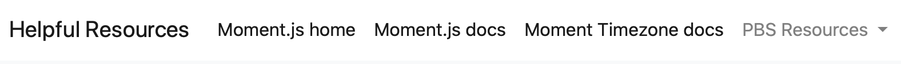
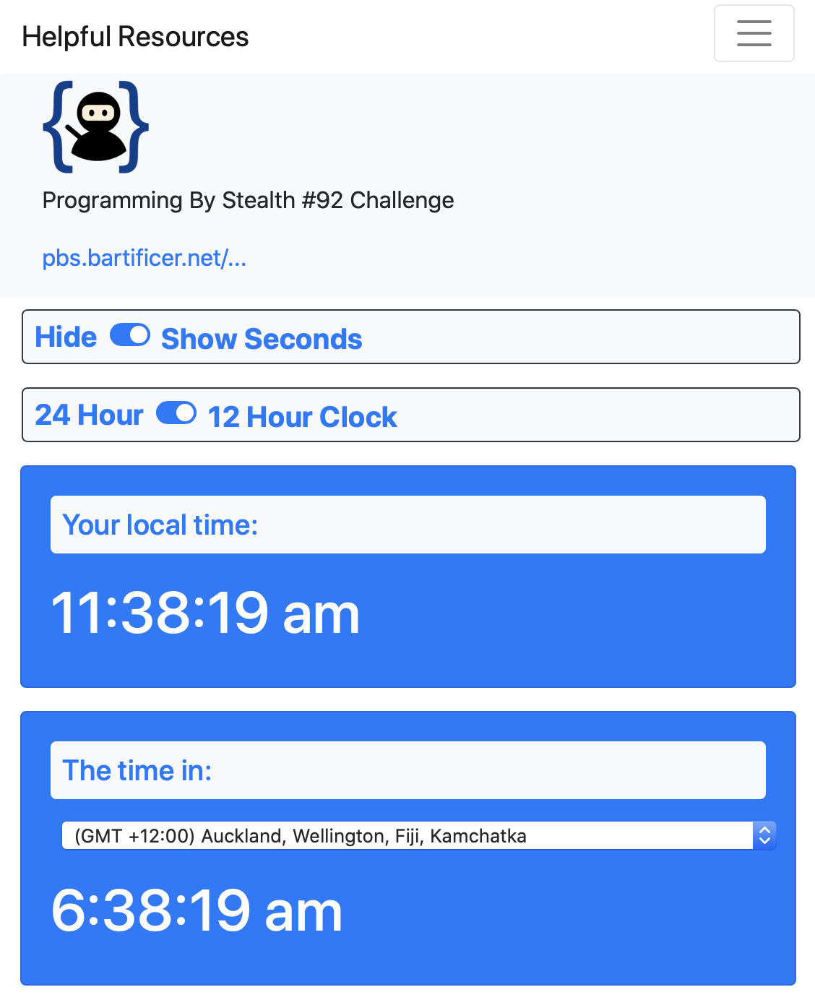

# PBS 96 of X — World Clock Challenge Solution

In this instalment we're taking a break from learning new things to look at two sample solutions to the world clock challenge set at the end of PBS 92. I'll start by handing over to Allison to describe her sample solution, and then I'll take over again to share mine.

Finally — I'll set another challenge to tide you over for four weeks while we finish our third look at OO programming in JavaScript over the next two instalments.

## Allison's World Clock

> This entire section is written by [Allison Sheridan](https://www.podfeet.com/).
{: .aside }

Allison taking over the reigns here to talk about how I approached making the clock as our challenge from PBS 92.  You'll find the full source code for my solution in the file `pbs92-ChallengeSolution-Allison/index.html` in this instalment's ZIP file or you can [view a live version of my solution in your browser here](https://rawcdn.githack.com/bartificer/programming-by-stealth/7fd37665c0ba5b67e19bd23322d5bdec174119c7/instalmentResources/pbs96/pbs92-ChallengeSolution-Allison/index.html), or [view the source code online here](https://github.com/bartificer/programming-by-stealth/blob/master/instalmentResources/pbs96/pbs92-ChallengeSolution-Allison/index.html).

I really enjoyed the clock assignment, even though technically we had learned how to make clocks in Programming By Stealth many many lessons ago.  I decided not to go back and look at those instructions and start from scratch with my newly-learned tools to see if I could make it happen.

### Writing Cleaner Code
In watching the elegance of the code Bart writes, I wanted mine to look more like his. I'm not even close, but it's less of a "dog's dinner" as Bart would say.  I started using all capital letters for a certain type of variable name and it was surprisingly easier to read.  I'm also trying to do the documentation bit but I'm calling far short of my intentions so far. I do plan on documenting this (don't developer's always say that?) but I need a way to visualize how the documentation will be visualized so I can see if it's making sense.

The first thing I did in this assignment was write my JavaScript in a separate file from my HTML, as Bart had suggested. It was far easier to mentally keep track of what was happening where.  Previously I'd been writing it in one long file.   Then I was using the "split right" command in my editor, [Microsoft's Visual Studio Code](https://code.visualstudio.com) which allowed me to have two copies of the same file open at the same time, but scrolled to two different positions.  With the HTML and JavaScript separated, that wasn't necessary as often, but as my code has been getting more complex I do often need to use that functionality.

A few challenges back, I started adding a standardized `navbar` at the top of every assignment with what I consider helpful resources. In the `navbar` I put in a dropdown for specific PBS Resources, like links to [Dorothy's PBS Index](https://www.podfeet.com/blog/pbs-index/), the [Bootstrap documentation](https://getbootstrap.com/docs/4.3/getting-started/introduction/), the [jQuery API](https://api.jquery.com) and the [AJAX API](https://api.jquery.com/category/ajax/).  Then I add in useful resources for the particular assignment.  This time that included direct links to [Moment.js Home](https://momentjs.com), [Moment.js Docs](https://momentjs.com/docs/#/use-it/browser/), and [Moment TimeZone Docs](https://momentjs.com/timezone/).  With these items in the `navbar`, I always have quick access to them.



```html
	<nav class='navbar navbar-expand-md navbar-light'>
	      <a class='navbar-brand' href="#">Helpful Resources</a>
	      <button class="navbar-toggler" type="button" data-toggle="collapse" data-target="#navbarSupportedContent" aria-controls="navbarSupportedContent" aria-expanded="false" aria-label="Toggle navigation">
	        <span class="navbar-toggler-icon"></span>
	      </button>
	      <div class="collapse navbar-collapse" id="navbarSupportedContent">
	        <ul class="navbar-nav mr-auto">
	          <li class="nav-item active">
	            <a class="nav-link" href="https://momentjs.com">Moment.js home</a>
	          </li>
	          <li class="nav-item active">
	            <a class="nav-link" href="https://momentjs.com/docs/#/use-it/browser/">Moment.js docs</a>
	          </li>
	          <li class="nav-item active">
	            <a class="nav-link" href="https://momentjs.com/timezone/">Moment Timezone docs</a>
	          </li>
	          <li class="nav-item dropdown">
	            <a class="nav-link dropdown-toggle" href="#" id="navbarDropdown" role="button" data-toggle="dropdown" aria-haspopup="true" aria-expanded="false">
	              PBS Resources
	            </a>
	            <div class="dropdown-menu" aria-labelledby="navbarDropdown">
	              <div class="dropdown-divider"></div>
	              <a class="nav-link dropdown-item" href="https://www.podfeet.com/blog/pbs-index/"  rel="no opener" target="_blank">PBS Index</a>
	              <a class="nav-link dropdown-item" href="https://getbootstrap.com/docs/4.3/getting-started/introduction/"  rel="no opener" target="_blank">Bootstrap Docs</a>
	              <a class="nav-link dropdown-item" href="https://api.jquery.com"  rel="no opener" target="_blank">jQuery API</a>
	              <a class="nav-link dropdown-item" href="https://api.jquery.com/category/ajax/"  rel="no opener" target="_blank">AJAX API</a>
	            </div>
	          </li>
	        </ul>
	      </div>
	    </nav>
```

### Moment.js for the Clocks

Step 1 of the challenge was to allow the user to control the timezone for the clock.  No matter how you approach it, dealing with timezones is a nightmare.  Bart suggested (but didn't require) we use moment.js, and it was very sane advice.  I wrote an extensive blog post on [www.podfeet.com/... entitled Time is Weird ](#)(https://www.podfeet.com/blog/2020/04/time-is-weird/) where I chronicled my adventures trying to figure out how to allow people to see the time in a timezone of their choosing.

My main challenge was not how to find the timezone data, but how to display it simply and elegantly. I'll not bore you with the incorrect paths I took (because they're in the blog post) and in the end I went for a path that included pretty much every single available city and time offset in a giant list.  By giant, I mean 539 items in my dropdown to choose the timezone! I was inspired by Michael Westbay's clock solution to this problem that he posted in the PBS channel in our community Slack ([podfeet.com/slack](https://podfeet.com/slack)).  He provided a text input field where people can start typing a city and if there's a match, it will show it to them.  That's going to be in the next rev of my web app.  For now, enjoy scrolling.  

### Modifying the time format
Armed with a well-formatted, if exhaustive JSON dictionary of timezone data, it was actually pretty easy to use moment.js to create a working clock. Items 2 and 3 were to allow the user to choose a 12 or 24 hour clock and whether or not to show seconds.  Moment.js documentation was pretty good at explaining how to make these different formats.

I decided to declare some variables that were the strings that moment.js required for the different formats.  For example, TIME24WSEC was the string 'h:mm:ss a'.  I also created variables for whether the user wanted seconds and a 12 hour clock.  Finally I created one variable called FORMATTEDTIME in which I would put the chosen format. I set it to a default value of 12-hour time with seconds.

```js
	// Time formats
	let h = 'h';
	let m = 'mm';
	let s = 'ss a';
	let TIME12WSEC = 'h:mm:ss a';
	let TIME12WOSEC = 'h:mm a';
	let TIME24WSEC = 'HH:mm:ss';
	let TIME24WOSEC = 'HH:mm';
	let FORMATTEDTIME = TIME12WSEC; // Default formatted time
	let TRUESECONDS = true; // boolean true if show seconds is true
	let TRUE12HR = true; // boolean true if numHrs is 12
```

I created two "checkboxes" and formatted them using Bootstrap to look like toggle switches.  These checkboxes were to select between 12 and 24 hour clocks and whether or not to show the seconds.  I ran into an interesting problem though. If you have a checkbox, it only has one label.  But if visually it looks like a toggle, then there's an expectation that there's a label on both sides.

My solution was to use "12 Hour Clock" as the real label for the checkbox and to put a plain old line of text to the left of the checkbox that said "24 Hour Clock".  But that opened up a can of worms for a screen reader. How are they to know that the other glop of text was explaining the checkbox? I chose to put a `div` with `class ="sr-only"` to give them a fighting chance.  I asked good friend of the NosillaCast and VoiceOver user Scott Howell to test it for me.  We both discovered using VoiceOver that it worked well enough but that there's some sort of bug where labels on checkboxes get read out twice. I was able to find people chatting about the problem more than 5 years back so I decided I wouldn't worry about it.


```js
	<!-- Switch to  12 vs 24 hr clock -->
	          <div class="row pl-3 pb-3"> <!-- row for numHrs switch -->
	            <div class="col col-md-6 form-control form-check-inline bg-light border border-dark rounded p-2 m3">
	              <!-- Description of checkbox for screen readers -->
	              <div id="hrsDesc" class="sr-only">Switch to toggle between 24 and 12 hour clock</div> 
	              <div class="mr-2 font-weight-bold mySwitches d-none d-md-inline">24 Hour Clock</div>
	              <div class="mr-2 font-weight-bold mySwitches d-inline d-md-none">24 Hour</div>
	              <div class="custom-control custom-switch form-control-md" aria-describedby="hrsDesc">
	                  <input type="checkbox" class="custom-control-input" checked id="numHrs" name="numHrs" >
	                <label class="custom-control-label mySwitches" for="numHrs">12 Hour Clock</label>
	              
	              </div>
	            </div>
	          </div>
	          <!-- end switch 12 vs 24 hr clock -->
```

Next up I needed two event handlers. One to capture the user's desire for the clock format from my two checkboxes, and the second to capture the selected timezone from the Dropdown of Doom (™Donald Burr).  Because I created the time format variables up front, I found that rendering the time because a trivial amount of code:

```js
	function renderTime(){
	    $('#forTime').html(moment().tz(selectedZone).format(FORMATTEDTIME)); // time in selected zone
	  }
```

In this line, `#forTime` was the ID of the div to hold this clock, and "selectedZone" was the chosen value from the dropdown select.  

Everything worked swimmingly until I saw the last part of the challenge, and that was whether or not to show pulsing dividers between the parts of the time.  In order to execute that part of the assignment, I would have to completely refactor how I created the formatted times. I had some ideas for a really cool feature for my clock that I was itching to work on so I made the decision that my users will not be allowed to have pulsing dividers!

I spent some time making the clock look pretty on mobile and I declared victory.



### Request from Allison
  
I've taken my clock much further than what I've described here. It has some functionality that I'm very excited about, but the UI is what my father would have described as "ugly as sin."  I'd like to ask if anyone in the Programming By Stealth community would like to step in to consult with me on how to make it less ugly and to make it obvious what the functionality is.  As it stands, I have to put in a lot of words to explain it and that always means you're doing it wrong!


> Back to Bart {: .aside }

## Bart's Sample Solution

You'll find the full source code for my sample solution in the file `pbs92-ChallengeSolution-Bart/index.html` in this instalment's ZIP file, or you can [view a live version of my solution in your browser here](https://rawcdn.githack.com/bartificer/programming-by-stealth/020e0f0590ec9b3148dbb303755c99167904d827/instalmentResources/pbs96/pbs92-ChallengeSolution-Bart/index.html), or [view the source code online here](https://github.com/bartificer/programming-by-stealth/blob/master/instalmentResources/pbs96/pbs92-ChallengeSolution-Bart/index.html).

This challenge was set before we started our exploration of encapsulation and object oriented programming, so I have avoided using either concept in my solution — it's entirely old-school as it were 😉

My solution revolves around some very basic markup that creates a large Bootstrap Badge that will act as the container for the clock, then adds some spans with IDs inside that badge to hold all the components of the clock, and a simple form to control the clock.

To bring the clock to life my solution defines a number of global variables to hold information about the clock and references to the parts of the clock. Those variables are declared in the global scope, and initialised in a jQuery document ready handler.

Finally, a single 500ms interval is used to drive the clock.

### Why 500ms? Tick-tock!

Having the separators pulse presents an interesting challenge. The clock itself needs to be updated every second, so clearly there will need to an interval timer running every second to take care of that. Should there be a second timer running to pulse the separators? Or do you pulse them every two seconds? You could show them when the seconds are even, and hide them when the seconds are odd for example.

I chose to have a single interval, but to have it run twice every second. Half of the time my interval will update the clock and show the separators, and the other half of the time it will only hide the separators, and even then, only if the switch for pulsing the separators is on. To keep track of which mode to operate in I chose to use a boolean variable, and to keep with the clock metaphor I named it `tick`. Each time the interval executes it inverts the value of `tick`, so if it was `true` last time it will be `false` this time. When `tick` is true the code updates the time, when `tick` is false, the code does a *tock* and only deals with the separators as needed.

To make the response times to changes in the time format and whether or not to show the seconds more responsive I chose to update those on both the *tick* and the *tock* cycles.

The advantages I saw to this approach were that I got to keep the entire operation of the clock contained within a single anonymous function executed by `window.setInterval()`, and the structure of that function could actually be quite simplistic:

```js
let tick = true;
		window.setInterval(function(){
				// figure out of we're a tick or a tock
				if(tick){
					// we're a tick, so update the time on the clock and show the separators
					// update the time …
					$WC_SEPARATORS.fadeTo(450, 1);
				}else{
					// we're a tock, just pulse the separators if needed
					if($WC_PULSE_CB.prop('checked')){
						$WC_SEPARATORS.fadeTo(450, 0.25);
					}
				}
				
				// Always update the display of everything
				// …
				
				// toggle the tick
				tick = !tick;
			},
			500 //runs every half second
		);
```

### How to Pulse?

You might think that the easiest way to pulse something would be to hide and show it, but that actually results in the thing vanishing and re-appearing, so when the separators are hidden the parts of the time all move to the left and bunch together, then they move right again, then left again … How do I know this? Because that was my first attempt at solving the problem, and it was an abject failure 🙂

Rather than changing the visibility, I chose to change the opacity, i.e. the level of transparentness, of the separators. The jQuery function for doing this is [.fadeTo()](https://api.jquery.com/fadeTo/). This function can take two arguments, a number of milliseconds over which to animate the fade, and an opacity to fade to over that time, with 0 being completely transparent, and 1 completely opaque.

I could have faded all the way to fully transparent, but I actually think it looks better to have the separators remain slightly visible when "off", so I chose to pulse between 0.25 and 1.

I also experimented with different fade durations, and I settled on 450ms, this means that the separators spend 90% of their time animating, and only 5% of the time fully 'on' or fully 'off'.

### Don't Optimise the Wrong Thing

**TL;DR** — don't be afraid to write code that uses a little more CPU and RAM if it makes the code easier to understand, write, and maintain!

You should always be very careful not to over-optimise or optimise the wrong thing. On modern hardware the infinitesimally small amount of work it takes the browser to check the state of a checkbox a few extra times, or to hide or show something that's already hidden or shown is utterly irrelevant!

Code complexity on the other hand remains as relevant as ever because our human brains are no better today than they were when the transistor was invented in 1947.

Unless you're doing complex calculations, optimise for the benefit of the human, not the machine! Or, to put it another way, don't be afraid to make your life easier by making the computer do a little more work — that's what it's for 🙂

When developing my sample solution I made two design decisions that made the code simpler at the cost of a tiny bit more work for the computer to do.

1. Rather than use traditional variables to store most of the clock's state information, my code reads the state of each checkbox every time it needs to know whether to use 24 or 12 hour format, whether or not to show the seconds, and whether or not to pulse the separators. It takes a few more CPU cycles to check the state of a checkbox than to read a value straight from a variable, but it removes the need for three entire event handlers, making the code easier to understand, write, debug, and maintain.
2. Rather than only showing/hiding the seconds etc when a user pro-actively clicks on a switch, my code explicitly sets everything as it should be each time. Twice a second the code shows or hides the seconds as appropriate. That sounds really inefficient, but firstly, even if jQuery were not well written it wouldn't be that much to ask of a modern computer, and secondly, jQuery is well written, so when you call `.hide()` on something that's already hidden it very quickly realises it has nothing to do and returns. So, it's fine to keep telling a hidden element that is should hide over and over again if it makes your code easier to design, write, debug, and maintain. 

### How to Show Timezones?

When it comes to designing the UI for our world clock, it was mostly extremely straight forward. Like Allison I chose to use [Bootstrap Switches](https://getbootstrap.com/docs/4.2/components/forms/#switches) for the binary choices like whether or not to show the seconds or pulse the separators. The only difficulty was finding a human-friendly way to specify the clock's timezone.

The simplest solution would be to hand-pick a small set of common timezones and put them into a dropdown list. That's easy to do, but not very satisfying. Like Allison I chose to use moment.js to deal with my timezone logic, so I had a full list of timezone names at my disposal via the `moment.tz.names()` function. This list contains all the standard IANA timezones in the popular *Region/City* format like *Europe/Dublin*. It also contains some duplication, e.g. */US/California/Los_Angeles* and *America/Los_Angeles*. This list also contains 12 generic timezones which have their region as *Etc*. I chose to filter out all names with more than one slash, and that start with *Etc*.

Even the filtered list was much too long to expect users to scroll through.

The next solution I considered was two selects, one to choose the region, and then, one to choose the city within that region. With some basic event handlers and some jQuery the content of the second dropdown could be altered each time the value of the first was changed. This reduced the need for scrolling, but at a high price, now the user had to interact with two form elements to specify a single value.

What I finally settled on was a single intelligent text input  pre-populated with the user's home timezone as reported by the browser. When I say intelligent, I mean a text input with an auto-complete dropdown of matching timezones that updates as the user types.

Getting the user's home timezone from the browser proved very easy — a quick Google search lead me to [a Stack Overflow answer](https://stackoverflow.com/a/34602679/174985) that informed me that I can get the local timezone from the browser with `Intl.DateTimeFormat().resolvedOptions().timeZone`.

I could have written my own auto-complete feature, but I figured there was no need to re-invent that wheel. A small amount of Googling soon lead me to an open-source jQuery plugin that uses Bootstrap4 dropdowns to implement autocomplete on a text inputs — [Bootstrap 4 Autocomplete](https://github.com/Honatas/bootstrap-4-autocomplete#readme).

The data structure used to specify the valid autocomplete options is a little strange, but regardless, it proved very easy to implement in just four steps.

First, include the plugin from a CDN:

```html
<script src="https://cdn.jsdelivr.net/npm/bootstrap-4-autocomplete/dist/bootstrap-4-autocomplete.min.js" crossorigin="anonymous"></script>
```

Second, add a regular Bootstrap text box to my markup with the browser's default autocomplete implementation disabled:

```html
<div class="form-group">
  <label for="wc_timeZone_tb">Time Zone</label>
  <input type="text" id="wc_timeZone_tb" class="form-control" autocomplete="off">
  <small class="form-text text-muted">
    Enter an <a href="https://en.wikipedia.org/wiki/Tz_database" target="_blank" rel="noopener">IANA timezone string</a>,
    or just start typing a city name for auto-complete suggestions.
  </small>
</div>
```

Third, build the data structure that will act as the source for the autocomplete suggestions. The data structure needs to be a dictionary where the keys are the auto-complete values, and the values are a numeric counter. The example they give in their documentation is:

```js
{ "label1": 1, "label2": 2, ...}
```

So for my code that meant a dictionary with IANA timezone names as the keys, and a counter as the values:

```js
const tzAutoCompeleSource = {};
let tzAutoCompleteCounter = 1;
for(const tzName of moment.tz.names()){
  // break the timezone into parts
  const tzParts = tzName.split('\/');
			
  // skip timezones with more than two parts
  if(tzParts.length != 2) continue;
					
  // skip the artificial Etc region
  if(tzParts[0] === 'Etc') continue;
			
  // if we got here, add the timezone as an option
  tzAutoCompeleSource[tzName] = tzAutoCompleteCounter;
  tzAutoCompleteCounter++;
}
```

And finally fourth, enable the `autocomplete` jQuery plugin on the text box from within the jQuery document ready handler:

```js
$WC_TIME_ZONE_TB.autocomplete({
  source: tzAutoCompeleSource, // the autocompelte values
  maximumItems: 10, // the maximum autocomplete suggestions
  treshold: 1 // the minimum number of characters to search
});
```

At this point the auto-complete functionality worked perfectly, but there was still a problem — there as the user typed there were times when the timezone was invalid, and because my clock re-calculates everything directly from the form every second, that meant invalid input getting passed to the `moment()` function and an intermittently broken clock!

Clearly, this was one state variable I could not avoid!

The solution was to add a global variable to store the most recently entered valid timezone, and to add event handlers to the text box to update that variable each time the currently entered value was valid.

The first step to getting this to work was to add a simple on-input event handler to the text box:

```js
$WC_TIME_ZONE_TB.on('input', function(){
  // validate the timezone
  const tzObj = moment.tz.zone($WC_TIME_ZONE_TB.val());
  if(tzObj){
    // not null, so time zone is valid
    WC_TIME_ZONE = tzObj.name;
    $WC_TIME_ZONE_TB.removeClass('is-invalid').addClass('is-valid');
  }else{
    // timezone is invalid
    $WC_TIME_ZONE_TB.removeClass('is-valid').addClass('is-invalid');
  }
});
```

While it may not be entirely obvious at first glance, this event handler validates the entered time zone and saves it to the global variable `WC_TIME_ZONE` only when it is valid. The reason this works is that [the documentation for the `moment.tx.zone()` function](https://momentjs.com/timezone/docs/#/data-loading/checking-if-a-zone-exists/) states that it returns null when passed an invalid time zone name, and a dictionary of timezone data when passed a valid time zone name.

This gave me an almost functional solution, but there was on problem, selecting an auto-complete value did not trigger this on-input handler on the text box! The solution to that was to a an `onSelectItem` event handler when initialising the autocomplete jQuery plugin:

```js
$WC_TIME_ZONE_TB.autocomplete({
  source: tzAutoCompeleSource, // the autocompelte values
  maximumItems: 10, // the maximum autocomplete suggestions
  treshold: 1, // the minimum number of characters to search
  onSelectItem: function(){ // event handler for selection of autocomplete suggestion
    $WC_TIME_ZONE_TB.trigger('input');
  }
});
```
Notice that this new event handler simply triggers the on-input handler we already added to the text box using [jQuery's `.trigger()` function](https://api.jquery.com/trigger/).

### Google Fonts

One final point to note is that I chose to use a custom font for my clock. Google Fonts is a great resource for free and easy to use web fonts. Simply go to [fonts.google.com](https://fonts.google.com/), pick the font you want, then copy-and-paste the embed code.

Once I'd picked my font, applying it onvolved just a few lines of CSS within a `<style>` tag in my page header:

```css
/* Load the web font for the clock */
@import url('https://fonts.googleapis.com/css2?family=Share+Tech+Mono&display=swap');
		
/* Apply the web font to the clock */
#wc_clock{
  font-family: 'Share Tech Mono', monospace;
}
```

## A New Challenge

Build a web app to solve the following problem:

> Two podcasters live in different parts of the world, they need to communicate show recording times without the need to do mental arithmetic. Provide a web app that can share a specific time across timezones. The time being communicated should be embedded in the URL somehow so it doesn't need to be typed in by the recipient.

The UI for your solution is entirely up to you.

Three hints to guide you:
1. Query parameters can be used to embed data in URLs
2. It is possible to use JavaScript to ask the browser for the current URL
3. There exist APIs for parsing URLs to extract their various components, including query strings. One I like is [URI.js](https://medialize.github.io/URI.js/).